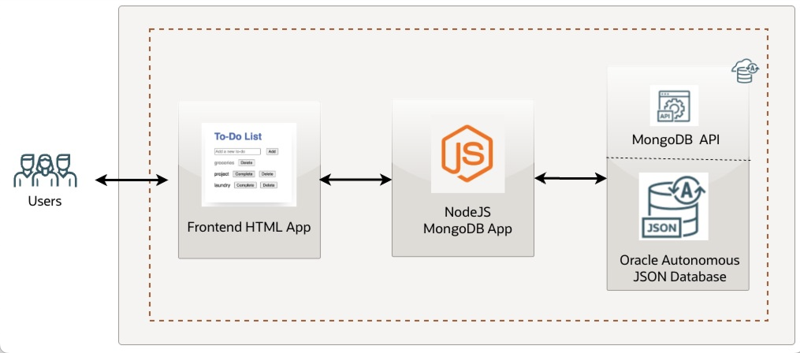

# Introduction

## About this Workshop

Welcome to **Creating a MongoDB-Compatible App with Autonomous JSON Database**!  
This hands-on workshop is designed for MongoDB developers transitioning to Oracle Autonomous JSON Database. You'll deploy a simple CRUD To-Do list application using Node.js and Express, connecting to AJD via its MongoDB-compatible API. This demonstrates AJD as a drop-in replacement for MongoDB, requiring minimal changes.

You'll learn how to:
- Provision an AJD instance with MongoDB API enabled
- Set up a Node.js/Express backend
- Build a basic frontend UI
- Deploy and run the app

> **Estimated Workshop Time:** 1 hour

**Note:** Throughout this workshop, Cline can assist by reviewing your code, suggesting optimizations, or refactoring for better scalability—simply ask!

---

### Objectives

By completing this workshop, you will:
- Understand how AJD serves as a seamless backend for MongoDB applications
- Deploy a full-stack To-Do app with CRUD operations
- Gain hands-on experience with AJD's MongoDB API compatibility

**Architecture Overview:**  
The app uses Node.js/Express for the backend, connecting to AJD via the MongoDB driver. The frontend is a simple HTML/JS interface.

---

### Prerequisites

This workshop assumes you have:
- An Oracle Cloud account
- Basic knowledge of Node.js and MongoDB
- Node.js (v18+) and NPM installed
- Familiarity with command-line tools

**Note:** Ensure your Node.js version is at least v18 (ideally v24 for compatibility with dependencies). Check with `node -v`; use nvm if needed (e.g., `nvm install 24 && nvm use 24`).

---

## Learn More

* [Oracle Autonomous JSON Database Documentation](https://docs.oracle.com/en/cloud/paas/autonomous-json-database/index.html)
* [MongoDB API in AJD](https://docs.oracle.com/en/database/oracle/mongodb-api/mgapi/overview-oracle-database-api-mongodb.html#GUID-D1F0C555-73AE-4263-B59C-448925B963A8)
* [Node.js MongoDB Driver](https://www.mongodb.com/docs/drivers/node/current/)

---

## Acknowledgements

**Authors**
* **Luke Farley**, Senior Cloud Engineer, ONA Data Platform S&E

**Contributors**
* **Kaushik Kundu**, Master Principal Cloud Architect, ONA Data Platform S&E

**Last Updated By/Date:**
* **Luke Farley**, Senior Cloud Engineer, ONA Data Platform S&E, November 2025
