# Lab 1: Explore the Unified Lakehouse Foundation

## Introduction

Alex has an approved business ontology, but an ontology alone does not make source data trustworthy. The underlying records still arrive with different identifiers, formats, quality levels, and update schedules. In this lab, you will inspect the representative source feeds prepared for Seer Construction Group and follow them through a prebuilt Bronze, Silver, and Gold medallion architecture implemented inside ALH.

The workshop uses simulated extracts that emulate data from Fusion ERP, Primavera, CRM, and on-premises applications. OCI Object Storage and Oracle Autonomous AI Lakehouse are the real services used to store, organize, and query the workshop data.

AIDP could perform equivalent transformations with Spark notebooks and workflows. In this workshop, ALH is both the transformation environment and the serving layer. You will prove that boundary by using Data Studio to link an Object Storage CSV as a Bronze external table and then running a small Bronze-to-Silver SQL transformation directly in ALH.

**Estimated Time:** 25 minutes

### Objectives

In this lab, you will:

- Verify that the pre-provisioned workshop schemas and data are available.
- Create a Bronze external table over a CSV in OCI Object Storage using the Data Studio interface.
- Use Data Studio Catalog to inspect representative Bronze, Silver, and Gold entities.
- Run a representative Bronze-to-Silver transformation inside ALH.
- Explain what belongs in Bronze, Silver, and Gold.
- Trace a steel-delivery business event across multiple source extracts.
- Review data quality, reconciliation, and lineage evidence.

### Prerequisites

- Authenticated OCI Console access to the Autonomous AI Lakehouse
- The `object_storage_base_uri` value from the Terraform outputs
- Access to Database Actions and Data Studio
- Read access to `SEER_BRONZE`, `SEER_SILVER`, and `SEER_GOLD`
- A database resource principal with read access to the workshop Object Storage bucket
- Permission to create a table and view in the connected database schema

> **Note:** Use the `ADMIN` Database Actions session for this lab. The external table and Silver demonstration view are created in the `ADMIN` schema, and the screenshots reflect that session. The `SEER_WORKSHOP` user owns the embedding model and is used only where the workshop explicitly instructs you to sign in with that account.

## Task 1: Verify the workshop environment

The environment was built before the workshop. Begin with a short readiness check so later exercises fail early and clearly if a required asset is missing.

1. In the OCI Console, open the **Navigation menu**, select **Oracle AI Database**, and then select **Autonomous AI Database**.

2. Select the region and compartment assigned to your workshop environment, then filter the Autonomous AI Database list by that compartment. You can find both values in the LiveLabs **View Login Info** panel. Open the Autonomous AI Lakehouse instance identified by your instructor.

    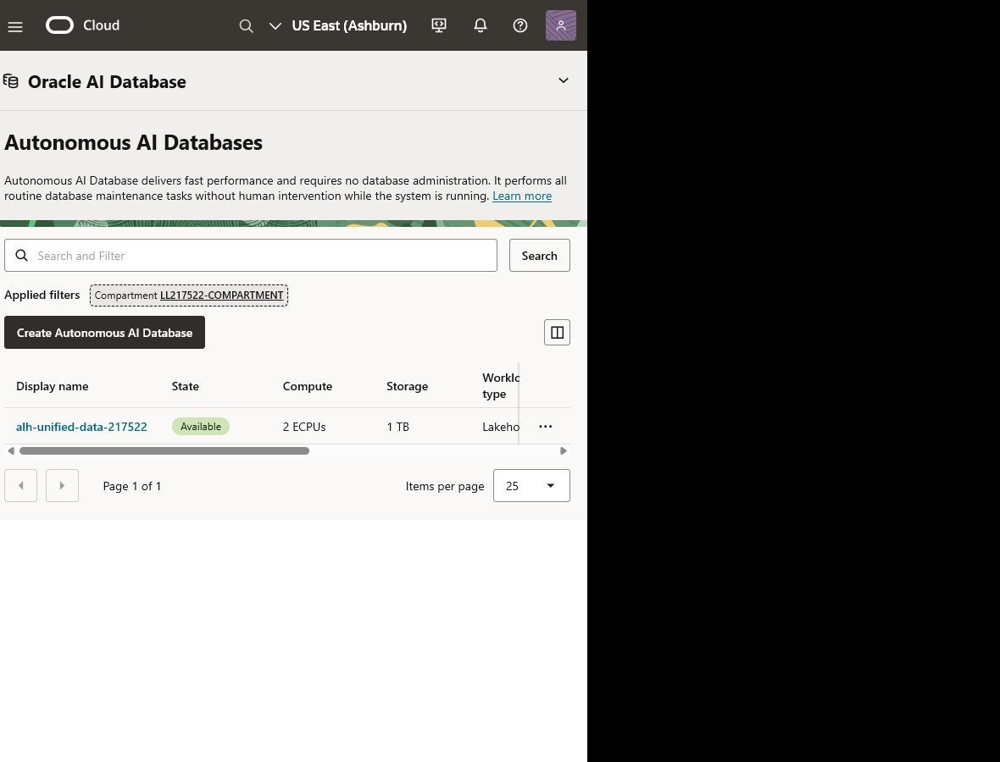

3. On the database details page, select **Database actions**, and then select **SQL**. SQL Worksheet opens in a new browser tab.

    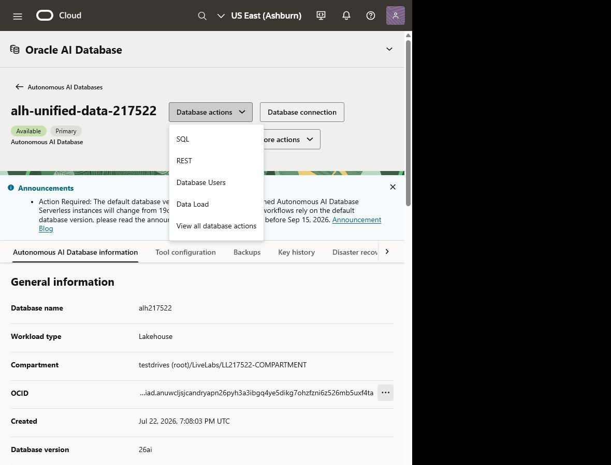

    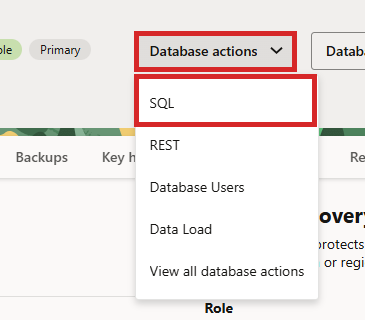

4. Wait for the SQL worksheet to finish loading. First-time users may see a short **Run Statement** tour, an ADMIN-user warning, a dark-theme announcement, or other informational notices. Select **X**, **Close**, or **Done** when those controls are available.

    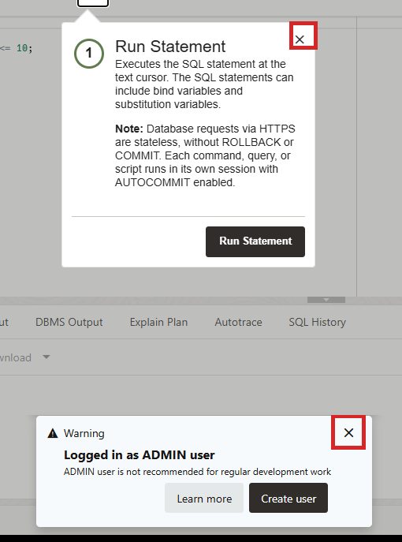

5. Run the following query to confirm your connected database user. Select **Run Statement** after pasting the query.

    ```sql
    <copy>
    SELECT USER AS connected_user FROM dual;
    </copy>
    ```

6. Run the following query to confirm that the three medallion schemas are visible:

    ```sql
    <copy>
    SELECT owner, COUNT(*) AS object_count
    FROM all_objects
    WHERE owner IN ('SEER_BRONZE', 'SEER_SILVER', 'SEER_GOLD')
      AND object_type IN ('TABLE', 'VIEW')
    GROUP BY owner
    ORDER BY owner;
    </copy>
    ```

7. Run the following query to confirm that the workshop contains source data, conformed entities, Gold products, and document chunks:

    ```sql
    <copy>
    SELECT 'Bronze source records' AS asset, COUNT(*) AS row_count
    FROM seer_bronze.source_record_inventory
    UNION ALL
    SELECT 'Silver assets', COUNT(*)
    FROM seer_silver.assets
    UNION ALL
    SELECT 'Gold project context', COUNT(*)
    FROM seer_gold.project_context
    UNION ALL
    SELECT 'Searchable document chunks', COUNT(*)
    FROM seer_gold.document_chunks;
    </copy>
    ```

8. Verify that every result contains at least one row. If an object is missing, stop and use the **Need Help?** section before continuing.

## Task 2: Link an Object Storage CSV as a Bronze external table

The workshop setup uploaded representative source extracts to a private Object Storage bucket. In this task, you will use the Autonomous AI Database Data Studio interface to link one CSV without copying it into a managed database table. The resulting external table is the Bronze source for your hands-on transformation.

1. Back on the database details page, select **Database actions**, and then select **Data Load**. Data Load opens in a new browser tab.

    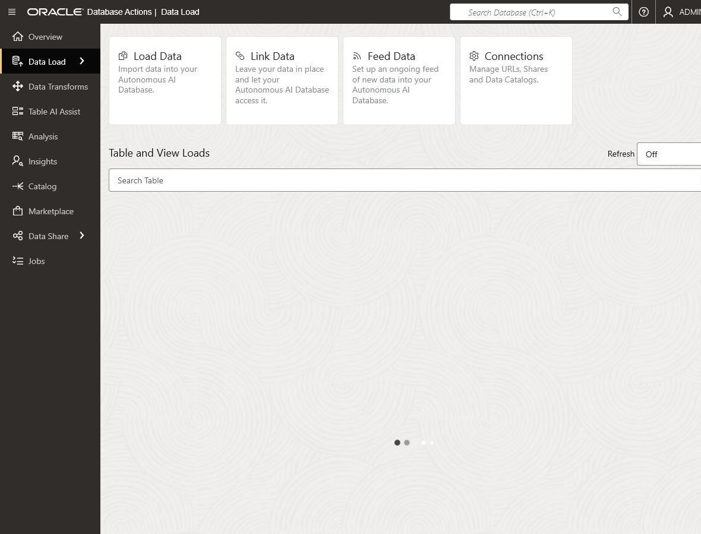

2. On the Data Load home page, select **Connections**.

    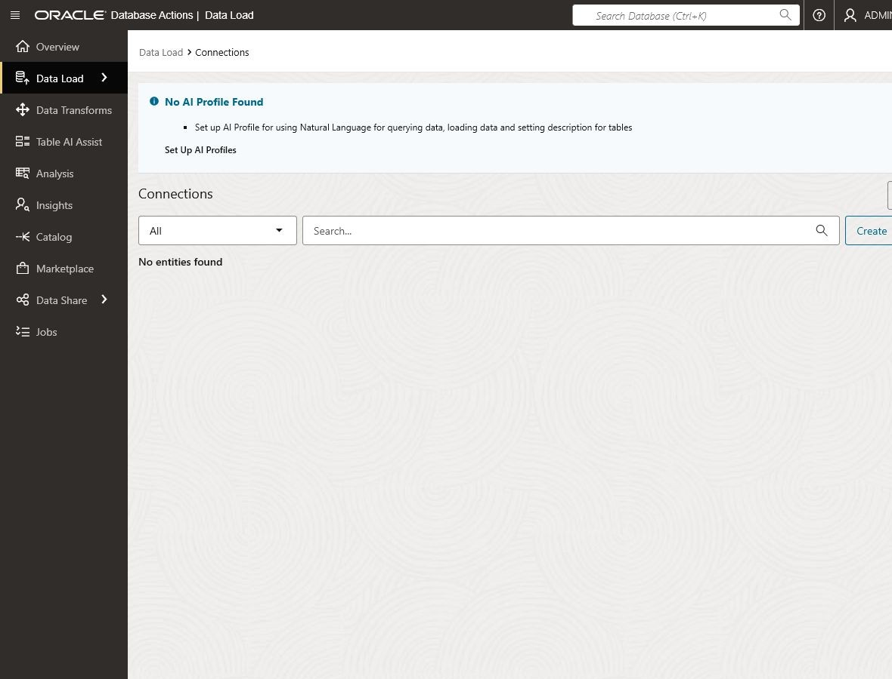

3. Select **Create**, and then select **New Cloud Store Location**.

    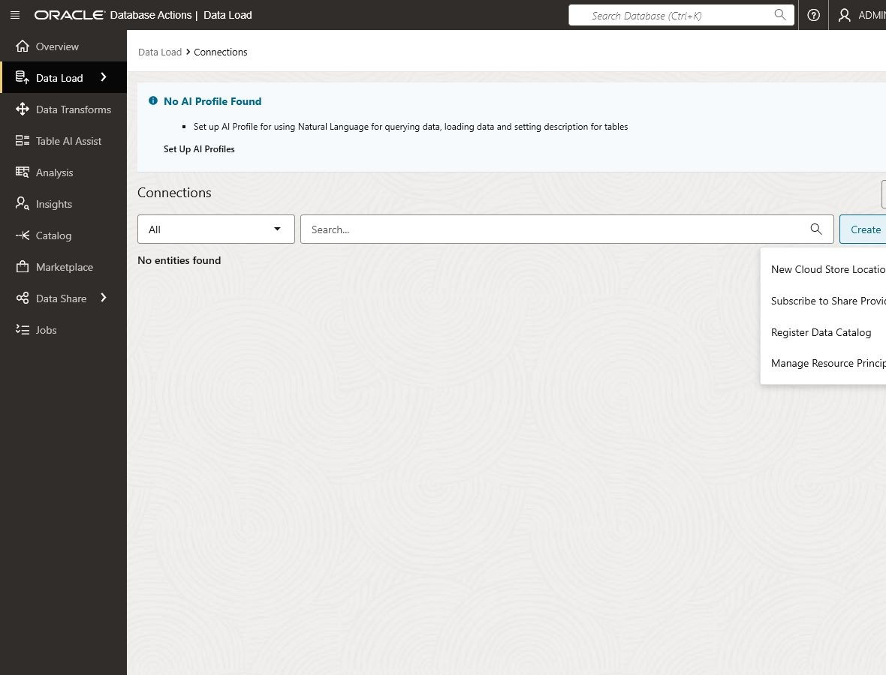

4. On **Storage Settings**, configure the cloud store location:

    - **Description:** Private storage location for the workshop's sample source files used to create the Bronze external table.

    - **Name:** `SEER_LAKE_SOURCE`
    - **Select Credential:** Keep the preselected `OCI$RESOURCE_PRINCIPAL` credential for the connected user.
    - **Bucket URI:** Keep **Bucket URI** selected and paste the `object_storage_base_uri` value from the Terraform outputs, for example `https://objectstorage.us-ashburn-1.oraclecloud.com/n/<namespace>/b/<bucket-name>/o/`.

    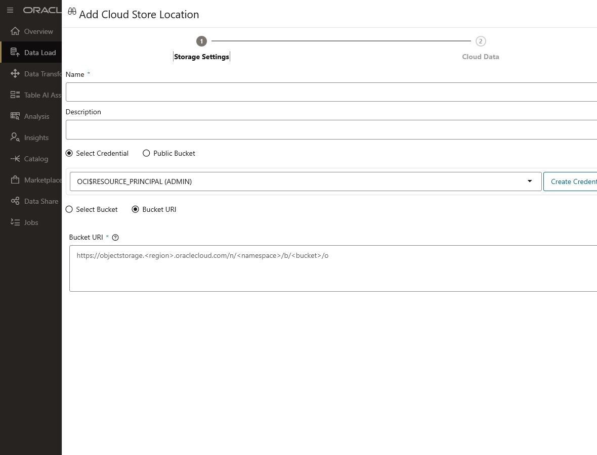

    The environment setup has already enabled the resource principal and granted it read access to this private bucket. You do not need an OCI username, auth token, or signing key.

5. Select **Next**. On **Cloud Data**, confirm that the preview lists folders such as `documents`, `models`, and `source-data`. This confirms that the database can reach the private bucket. Select **Create**.

6. Select the **Data Load** breadcrumb to return to the Data Load home page, and then select **Link Data**. **Cloud Store** is selected by default.

    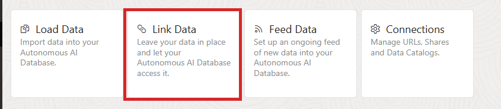

    > **Link rather than load:** **Link Data** leaves the CSV in Object Storage and creates an external table. **Load Data** would copy the rows into a managed database table.

7. Confirm that `SEER_LAKE_SOURCE` is selected. Expand `SEER_LAKE_SOURCE`, `source-data`, and `suppliers`. Double-click `supplier_extract.csv`, or drag it into the data link cart.

    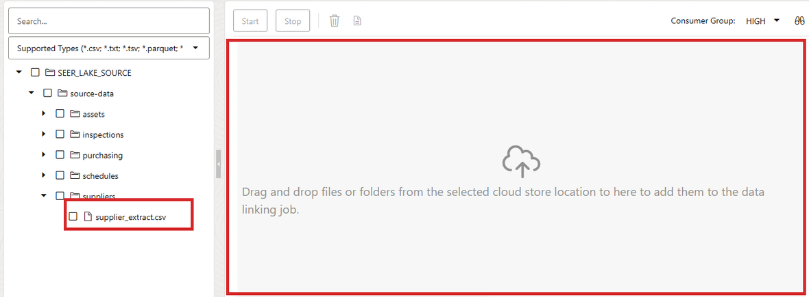

8. On the file card, select the **Settings** pencil icon and configure the link:

    - **Option:** Create External Table
    - **Table name:** `SUPPLIER_TRANSFORM_EXT`
    - **Validation Type:** Full
    - **Encoding:** AL32UTF8 - Unicode UTF-8 encoding scheme
    - **Text enclosure:** Double quote
    - **Field delimiter:** Comma
    - **Column header row:** Selected, row `1`
    - **Start processing data at row:** `2` (set automatically when the header row is selected)
    - **Partition column:** None

9. In **Mapping**, retain the source-aligned columns. This is a Bronze asset, so do not standardize names, statuses, certifications, or locations yet.

10. Confirm that Mapping contains the seven CSV columns: source record ID, supplier name, source status, certification, location, source system, and ingestion batch ID. Data Studio does not add separate file-name or link-timestamp mapping rows in this flow. Object Storage lineage, the cloud-store connection, and `INGESTION_BATCH_ID` preserve the source context needed for this exercise.

11. Review **File Preview** to confirm that the header and CSV fields were interpreted correctly. Review **Table** to inspect the proposed external-table shape.

12. Open **SQL** in the left pane and review the database commands Data Studio will generate. Notice `DBMS_CLOUD.CREATE_EXTERNAL_TABLE`; you do not need to copy or run this SQL manually.

13. Select **Close**, and then select **Start** in the data link cart. In **Start Link From Cloud Store**, select **Run**.

    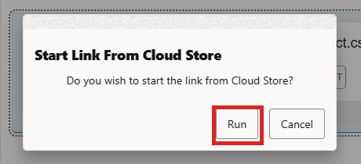

14. Wait for Data Studio to return to the Data Load home page. Confirm that `SUPPLIER_TRANSFORM_EXT` shows **8 rows loaded**.

    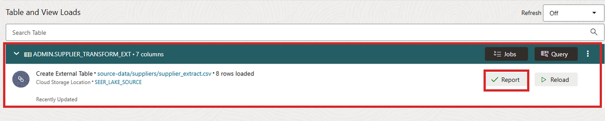

15. Select **Report**. Confirm that the Job Report shows **8 rows validated**, **8 rows processed successfully**, and **0 rows rejected**. Select **Close**.

    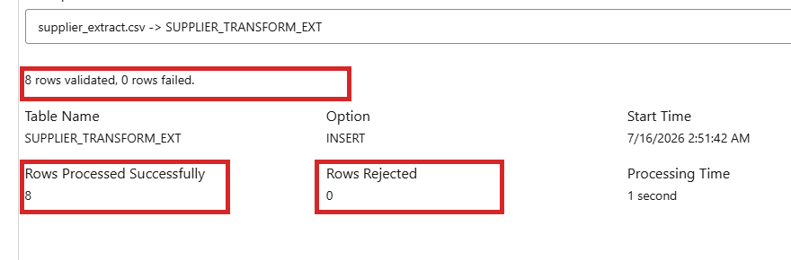

16. On the completed external-table card, select **Query**. Data Studio opens **Analysis** with a query for `SUPPLIER_TRANSFORM_EXT` already populated. In the current interface, the query may run automatically; if results are not already displayed, select **Run**. Confirm that the results show the seven external-table columns and eight rows. `SUPPLIER_TRANSFORM_EXT` contains the actual supplier records from the CSV you linked. This verifies that ALH can query that raw supplier file directly from Object Storage through a Bronze external table. If the **Selected Schema** tour prompt appears, select **X** to close it.

17. The next query serves a different purpose. It does not read `SUPPLIER_TRANSFORM_EXT` or the eight supplier records. Instead, it reads `SEER_BRONZE.SOURCE_RECORD_INVENTORY`, a separate workshop table that acts as an inventory of the staged source files. Each row describes a source file—for example, its originating system, file name, format, record count, extraction time, and ingestion batch. This places the one supplier-file example you just queried in the context of the wider Bronze layer. Return to the Database Actions Launchpad, open **SQL**, paste the following read-only query, and select **Run Statement**:

    ```sql
    <copy>
    SELECT source_system,
           source_object,
           storage_format,
           record_count,
           extracted_at,
           ingestion_batch_id
    FROM seer_bronze.source_record_inventory
    ORDER BY source_system, source_object;
    </copy>
    ```

18. Review the results from `SEER_BRONZE.SOURCE_RECORD_INVENTORY`. The supplier CSV linked as `SUPPLIER_TRANSFORM_EXT` is one example of a Bronze source. `SEER_BRONZE.SOURCE_RECORD_INVENTORY` provides the wider view of the representative source files staged in Object Storage, including Fusion ERP-style purchasing and financial data, Primavera-style milestones, on-premises inspection findings, and PDF project evidence. In business terms, it is the register of what data arrived and where it came from. Bronze preserves that raw data and its source context; it is not yet the standardized, stable dataset that downstream applications should consume.

## Task 3: Compare Bronze, Silver, and Gold

The medallion layers answer different questions.

**Table 1. Bronze, Silver, and Gold: Purpose and Controls**

| Layer | Primary question | Typical controls |
| --- | --- | --- |
| Bronze | What arrived from the source? | Provenance, ingestion time, raw payload retention |
| Silver | What enterprise entity does it represent? | Standardization, validation, deduplication, reconciliation |
| Gold | What trusted product does a consumer need? | Business definitions, stable schema, quality and freshness expectations |

1. Return to the Database Actions Launchpad and select **Catalog** under **Data Studio**.

2. Confirm that `LOCAL` is the selected catalog. Select the `LOCAL` schema selector, remove the current schema, select `SEER_BRONZE`, and select **Apply**. Search for `SOURCE_RECORD_INVENTORY`.

3. Open `SEER_BRONZE.SOURCE_RECORD_INVENTORY`. This table represents the Bronze-layer inventory of source files that arrived in the lakehouse. Use the available entity-detail tabs to:

    - Preview the source inventory rows.
    - Inspect the columns and data types.
    - Review statistics when available.
    - Locate the source object, storage format, extraction time, and ingestion batch metadata.

    Bronze preserves the original source context and answers: "What arrived, and where did it come from?"

4. Select **Close** to exit the `SOURCE_RECORD_INVENTORY` table view and return to the Catalog page. In the `LOCAL` schema selector, replace `SEER_BRONZE` with `SEER_SILVER`, then select **Apply**. Search for `ASSETS` and open `SEER_SILVER.ASSETS`. Select **Preview**, then locate `CANONICAL_ASSET_NAME`, `NORMALIZED_STATUS`, `SOURCE_SYSTEM_COUNT`, and `RECONCILIATION_STATUS`. These fields show how Silver converts source-specific asset records into a standardized enterprise asset definition.

5. Select **Close** to exit the `ASSETS` table view and return to the Catalog page. Search for and open `SEER_SILVER.SUPPLIERS`. Select **Preview** and review the standardized supplier names, qualification statuses, compliance statuses, and matched-source counts. This is another Silver example: it resolves differences between source systems into one conformed supplier entity that the business can use consistently.

6. Select **Close** to exit the `SUPPLIERS` table view and return to the Catalog page. In the `LOCAL` schema selector, replace `SEER_SILVER` with `SEER_GOLD`, then select **Apply**. Search for `PROJECT_CONTEXT` and open `SEER_GOLD.PROJECT_CONTEXT`. Select **Preview**, inspect its columns, and locate the project, asset, milestone, committed cost, inspection, supplier, and freshness fields. This Gold table is a consumer-ready product: it brings together the business context needed for project analysis without requiring users to interpret each raw source system.

7. Compare the three layers:

    - Bronze preserves what arrived and its source context.
    - Silver standardizes and reconciles source records into trusted enterprise entities.
    - Gold provides stable, business-focused data products for reports, applications, and AI use cases.

    Provenance remains available, but Gold consumers no longer need to understand every source-system field or file format. In the next task, you will apply this pattern by transforming the Bronze supplier records you linked earlier into a standardized Silver view using SQL in ALH.

## Task 4: Run an ALH-native Bronze-to-Silver transformation

In this task, you will apply a small but realistic Silver-layer transformation to the supplier CSV you linked earlier. `SUPPLIER_TRANSFORM_EXT` is the Bronze external table that reads the raw supplier CSV directly from Object Storage. Its records intentionally contain source-specific differences, such as name abbreviations, inconsistent capitalization, status codes, location formats, and missing certifications.

You will use SQL in Autonomous AI Lakehouse to create `SUPPLIER_STANDARDIZED_DEMO`, a view that presents those raw records in a consistent business format. The view does not copy the CSV; it saves the transformation logic and applies it when queried. You will then compare your result with the workshop's prebuilt Silver reference mapping.

This task has three parts:

1. Define the transformation rules that standardize the raw Bronze supplier records.
2. Query the view to see the standardized Silver-style result.
3. Compare the result with the workshop's seeded Silver reference mapping to validate the transformation.

1. Return to the Database Actions Launchpad, select **SQL** under **Development**, and run the following query to inspect the raw Bronze supplier records:

    ```sql
    <copy>
    SELECT source_record_id,
           supplier_name,
           source_status,
           certification,
           location,
           source_system,
           ingestion_batch_id
    FROM supplier_transform_ext
    ORDER BY source_record_id;
    </copy>
    ```

2. Review the results. Notice differences such as extra spaces, abbreviations, inconsistent capitalization, multiple status codes, different location formats, and missing certifications. Bronze preserves these values as they arrived from the source systems.

3. Run the following SQL to create `SUPPLIER_STANDARDIZED_DEMO`, a view in your connected schema:

    ```sql
    <copy>
    CREATE OR REPLACE VIEW supplier_standardized_demo AS
    SELECT source_record_id,
           CASE
             WHEN UPPER(TRIM(supplier_name)) IN (
                    'ATLAS STRUCTURAL FAB.',
                    'ATLAS STRUCTURAL FABRICATION'
                  )
             THEN 'Atlas Structural Fabrication'
             ELSE INITCAP(TRIM(supplier_name))
           END AS canonical_supplier_name,
           CASE UPPER(TRIM(source_status))
             WHEN 'A' THEN 'APPROVED'
             WHEN 'APPROVED' THEN 'APPROVED'
             WHEN 'PENDING_INFO' THEN 'REQUEST_INFORMATION'
             ELSE 'REVIEW_REQUIRED'
           END AS qualification_status,
           CASE
             WHEN certification IS NULL THEN 'MISSING'
             WHEN UPPER(certification) LIKE '%AISC%' THEN 'AISC'
             ELSE UPPER(TRIM(certification))
           END AS normalized_certification,
           REPLACE(
             UPPER(TRIM(location)),
             ', TEXAS',
             ', TX'
           ) AS normalized_location,
           source_system,
           ingestion_batch_id
    FROM supplier_transform_ext;
    </copy>
    ```

    This statement defines rules that standardize supplier names, qualification statuses, certifications, and locations. It creates a view; it does not copy or modify the raw Bronze CSV. The view also retains source-record, source-system, and ingestion-batch details for traceability.

4. Query the standardized view:

    ```sql
    <copy>
    SELECT *
    FROM supplier_standardized_demo
    ORDER BY canonical_supplier_name, source_record_id;
    </copy>
    ```

    This query applies the transformation rules in the view and displays the standardized Silver-style result. Confirm that the eight records now use consistent supplier names, statuses, certifications, and location formats.

5. Compare your standardized result with the workshop's seeded Silver reference mapping:

    ```sql
    <copy>
    SELECT demo.source_record_id,
           demo.canonical_supplier_name AS attendee_result,
           silver.canonical_supplier_name AS seeded_silver_result,
           CASE
             WHEN demo.canonical_supplier_name = silver.canonical_supplier_name
              AND demo.qualification_status = silver.qualification_status
              AND demo.normalized_certification = silver.normalized_certification
              AND demo.normalized_location = silver.normalized_location
             THEN 'MATCH'
             ELSE 'REVIEW'
           END AS validation_status
    FROM supplier_standardized_demo demo
    JOIN seer_silver.supplier_source_mappings silver
      ON silver.source_record_id = demo.source_record_id
    ORDER BY demo.source_record_id;
    </copy>
    ```

6. Confirm that all eight rows return `MATCH`. `SEER_SILVER.SUPPLIER_SOURCE_MAPPINGS` is the workshop's expected Silver reference result. A `MATCH` confirms that your transformation produced the expected standardized values for each supplier record.

7. This exercise standardizes individual source records, which is one part of creating Silver data. A production Silver pipeline also performs cross-source entity matching, survivorship, validation, and quarantine of problem records. Catalog lineage provides the connection back to the source file and Object Storage path.

> **ALH Data Transforms alternative:** This lab uses SQL because the rules are concise and easy to validate. ALH Data Transforms can represent the same pattern visually using source, expression, mapping, validation, and target components. It also supports reusable connections, workflows, scheduling, and job monitoring. Production pipelines can use SQL, Data Transforms, or both, depending on the transformation. Participants only inspect the prepared Data Transforms flow evidence in Lab 3; they do not create or run a Data Transforms flow in this workshop.

## Task 5: Trace the Austin steel-delivery event

In this task, you will trace one real-world business event—the reinforced-steel delivery for Seer's Austin bank project—across the systems that recorded it.

Each source system captured a different part of the same delivery: CRM identifies the supplier, Fusion ERP records the purchase order and financial status, Primavera records the project milestone, and the on-premises inspection system records the receiving inspection. The lakehouse maps those source records to one canonical event, then presents the result as a consumer-ready Gold record.

This task has three parts:

1. Identify the source records mapped to the shared Austin steel-delivery event.
2. Review the standardized Silver event created from those records.
3. Review the Gold project context used for business decisions.

No data is changed in this task.

1. Run the following query to locate the source-system records associated with the Austin steel delivery:

    ```sql
    <copy>
    SELECT source_system,
           source_object,
           source_record_id,
           source_description,
           canonical_event_id,
           match_method,
           match_confidence
    FROM seer_silver.source_record_mappings
    WHERE UPPER(canonical_business_term) = 'STEEL DELIVERY'
      AND UPPER(project_name) LIKE '%AUSTIN%'
    ORDER BY source_system, source_object;
    </copy>
    ```

2. Review the results. The query returns one mapping row for each source record associated with this event, including financial, schedule, supplier, and inspection context. Although the source records have different IDs and descriptions, they share the same `CANONICAL_EVENT_ID`. `MATCH_METHOD` identifies how the pipeline associated a source record with the canonical event, and `MATCH_CONFIDENCE` indicates the confidence of that association. These mappings preserve the technical evidence needed to explain how the event was assembled.

3. Run the following query to open the canonical Silver event:

    ```sql
    <copy>
    SELECT event_id,
           project_name,
           asset_name,
           event_type,
           planned_date,
           actual_date,
           supplier_name,
           financial_status,
           inspection_status
    FROM seer_silver.project_events
    WHERE event_id = (
      SELECT canonical_event_id
      FROM seer_silver.source_record_mappings
      WHERE UPPER(canonical_business_term) = 'STEEL DELIVERY'
        AND UPPER(project_name) LIKE '%AUSTIN%'
      FETCH FIRST 1 ROW ONLY
    );
    </copy>
    ```

4. This query uses the shared `CANONICAL_EVENT_ID` from the mappings to retrieve one standardized event record. Review the project, asset, event type, planned and actual dates, supplier, financial status, and inspection status. At the Silver layer, the delivery is represented as one reconciled business event rather than separate CRM, ERP, schedule, and inspection records.

5. Run the following query to review the corresponding Gold record:

    ```sql
    <copy>
    SELECT project_name,
           asset_name,
           supplier_name,
           milestone_status,
           purchase_order_status,
           inspection_status,
           decision_readiness
    FROM seer_gold.project_context
    WHERE UPPER(project_name) LIKE '%AUSTIN%'
      AND UPPER(asset_name) LIKE '%STEEL%';
    </copy>
    ```

6. Review the results. This Gold record presents the project context that a business user needs: the supplier, milestone status, purchase-order status, inspection status, and overall decision readiness.

7. Compare the three results:

    - `SEER_SILVER.SOURCE_RECORD_MAPPINGS` shows the evidence that connects records from different systems to the same event.
    - `SEER_SILVER.PROJECT_EVENTS` provides the standardized, reconciled operational event.
    - `SEER_GOLD.PROJECT_CONTEXT` provides a stable, consumer-ready view for project decisions.

    The Gold record does not erase source differences. It resolves them into a trusted business object while preserving the Silver mappings needed to trace and explain the result.

## Task 6: Review quality and lineage evidence

Trusted data requires evidence that it meets defined quality rules and can be traced back to its source. In this task, you will review that evidence for the workshop data.

You will:

1. Review quality-rule results across the Bronze, Silver, and Gold layers.
2. Review records placed in quarantine for follow-up.
3. Trace your supplier-standardization view from Object Storage through its Bronze external table.
4. Review the recorded pipeline lineage for the seeded Gold project-context product.

No data is changed in this task.

1. Review the latest quality-rule results in the workshop-created `SEER_GOLD.DATA_QUALITY_RESULTS` table:

    ```sql
    <copy>
    SELECT layer_name,
           rule_name,
           rule_dimension,
           records_evaluated,
           records_failed,
           status,
           evaluated_at
    FROM seer_gold.data_quality_results
    ORDER BY evaluated_at DESC, layer_name, rule_name;
    </copy>
    ```

2. Review quarantined records without changing them:

    ```sql
    <copy>
    SELECT source_system,
           source_record_id,
           failed_rule,
           failure_reason,
           quarantine_status
    FROM seer_silver.quarantined_records
    ORDER BY source_system, source_record_id;
    </copy>
    ```

3. Return to the **Catalog** item in the Data Studio left pane. Select the `LOCAL` schema selector, choose the schema shown by `SELECT USER` in Task 1, and select **Apply**.

4. In **Entity type**, include **View**. Search for `SUPPLIER_STANDARDIZED_DEMO`, open the view, and select **Lineage**. Confirm the visual chain from the Object Storage URI and cloud-store link to `SUPPLIER_TRANSFORM_EXT`, and then to `SUPPLIER_STANDARDIZED_DEMO`.

    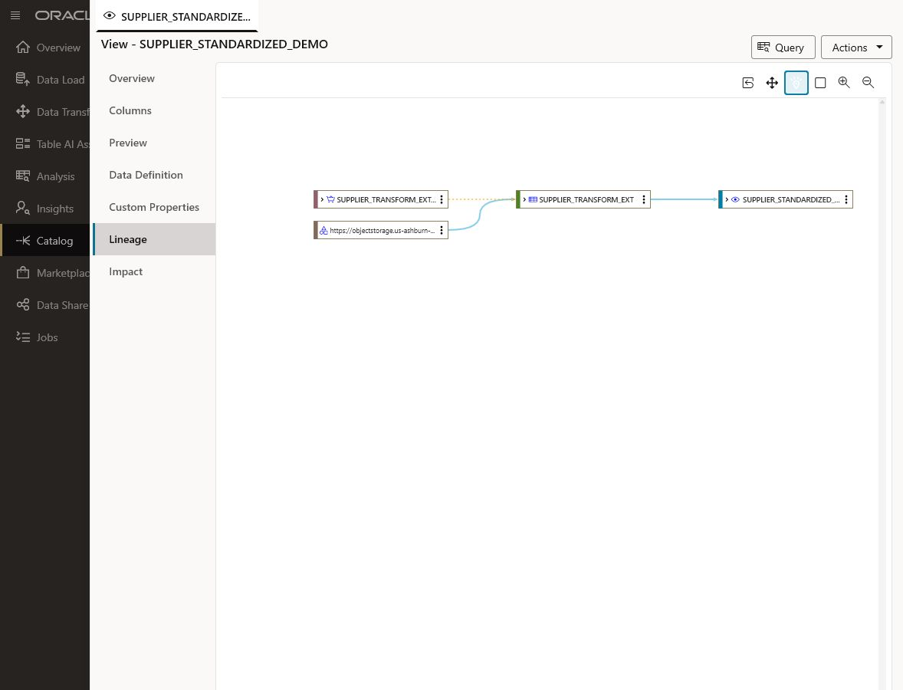

5. Return to the SQL worksheet and inspect the workshop-created `SEER_GOLD.LINEAGE_SUMMARY` audit table for the seeded Gold project-context product:

    ```sql
    <copy>
    SELECT target_object,
           source_object,
           transformation_name,
           pipeline_run_id,
           completed_at
    FROM seer_gold.lineage_summary
    WHERE target_object = 'SEER_GOLD.PROJECT_CONTEXT'
    ORDER BY completed_at DESC, source_object;
    </copy>
    ```

6. Confirm that the Gold product can be traced to its Silver entities, Bronze records, and original documents or files. Catalog provides interactive lineage for supported database objects, while the workshop-created `SEER_GOLD.LINEAGE_SUMMARY` audit table preserves the complete seeded pipeline lineage.

## Lab 1 Recap

In this lab, you:

- Verified the pre-provisioned lakehouse environment.
- Used Data Studio to link an Object Storage CSV as the attendee-created Bronze external table `SUPPLIER_TRANSFORM_EXT`.
- Used Data Studio Catalog to compare Bronze, Silver, and Gold entities and inspect lineage.
- Created the Silver demonstration view `SUPPLIER_STANDARDIZED_DEMO` directly in ALH.
- Compared the responsibilities of Bronze, Silver, and Gold.
- Traced the Austin steel-delivery event across source systems.
- Reviewed quality, quarantine, reconciliation, and lineage evidence.

The key takeaway is that connecting sources is only the beginning. Trusted AI context requires explicit contracts, reconciliation, and provenance.

## Learn More

- [Use external tables with Autonomous Database](https://docs.oracle.com/en/cloud/paas/autonomous-database/serverless/adbsb/query-external-data.html)
- [Link to objects in cloud storage with Data Studio](https://docs.oracle.com/en/cloud/paas/autonomous-database/serverless/adbsb/link-to-cloud.html)
- [Discover and Manage Data with Catalog in Autonomous AI Database](https://docs.oracle.com/en-us/iaas/autonomous-database-serverless/doc/catalog-entities.html)
- [Transform Data with Data Transforms in Autonomous AI Database](https://docs.oracle.com/en-us/iaas/autonomous-database-serverless/doc/autonomous-data-transforms.html)
- [OCI Object Storage documentation](https://docs.oracle.com/en-us/iaas/Content/Object/home.htm)

## Acknowledgements

- **Author:** Eli Schilling, Cloud Architect || Evangelist
- **Contributors:** Oracle LiveLabs and ONA Lab Experience Teams
- **Last Updated By / Date:** ONA Lab Experience team, July 2026
