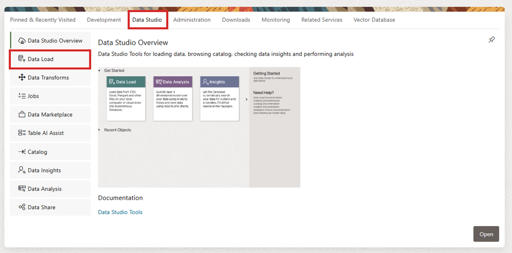

# Lab 2: Explore the Unified Lakehouse Foundation

## Introduction

Alex has an approved business ontology, but an ontology alone does not make source data trustworthy. The underlying records still arrive with different identifiers, formats, quality levels, and update schedules. In this lab, you will inspect the representative source feeds prepared for Seer Construction Group and follow them through the Bronze, Silver, and Gold medallion architecture you built in Lab 1.

The workshop uses simulated extracts that emulate data from Fusion ERP, Primavera, CRM, and on-premises applications. OCI Object Storage and Oracle Autonomous AI Lakehouse are the real services used to store, organize, and query the workshop data.

AIDP could perform equivalent transformations with Spark notebooks and workflows. In this workshop, ALH is both the transformation environment and the serving layer. You will prove that boundary by using Data Studio to link an Object Storage CSV as a Bronze external table and then running a small Bronze-to-Silver SQL transformation directly in ALH.

**Estimated Time:** 25 minutes

### Objectives

In this lab, you will:

- Verify the workshop schemas and data products created in Lab 1.
- Create a Bronze external table over a CSV in OCI Object Storage using the Data Studio interface.
- Use Data Studio Catalog to inspect representative Bronze, Silver, and Gold entities.
- Run a representative Bronze-to-Silver transformation inside ALH.
- Explain what belongs in Bronze, Silver, and Gold.
- Trace a steel-delivery business event across multiple source extracts.
- Review data quality, reconciliation, and lineage evidence.

### Prerequisites

- Completion of Lab 1
- Authenticated OCI Console access to the Autonomous AI Lakehouse
- The Object Storage base URI recorded in Lab 1
- Access to Database Actions and Data Studio
- Read access to `SEER_BRONZE`, `SEER_SILVER`, and `SEER_GOLD`
- A database resource principal with read access to the workshop Object Storage bucket
- Permission to create a table and view in the connected database schema

> **Note:** Use the `ADMIN` Database Actions session for this lab. The external table and Silver demonstration view are created in the `ADMIN` schema, and the screenshots reflect that session. The `SEER_WORKSHOP` user owns the embedding model and is used only where the workshop explicitly instructs you to sign in with that account.

## Task 1: Verify the workshop environment

You built the environment in Lab 1. Begin with a short readiness check so later exercises fail early and clearly if a required asset is missing.

1. In the OCI Console, open the **Navigation menu**, select **Oracle AI Database**, and then select **Autonomous AI Database**.

2. Confirm that you are in the region assigned to your workshop environment. Open the Autonomous AI Database identified by your instructor.

3. On the database details page, select **Database actions**, and then select **SQL**. Database Actions opens in a new browser tab.

    

4. Wait for the SQL worksheet to finish loading. First-time users may see a short **Run Statement** tour, an ADMIN-user warning, a dark-theme announcement, or other informational notices. Select **X**, **Close**, or **Done** when those controls are available.

    

5. Run the following query to confirm your connected database user:

    ```sql
    <copy>
    SELECT USER AS connected_user FROM dual;
    </copy>
    ```

6. Confirm that the three medallion schemas are visible:

    ```sql
    <copy>
    SELECT owner, COUNT(*) AS object_count
    FROM all_objects
    WHERE owner IN ('SEER_BRONZE', 'SEER_SILVER', 'SEER_GOLD')
      AND object_type IN ('TABLE', 'VIEW')
    GROUP BY owner
    ORDER BY owner;
    </copy>
    ```

7. Confirm that the workshop contains source data, conformed entities, Gold products, and document chunks:

    ```sql
    <copy>
    SELECT 'Bronze source records' AS asset, COUNT(*) AS row_count
    FROM seer_bronze.source_record_inventory
    UNION ALL
    SELECT 'Silver assets', COUNT(*)
    FROM seer_silver.assets
    UNION ALL
    SELECT 'Gold project context', COUNT(*)
    FROM seer_gold.project_context
    UNION ALL
    SELECT 'Searchable document chunks', COUNT(*)
    FROM seer_gold.document_chunks;
    </copy>
    ```

8. Verify that every result contains at least one row. If an object is missing, stop and use the **Need Help?** section before continuing.

## Task 2: Link an Object Storage CSV as a Bronze external table

In Lab 1, you uploaded representative source extracts to a private Object Storage bucket and loaded managed staging copies. In this task, you will link the supplier CSV without copying it again. The resulting external table lets you compare a live link with the managed-load pattern.

1. In the SQL worksheet header, select **Database Actions** to return to the Launchpad. If the **Introducing Dark Theme** notice appears, select **Done**. Select the **Data Studio** category, and then select **Data Load**.

    

2. On the Data Load home page, select **Connections**.

    

3. Select **Create**, and then select **New Cloud Store Location**.

    

4. On **Storage Settings**, configure the cloud store location:

    - **Name:** `SEER_LAKE_SOURCE`
    - **Select Credential:** Keep the preselected `OCI$RESOURCE_PRINCIPAL` credential for the connected user.
    - **Bucket URI:** Keep **Bucket URI** selected and paste the Object Storage base URI recorded in Lab 1.

    

    The environment setup has already enabled the resource principal and granted it read access to this private bucket. You do not need an OCI username, auth token, or signing key.

5. Select **Next**. On **Cloud Data**, confirm that the preview lists folders such as `documents`, `models`, and `source-data`. This confirms that the database can reach the private bucket. Select **Create**.

6. Select the **Data Load** breadcrumb to return to the Data Load home page, and then select **Link Data**. **Cloud Store** is selected by default.

    

    > **Link rather than load:** **Link Data** leaves the CSV in Object Storage and creates an external table. **Load Data** would copy the rows into a managed database table.

7. Confirm that `SEER_LAKE_SOURCE` is selected. Expand `SEER_LAKE_SOURCE`, `source-data`, and `suppliers`. Double-click `supplier_extract.csv`, or drag it into the data link cart.

    

8. On the file card, select **Settings** and configure the link:

    - **Option:** Create External Table
    - **Table name:** `SUPPLIER_TRANSFORM_EXT`
    - **Validation Type:** Full
    - **Encoding:** AL32UTF8 - Unicode UTF-8 encoding scheme
    - **Text enclosure:** Double quote
    - **Field delimiter:** Comma
    - **Column header row:** Selected, row `1`
    - **Start processing data at row:** `2` (set automatically when the header row is selected)
    - **Partition column:** None

9. In **Mapping**, retain the source-aligned columns. This is a Bronze asset, so do not standardize names, statuses, certifications, or locations yet.

10. Confirm that Mapping contains the seven CSV columns: source record ID, supplier name, source status, certification, location, source system, and ingestion batch ID. Data Studio does not add separate file-name or link-timestamp mapping rows in this flow. Object Storage lineage, the cloud-store connection, and `INGESTION_BATCH_ID` preserve the source context needed for this exercise.

11. Review **Preview** to confirm the header and CSV fields were interpreted correctly. Review **Table** to inspect the proposed external-table shape.

12. Open **SQL** and review the database commands Data Studio will generate. Notice that Data Studio uses `DBMS_CLOUD.CREATE_EXTERNAL_TABLE`; you do not need to copy or run this SQL manually.

13. Select **Close**, and then select **Start** in the data link cart. In **Start Link From Cloud Store**, select **Run**.

    

14. Wait for Data Studio to return to the Data Load home page. Confirm that `SUPPLIER_TRANSFORM_EXT` shows **8 rows loaded**.

    

15. Select **Report**. Confirm that the Job Report shows **8 rows validated**, **8 rows processed successfully**, and **0 rows rejected**. Select **Close**.

    

16. On the completed external-table card, select **Query**. Data Studio opens **Analysis** and displays the seven external-table columns and eight rows. If the **Selected Schema** tour prompt appears, select **X**.

17. Return to the Database Actions Launchpad, open **SQL**, and review the broader seeded source inventory:

    ```sql
    <copy>
    SELECT source_system,
           source_object,
           storage_format,
           record_count,
           extracted_at,
           ingestion_batch_id
    FROM seer_bronze.source_record_inventory
    ORDER BY source_system, source_object;
    </copy>
    ```

18. The other representative feeds include Fusion ERP-style purchasing and financial data, Primavera-style milestones, on-premises-style inspection findings, and PDF project evidence in the same Object Storage bucket. Bronze preserves what arrived, including source identifiers and provenance; it is not the stable contract applications should consume.

## Task 3: Compare Bronze, Silver, and Gold

The medallion layers answer different questions.

| Layer | Primary question | Typical controls |
| --- | --- | --- |
| Bronze | What arrived from the source? | Provenance, ingestion time, raw payload retention |
| Silver | What enterprise entity does it represent? | Standardization, validation, deduplication, reconciliation |
| Gold | What trusted product does a consumer need? | Business definitions, stable schema, quality and freshness expectations |

1. Return to the Database Actions Launchpad, select **Data Studio**, and then select **Catalog**.

2. Confirm that `LOCAL` is the selected catalog. Select the `LOCAL` schema selector, remove the current schema, select `SEER_BRONZE`, and select **Apply**. Search for `SOURCE_RECORD_INVENTORY`.

3. Open `SEER_BRONZE.SOURCE_RECORD_INVENTORY`. Use the available entity-detail tabs to:

    - Preview the source inventory rows.
    - Inspect the columns and data types.
    - Review statistics when available.
    - Notice the source object, storage format, extraction time, and ingestion batch metadata retained in Bronze.

4. Select the `LOCAL` schema selector, replace `SEER_BRONZE` with `SEER_SILVER`, and select **Apply**. Search for `ASSETS`, and open `SEER_SILVER.ASSETS`. Preview the data and locate `CANONICAL_ASSET_NAME`, `NORMALIZED_STATUS`, `SOURCE_SYSTEM_COUNT`, and `RECONCILIATION_STATUS`.

5. Search for and open `SEER_SILVER.SUPPLIERS`. Preview the standardized supplier names, qualification statuses, compliance statuses, and matched-source counts. These fields show how Silver resolves source differences into conformed enterprise entities.

6. Select the `LOCAL` schema selector, replace `SEER_SILVER` with `SEER_GOLD`, and select **Apply**. Search for `PROJECT_CONTEXT`, and open `SEER_GOLD.PROJECT_CONTEXT`. Preview the product and inspect its columns. Locate the project, asset, milestone, committed cost, inspection, supplier, and freshness fields.

7. Compare the three entity-detail pages. Bronze emphasizes what arrived and where it came from, Silver emphasizes reconciliation and standardization, and Gold presents stable business concepts for consumers. Provenance remains available even though consumers no longer need to understand every source-system field.

## Task 4: Run an ALH-native Bronze-to-Silver transformation

The complete production-style medallion architecture is seeded, but the external table you just linked lets you execute one representative transformation yourself. You will standardize its deliberately inconsistent supplier data with database-native SQL and compare your result with the seeded Silver mapping.

1. Inspect the sample Bronze records:

    ```sql
    <copy>
    SELECT source_record_id,
           supplier_name,
           source_status,
           certification,
           location,
           source_system,
           ingestion_batch_id
    FROM supplier_transform_ext
    ORDER BY source_record_id;
    </copy>
    ```

2. Identify differences such as extra spaces, abbreviations, inconsistent case, status codes, and missing certifications.

3. Create a standardized view in your connected schema:

    ```sql
    <copy>
    CREATE OR REPLACE VIEW supplier_standardized_demo AS
    SELECT source_record_id,
           CASE
             WHEN UPPER(TRIM(supplier_name)) IN (
                    'ATLAS STRUCTURAL FAB.',
                    'ATLAS STRUCTURAL FABRICATION'
                  )
             THEN 'Atlas Structural Fabrication'
             ELSE INITCAP(TRIM(supplier_name))
           END AS canonical_supplier_name,
           CASE UPPER(TRIM(source_status))
             WHEN 'A' THEN 'APPROVED'
             WHEN 'APPROVED' THEN 'APPROVED'
             WHEN 'PENDING_INFO' THEN 'REQUEST_INFORMATION'
             ELSE 'REVIEW_REQUIRED'
           END AS qualification_status,
           CASE
             WHEN certification IS NULL THEN 'MISSING'
             WHEN UPPER(certification) LIKE '%AISC%' THEN 'AISC'
             ELSE UPPER(TRIM(certification))
           END AS normalized_certification,
           REPLACE(
             UPPER(TRIM(location)),
             ', TEXAS',
             ', TX'
           ) AS normalized_location,
           source_system,
           ingestion_batch_id
    FROM supplier_transform_ext;
    </copy>
    ```

4. Query your transformed result:

    ```sql
    <copy>
    SELECT *
    FROM supplier_standardized_demo
    ORDER BY canonical_supplier_name, source_record_id;
    </copy>
    ```

5. Compare the standardized name, status, certification, and location with the seeded Silver mapping:

    ```sql
    <copy>
    SELECT demo.source_record_id,
           demo.canonical_supplier_name AS attendee_result,
           silver.canonical_supplier_name AS seeded_silver_result,
           CASE
             WHEN demo.canonical_supplier_name = silver.canonical_supplier_name
              AND demo.qualification_status = silver.qualification_status
              AND demo.normalized_certification = silver.normalized_certification
              AND demo.normalized_location = silver.normalized_location
             THEN 'MATCH'
             ELSE 'REVIEW'
           END AS validation_status
    FROM supplier_standardized_demo demo
    JOIN seer_silver.supplier_source_mappings silver
      ON silver.source_record_id = demo.source_record_id
    ORDER BY demo.source_record_id;
    </copy>
    ```

6. Confirm that all eight rows return `MATCH`. Notice that the view retains the source record, source system, and ingestion batch needed for provenance; Catalog lineage supplies the file and Object Storage path.

7. Your SQL standardized individual records. The seeded Silver pipeline also performs cross-source entity matching, survivorship, validation, and quarantine. Standardization is an important transformation step, but it is not the entire reconciliation process.

> **ALH Data Transforms alternative:** You used SQL because this rule is concise and easy to validate. ALH Data Transforms can represent the same pattern visually with source, expression, mapping, validation, and target components. It also provides reusable connections, workflows, scheduling, and job monitoring. The full seeded pipeline may use SQL, Data Transforms, or both according to the needs of each step.

## Task 5: Trace the Austin steel-delivery event

The reinforced-steel framework for Seer's Austin bank project appears differently in each source. Use the cross-source mapping to follow the shared business event.

1. Locate the source records associated with the Austin steel delivery:

    ```sql
    <copy>
    SELECT source_system,
           source_object,
           source_record_id,
           source_description,
           canonical_event_id,
           match_method,
           match_confidence
    FROM seer_silver.source_record_mappings
    WHERE UPPER(canonical_business_term) = 'STEEL DELIVERY'
      AND UPPER(project_name) LIKE '%AUSTIN%'
    ORDER BY source_system, source_object;
    </copy>
    ```

2. Confirm that the mapping includes financial, schedule, supplier, and inspection context.

3. Open the canonical event:

    ```sql
    <copy>
    SELECT event_id,
           project_name,
           asset_name,
           event_type,
           planned_date,
           actual_date,
           supplier_name,
           financial_status,
           inspection_status
    FROM seer_silver.project_events
    WHERE event_id = (
      SELECT canonical_event_id
      FROM seer_silver.source_record_mappings
      WHERE UPPER(canonical_business_term) = 'STEEL DELIVERY'
        AND UPPER(project_name) LIKE '%AUSTIN%'
      FETCH FIRST 1 ROW ONLY
    );
    </copy>
    ```

4. Review the corresponding Gold record:

    ```sql
    <copy>
    SELECT project_name,
           asset_name,
           supplier_name,
           milestone_status,
           purchase_order_status,
           inspection_status,
           decision_readiness
    FROM seer_gold.project_context
    WHERE UPPER(project_name) LIKE '%AUSTIN%'
      AND UPPER(asset_name) LIKE '%STEEL%';
    </copy>
    ```

5. The Gold product does not erase source differences. It resolves them into a stable business object while preserving the mappings needed to explain the result.

## Task 6: Review quality and lineage evidence

Data should advance only when it satisfies the contract for the next layer.

1. Review the latest quality-rule results:

    ```sql
    <copy>
    SELECT layer_name,
           rule_name,
           rule_dimension,
           records_evaluated,
           records_failed,
           status,
           evaluated_at
    FROM seer_gold.data_quality_results
    ORDER BY evaluated_at DESC, layer_name, rule_name;
    </copy>
    ```

2. Review quarantined records without changing them:

    ```sql
    <copy>
    SELECT source_system,
           source_record_id,
           failed_rule,
           failure_reason,
           quarantine_status
    FROM seer_silver.quarantined_records
    ORDER BY source_system, source_record_id;
    </copy>
    ```

3. Return to **Data Studio > Catalog**. Select the `LOCAL` schema selector, choose the schema shown by `SELECT USER` in Task 1, and select **Apply**.

4. In **Entity type**, include **View**. Search for `SUPPLIER_STANDARDIZED_DEMO`, open the view, and select **Lineage**. Confirm the visual chain from the Object Storage URI and cloud-store link to `SUPPLIER_TRANSFORM_EXT`, and then to `SUPPLIER_STANDARDIZED_DEMO`.

    

5. Return to the SQL worksheet and inspect the workshop's recorded lineage for the seeded Gold project context product:

    ```sql
    <copy>
    SELECT target_object,
           source_object,
           transformation_name,
           pipeline_run_id,
           completed_at
    FROM seer_gold.lineage_summary
    WHERE target_object = 'SEER_GOLD.PROJECT_CONTEXT'
    ORDER BY completed_at DESC, source_object;
    </copy>
    ```

6. Confirm that the Gold product can be traced to its Silver entities, Bronze records, and original documents or files. Catalog provides interactive lineage for supported database objects, while `SEER_GOLD.LINEAGE_SUMMARY` preserves the workshop's complete seeded pipeline lineage.

## Lab 2 Recap

In this lab, you:

- Verified the lakehouse environment built in Lab 1.
- Used Data Studio to link an Object Storage CSV as the attendee-created Bronze external table `SUPPLIER_TRANSFORM_EXT`.
- Used Data Studio Catalog to compare Bronze, Silver, and Gold entities and inspect lineage.
- Created the Silver demonstration view `SUPPLIER_STANDARDIZED_DEMO` directly in ALH.
- Compared the responsibilities of Bronze, Silver, and Gold.
- Traced the Austin steel-delivery event across source systems.
- Reviewed quality, quarantine, reconciliation, and lineage evidence.

The key takeaway is that connecting sources is only the beginning. Trusted AI context requires explicit contracts, reconciliation, and provenance.

## Learn More

- [Use external tables with Autonomous Database](https://docs.oracle.com/en/cloud/paas/autonomous-database/serverless/adbsb/query-external-data.html)
- [Link to objects in cloud storage with Data Studio](https://docs.oracle.com/en/cloud/paas/autonomous-database/serverless/adbsb/link-to-cloud.html)
- [Discover and Manage Data with Catalog in Autonomous AI Database](https://docs.oracle.com/en-us/iaas/autonomous-database-serverless/doc/catalog-entities.html)
- [Transform Data with Data Transforms in Autonomous AI Database](https://docs.oracle.com/en-us/iaas/autonomous-database-serverless/doc/autonomous-data-transforms.html)
- [OCI Object Storage documentation](https://docs.oracle.com/en-us/iaas/Content/Object/home.htm)

## Acknowledgements

- **Author:** Eli Schilling, Cloud Architect || Evangelist
- **Contributors:** Oracle LiveLabs and ONA Lab Experience Teams
- **Last Updated By / Date:** ONA Lab Experience team, July 2026
