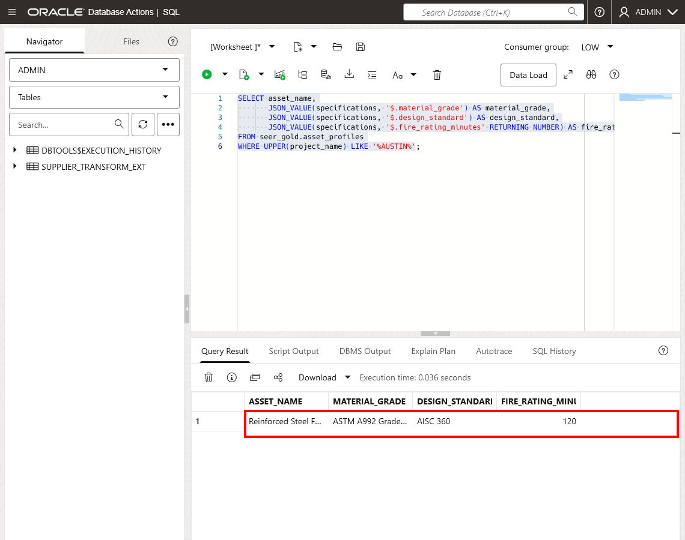
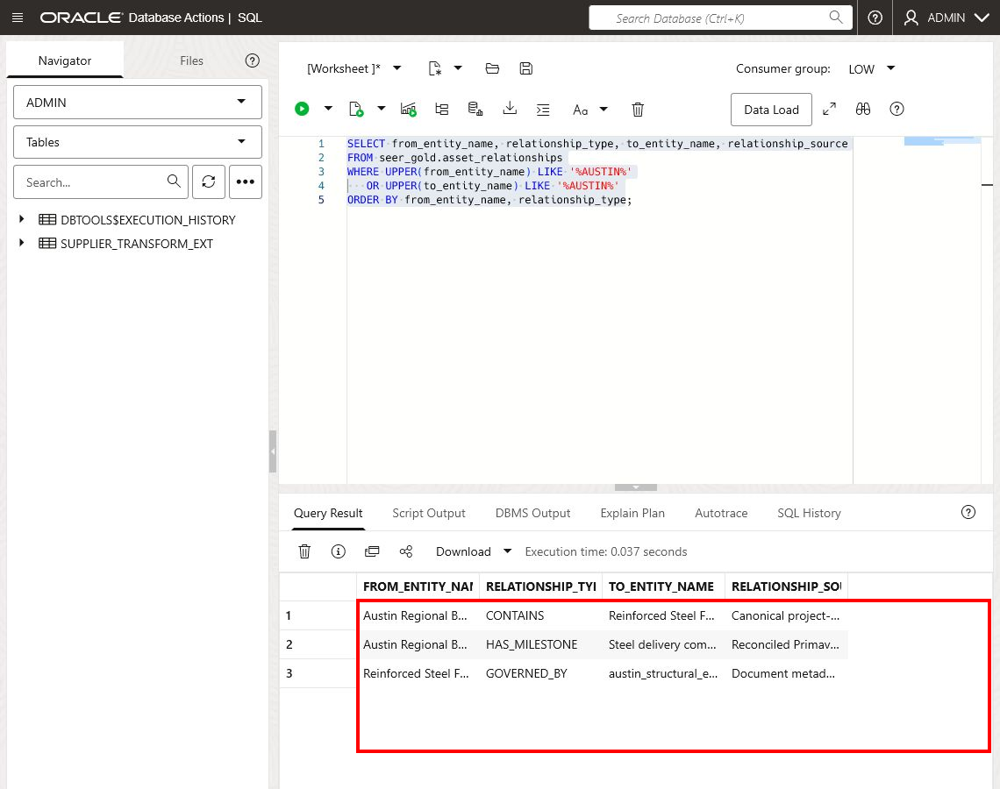
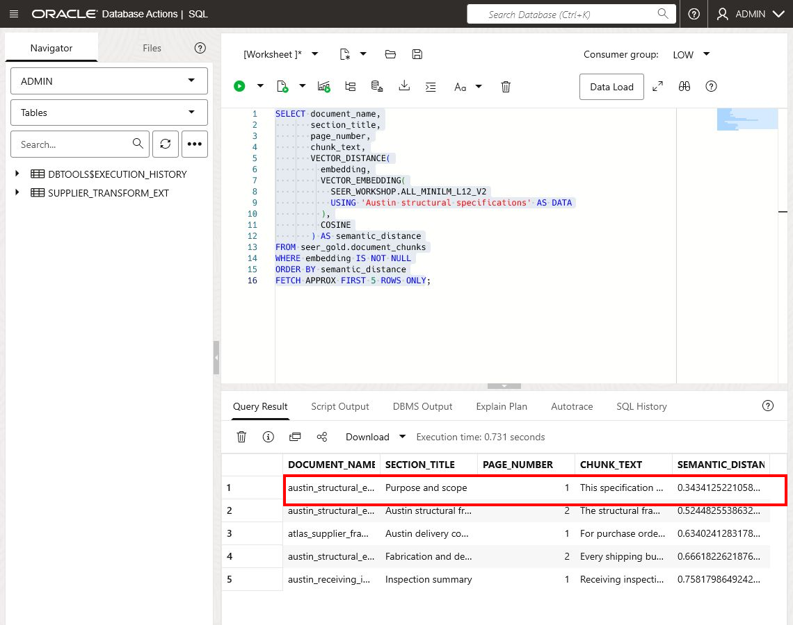
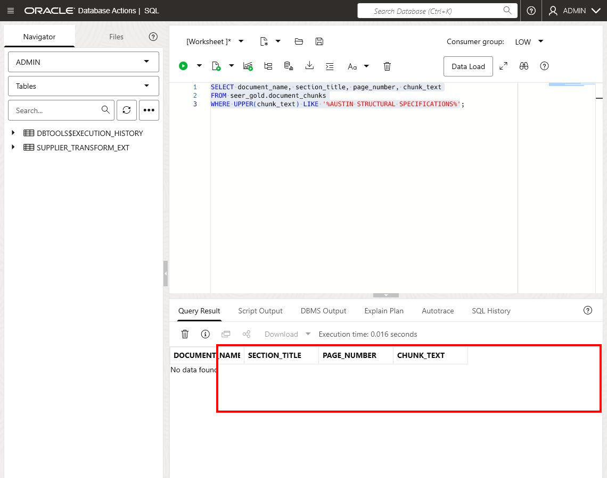
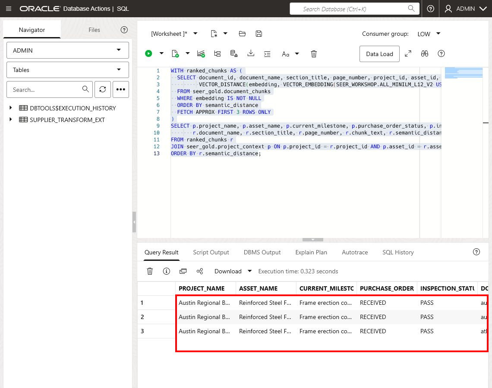
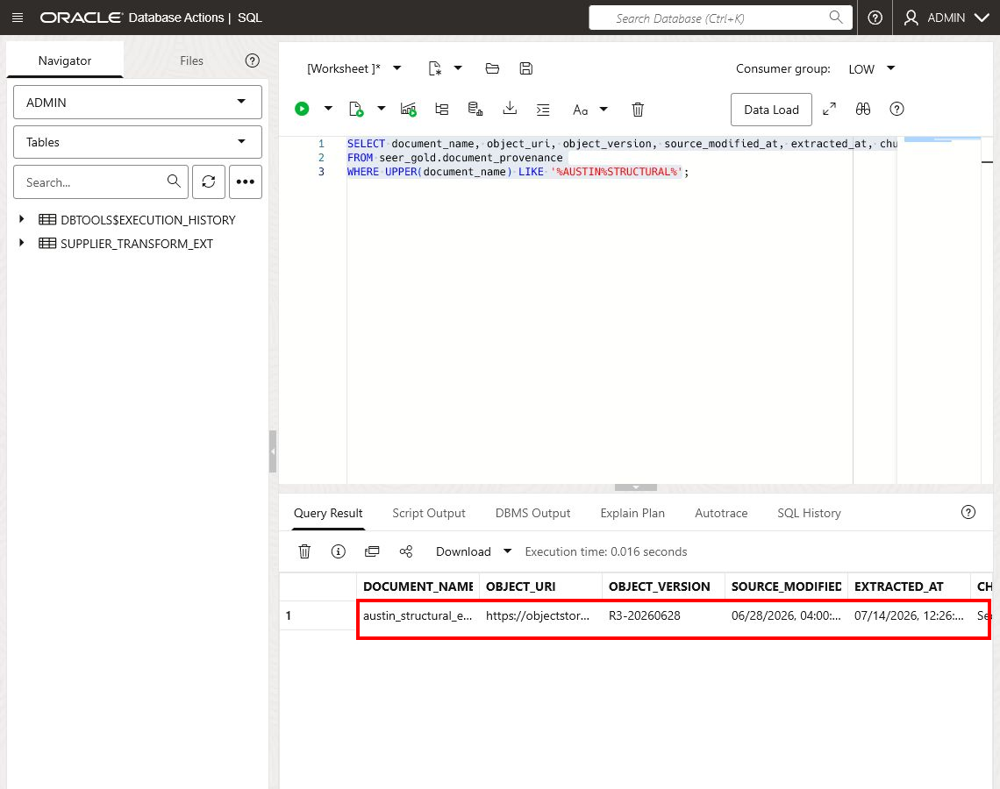

# Lab 2: Unify Data for AI Applications

## Introduction

Lab 1 established a trusted foundation for structured data. In this lab, you extend that foundation to AI applications by combining Gold business context with searchable document evidence. Gold data products make project facts easy to consume, but applications and agents also need detailed evidence from contracts, specifications, inspection reports, and compliance documents. You will explore how Oracle Autonomous AI Lakehouse keeps structured facts and unstructured document evidence governed together, then use semantic search to find engineering-specification content relevant to the Austin project.

The workshop setup has already created the relationship projection, document relationships, chunks, embeddings, and vector index inside ALH. Your task is to inspect and use these prepared assets; you do not need to create them. No data is changed in this lab.

**Estimated Time:** 20 minutes

### Objectives

In this lab, you will:

- Use Data Studio Catalog to inspect the Gold products intended for applications and agents.
- Compare relational, JSON, relationship-projection, and vector representations.
- Review how project documents were prepared for semantic retrieval.
- Run a vector search for Austin structural specifications.
- Combine retrieved evidence with structured project context and provenance.

### Prerequisites

- Completion of Lab 1
- Read access to `SEER_GOLD`
- The `SEER_WORKSHOP.ALL_MINILM_L12_V2` embedding model loaded in the database
- Precomputed embeddings and a valid vector index on `SEER_GOLD.DOCUMENT_CHUNKS`

## Task 1: Inspect the consumer-ready Gold products

Applications and agents should consume stable, business-oriented data products rather than reconstructing joins across raw source systems. In this task, you will inspect the Gold products available to the downstream Construction Evaluation Agent.

1. From the Database Actions Launchpad, select **Data Load**. In the Data Studio left pane, select **Catalog**.

2. Confirm that `LOCAL` is selected. Select the `LOCAL` schema selector, replace the current schema with `SEER_GOLD`, and select **Apply**. Search for `DATA_PRODUCT_CATALOG`.

3. Open `SEER_GOLD.DATA_PRODUCT_CATALOG` and select **Preview**. Review each product's business purpose, owner, refresh frequency, quality status, and intended consumers. `DATA_PRODUCT_CATALOG` is a business-facing register of approved data products; it helps a team understand what is available, who owns it, and whether it is suitable for a particular consumer.

4. Locate the three products that align to the downstream Construction Evaluation Agent:

    - `PROJECT_CONTEXT`
    - `SUPPLIER_RECOMMENDATIONS`
    - `SUPPLIER_PROFILE`

5. Return to the Catalog results, search for `SUPPLIER_RECOMMENDATIONS`, and open `SEER_GOLD.SUPPLIER_RECOMMENDATIONS`.

6. Use **Preview** to inspect the project, supplier, fit score, risk level, recommendation status, and missing-information fields. Use **Columns** to review the entity's columns and data types.

7. Notice that the product exposes a stable decision-support contract. An application can consume recommendation and risk information directly without needing to understand raw ingestion fields or reconstruct source-system joins.

## Task 2: Compare the data shapes

The same governed business data can be exposed through different data shapes without creating separate, unsynchronized copies. In this task, you will inspect relational facts, flexible JSON attributes, and entity relationships.

1. Query relational project facts:

    ```sql
    <copy>
    SELECT project_name, asset_name, current_milestone, inspection_status
    FROM seer_gold.project_context
    WHERE UPPER(project_name) LIKE '%AUSTIN%';
    </copy>
    ```

    This relational result provides a simple, tabular view of the project, asset, schedule milestone, and inspection status. It is well suited to reports, dashboards, and application queries.

2. Inspect flexible attributes stored as JSON:

    ```sql
    <copy>
    SELECT asset_name,
           JSON_VALUE(specifications, '$.material_grade') AS material_grade,
           JSON_VALUE(specifications, '$.design_standard') AS design_standard,
           JSON_VALUE(
             specifications,
             '$.fire_rating_minutes' RETURNING NUMBER
           ) AS fire_rating_minutes
    FROM seer_gold.asset_profiles
    WHERE UPPER(project_name) LIKE '%AUSTIN%';
    </copy>
    ```

      `SPECIFICATIONS` stores flexible technical attributes as a JSON document. `JSON_VALUE` retrieves individual attributes from that document as queryable columns, allowing the model to evolve without a new relational column for every possible specification attribute.

      

3. Explore the prebuilt relationship projection:

    ```sql
    <copy>
    SELECT from_entity_name,
           relationship_type,
           to_entity_name,
           relationship_source
    FROM seer_gold.asset_relationships
    WHERE UPPER(from_entity_name) LIKE '%AUSTIN%'
       OR UPPER(to_entity_name) LIKE '%AUSTIN%'
    ORDER BY from_entity_name, relationship_type;
    </copy>
    ```

  4. This result describes how governed entities are related, such as a project to an asset or an asset to another business object. The relationship projection can support graph-style application queries without requiring the learner to create graph definitions in this workshop.

      

## Task 3: Inspect the document preparation pipeline

Before an AI application can retrieve document evidence reliably, each source document must be registered, processed into meaningful chunks, enriched with metadata, embedded, and indexed.

1. Return to the **Catalog** item in the Data Studio left pane. Select the `LOCAL` schema selector, choose `SEER_GOLD`, and select **Apply**. Search for `DOCUMENT_CATALOG`.

2. Open `SEER_GOLD.DOCUMENT_CATALOG` and select **Preview**. Locate each document's name, type, project, asset, version, Object Storage URI, and classification. Use **Columns** to inspect the registered metadata contract. `DOCUMENT_CATALOG` describes each original document and preserves its source and business context.

3. Return to the Catalog results, search for `DOCUMENT_CHUNKS`, and open `SEER_GOLD.DOCUMENT_CHUNKS`. Preview the entity and inspect its column definitions and statistics. Locate the chunk sequence, page and section metadata, embedding model, embedding status, and source identifiers. A chunk is a meaningful document section or passage that retains the metadata needed to retrieve it, connect it to the right project or asset, and trace it to its source document.

4. Return to the SQL worksheet and inspect the prepared chunks for the Austin project:

    ```sql
    <copy>
    SELECT document_name,
           section_title,
           chunk_sequence,
           character_count,
           embedding_model,
           embedding_status
    FROM seer_gold.document_chunks
    WHERE UPPER(project_name) LIKE '%AUSTIN%'
    ORDER BY document_name, chunk_sequence;
    </copy>
    ```

5. Review the preparation stages:

    1. Register the original Object Storage object and version.
    2. Extract text while retaining page and section boundaries.
    3. Create chunks sized for coherent retrieval.
    4. Attach project, asset, supplier, classification, and provenance metadata.
    5. Generate embeddings inside the Oracle security boundary.
    6. Build or refresh the vector index.

6. Chunking is a data-quality decision. A technically valid embedding can still produce poor results when chunks omit headings, combine unrelated topics, or lose source metadata.

## Task 4: Search for Austin structural specifications

Semantic search finds content with similar meaning, not only content containing the exact search phrase. The query converts the search phrase into an embedding and compares it with stored document-chunk embeddings. A lower `SEMANTIC_DISTANCE` means a closer semantic match.

1. Run a semantic search using the workshop's in-database embedding model:

    ```sql
    <copy>
    SELECT document_name,
           section_title,
           page_number,
           chunk_text,
           VECTOR_DISTANCE(
             embedding,
             VECTOR_EMBEDDING(
               SEER_WORKSHOP.ALL_MINILM_L12_V2
               USING 'Austin structural specifications' AS DATA
             ),
             COSINE
           ) AS semantic_distance
    FROM seer_gold.document_chunks
    WHERE embedding IS NOT NULL
    ORDER BY semantic_distance
    FETCH APPROX FIRST 5 ROWS ONLY;
    </copy>
    ```

2. Confirm that a section from an Austin engineering specification ranks near the top even if it does not repeat the exact search phrase.

    

3. Record the document name, section, page number, and distance for the best result.

4. Compare semantic retrieval with a simple keyword filter:

    ```sql
    <copy>
    SELECT document_name, section_title, page_number, chunk_text
    FROM seer_gold.document_chunks
    WHERE UPPER(chunk_text) LIKE '%AUSTIN STRUCTURAL SPECIFICATIONS%';
    </copy>
    ```

  5. Semantic search finds related meaning; keyword search finds exact text. Production retrieval may combine both approaches when exact project codes or contractual terms matter.

      

## Task 5: Combine document evidence with structured context

AI applications need more than a relevant document passage. They also need the project and asset context needed to interpret that passage and support a decision. The following query repeats the semantic ranking, selects the top three document chunks, and joins each result to the corresponding Gold project and asset context.

1. Use the best semantic matches as document evidence and join them to Gold project context:

    ```sql
    <copy>
    WITH ranked_chunks AS (
      SELECT document_id,
             document_name,
             section_title,
             page_number,
             project_id,
             asset_id,
             chunk_text,
             VECTOR_DISTANCE(
               embedding,
               VECTOR_EMBEDDING(
                 SEER_WORKSHOP.ALL_MINILM_L12_V2
                 USING 'Austin structural specifications' AS DATA
               ),
               COSINE
             ) AS semantic_distance
      FROM seer_gold.document_chunks
      WHERE embedding IS NOT NULL
      ORDER BY semantic_distance
      FETCH APPROX FIRST 3 ROWS ONLY
    )
    SELECT p.project_name,
           p.asset_name,
           p.current_milestone,
           p.purchase_order_status,
           p.inspection_status,
           r.document_name,
           r.section_title,
           r.page_number,
           r.chunk_text,
           r.semantic_distance
    FROM ranked_chunks r
    JOIN seer_gold.project_context p
      ON p.project_id = r.project_id
     AND p.asset_id = r.asset_id
    ORDER BY r.semantic_distance;
    </copy>
    ```

2. Review how each row combines structured project context (milestone, purchasing, and inspection status), engineering evidence (document, section, page, and text), and retrieval context (`SEMANTIC_DISTANCE`). This is an AI-ready retrieval pattern: an application can present a business answer alongside the document evidence that supports it.

    

3. Verify the provenance of the selected chunk:

    ```sql
    <copy>
    SELECT document_name,
           object_uri,
           object_version,
           source_modified_at,
           extracted_at,
           chunking_policy,
           embedding_model,
           classification
    FROM seer_gold.document_provenance
    WHERE document_name = '<document name returned by your search>';
    </copy>
    ```

  4. Replace the placeholder with the document name returned by your query. Confirm that the result can be traced to a specific source object and version. Review its extraction time, chunking policy, embedding model, and classification; provenance lets an application or reviewer verify where retrieved evidence came from, which version was used, and how it was prepared.

      

## Lab 2 Recap

In this lab, you:

- Used Data Studio Catalog to explore application-ready products and document metadata.
- Compared relational, JSON, relationship-projection, and vector representations.
- Reviewed the prebuilt document-processing pipeline.
- Retrieved Austin engineering evidence by semantic meaning.
- Combined the evidence with structured project context and provenance.

The key takeaway is that structured facts and unstructured evidence can remain governed together. Applications and agents can retrieve richer context without sending sensitive project material to an unrelated external data store.

## Labs 1–2 Wrap-Up: From Governed Data to AI-Ready Context

In Labs 1 and 2, you followed the path from enterprise source data to trusted context for an AI application. In Lab 1, you linked raw source data in Object Storage, preserved it as Bronze evidence, standardized it into Silver-style business entities, and examined Gold data products designed for consumers. You also saw how quality rules, quarantine, and lineage make those products trustworthy.

In Lab 2, you extended that foundation with governed document evidence. You reviewed how documents are cataloged, chunked, enriched with metadata, embedded, and searched by meaning. You then combined retrieved engineering evidence with Gold project context and traced the result back to its source object and version.

`Enterprise sources and documents` → governed Bronze evidence → standardized Silver entities → Gold business products and searchable document context → applications and agents with explainable answers

### Data Transforms: Productionizing the Pattern

In this workshop, you used Data Studio and SQL to make each step visible. In production, ALH Data Transforms can package these same patterns into reusable visual data flows and workflows. A flow can define sources, mappings, expressions, validations, and target writes. A workflow can schedule and monitor flows, manage dependencies, and record operational outcomes.

Use SQL when a rule is concise and easy to express directly. Use Data Transforms when a team needs a visual, repeatable, scheduled, and monitored pipeline. Many production implementations use both.

### Optional Take-Home: Lab 3

Lab 3 is an optional readiness review. It examines the operational and governance evidence behind a data product: pipeline runs, quality and freshness checks, published contracts, consumer mappings, and the final AI-readiness assessment. Its key question is: “Is this Gold product not only useful, but safe and reliable to hand to developers and AI agents?”

## Learn More

- [Discover and Manage Data with Catalog in Autonomous AI Database](https://docs.oracle.com/en-us/iaas/autonomous-database-serverless/doc/catalog-entities.html)
- [Oracle AI Vector Search User's Guide](https://docs.oracle.com/en/database/oracle/oracle-database/26/vecse/)
- [Generate vector embeddings in Oracle Database](https://docs.oracle.com/en/database/oracle/oracle-database/26/vecse/generate-vector-embeddings.html)
- [JSON in Oracle Database](https://docs.oracle.com/en/database/oracle/oracle-database/26/adjsn/)

## Acknowledgements

- **Author:** Eli Schilling, Cloud Architect || Evangelist
- **Contributors:** Oracle LiveLabs and ONA Lab Experience Teams
- **Last Updated By / Date:** ONA Lab Experience team, July 2026
