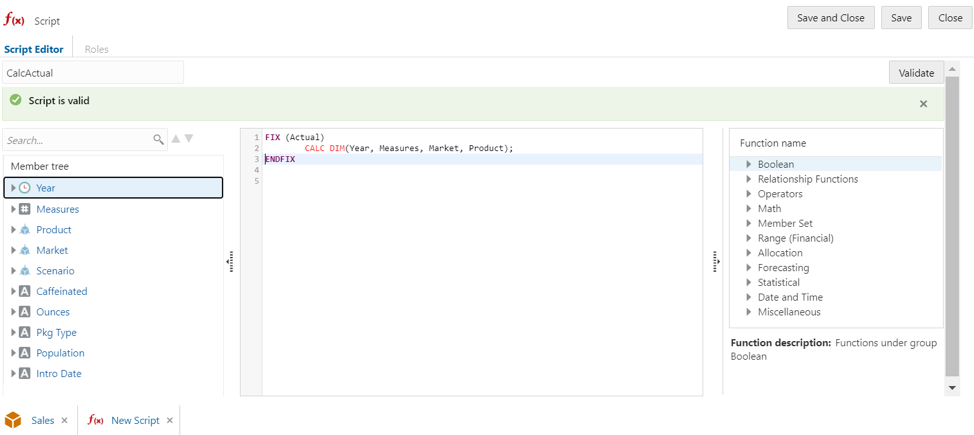
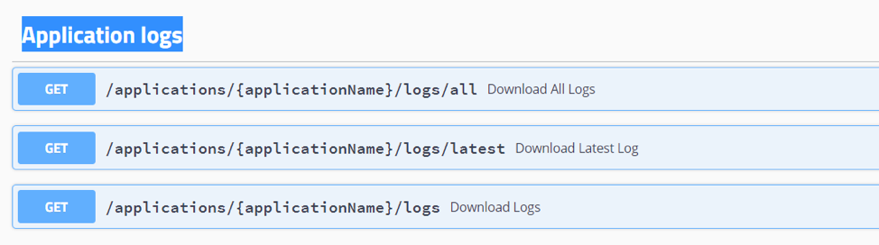
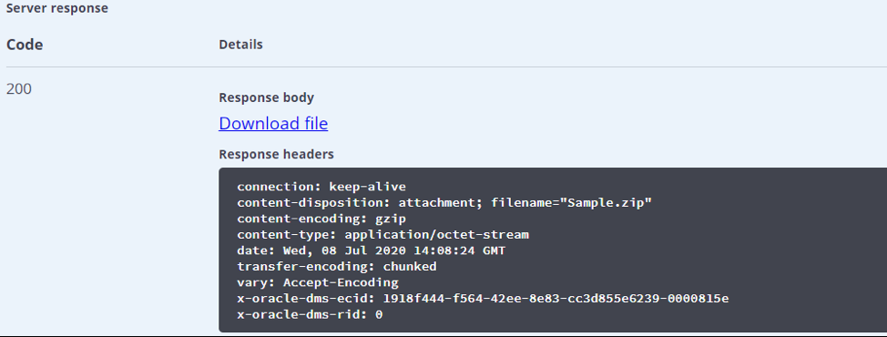

# Essbase Features: Advanced

## Introduction

This lab walks you through some of the advanced features on Essbase 19c platform such as data load to cubes and execution of Calculation scripts followed by utilities for Migration to Cloud and brief overview of automation using REST APIs.

Estimated Lab Time: 25 minutes.

### Objectives

* Learn how to build rules/calculations and run corresponding jobs.
* Learn the migration process between Cloud environments.
* Understand the Essbase REST API functionality.

### Prerequisites

This lab requires -

* An Oracle Public Cloud account-Essbase 19c instance
* Service administrator role
* Windows Operating System for Essbase add-ins (Smart View and Cube Designer)

*Note:* Whenever there is a “Name” being assigned to any Resource / Application / Cube or to any database in this lab please follow the naming convention as “Sample_<FIRST_NAME>” to avoid duplication.

## Task 1: Data Load to Cube

DataCorp IT group stores data in an Oracle Data warehouse that is being used to normalize the data. The IT group extracts data in flat files on a regular basis.

Loading data is the process of adding data values to a cube from any number of data sources or SQL database. Since data sources seldom are configured solely to support Essbase dimension build and data load processes, a rule file is generally used to create Essbase-compatible directives to be applied to the data source.

Create a rule file that is based on sample file from the data warehouse.

1.	Download the rules file [here](https://objectstorage.us-ashburn-1.oraclecloud.com/p/Pnp9bHy2Ja5o7FQILaBFhCd02G4LM9Z1buBnCIjhW84/n/natdsepltfrmanalyticshrd1/b/Essbase-Workshop/o/Data_Basic.txt)

    

2.	Set the rule file to ignore extra fields.

3.	Define the data load properties.

4.	Validate and save the rule file as LoadCorp.

5.	Load data to Sales and specify the following options.

  	a. Data Source: Data-Basic.txt

  	b. Rules file: LoadCorp.rul

6.	Open the downloaded data file, data-basic.txt, in a formatted text editor. Notice that there's no header row and that the file delimiter is a comma.

7.	Sign in to the Essbase web interface.

8.	On the home page, expand the DynamicCorp application, and select the Sales cube.

9.	Now create the load rule.

  	a.	From the Actions menu to the right of the Sales cube, launch the inspector.

	  

	  b.	Select the Scripts tab, and then Rules. The Rules editor is displayed, showing currently defined rules.
	  c.	Click Create and select Data Load to define the load data rule.

	  

	  d.	In the New Rule dialog box, enter LoadCorp as the name of the rule.

	  e.	Enter Measures as the data dimension.

	  f.	Under Preview Data, select File for flat file input.

	  g.	Click the browse icon to locate the file data-basic.txt that you downloaded, and click Open to select it.

	  h.	As you saw earlier, the first row of the flat file doesn't contain header values. Deselect the Header Row check box if it is selected. When the header row is present, the columns are mapped automatically.

	  i.	Select Comma as the Delimiter value, based on the file format.

	  j.	Click Proceed.

	  

10. You can now see the preview of the data in the Rules editor, based on the input flat file.

  	

11.	The Global options toolbar, on the top right of the Rules editor allows you to modify file properties or the data source and to see the results in the Rules editor. The Field options toolbar on the left side of the Rules editor allows you map fields in the rule.

12.	Because there were no headers in the input file, you need to map each column to the appropriate dimensions and members.

13. In the Rules editor, you can now set up the rule fields.

    

    a. Click Create drop-down menu, and start setting the field names.

    * Set Field (column) 1 to Product.
    * Set Field 2 to Market.
    * Set Field 3 to Year.
    * Set Field 4 to Scenario.
    * Set Field 5 to Sales.
    * Set Field 6 to COGS.
    * Set Field 7 to Marketing.
    * Set Field 8 to Payroll.
    * Set Field 9 to Misc.
    * Set Field 10 to Opening Inventory.
    * Set Field 11 to Additions. All dimensions must be represented in the load data rule before any data can be loaded.

    b. When you are finished defining the rule, with global and field options, click Verify on the Global toolbar to validate the syntax and click Close.

    c. After syntax is validated, click Save and Close.

    d. Click Refresh. See that your created rule is now listed in the Rules pane of the Scripts tab. You can edit your rule by clicking the rule name and then    clicking Proceed.

    e. Click Close to return to the Applications home page. Next, create a job to load the data using the rule.

14. On the home page, select Jobs, and then New Job.

    a. Select Load Data.

    b. In the Load Data dialog box, from the Application menu, select the DynamicCorp application.

    c. In the Database list, select the Sales cube.

    d. In the Script list, select the load data rule that you created, LoadCorp.rul.

    e. For Load Type, select File.

    f. Select the file Data-basic.txt from the Data File list. This file is located in the DataCorp > Sales folder.

    g. Optional: select the Abort on error check box if you want the load to stop if an error occurs.

    h. Click OK. The load data job is executed.

    

    i. On the Jobs page, click Refresh to monitor the job status.

    

15. After the job is completed, verify that the input records were processed and loaded.

    a.	On the Applications home page, click Actions to the right of the Sales cube in the DynamicCorp application.

    b.	Select Job Details to check the load data job details.

    c.	Click Close when done.

    d.	On the Applications page, click the Actions menu on the cube row to the right of the Sample cube, and click Inspect.

    e.	Select Statistics to view the resulting statistics for the Sales cube.

16. You have now completed loading data using a rule.

## Task 2: Calculating Essbase Cube

A cube contains two types of values: values that you enter, called input data, and values that are calculated from input data.

A cube can be calculated using one of two methods. Outline calculation, which is the simplest calculation method, bases the calculation of a cube on the relationships between members in the cube outline and on any formulas that are associated with members in the outline.

A calculation script, which contains a series of calculation commands, equations, and formulas, allows you to define calculations other than those defined by the database outline.

You create calculation scripts using a script editor in the Essbase web interface.
Calculation scripts do not apply to aggregate storage applications.

1.	On the Application page, expand the application.

2.	From the Actions menu, to the right of the cube name, launch the inspector.

    

3.	Select the Scripts tab, and then select the Calculation Scripts tab.

    

4.	Click Add   to create a new calculation script.

5.	If member names are required in your calculation script, drill into the Member Tree to find the members you want to add.
Right-click dimension or member names to insert them into the script.

6.	If function names are required in your calculation script, use the Function Name menu to find calculation functions and add them to the script.
See the Function description under the menu to read descriptions of each function.

7.	The following calculation script, based on the DynamicCorp.Sales database, calculates the Actual values from the Year, Measures, Market, and Product dimensions:

		FIX (Actual)
		CALC DIM(Year, Measures, Market, Product);
		ENDFIX

8. In the name field of script editor give the name to script as CalcActual

    

9.	Click **Validate** before saving your script. Validating a script verifies the script syntax. For example, incorrectly spelled function names and omitted end-of-line semicolons are identified. Validation also verifies dimension names and member names.

10.	Correct any validation errors.

11.	Click Save.

12.	Click Close.

13. After creating and saving calculation scripts, you use the Jobs page to execute them and perform the calculations on data loaded in your cube.

14.	Create your calculation script, or upload an existing calculation script.

15.	In Essbase, click Jobs.

16.	On the Jobs page, click New Job and select Run Calculation.

    

17.	On the Run Calculation dialog box, select the application - DynamicCorp and cube – Sales.

18.	Select the script – CalcActual.

    

19.	Click OK to start the calculation.

20.	Click Refresh to see the status of your calculation.

## Task 3: Migration Utilities

This exercise will introduce how to automate tasks using Essbase Command Line Interface.

Import base cube using Application Workbook structures sheet from CLI

Before you start, copy the provided file [Sample_Basic.xlsx](https://objectstorage.us-ashburn-1.oraclecloud.com/p/84mR3q7KTI_8Fnno0QzJRAMX4HsPPTmU2863GqOo-ok/n/natdsepltfrmanalyticshrd1/b/Essbase-Workshop/o/Sample_Basic.xlsx) to your CLI directory.

  

The file Sample_Basic.xlsx will be imported using CLI and form the starting point for the rest of the exercise   

1. Next deploy the the Sample cube using the Sample_Basic.xlsx file.  Call the application Sample01

    ```
    <copy> esscs.bat deploy --help
    esscs.bat deploy -a Sample01 -db Basic -file Sample_Basic.xlsx </copy>
    ```

    

2. Next, review the newly create cube from the Essbase Web Interface.

    

3. LcmExport: Back Up Cube Files. The LcmExport CLI command backs up cube artifacts to a Lifecycle Management (LCM) .zip file. To export Sample application deployed in last step use command.

    ```
    <copy> lcmExport [-verbose] -application appname [-zipfilename filename] [-localDirectory path] [-threads threadscount] [-skipdata] [-overwrite] [-generateartifactlist] [-include-server-level] </copy>
    ```
    ```
    <copy> esscs lcmExport -application Sample -zipfilename Sample.zip </copy>
    ```

    

4. LcmImport: Restore Cube Files. Restores cube artifacts from a Lifecycle Management (LCM) .zip file.

    ```
    <copy> lcmImport [-verbose] -zipfilename filename [-overwrite] [-targetappName targetApplicationName] [-artifactlist artifactList] </copy>
    ```
    ```
		<copy> Command example : esscs lcmImport -z  C:/cli/Sample.zip -o </copy>
    ```

    *NOTE:* The mentioned path should not contain spaces.

    

## Task 4: REST APIs

Using the REST API for Oracle Essbase enables you to automate management of Essbase resources and operations. All requests and responses are communicated over secured HTTP.

You can view a list of all REST Endpoints.

**Explore the Swagger Interface**

The Swagger interface for Essbase REST enables you to try out REST requests in a visual interface, even before you have set up cURL or another API implementation method.
To use the Swagger interface,

1. In a web browser, enter the URL for the Essbase web interface. For example: https://ip/essbase/jet

2. Log in.

3. In your browser address bar, select all of the URL string that immediately follows essbase, and replace it with /rest/doc/. For example, change the URL to:  https://ip/essbase/rest/doc/

4. On Swagger web interface, you will be presented with number of different REST APIs.  

5.	Under Application logs, click on the second GET button (Download All Logs).

    

    

6.	Click the Try it Out button.

    

7.	Enter the name of application.

    

8.	Click the Execute button.

9.	Look under the Server Response section. If the request was successful, then you should see a 200 response with a body such as the following:

    

10.	Click on the Download File link to download zip file containing application log.

11. You can integrate REST APIs with cURL in order to automate various Essbase tasks. cURL is a command-line data transfer tool you can use for making HTTP requests and other requests.

You may proceed to the next lab.

## Acknowledgements

* Author - NATD Cloud Engineering - Bangalore Analytics (Aparana Gupta, Sushil Mule, Sakethvishnu D, Mitsu Mehta, Fabian Reginold, Srikrishna Kambar)
* Reviewed by - Ashish Jain, Product Management
* Last Updated By/Date - Jess Rein, Cloud Engineer, Sept 2020
