# Essbase and Data Visualization

## Introduction

Essbase users are familiar with performing data analysis using Smart View for Office. Oracle Analytics Cloud - Data Visualization (DV) enables Essbase users to visualize data on top of Essbase cubes with the help of different intuitive graphs & dashboards. OAC – DV along with Essbase sourced data empowers the users with quick yet powerful insights the data is capable of.  

*Note:* The Data Visualization service in Oracle Analytics Cloud provides a direct connection for Essbase

Estimated Lab Time: 20 minutes.

### Objectives

* Getting introduced to OAC-DV with Essbase as data-source
* Understanding the connection process
* Creating intuitive dashboards on top of Essbase cubes

### Prerequisites

This lab will require the following -

*	An Oracle public cloud tenancy with OAC-DV & Essbase19c Instances of at least 1 OCPU up & running.


## Task 1: Create a Direct Connection in Data Visualizer

1. In OAC, create a new connection.

    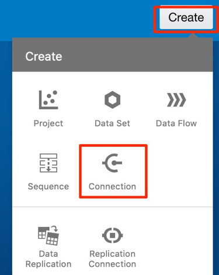

2. Select 'Oracle Essbase' as the connection type.

    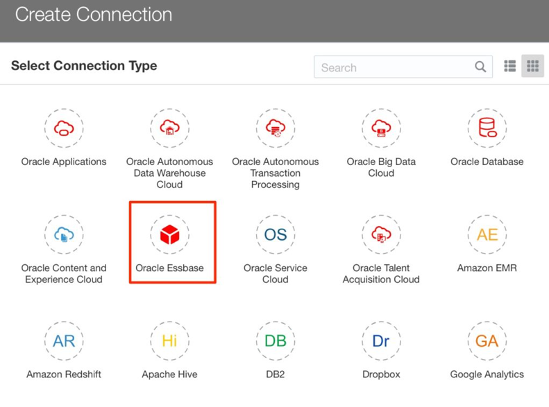

3. In the DSN, use the Essbase 19c URL [updated if using DEMO SSL certs ] as below :
http://essbaseip/essbase
The username and password are for the Essbase server credentials. [ This user must be already added to the Essbase UI ]

    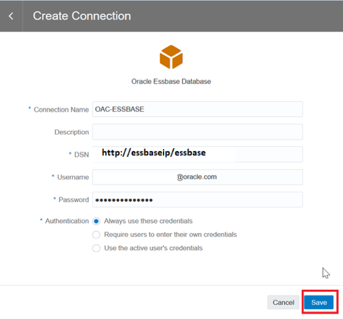

4. Once the credentials are verified the CONNECTION SUCCESS message gets displayed and we can find the connection in the “Connections” tab.

    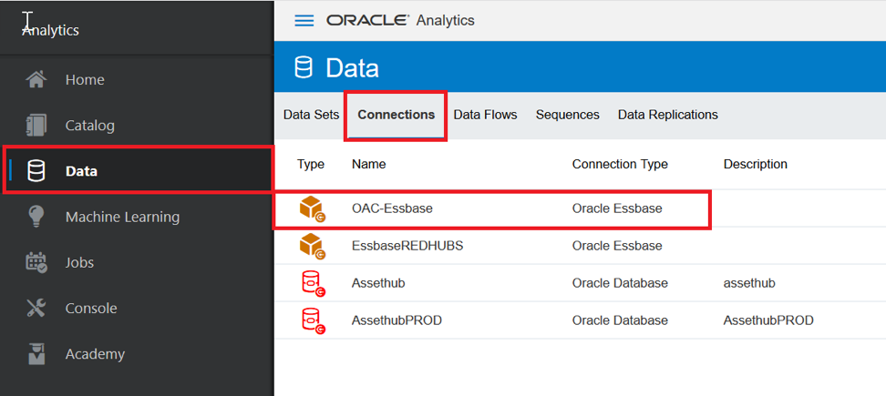

## Task 2: Essbase19c instances using DEMO CERTS

As an Essbase administrator, when you are managing your Oracle Essbase stack on Oracle Cloud Infrastructure, you may need access to the WebLogic console to perform some administrative tasks.

The Essbase stack on Oracle Cloud Infrastructure runs from a managed WebLogic server. When you start or stop the Essbase stack, it starts and stops the WebLogic server as well as the Essbase applications.

To disable the DEMO SSL certificate verification we need to open port 80 on Essbase backend. To access it,

1.	Expose the port on the target compute node. To do this, SSH into the target machine  using any tool. [ Here PUTTY tool is being used ]

2.	Enter the IP of the Essbase Node VM and click on “Auth” as shown below to provide the ppk file for the login access to backend Essbase server.

    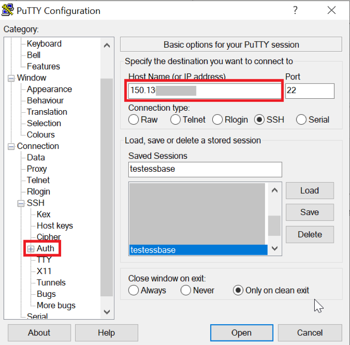

3.	Once we provide the corresponding SSH Private key file under “Auth” , click on OPEN.

    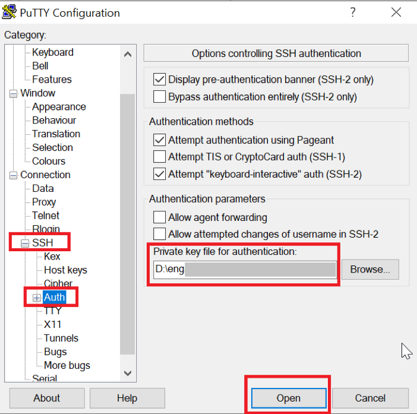

4.	Execute the below commands as given below

    ```
    <copy> sudo firewall-cmd --add-port=80/tcp --zone=public </copy>
    ```

5. To make this survive restarts of the firewall service:

    ```
    <copy> sudo firewall-cmd --add-port=80/tcp --zone=public –permanent </copy>
    ```

    ```
    <copy> sudo systemctl restart firewalld </copy>
    ```

    ```
    <copy> sudo firewall-cmd --list-all </copy>
    ```

    

6.  Enable the security list for the subnet where the Essbase Node VM resides to allow access to the port from a source network. This example enables access from the entire Internet. The quick start creates a virtual cloud network (VCN) named <prefix>-vcn, and a security list named <prefix>-app-security-list. Add an ingress rule as follows:

    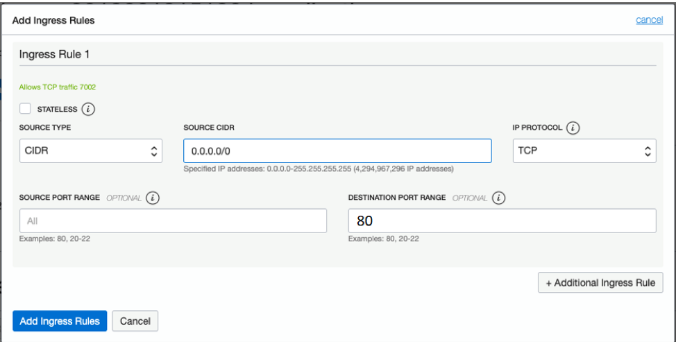

7. Now replace the URL with “HTTP” from “HTTPS” in IDCS confidential application.

    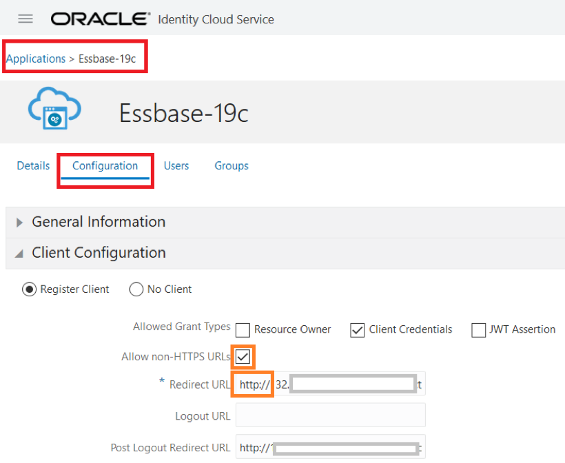

## Task 3: Create Data Sets from Essbase Cubes

After you create Essbase connections, you can use those connections to create data sets. You must create the Essbase connection before you can create a data set for it.

1.	On the Home page click Create and click Data Set.

    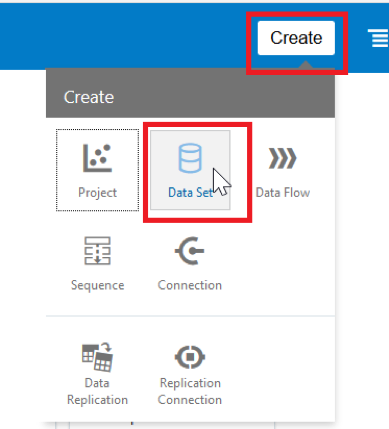

2.	In the Create Data Set dialog, select an existing Essbase connection.

    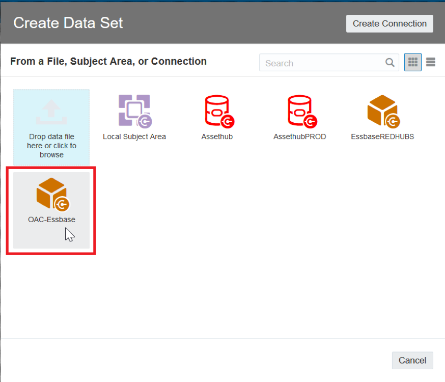

3.	In the Add Data Set page, double-click the Essbase cube that you want to use as a data set. Essbase cube details are displayed.

    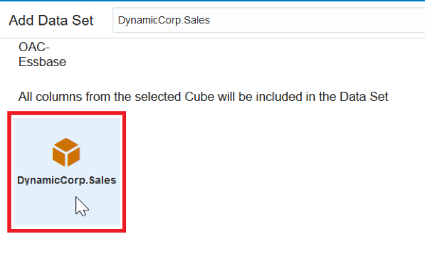

4.	If required, you can edit the Description, and select an Alias value. If you select an alias value other than the default, then values from the selected alias table are displayed in visualizations that use this Essbase data set.

5.	Click Add to save the Essbase cube. [preview would not be available for Essbase Cube sourced data]

6.	Now select “Create Project” option on the right-top of the screen.

7.	Now add/drag-drop the corresponding fields from the left pane to the DV fields as below. In below visualization – we have fields “Profit_%”, “Total_Expenses”, “Profit” & “Sales” under Basic#1 [Measures] field & “Quarter” under Year field      

    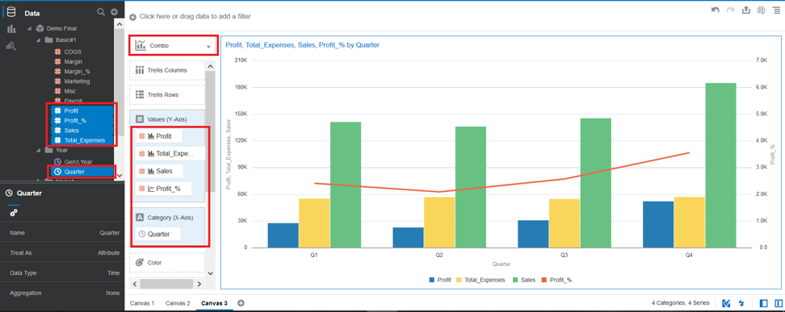

8.	Now we can quickly see the distribution of sales across different states as below using MAP visualization. Convert the default MAP BACKGROUND settings.

    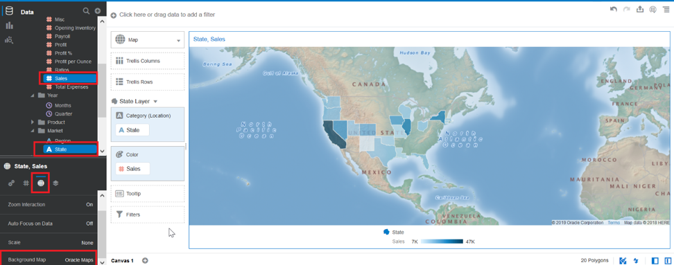

9.	In the similar fashion we can visualize an intriguing analysis summary of data possesses by creating a canvas.

    

## Acknowledgements

* Author - NATD Cloud Engineering - Bangalore Analytics (Aparana Gupta, Sushil Mule, Sakethvishnu D, Mitsu Mehta, Fabian Reginold, Srikrishna Kambar)
* Reviewed by - Ashish Jain, Product Management
* Last Updated By/Date - Jess Rein, Cloud Engineer, Sept 2020
