# Essbase on OCI

## Introduction

This lab provides detailed instructions for deploying Essbase on OCI using the Marketplace listing. It includes details of how-to setup users/groups and corresponding policies and compartments on OCI. It also provides details of the network topology for the deployment. Following OCI components will be deployed/configured – IDCS, OCI Vault, OCI VMs, ATP, storage, VCNs, Load Balancer, etc. Once the deployment is complete, you should be able to access Essbase on the Web UI.

Estimated Lab Time: 45 minutes.

### Objectives

* Understand the Network Topology of Essbase 19c on OCI
* Learn how to Setup IDCS Confidential Application
* Learn the Pre-requisites for Essbase 19c Deployment
* Learn how to Deploy Essbase 19c on OCI


### Prerequisites
* The following lab requires an Oracle Public Cloud account with IDCS and OCI Administrator Access for the whole process of deployment of Essbase19c on OCI without any hassles.

*Note:*  Whenever there is a “Name” being assigned for any resource creation in this lab please follow the naming convention as “<Resource_Name>_<FIRST_NAME>” to avoid duplication.

## Task 1: Essbase 19c - Basic Topology

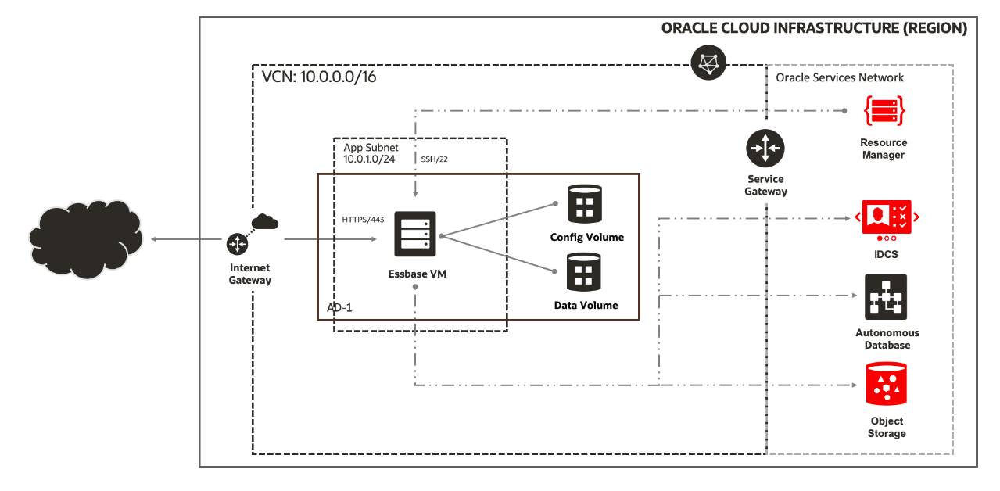

Above is the basic topology of Essbase19c architecture on Oracle Cloud Infrastructure.

Essbase19c VM resides in the Application subnet as shown in the above figure which is configured automatically with Block Volumes – Configuration Volume and Data Volume.

The connections to this application subnet are dependent on the Security List rules associated with the Application subnet and in this topology we will have ingress rules on    the application subnet for SSH Connectivity and for HTTPS - Web UI connectivity to the Essbase19c VM via the Internet Gateway.

SSH connectivity is first required during the procurement process for the Resource Manager to configure and install the Essbase19c in the compute instance automatically with no manual work from our end and secondly after the procurement SSH connectivity enables the users to login to the backend Essbase19c instance and for corresponding access.

The Essbase19c instance procured will manage its users using the IDCS of Oracle Cloud and metadata gets stored in the ATP-Autonomous Database.

Essbase backups gets stored in the Object storage of the OCI and the connectivity to this is established by the service gateway.

## Task 2: Deployment of Essbase 19c - Prerequisites

1. Go to cloud.oracle.com, click on the Person Icon.

    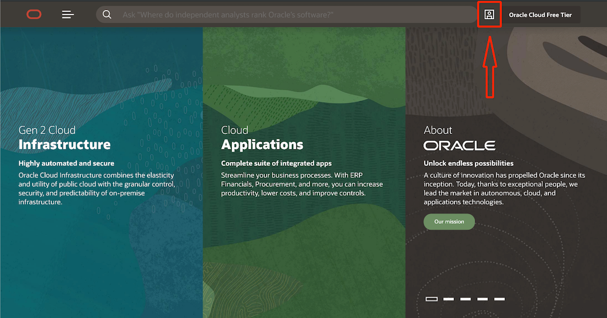

2. Then click on Sign in to Cloud to sign in with your Oracle Cloud account.

    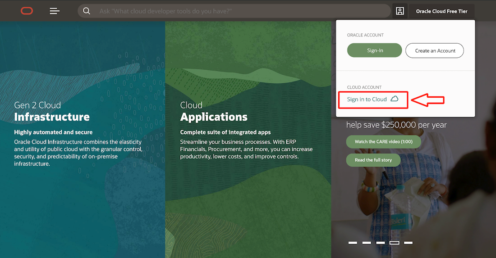

3. Enter your Cloud Account Name and click Next.

    

4. Enter your Oracle Cloud username and password, and click Sign In.

    

5. If after logging in, you are taken to the screen below, click on Infrastructure Dashboard. If you do not see the screen below when you login, skip this step and move on to the next step below.

    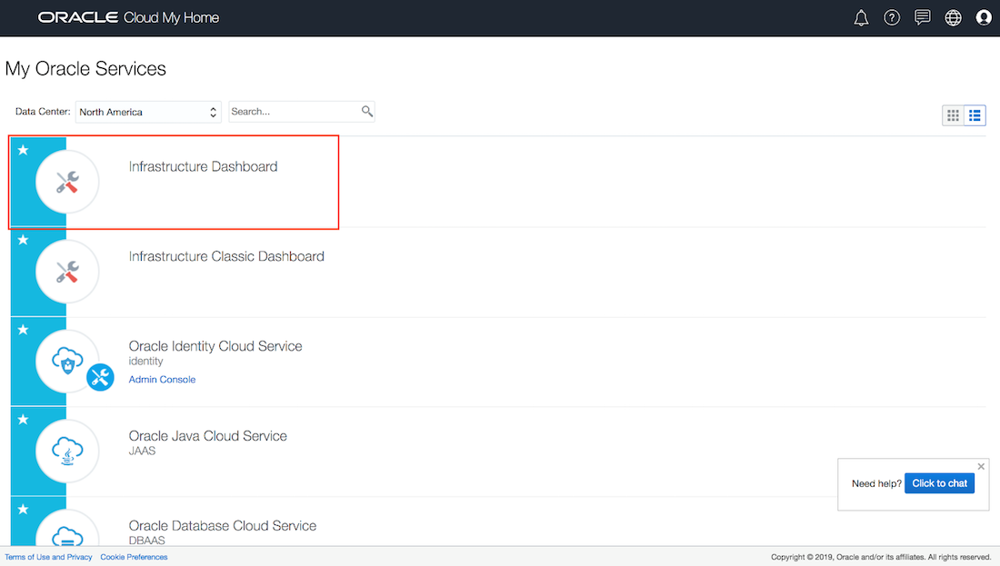

6. Log in to Identity Cloud Service as the identity domain administrator. To get to the Identity Cloud Service console from Oracle Cloud Infrastructure, click Identity, then Federation, and click on the URL link next to Oracle Identity Cloud Service Console.

    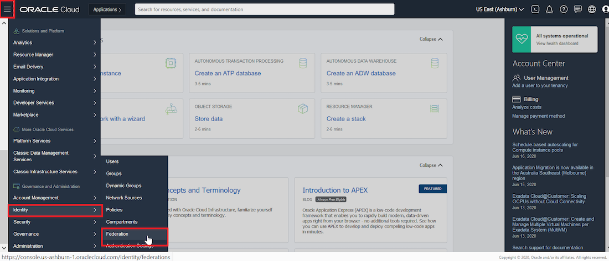

7. In the Identity Cloud Service console, expand the navigation drawer icon, click Settings, and then click Default Settings as below.

    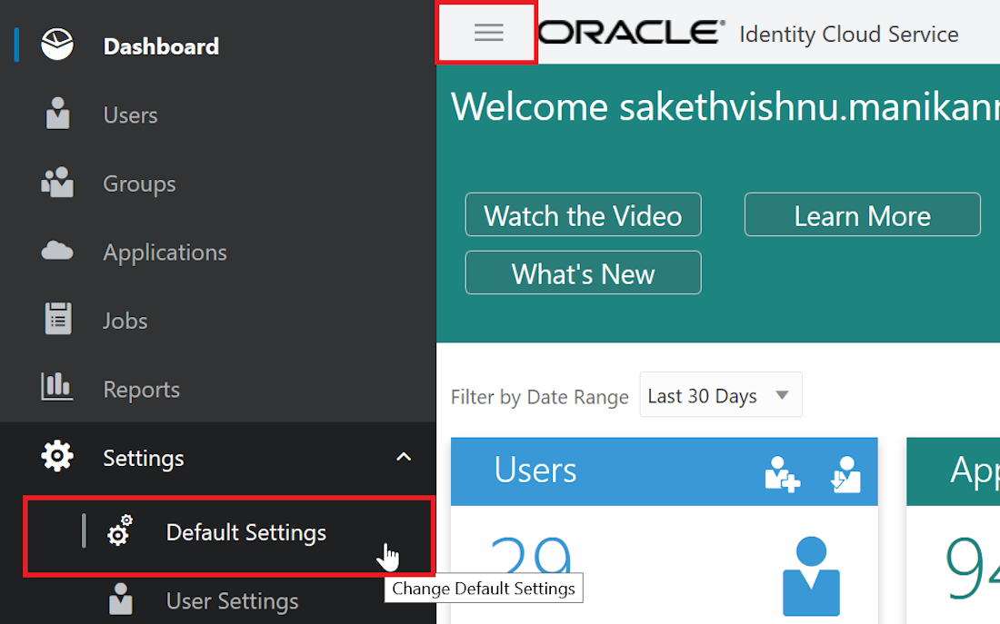

8. Turn on the switch under Access Signing Certificate to enable clients to access the tenant signing certificate without logging in to Identity Cloud Service as above.

9. Scroll up and click Save to store your changes as below.

    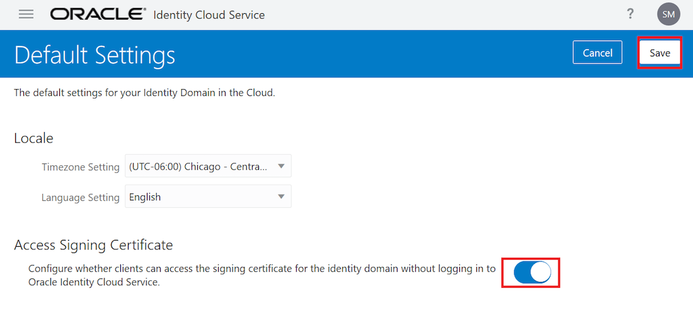

    **Note: If not already created, create a user in Identity Cloud Service who will be the initial Essbase Service Administrator.**

    Refer this link for steps - [Create User Accounts](https://docs.oracle.com/en/cloud/paas/identity-cloud/uaids/create-user-accounts.html).

    * Before deploying the Essbase stack, create a confidential application in Oracle Identity Cloud Service and register Essbase with it.

10. On the “Dashboard” page , please click on the plus symbol on application tab as shown in below figure.

    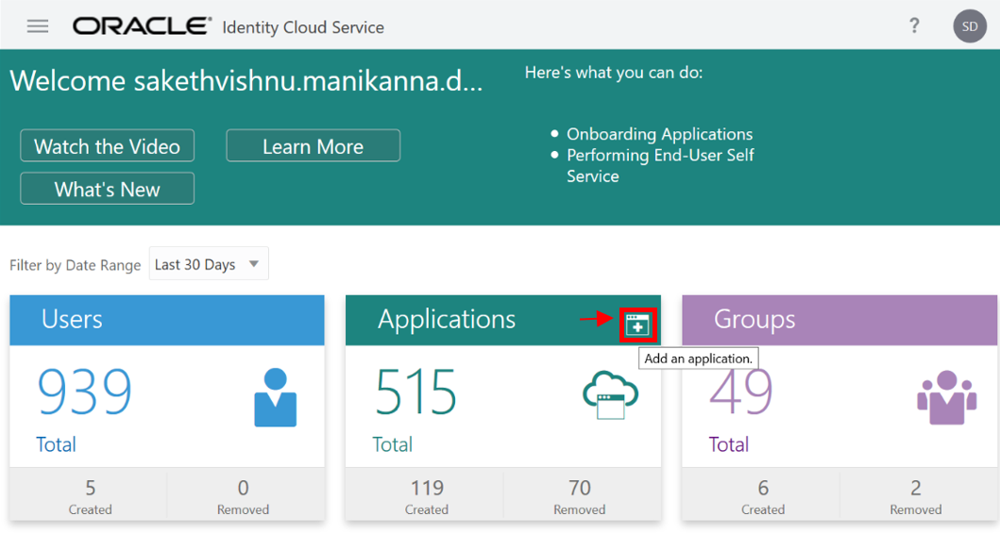

11. Click on the Confidential Application as shown below.

    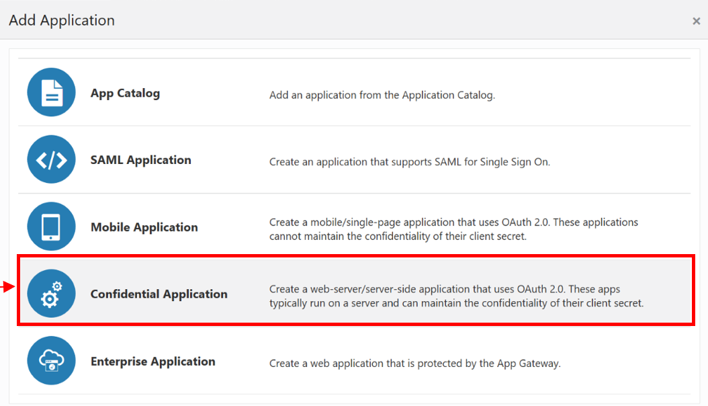

12. Enter "Essbase19c" in the name and description section for the Essbase Application and click Next.

    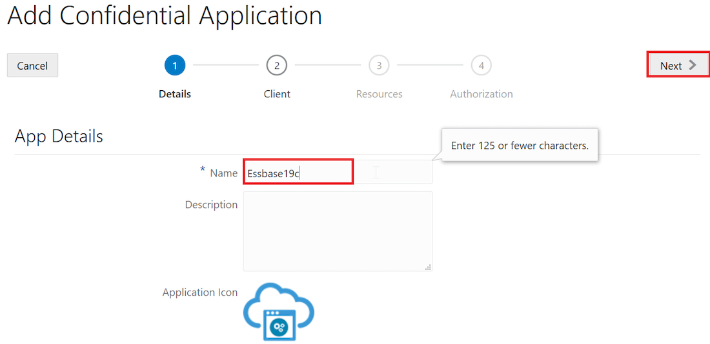

13. In the Client step, Select the option Configure this application as a client now.

   In the Authorization section,

	  * Select the following allowed grant types: Client Credentials and Authorization Code.
	  * Select allow non-HTTPS URLs.
		a. For the Essbase Redirect URL, enter a temporary/mock redirection URL (it ends with _uri): https://ip/essbase
		b. For the Essbase Post Logout Redirect URL, enter a temporary/mock URL: https://ip/essbase

    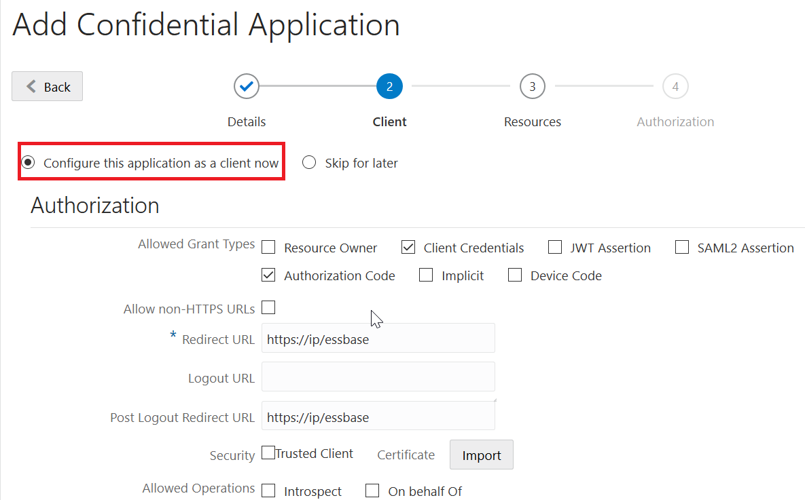

14. Under Token Issuance Policy, in the section Grant the client access to Identity Cloud Service Admin APIs, click Add, find and select the Identity Domain Administrator role, and select Add.

    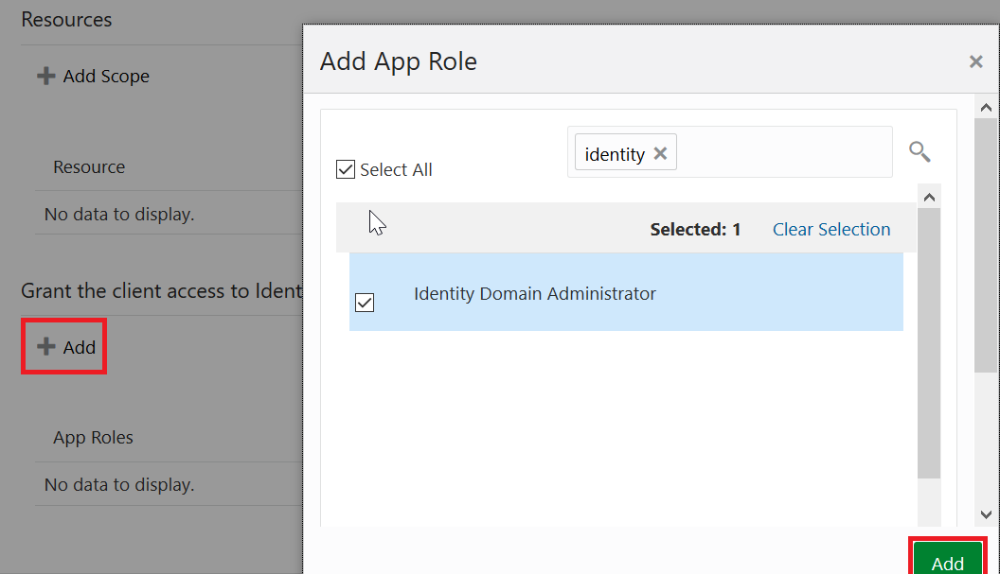

15. Scroll to the top of the page and click Next until you reach the Authorization section. Click Finish.

16. From the "Application Added" popup window, record the following Identity Cloud Service details:

  	* IDCS Application Client ID
  	* IDCS Application Client Secret.

     Record these values to use during your Essbase deployment.

     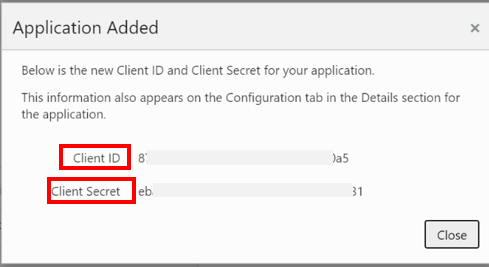

17. Select Activate in the title bar, next to your application's name.

    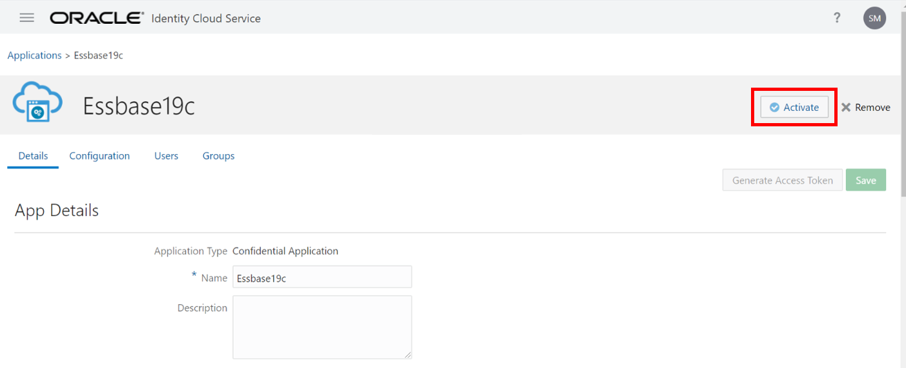

18. Now click on users tab of this application toolbar and add the current user to the application using "Assign" option.

    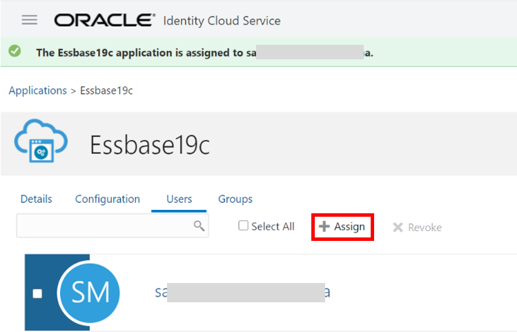

19. Record the IDCS Instance GUID from the following location:

    * In the Identity Cloud Service Console, select your ID icon in the top right corner (the icon contains your initials), select "About", and record the IDCS Instance GUID value. If you don't have access, ask your administrator to provide it. Example: idcs-123456789a123b123c12345678d123e1

    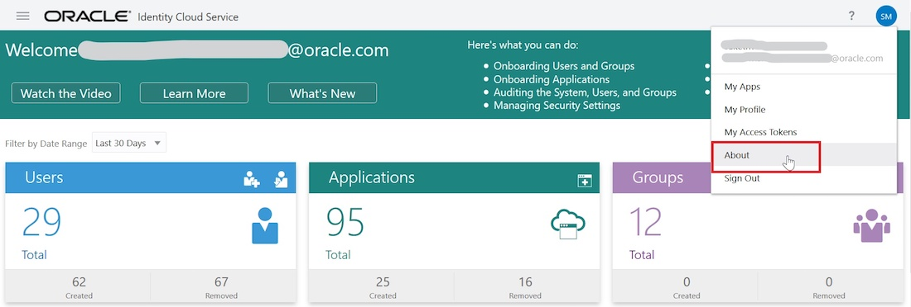

    * Alternatively, the IDCS Instance GUID is at the front of the IDCS URL in the browser - take the host portion of the url.

    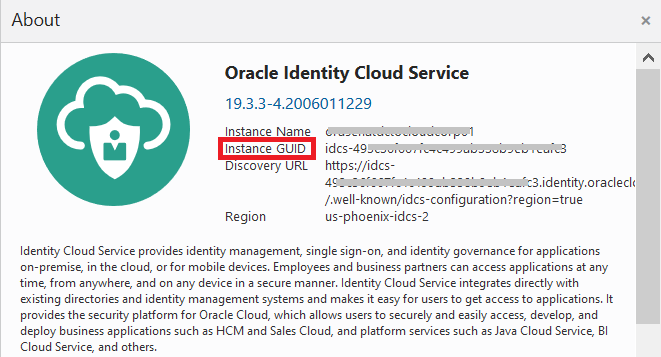

20. Create a new compartment (name it EssbaseSalesPlay) by going to Identity -> Compartments in OCI console and you can create this compartment under parent compartment of your choice.

    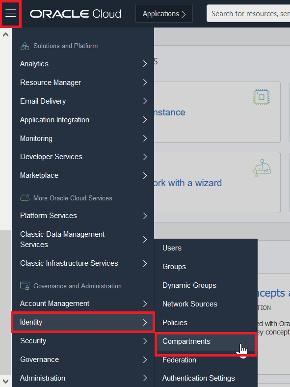
    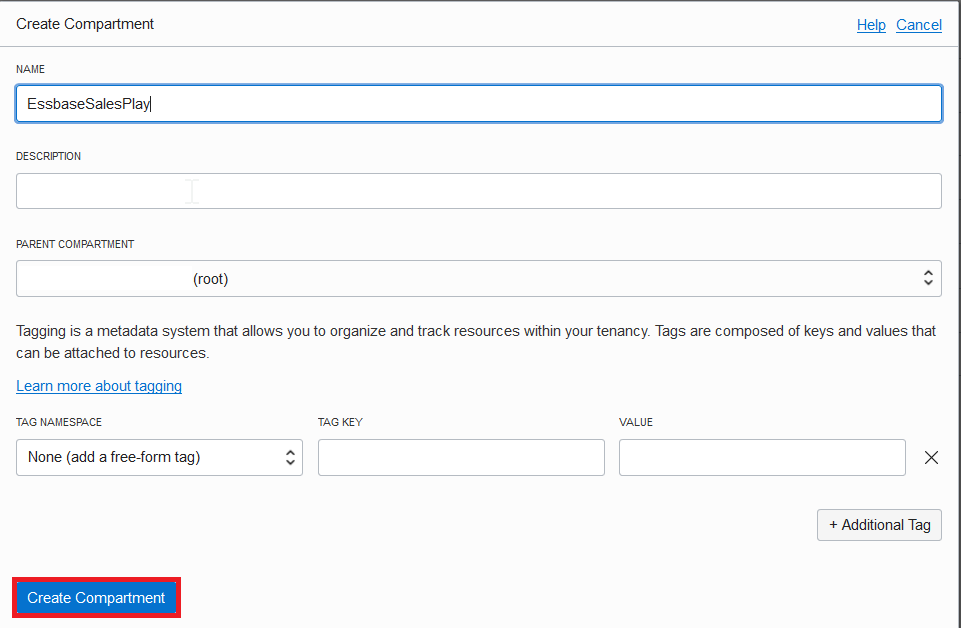

21.	Note down the COMPARTMENT OCID.

    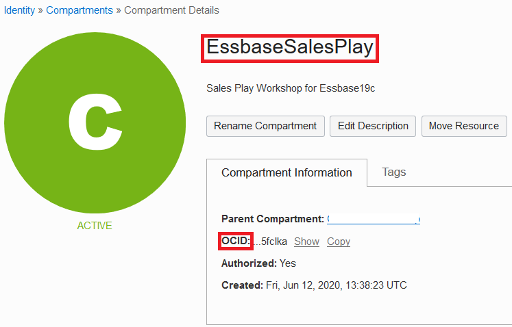

22. Create a Dynamic group, under Identity -> Dynamic Group, and make sure we are under the EssbaseSalesPlay compartment we created in the part-4.

23. Select on the Rule Builder as below.

    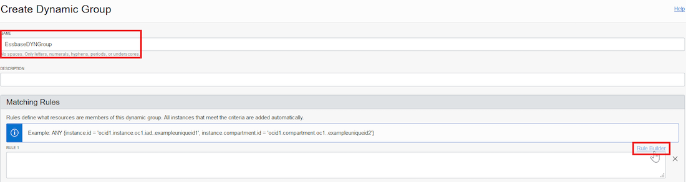

24. Select “ANY OF THE FOLLOWING RULES” as rules for match.

25. Select “Match Instances in Compartment ID” as attribute.

26. Now paste the Compartment OCID noted before and click on Add Rule.

    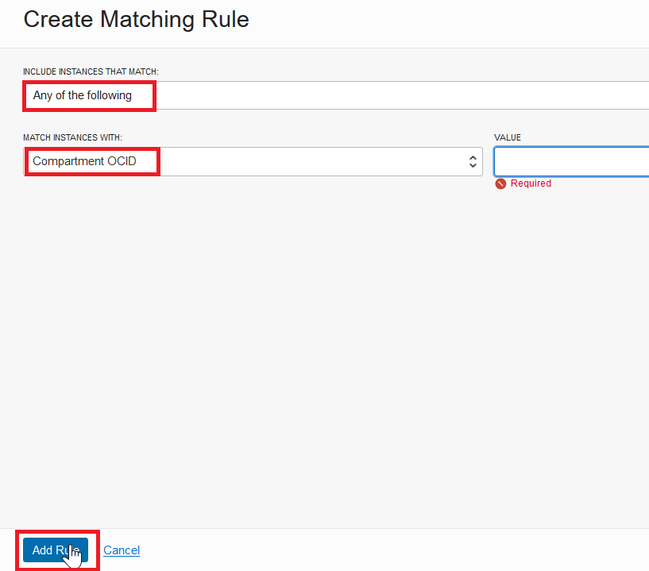

## Task 3: Setup Policies for Essbase19c Stack

### To Create Policies:

1. On the Oracle Cloud Infrastructure console, navigate to the hamburger icon and, click Identity, select Policies, select the EssbaseSalesPlay compartment, and then click Create Policy.  

    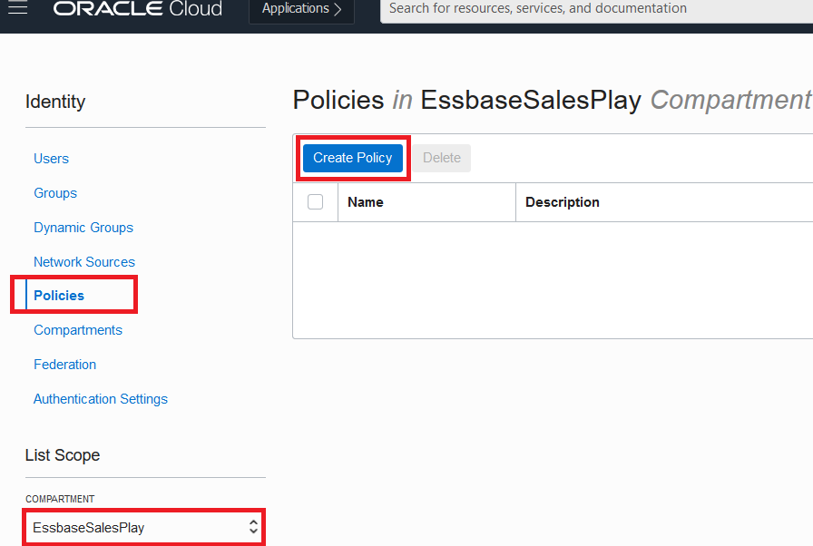

2. Provide a name and description for the policy.

3. Add all policy statements (Allow) for both Administrator group and Dynamic group (that we have created in the part-5) as given [here](https://docs.oracle.com/en/database/other-databases/essbase/19.3/essad/set-policies.html)

    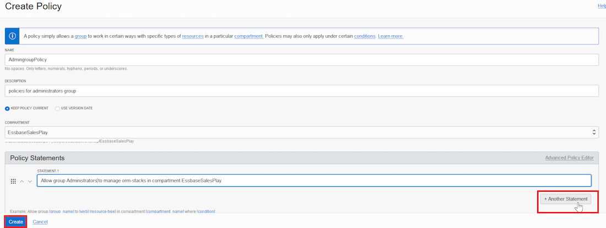

4. When done, click Create.

5. Create one more policy , this time for the Dynamic Group we have created , so that dynamic group will have permissions to initiate tasks automatically during procurement process . Repeat the 3rd and 4th steps as above to add all policies as listed [here](https://docs.oracle.com/en/database/other-databases/essbase/19.3/essad/set-policies.html)

    Note: Create policies each for both Admin groups and Dynamic groups, with all policy statements as given [here](https://docs.oracle.com/en/database/other-databases/essbase/19.3/essad/set-policies.html)

6. We will have two policy groups as shown below.

    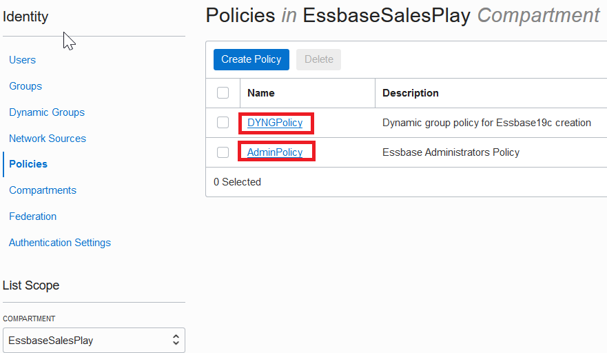

7. The policy statements of the corresponding groups will look like the images shown below.

    a. Dynamic Group Policy Statements

    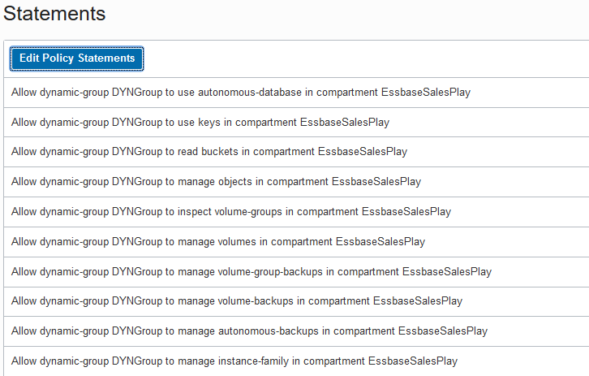

    b. Administrator Group Policy Statements

    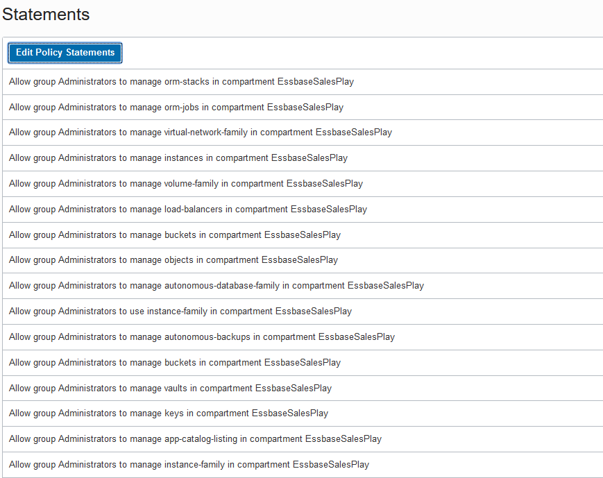

## Task 4: Encrypt Values Using OCI Virtual Vault

Key Management (KMS) enables you to manage sensitive information when creating a server domain.

When you use KMS to encrypt credentials during provisioning, you need to create a key. Passwords chosen for Essbase administrator and database must meet the Resource Manager password requirements.

Keys need to be encrypted for the following fields: Essbase Administrator Password, IDCS application client secret, and Database system administrator password.

1. Sign in to the Oracle Cloud Infrastructure console.

2. In the navigation menu, select Security, and click Vault.

    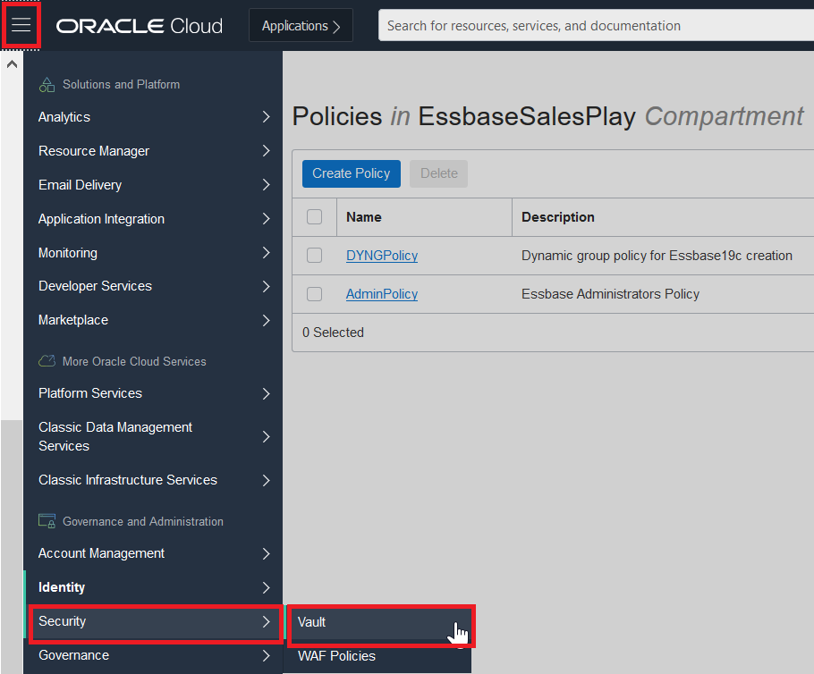

3. Select your Compartment i.e. EssbaseSalesPlay , if not already selected.

4. Click Create Vault.

5. For Name, enter OracleEssbaseVault.

6. For the lower-cost option, leave unchecked the option to make it a virtual private vault.

7. Click on Create Vault.

    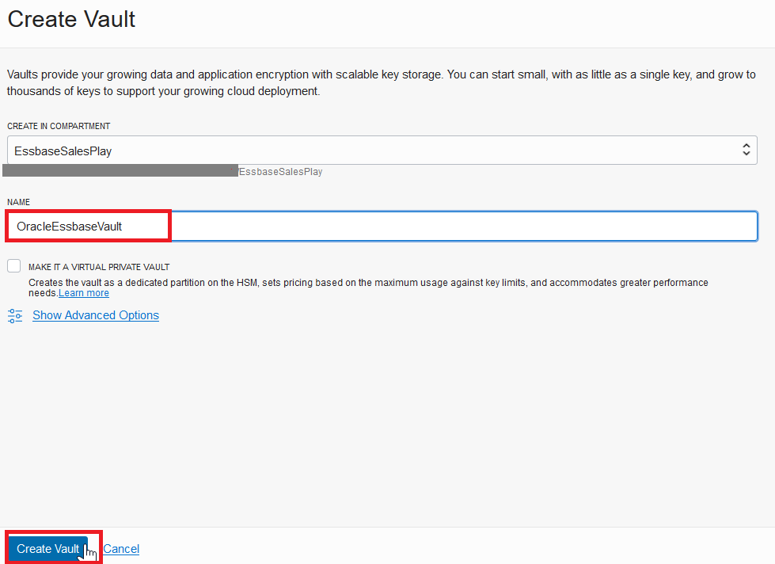

8. Click on the new vault we created in the previous steps.

9. Record the Cryptographic Endpoint URL for later use.

10. Click Keys, and then click Create Key.

    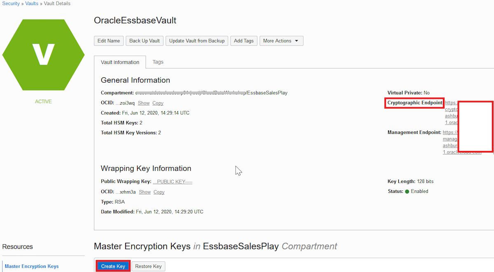

11. For Name, enter OracleEssbaseKey.

12. Click Create Key.

13. Click the new key.

    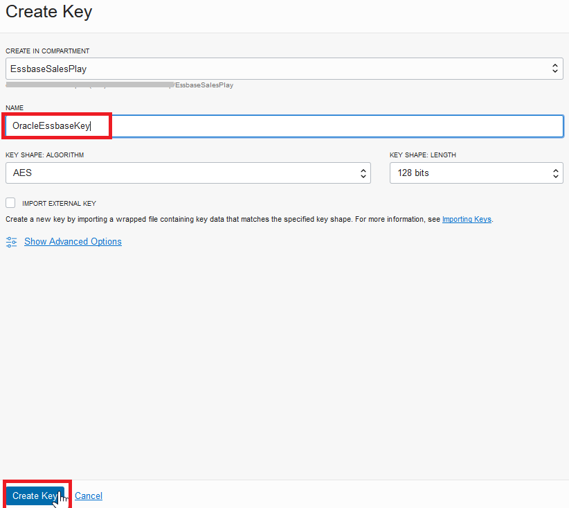

14. Record the OCID value for the key, for later use.

    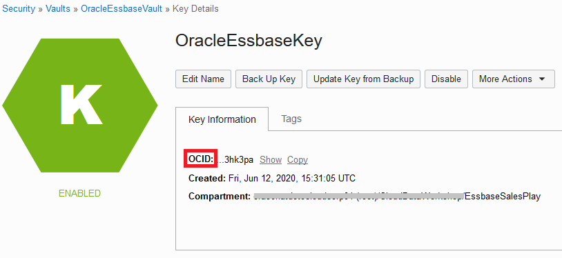

    **Note:** Essbase uses the same key to decrypt all passwords for a single domain.

    Refer the link [here] (https://docs.oracle.com/en/database/other-databases/essbase/19.3/essad/encrypt-values-using-kms.html)

15. Convert the administrator password / Application Client Secret that you want to use for the Essbase domain to a base64 encoding.  For example, we can use the cloud shell option from the Cloud Console UI as below and execute the following command:

    ```
    <copy> echo -n 'OracleEssbase_Password' | base64 </copy>
    ```

    Note: The password for the Essbase system administrator, encrypted with the provided KMS key. Use a password that starts with a letter, is between 8 and 30 characters long, contains at least one number, and, optionally, any number of the special characters ($ # _). *For example, Ach1z0#d*

    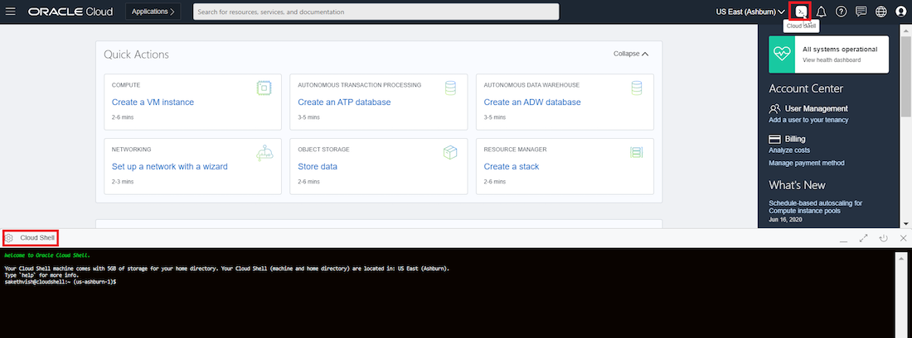
    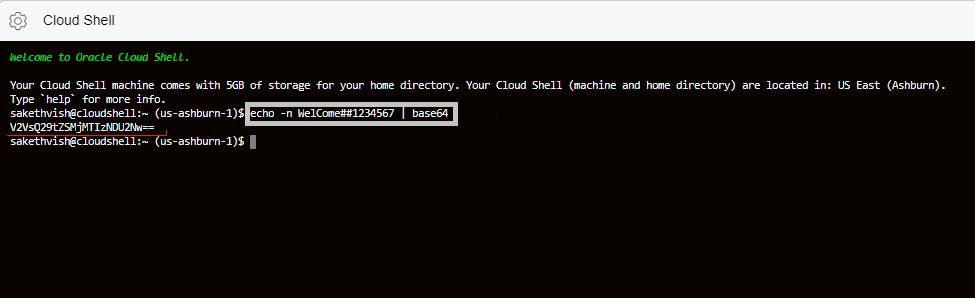

16. In the similar way please run the encrypt oci command using Oracle Cloud Infrastructure command line interface. Provide the following parameters:

    * Key's OCID (already noted in step-1 of part-7 )
    * Vault's Cryptographic Endpoint URL (already noted in step-1 of part-7)
    * base64-encoded password (generated using “echo” command as above)

    ```
    <copy> oci kms crypto encrypt --key-id Key_OCID --endpoint Cryptographic_Endpoint_URL --plaintext Base64_OracleEssbase_Password </copy>

    ```
17. From the output, copy the encrypted password value for use in the deploy process, as shown here:

    ```
    <copy> "ciphertext": "Encrypted_Password" </copy>
    ```

    *Important* You must use KMS encryption to encrypt your Database Password and your Client Secret in the similar way as mentioned above.

    Reference : (Click here)[https://docs.oracle.com/en/database/other-databases/essbase/19.3/essad/encrypt-values-using-kms.html]

## Task 5: Provision Essbase using Marketplace Listing

As the Oracle Cloud Infrastructure administrator, you use Oracle Cloud Infrastructure to set up Essbase. Oracle Cloud Marketplace uses Oracle Resource Manager to provision the network, compute instances, Autonomous Transaction Processing database for storing Essbase metadata, and Load Balancer.

1.	Sign into Oracle Cloud Infrastructure console as the Oracle Cloud Infrastructure administrator.

2.	From the navigation menu, select Marketplace.

    

3.	On Oracle Marketplace page, in the title bar, select or accept the region from which to run the deployment.

4. In the Category dropdown menu, select Database Management.

5. Under All Applications, select Oracle Essbase BYOL.

    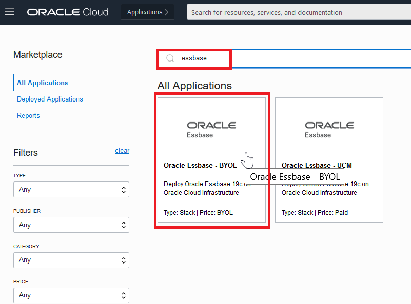

6. Select the stack version, or accept the default.

7. From the dropdown menu, select the target Compartment that you created for Essbase, in which to create the stack instance.

8. Select the check box to indicate you accept the Oracle Standard Terms and Restrictions.

9. Click Launch Stack.

    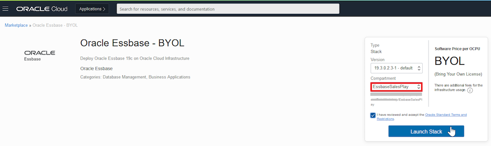

10. In Stack Information, on the Create Stack page.

11. Enter a stack name, description, and any other stack information as necessary.

12. Click Next.

    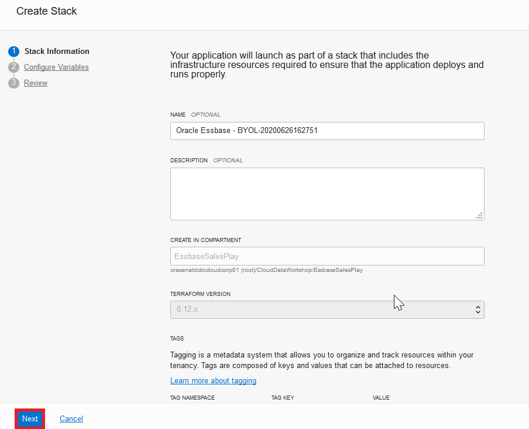

13. In General Settings, on the Configure Variables page, you configure variables for the infrastructure resources that the stack creates.

14. [Optional] Enter Resource Display Name Prefix value to use to identify all generated resources, for example Essbase_<userid>. If not entered, a prefix is assigned. The target compartment you previously selected is shown.

15. Enter values for KMS Key OCID and KMS Service Crypto Endpoint for encrypting credentials during provisioning.

16. [Optional] Select Show Advanced Options if you want to enable additional network configuration options under Network Configuration. Use this if you plan to create a new virtual cloud network (VCN) or subnets.

    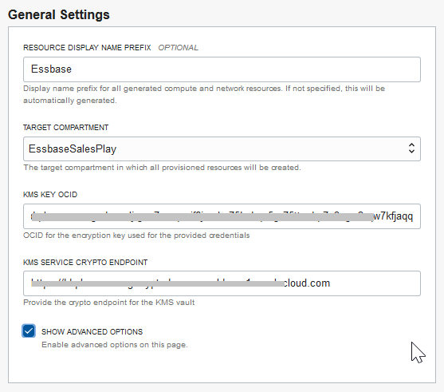

17. In Essbase Instance, select an availability domain in which to create the Essbase compute instance. Enter the shape for the Essbase compute instance.

18. Enter the data volume size or accept the default.

19. Paste the value of the SSH public key that you created, to access the Essbase compute instance.

20. In the Essbase System Admin User Name field, enter an Essbase administrator user name and password - which is encrypted by KMS key as mentioned in step 2 part 7 of this lab: To encrypt your Oracle Essbase Administrator password. It can be an Identity Cloud Service user, but it doesn’t have to be. It provides an additional way (if necessary) to log in to Essbase, and is also the administrator used to Access the WebLogic Console on which Essbase runs. If you don't enter an Identity Cloud Service user in this field, then you must provide one in the IDCS Essbase Admin User field later in the stack definition, in the Security Configuration section. If you enter an Identity Cloud Service user in this field, then the Identity Cloud Service System Administrator User ID is optional in the Security Configuration section.

    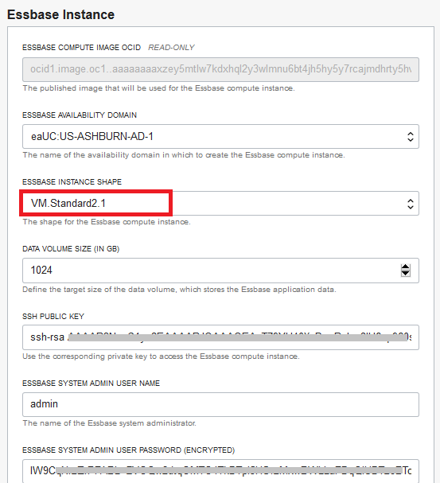

21. In Security Configuration, select IDCS for use with your production instances. To set up security and access for Essbase 19c, you integrate Essbase with Identity Cloud Service as part of the stack deployment. The Embedded option is not recommended or supported for production instances.

22. Enter the IDCS Instance GUID, IDCS Application Client ID, and IDCS Application Client Secret values – which is encrypted by KMS key as mentioned in step 2 of part 7: To encrypt your Oracle Essbase Administrator password , which you recorded as pre-deployment requirements, after you created a confidential Identity Cloud Service Application.

23. Enter IDCS Essbase Admin User value. This cannot be the same user ID as the Essbase administrator. Additionally, this user ID must already exist in the Identity Cloud Service tenancy. If you do not provide this user ID during stack creation, or if its mapping to the initial Essbase administrator doesn't happen correctly, you can later use the Identity Cloud Service REST API to create this user and link it to Essbase. See REST API for Oracle Identity Cloud Service.

    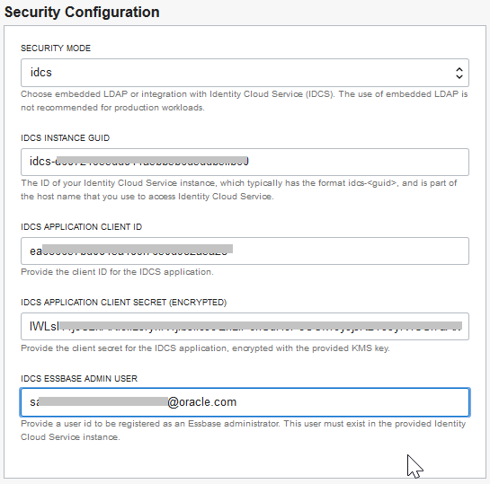

24. In Network Configuration, if you DID select Show Advanced Options under General Settings:
    a. Select the Assign Public IP address option as below, which creates a whole new VCN automatically for the Essbase deployment.

25. In Database Configuration, perform the following configuration tasks to create new Autonomous Database for this deployment.

    a. Enter a database admin user password - which is encrypted by KMS key as step 2 of part 7 of this lab: "To encrypt your Oracle Essbase Administrator password".
    b. Select the database license or accept the default.
    c. Click Next.

    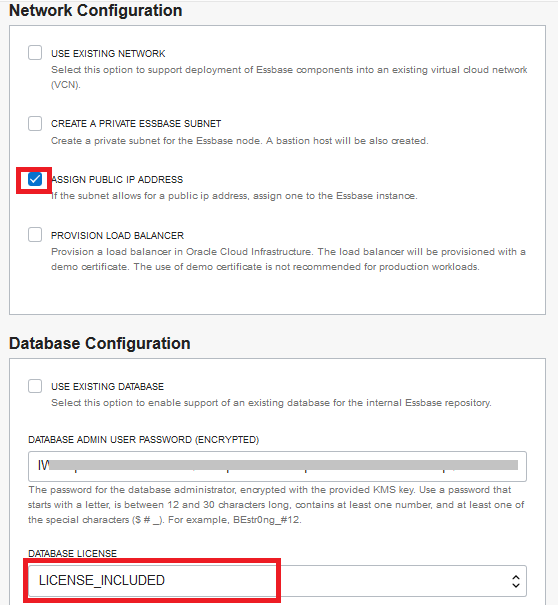

26. On the Review page, review the information that you provided, and click Create. The Job Information tab in Oracle Resource Manager shows the status until the job finishes and the stack is created.

27. Check for any log errors. If you have any, see Troubleshoot Deployment Errors.

    **Note:** The approximate time for the job completion is around 25 minutes.

28. If the job is executed without any errors we can see the Job Successful state in green color as below. (Refresh the page to see the changes.)

    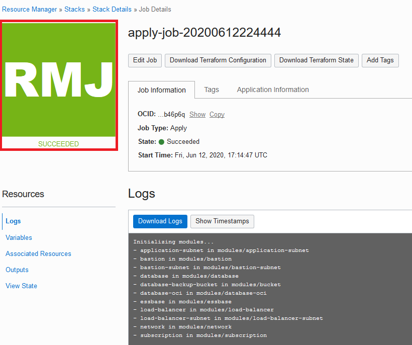

29. From the Application Information page, the value for Essbase_url is used in the browser to access Essbase. The Essbase node public ip is for accessing SSH.

30. After you deploy the stack, now complete the post-deployment tasks, including update your created Identity Cloud Service application, test connectivity to Essbase, and others.

    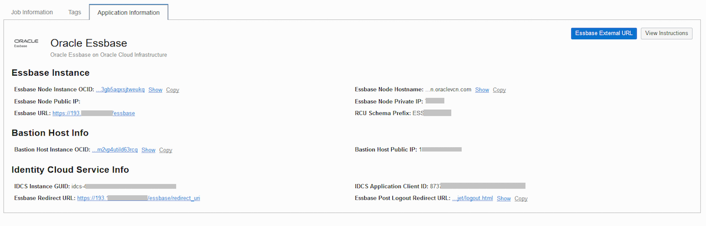

31. You can modify the created resources and configure variables later. Logs are created that can be forwarded to Oracle Support, if necessary for troubleshooting. After deployment, you're ready to assign users to roles and permissions in the Essbase web interface. You can also perform additional network and security configuration.

## Task 6: Post-Deployment Tasks

1. The list of outputs generated can be found from OCI-> ResourceManger-> jobs under EssbaseSalesPlay compartment.

2. Click on Outputs tab from the left panel

    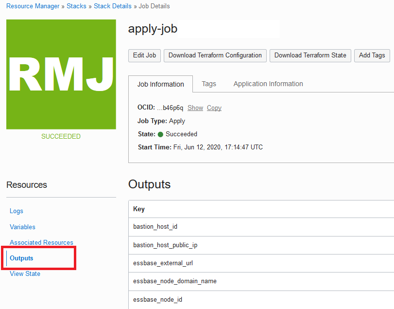

3. Once we have the outputs generated and job executed successfully, we need to update these endpoints i.e. Essbase Redirect URL and Essbase Post Logout Redirect URL back in the Essbase IDCS Confidential Application, where we fed temporary URL’s as below.

    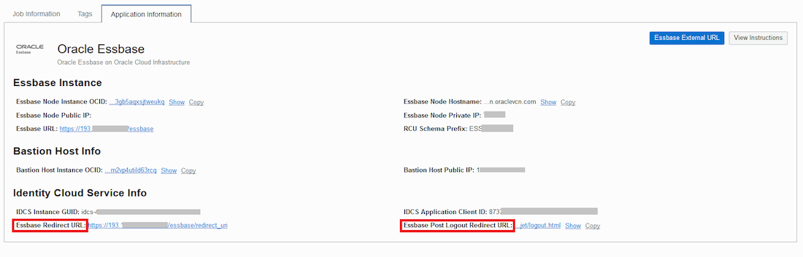

    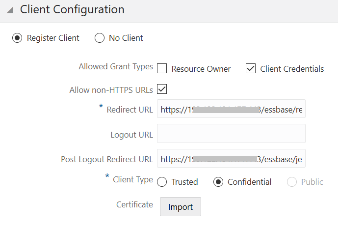

4. Now we can test the connectivity to Essbase 19c by clicking on Essbase external URL from OCI console.

    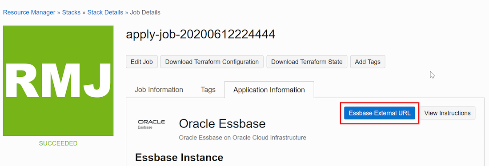

5. By getting this screen, we confirm that we have successfully deployed Essbase19c.

    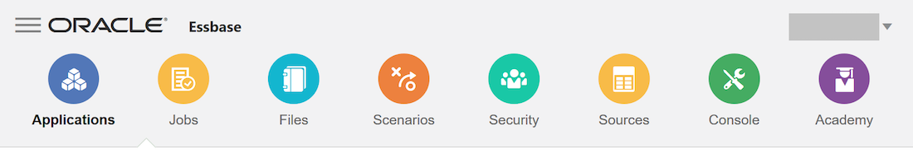

You may proceed to the next lab.

## Acknowledgements

* Author - NATD Cloud Engineering - Bangalore Analytics (Aparana Gupta, Sushil Mule, Sakethvishnu D, Mitsu Mehta, Fabian Reginold, Srikrishna Kambar)
* Reviewed by - Ashish Jain, Product Management
* Last Updated By/Date - Jess Rein, Cloud Engineer, Sept 2020
