# Scenario Management

## Introduction

Using scenario management, scenario participants can perform what-if analysis to model data in their own private work areas. These scenarios can optionally be subject to an approval workflow, which includes a scenario owner and one or more approvers. In the workflow, scenario owners merge scenario data with the final cube data only after it is approved.

Estimated Lab Time: 15 minutes.

### Objectives

To understand the following:

*	Scenario Management Overview
*	Creating a cube with Sandboxes
*	Creating a Scenario
*	Lightweight Sandboxes		
*	Changing Sandbox Data
*	Scenario Workflow

### Required Artifacts

* An Oracle Public Cloud account-Essbase 19c instance with Service administrator role
* Windows Operating System for Essbase add-ins (Smart View and Cube Designer)
* Smart View plugin enabled for Excel.

## Overview – Understand Scenario

The exercises contained within this lesson will allow the user to get acquainted with different aspects of Scenario Management.  The different aspects include the lightweight nature of sandboxes on the cube; the process involved with initiating Scenario Management and adding sandboxes; as well as, the workflow supported by Scenario Management.  

*	Scenarios are private work areas in which users can model different assumptions within the data and see the effect on aggregated results, without affecting the existing data.

*	Each scenario is a virtual slice of a cube in which one or more users can model data and then commit or discard the changes.

*	The sandbox dimension is flat, with one member called Base and up to 1000 other members, commonly referred to as sandbox members. Sandbox members are named sb0, sb1, and so on.

*	Each sandbox is a separate work area, whereas the Base holds the data currently contained in the cube. A specific scenario is associated with exactly one sandbox member.

*	When first created, sandbox member intersections are all virtual and have no physical storage.

## Task 1:	Create a Scenario-Enabled Sample Cube

You can create a scenario-enabled cube by importing the scenario-enabled sample application workbook.

1.	In the Essbase web interface, click Import.

    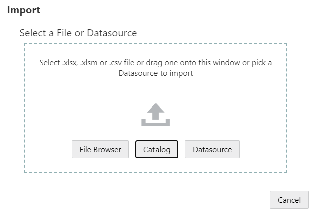

2.	Click Catalog.

    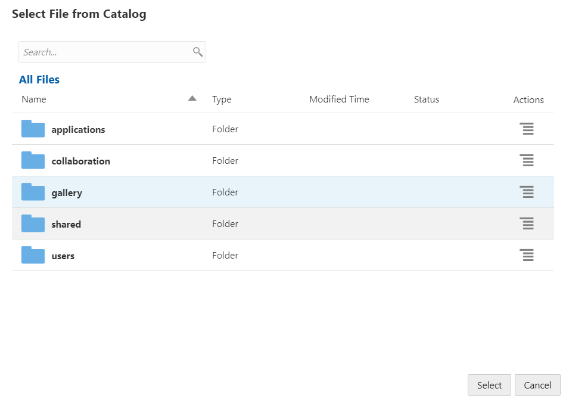

3.	Drill down into the Gallery, Cubes, and General folders. Naviagte to All Files > gallery > Applications > Demo Samples > Block Storage

    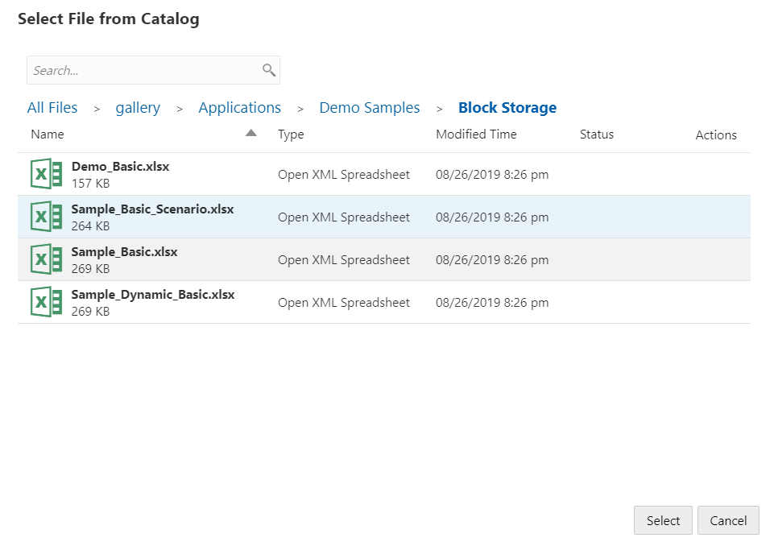

4.	Download the [Sample_Basic_Scenario.xlsx](https://objectstorage.us-ashburn-1.oraclecloud.com/p/SnwdapEvpeFJVEahs5vIqgjd-tPBAhSKXX8OluI_IQ4/n/natdsepltfrmanalyticshrd1/b/Essbase-Workshop/o/Sample_Basic_Scenario.xlsx) file. Select `Sample_Basic_Scenario.xlsx` and click Select.

5.	Provide a unique name and click OK.

    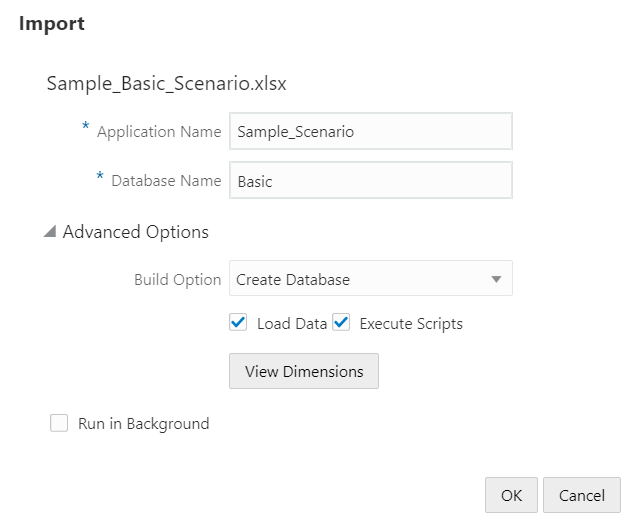

    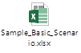

## Task 2: Creating a Scenario

**Adding a Scenario to a Sandbox-Enabled Cube**

To create a scenario, you specify general information about your scenario, including creating a scenario name, selecting a due date, selecting an application and cube, and choosing whether to use calculated values. Then you add users and define whether each user is a participant or an approver.

1.	In Essbase, login as a user with database update (or higher) permission to at least one application.

2.	Click Scenarios.

3.	Click Create Scenario.

    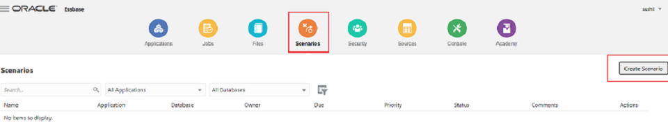

4.	On the General Information tab, enter a scenario name and select a Priority (optional), Due Date, Application, and Database (cube). You will only see applications for which you have minimum database update permission.

    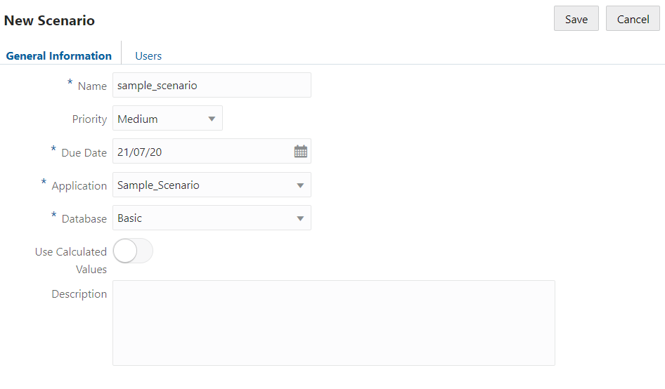

5.	Turn on Use Calculated Values if you want to merge calculated values to base values when running calculation scripts on scenarios.

6.	(Optional) Enter a description.

7.	On the Users tab, click Add   for a list of users.

8.	Add the users that you want.

9.	Close the Add Users dialog box.

10.	For each user, keep the default (Participant), or select Approver.

11.	Select Approver. Scenario user roles determine the workflow for the scenario.

    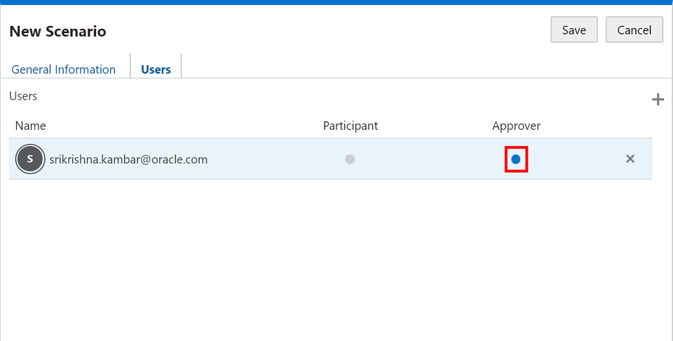

12.	Save your change.

## Task 3: Lightweight Sandboxes

**Show that Sandboxes are lightweight**  

This exercise shows that creating sandboxes has little impact on resource usage such as disk space.

1. Connect to `Sample_Scenario_Basic` in Smart View analysis.

    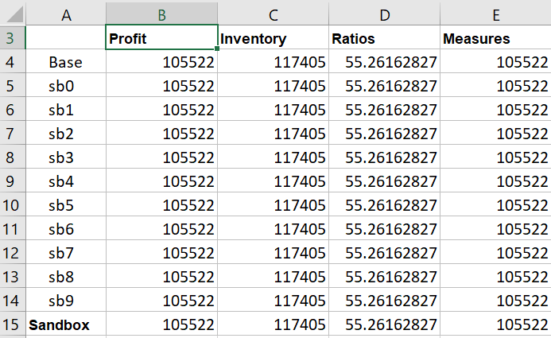

2. Create a private connection to your environment, `http://<MachineIP>/essbase/smartview` If you are not already connected, log in.

3. Refresh the data.

**Questions:**

1. Do you see Data for the sandboxes (sb#)?

2. Is there a variance between any of the sb# members and Base?

3. If the loaded file contained no references to any sb# members how did the data get there?`

**Takeaway:**

By default, all Sandboxes you create have the same values as the data loaded into the base. The data in the sandbox is dynamically queried and will not use any extra storage disk space. Only values that are modified as part of a scenario will be stored. This makes creating and using most scenarios a very light weight operation.  

## Task 4:	Model Data

As a scenario user, you can model data slices in your own scenario.

1.	In Essbase, click Scenario.

2.	On the Scenarios page, locate the scenario in which you want to model data.

3.	Launch Smart View by clicking the Excel   icon before the scenario name.

4.	Make data changes and perform your what-if analysis in Smart View.

    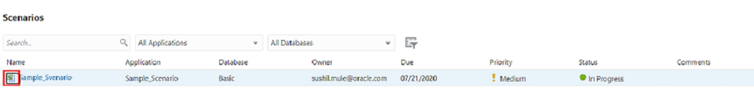

5. Or you can make use of [this excel file](https://objectstorage.us-ashburn-1.oraclecloud.com/p/i5MLTlyY7whIRIc-BGSgQq7vNPHPeDshyrQVaxqJ61c/n/natdsepltfrmanalyticshrd1/b/Essbase-Workshop/o/Scenario_Comparision.xlsx). (Use ‘Submit_Data’ tab in this excel file to submit data) to perform what if analysis.

    

6.	Open the Scenario Comparison file and create connection with Sample Scenario – Basic.

7.	Change the data value for the sandbox member sb0 Actual and submit data.

    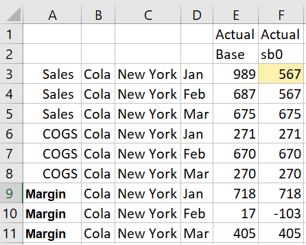

8. You will notice updated data will reflect only against sb0 dimension intersection.

## Task 5:	Scenario Workflow

You can review a scenario using an optional approval workflow.

  

In the real use case, the scenario flow that we will simulate is:

*	Participant user performs What-if analysis on base data within Sandbox.
*	After analysis Participant user submits the data changes for approval.
*	Approver user can review the data and decides to approve/reject.
*	Once data is approved, Data can be applied to the Base by Participant.

**Understand Scenario User Roles**

*	Scenario user role assignments determine the workflow for scenarios. You must have at least one approver to enable the scenario workflow. Without an approver, participants do not have the option to submit the scenario for approval, for example, and there is no option to approve or reject the scenario.

*	Participants can participate in a what-if analysis. They must have Database Update or Database Access user role. Adding participants is not mandatory.

*	Approvers monitor the process and approve or reject scenarios. They must have Database Access or higher role. Scenarios can have multiple approvers, in which case each one must approve the scenario before it can be submitted.

* Now we will use the Scenario workflow to submit and ultimately merge the scenario data with the base. Since you are doing it by yourself, you will need to play roles of both participant and approver.

Let’s start:

1.	Login to Essbase. (Consider yourself as participant user). Navigate to scenarios.

2.	Highlight the scenario you created previously.

3.	Select Actions->Submit, and enter a comment if needed

    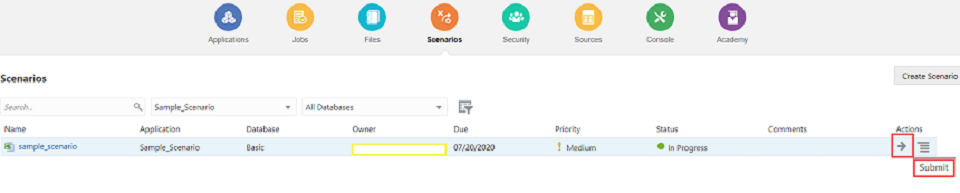

    *Tip: If you don’t have an Approver assigned for the scenario, the action Submit will not be available.*

4.	Highlight the scenario created previously, select Actions->Approve, and enter a comment if needed. (Consider yourself an approver).

    

5.	Login to the Essbase. (Consider yourself a participant).

6.	Highlight the scenario you created previously.

7.	Select Actions->Apply

    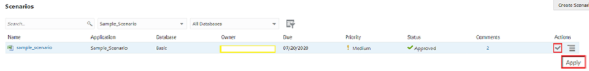

8. Download the file by clicking [here](https://objectstorage.us-ashburn-1.oraclecloud.com/p/i5MLTlyY7whIRIc-BGSgQq7vNPHPeDshyrQVaxqJ61c/n/natdsepltfrmanalyticshrd1/b/Essbase-Workshop/o/Scenario_Comparision.xlsx). Go to Smart View and retrieve data into the Comparison tab (make sure you have an active connection in the ‘Comparison’ tab to the same application you connected to while submitting the data)

    

9. You should see the changes have been applied to the Base.

You may proceed to the next lab.

## Acknowledgements

* Author - NATD Cloud Engineering - Bangalore Analytics (Aparana Gupta, Sushil Mule, Sakethvishnu D, Mitsu Mehta, Fabian Reginold, Srikrishna Kambar)
* Reviewed by - Ashish Jain, Product Management
* Last Updated By/Date - Jess Rein, Cloud Engineer, Sept 2020
