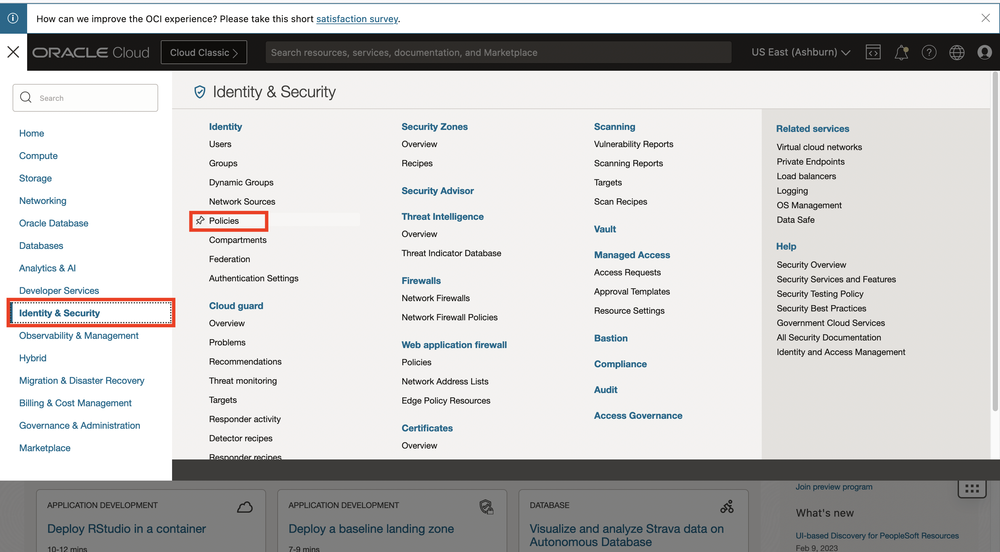
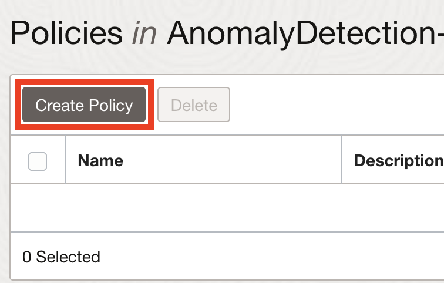
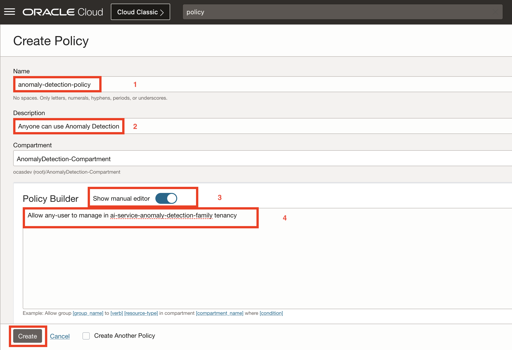

# Anomaly Detection

## Introduction

Anomaly Detection is the identification of rare items, events, or observations in data that differ significantly from the expectation. This can be used for several scenarios like asset monitoring, maintenance and prognostic surveillance in industries such as utility, aviation, transportation, and manufacturing.

The core algorithm of our Anomaly Detection service is an Oracle-patented multivariate time-series anomaly detection algorithm originally developed by Oracle Labs and had been successfully used in several industries for prognosis analysis.

The Oracle Cloud Infrastructure Anomaly Detection will create customized Machine Learning models by taking the data uploaded by users, using the core algorithm to train the model, and hosted in the cloud to be ready for detection. Users can then send new data to the detection endpoints to get detected anomaly results.

[Anomaly Detection Demonstration Video](youtube:LamMjG3mD-s)

The *OCI Anomaly Detection Service* which is serverless, multi-tenant service, will cover multivariate *time series data, accessible over public REST APIs* by authenticated users via OCI CLI, SDK or Cloud Console.

This workshop contains 3 required lab sessions for user to get familiar with required data, and the full cycle of building the anomaly detection model and make predictions, and 2 optional advanced sessions that help in-depth users to seamlessly integrate our services and understand how the training data should be prepared.

*Estimated Time*: 70 minutes (3 regular sessions) + 120 minutes (2 advanced sessions)

### Objectives

* Understand a high level overview of the OCI Anomaly Detection Service
* Understand the full cycle/workflow of services provided in the OCI Anomaly Detection
* Hand-on activities to experience the whole pipeline of machine learning model development from training to detecting
* (In Advanced Sessions) Learn to use REST API to interact with Anomaly Detection service
* (In Advanced Sessions) Learn basic data analysis preprocessing techniques to prepare data for model training

### Prerequisites

* An Oracle Free Tier, or Paid Cloud Account
* Grant proper permission for user to use the Anomaly Detection Service
* Additional prerequisites (cloud services) are mentioned per lab
* Familiar with services on Oracle Cloud Infrastructure (OCI), such as Object Storage
* Familiar with machine learning, data processing, statistics is desirable, but not required
* Familiar with Python/Java programming is strongly recommended (Optional for API integration)
* Familiar with editing tools (vim, nano) or shell environments (cmd, bash, etc) (Optional for API integration)

## Anomaly Detection Service Concepts

* Project: Projects are collaborative workspaces for organizing data assets, models, and detection portals.
* Data Assets: An abstracted data format to contain meta information of the actual data source for model training; it supports multiple types of data sources (currently  Oracle Object Storage, Oracle Autonomous Transaction Processing, InfluxDB are supported).
* Model: The ML model that trained by our Oracle patented algorithms that can detect anomalies in multivariate time-series data. A few parameters are exposed so user can choose to select, but also default values are suggested.
* Detection: Once a model is trained successfully, it is automatically deployed into the cloud environment os user can use send new data to the API or upload to the cloud portal to get anomaly detection results.

## Anomaly Detection Process

At a high level, here are the process of completing a full cycle of using anomaly detection service.

1. Create a project. A project is used to include and organize different assets, models and private endpoints for ATP or InfluxDB data connection in the same workspace.
2. Create a data asset. Data asset is an abstracted data representation for a data source. Currently it supports Oracle object storage, Oracle Autonomous Transaction Processing, InfluxDB.
3. Train a model. After specifying a data asset and the training parameters, you can train an anomaly detection model. It will take 5 minutes or longer depending on the data size and target parameter FAP. Once a model is trained successfully, it is deployed automatically with an endpoint ready to take any new incoming testing data.
5. Detection with new data. User can send newer data with same attributes of the training data to the deployment endpoint or upload to the deployment UI to get detection result.

Note that one project can have multiple data assets and multiple models.

## Anomaly Detection Kernels

Anomaly Detection uses two types of machine learning (ML) kernels to learn the patterns and detect anomalies from your multivariate dataset. One type for multivariate correlated signals and one for univariate independent signals.

The ML engine embedded in the service automatically chooses the appropriate kernel and optimize the parameters to produce the best model and result.

### Multivariate Kernel
The Anomaly Detection service uses MSET2 as the main kernel to detect multivariate time-series anomalies from datasets. MSET2 stand for three techniques:

* Multivariate State Estimation Technique (MSET)
* Sequential Probability Ratio Test (SPRT)
* Intelligent Data Processing (IDP)

All of these techniques were invented by Oracle Labs. The MSET2 algorithm is successfully used in several industries for prognosis analysis.

#### Capability
It works well to detect pointy, contextual, and collective anomalies in multivariate datasets with highly correlated numerical signals. It can handle dataset with a moderate level of missing values, and provides estimated values.

#### Requirements
- The training and inferencing dataset can contain numerical values only. Categorical or nominal values aren't supported.
The correlations between signals are relatively high.
    - For example, the average pair-wise Pearson correlation between one signal to the rest of signals is no less than 0.1. The kernel excludes signals with lower correlations and treats them with univariate modeling.

- The training dataset must be anomaly free. For example, the dataset contains normal business scenarios and data values without rare anomaly events.
- All of the different normal business scenarios are included in the training dataset. For example, at least one business cycle in the training portion. Missing some normal business patterns may lead to false positives during inferencing.

#### Use Cases
Typical MSET2 use cases are in the manufacturing, IoT, transportation, oil and as, energy industries because the data is from a signal system or asset with well correlated signals.

#### Restrictions
Use cases with datasets that are not numerical, highly correlated, or non-time series based shouldn't use MSET2 to detect anomalies.

### Univariate Kernel
The univariate kernel builds one model per signal, and is one of the best classic ML algorithms. Signals considered as low correlations by MSET2 are automatically treated as univariate using this kernel.

The univariate kernel is not standalone and uses the existing multivariate-based API with the same data input format. The univariate model for each univariate signal is built, optimized, and saved independently. The models are used for inferencing separately as well.

#### Capability
It detects anomalies in a signal by considering its time-series patterns, and works well on pointy or contextual anomalies.

#### Requirements
- The training and inferencing dataset containing numerical values only. Categorical or nominal values are not supported.
- It uses a window-based feature engineering approach so it requires an extra one window size of data before the actual training or detecting data to learn the patterns or inference anomalies.
    - By default, the window size is 20 timestamps. The minimum total number of timestamps is 80.

- The training dataset must be anomaly free.
- All of the different normal business scenarios are included in the training dataset. For example, at least one business cycle in the training portion.

#### Use Cases
Typical use cases of univariate kernel come from different industries where the data is numerical with signals that are more independent without any correlations among them, or suggested being monitored independently based on business domain knowledge.

#### Restrictions
- The kernel only treats one signal at a time so collective anomalies among multiple signals aren't addressed.
- The kernel is not standalone and is automatically invoked by the existing multivariate Anomaly Detection service.

## Task 1: Set Up Policy

In order for users to create and manage the resource used in Anomaly Detection service, the administrators of the tenancy need to add proper policy to grant permissions to users.

### 1. Navigate to Policies

Log into OCI Cloud Console. Using the Burger Menu on the top left corner, navigate to Identity & Security and click it, and then select Policies item under Identity.


### 2. Create Policy

Click Create Policy button. **Note only tenancy administrators or user in administrator group have permissions to create new policies.**



### 3. Create a new policy with the following statements:

If you want to allow all the users in your tenancy to use anomaly detection service. Create a new policy with the below statement:

```
<copy>allow any-user to manage ai-service-anomaly-detection-family in tenancy</copy>
```



If you want to limit access to a user group, you can create a new policy with the below statement:

```
<copy> allow group <group-name> to manage ai-service-anomaly-detection-family in tenancy</copy>
```

> **Note:** The anomaly detection service need data to build customized models, therefore, user also need to add policy to grant permissions to access data.
For example, in this lab session, we will use Oracle object storage as data source, so the administrators also need to add the following policy:

```
<copy>allow any-user to manage object-family in tenancy</copy>
```

## Acknowledgements

* **Authors**
    * Jason Ding - Principal Data Scientist - Oracle AI Services
    * Haad Khan - Senior Data Scientist - Oracle AI Services
    * Marianne Liu - Senior Data Scientist - Oracle AI Services
* **Last Updated By/Date**
    * Jason Ding - Principal Data Scientist, Jan 2022
