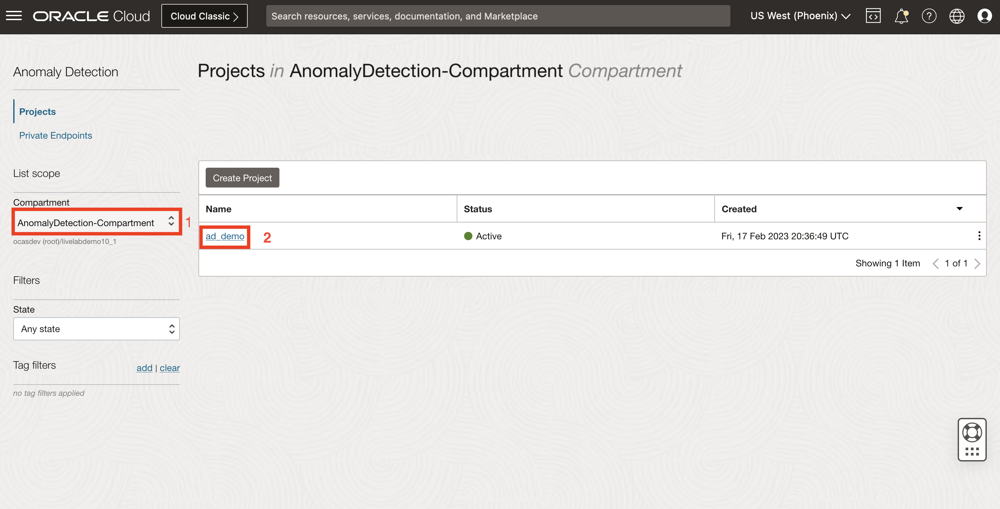
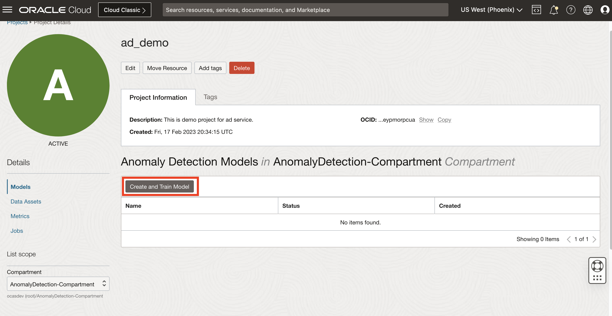
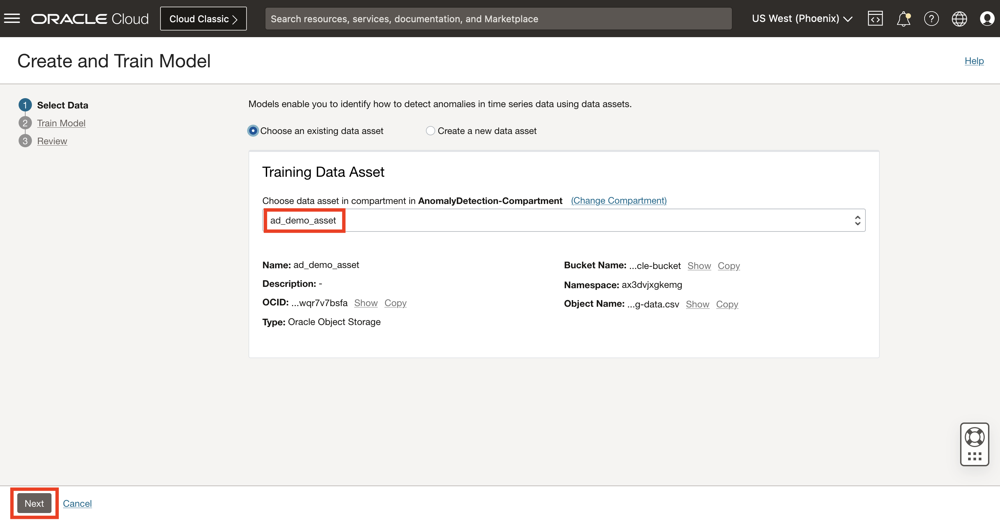
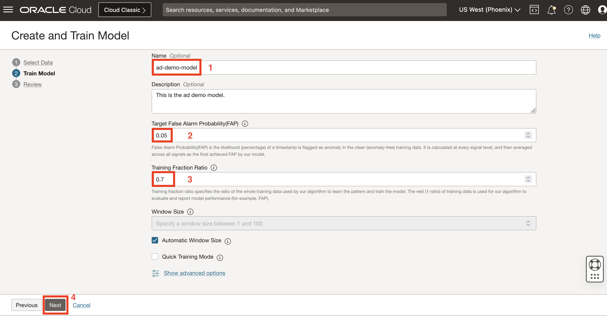
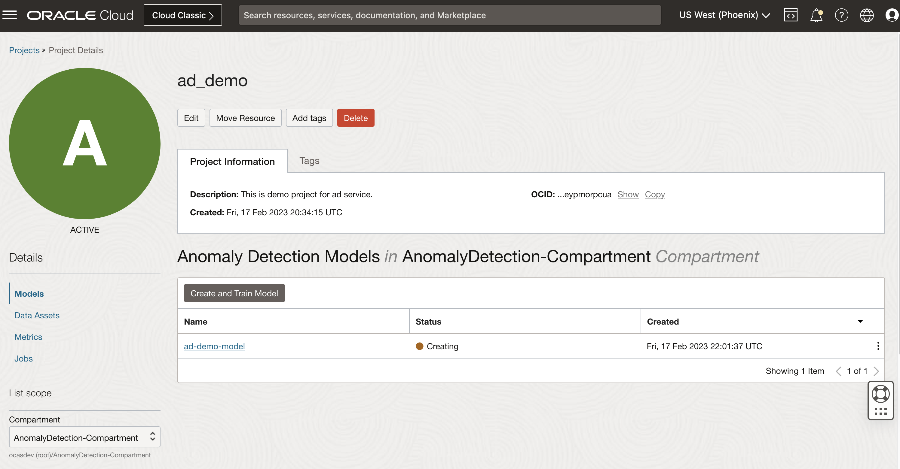
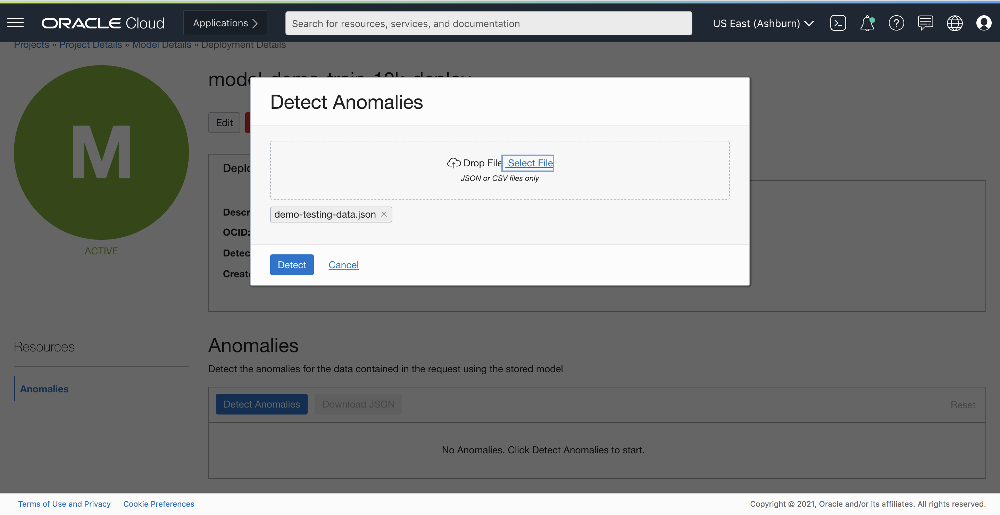
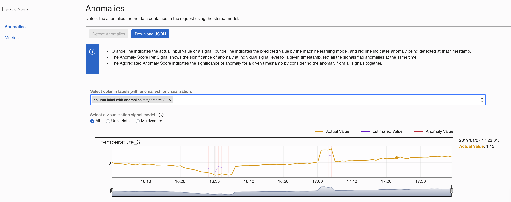

# Train Anomaly Detection Model And Detect

## Introduction

In this session, we will show you how to train an anomaly detection model, and make predictions with new data.

***Estimated Time***: 30 minutes

### Objectives

In this lab, you will:
- Learn to train an anomaly detection model with created data asset
- Learn to verify the trained model performance
- Upload testing data to check detection result

### Prerequisites

- A Free tier or paid tenancy account in OCI
- Understand basic model terminology FAP - False Alarm Probability

## Task 1: Create a Model

Creating a model is requiring the 3 actions to kick off training the AD model.

* Select the proper compartment and data asset that we just created.
* Set training parameters
* Train a model

Select the proper compartment(e.g, the compartment matching your name or company name), and then the project you have created.


Once the project ad_demo is selected, it will navigate the User to Created Anomaly Detection Project, then click "Create and Train Model".


The data asset created in previous lab session should be pop up in the drop down menu. Click "Next" button.


This takes us to "Train Model" form with parameter selections.

We can specify FAP(false alarm probability) and Train Fraction Ratio. The default values for these are 0.01 and 0.7 (implying 70%) respectively.

###FAP (False Alarm Probability)

FAP stands for False Alarm Probability, which is basically the likelihood (percentage) of a timestamp is flagged as anomaly in the clean (anomaly-free) training data. It is calculated at every signal level and then averaged across all signals as the final achieved FAP by our model.  

A model with high FAP means the likelihood of an anomaly flagged by AD service to be a false alarm is high. If this is not desired, depending on the sensitivity requirements of a user, user can specify it to be low.

Typically, FAP can be set to be around the same level of percentage of anomalies in real business scenarios, and a value 0.01 or 1% is relatively appropriate for many scenarios. Also, be aware that if specifying a lower target FAP, the model needs more time to train, and may not achieve to the target FAP.

###How to calculate FAP


**FAP = sum(number of anomalies in each signal) / (number of signals * number of timestamps)**

As can be inferred from the formula, the more the number of false alarms allowed for the model to learn, the higher FAP will be.

###Train Fraction Ratio

Train Fraction Ratio specifies the ratio of the whole training data used for our algorithm to learn the pattern and train the model. The rest (1-ratio) of training data will be used for our algorithm to evaluate and report model performance (e.g., FAP). The default value 0.7 or 70% specifies the model to use 70% of the data for training, and the rest 30% is used to produce model performance.

In this demo data set, the default value for FAP and Train Fraction Ratio are appropriate, we will leave them as is.


Click Submit. For this demo dataset, it takes **10-15 minutes** to finish training a model.


Once the model is trained successfully, it is automatically ready for detecting anomalies from new data. User can either use the cloud Console (next step) or the endpoint to send new testing data.

## Task 2: Detect Anomaly with new Data

### Upload to UI

To start the  process of anomaly detection select "Detect Anomalies" on the Model listing page.


Select a file from local filesystem or drag and drop the desired file.


**Note: The detection data can have up to 30,000 data points (number of signals times number of timestamps). If the trained model contains univariate models, it requires at least 20 timestamps to generate anomaly.**

Once the test file is uploaded, now click Detect button.

The detection result will return immediately, and you have the option to select the column to see related anomalies.

Use the drop wizard to select a column to see anomalies.


**Explanation of the Graph**

Each signal in your detection data can be selected to show a separate graph.

In the graph, horizontal axis represents the timestamp (or indexes if no timestamp was provied), and the vertical axis represents sensor values.

In each subgraph, orange line indicates the actual input value of a signal, purple line indicates the predicted value by the machine learning model, and red line indicates anomaly being detected at that timestamp.

There are two additional subgraphs after sensor subgraphs:

* The Anomaly Score Per Signal shows the significance of anomaly at individual signal level for a given timestamp. Not all the signals flag anomalies at the same time.
* The Aggregated Anomaly Score indicates the significance of anomaly for a given timestamp by considering the anomaly from all signals together.

You can move your mouse over the graph, the actual value & estimated value at a certain timestamp will show at the upper right corner of the graph.

Lets select temperature_3 to see where the model has detected an anomaly.



The part of the signal where the model has determined to be an anomaly is highlighted. There is also an option to download the anomaly detection result.

Click the "Download JSON" button, it will download a file named anomalies.json, with the following content after pretty formatting.
 ```json
 [{
   "timestamp": "2019-01-07T21:28:10.000+00:00",
   "anomalies": [{
     "signalName": "temperature_3",
     "actualValue": -2.3941492028804823,
     "estimatedValue": -1.3968646982446573,
     "anomalyScore": 0.6991412894059958
   }],
   "score": 0.17062950252018466
 }, {
   "timestamp": "2019-01-07T21:30:09.000+00:00",
   "anomalies": [{
     "signalName": "temperature_3",
     "actualValue": -2.969391704072731,
     "estimatedValue": -2.2280378569031987,
     "anomalyScore": 0.44132450938143
   }],
   "score": 0.15049852136852282
 }, {
   "timestamp": "2019-01-07T21:31:07.000+00:00",
   "anomalies": [{
     "signalName": "temperature_3",
     "actualValue": -2.8692496787296853,
     "estimatedValue": -0.9000745817440916,
     "anomalyScore": 0.6888888888888889
   }],
   "score": 0.3324823947982064
 }, {
   "timestamp": "2019-01-07T21:32:07.000+00:00",
   "anomalies": [{
     "signalName": "temperature_3",
     "actualValue": -2.6463618772188724,
     "estimatedValue": -1.1883816883039726,
     "anomalyScore": 0.6444444444444445
   }],
   "score": 0.26424069902395886
 }, {
   "timestamp": "2019-01-07T21:33:07.000+00:00",
   "anomalies": [{
     "signalName": "temperature_2",
     "actualValue": -3.2061627022001513,
     "estimatedValue": -1.9734666104961938,
     "anomalyScore": 0.6
   }],
   "score": 0.2827533417975129
 }, {
   "timestamp": "2019-01-07T21:34:09.000+00:00",
   "anomalies": [{
     "signalName": "temperature_3",
     "actualValue": -2.6708890607848206,
     "estimatedValue": -1.5134377236108654,
     "anomalyScore": 0.6
   }],
   "score": 0.16854638238128244
 }, {
   "timestamp": "2019-01-07T22:03:05.000+00:00",
   "anomalies": [{
     "signalName": "temperature_2",
     "actualValue": 3.083887035191133,
     "estimatedValue": 1.3737587686565504,
     "anomalyScore": 0.6444444444444445
   }, {
     "signalName": "temperature_3",
     "actualValue": 2.9912405995536164,
     "estimatedValue": 1.5717138197392095,
     "anomalyScore": 0.6444444444444445
   }],
   "score": 0.2646869126037501
 }, {
   "timestamp": "2019-01-07T22:04:03.000+00:00",
   "anomalies": [{
     "signalName": "temperature_2",
     "actualValue": 3.0544769126601294,
     "estimatedValue": 1.629371737935325,
     "anomalyScore": 0.6
   }, {
     "signalName": "temperature_3",
     "actualValue": 3.296416780034894,
     "estimatedValue": 1.7698354655336326,
     "anomalyScore": 0.6
   }],
   "score": 0.26224293915437363
 }, {
   "timestamp": "2019-01-07T22:13:05.000+00:00",
   "anomalies": [{
     "signalName": "pressure_2",
     "actualValue": 7.592321707893466,
     "estimatedValue": 3.2019284312239957,
     "anomalyScore": 0.6888888888888889
   }],
   "score": 0.21415093574406247
 }, {
   "timestamp": "2019-01-07T22:14:03.000+00:00",
   "anomalies": [{
     "signalName": "pressure_2",
     "actualValue": 9.960204074915126,
     "estimatedValue": 3.530785021250325,
     "anomalyScore": 0.6444444444444445
   }],
   "score": 0.17395422335011604
 }, {
   "timestamp": "2019-01-07T22:15:04.000+00:00",
   "anomalies": [{
     "signalName": "pressure_2",
     "actualValue": 8.957698832423487,
     "estimatedValue": 3.938389507449287,
     "anomalyScore": 0.6
   }],
   "score": 0.26877693556170257
 }]
 ```

The results return an array of anomalies grouped by timestamp. Each timestamp could have anomalies generated by single or multiple signals. Anomaly generated by one signal contains a tuple of signal name, actual value, estimate value, and an anomaly score with in the range of 0 to 1 that indicate the significance of anomaly. Meanwhile, each timestamp also have a normalized score that combines the significance scores across single or multiple alerted signals.


**Congratulations on completing this lab!**

You now have completed the full cycle of using the training data to create a model and deploy, and also making predictions with testing data.

The next 2 sessions are optional for advanced users, which cover the topic on using REST API to integrate our services and how to prepare the training and testing data from raw data in different scenarios.

## Acknowledgements

* **Authors**
    * Jason Ding - Principal Data Scientist - Oracle AI Services
    * Haad Khan - Senior Data Scientist - Oracle AI Services
* **Last Updated By/Date**
    * Jason Ding - Senior Data Scientist, Jan 2022
