# Lab 2: Deploy Agent Tools

## Introduction

This lab configures the OCI Generative AI Agent tools. You will confirm the RAG tool created in Lab 1, use or configure an Autonomous AI Database and Database Tools connection for SQL, add a Weather tool, and test the multi-tool agent.

The following agent tools will be configured:
* General LLM Chat (Built-in)
* Weather
* RAG
* SQL

Estimated Time: 45 minutes

### Objectives

In this lab, you will:
* Use a Vault, Autonomous Database, and Database Tools connection for the SQL tool
* Define agent tools in the OCI console

### Prerequisites

This lab assumes you have:

* An Oracle account
* All previous labs successfully completed

> **Important:** Review **Preparing Your Tenancy** in the workshop introduction before enabling SQL execution or self-correction.

> **Sandbox option:** The LiveLabs sandbox already provides a Vault, Autonomous Database, and Database Tools connection. For the sandbox, skip the creation steps in Tasks 2 through 4 and use the existing connection in Task 6. You must still create the `Employees` table in Task 5 because the pre-provisioned sample tables are optional and are not used by this workshop. Do not modify or delete the pre-provisioned resources.

## Task 1: Add Agent Routing Instructions and Confirm RAG Tool Configuration

1. Navigate to your GenAI Agent created in the previous lab

    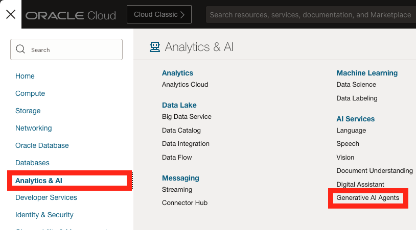

2. Edit your agent and add the following routing instructions:

    ```text
     <copy>
      You are a helpful assistant. If a user asks about design considerations for generative AI applications, use the RAG tool. If a user asks about employees, use the employee-sql tool. If a user asks about the weather, use the get_weather tool. If a user asks a general question, use your general knowledge, no tools.
     </copy>
    ```

    > **Note** The RAG tool is grounded in *Design Considerations for GenAI Apps.pdf*. The routing instruction uses this document's subject so the agent selects the RAG tool for relevant questions.

3. Select your agent and confirm it has a RAG tool as configured in the previous lab. If not, create a new tool.

    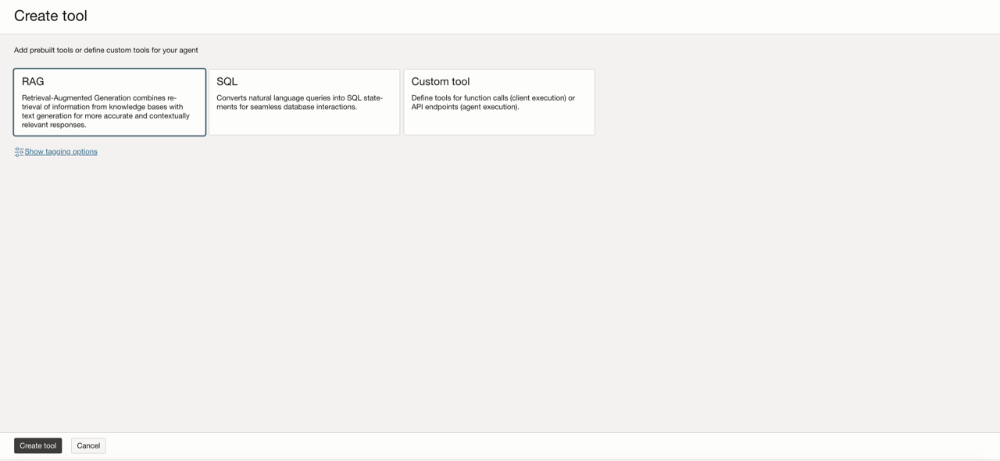

4. Confirm the description of the tool and the knowledge base you created in the previous lab

    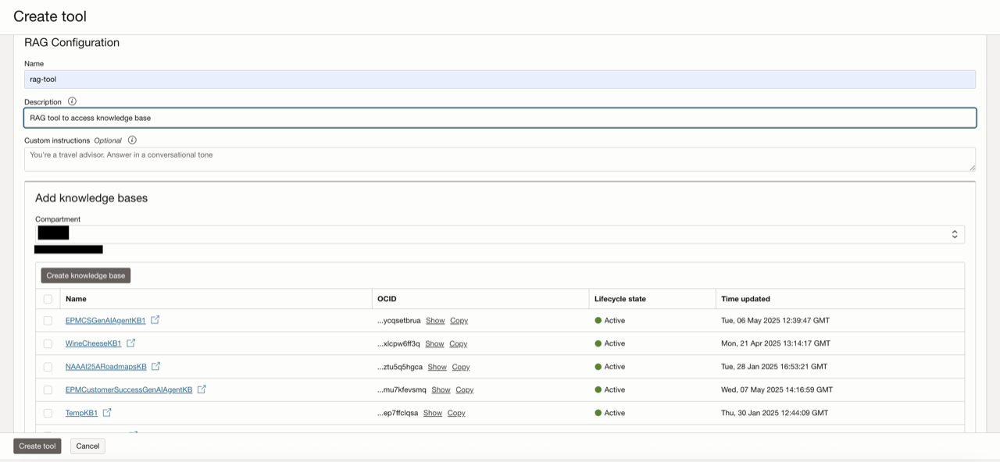

5. Navigate to the agent endpoint and launch the chat. You should now be able to ask questions about design considerations for generative AI applications.

    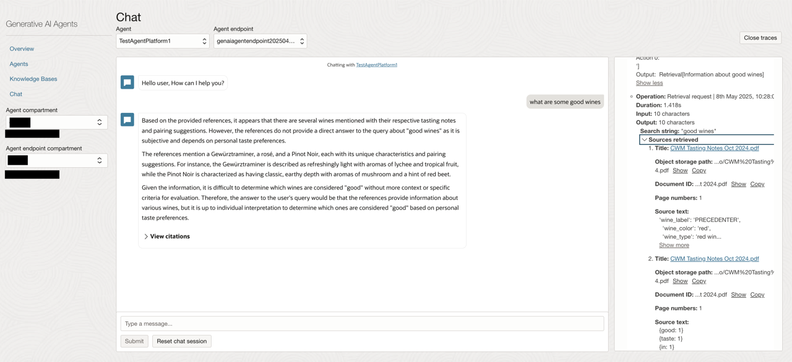

## Task 2: Use a Vault to Store Database Secrets

If you are using the LiveLabs sandbox, its Vault and secrets are already configured for the pre-provisioned Database Tools connection. No action is required in this task; proceed to Task 3.

If you are using your own tenancy, create a Vault and key to store the database secrets used by the Database Tools connection:

1. Locate Vault under Key Management & Secret Management. Provide Name and click on Create Vault.

    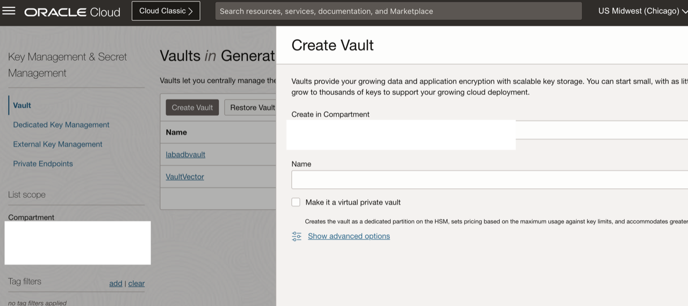

2. Go to the newly created Vault. Click on Create Key.

3. Provide Name and leave rest as default. Choose Protection Mode as HSM and click on Create Key.

    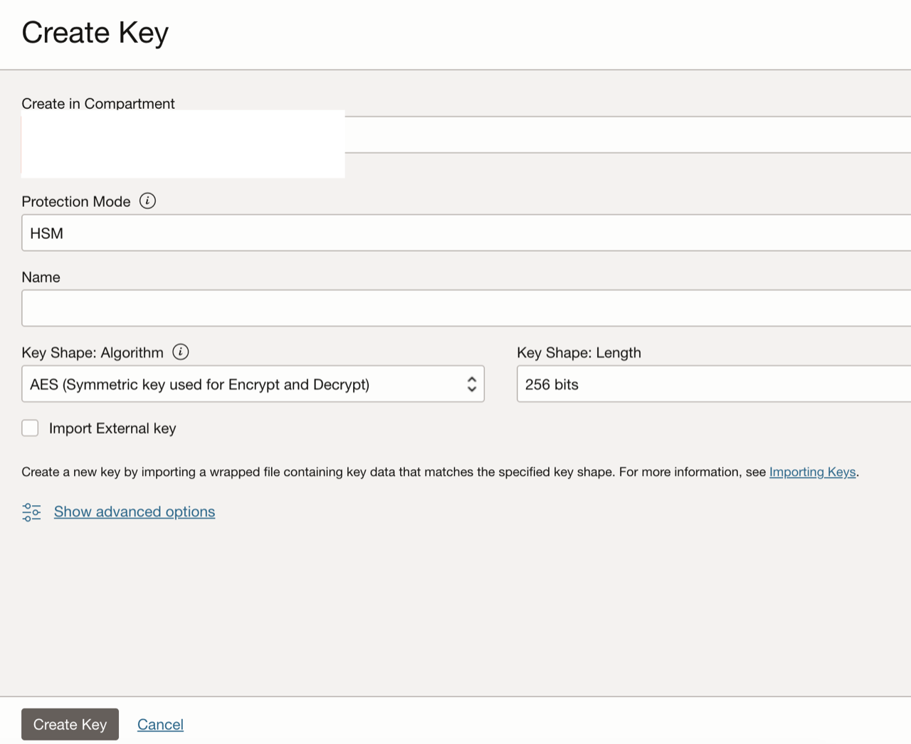

## Task 3: Use an Autonomous Database

If you are using the LiveLabs sandbox, use its pre-provisioned Autonomous Database. Do not create or delete a database; proceed to Task 4.

If you are using your own tenancy, create an Autonomous Database 26ai:

1. Locate Autonomous Databases under Oracle Databases. Click on Create Autonomous Database.

    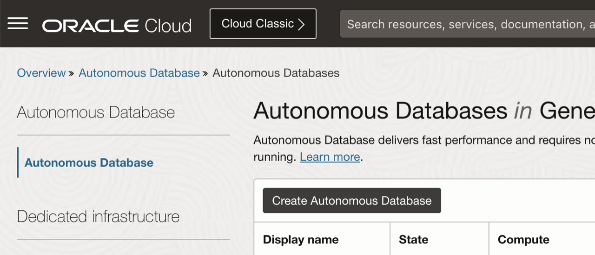

2. Provide information for Compartment, Display name, Database name. Choose workload type as Transaction Processing. Choose deployment type as Serverless. Choose database version as 26ai and give it a password of your preference.

    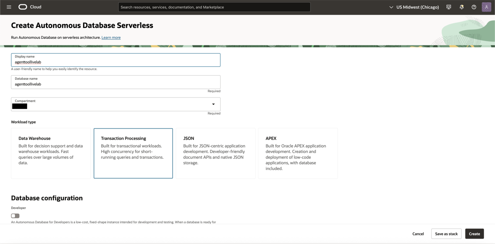

3. For **Network access**, select **Secure access from everywhere** to create a public endpoint. Keep **Require mutual TLS (mTLS) authentication** enabled. This workshop uses only sample data; do not use this public-endpoint configuration for production data.

4. Finally click on Create Autonomous Database.

## Task 4: Use a Database Tools Connection

If you are using the LiveLabs sandbox, use its pre-provisioned Database Tools connection. You can use it in SQL Worksheet to create the `Employees` table in Task 5 and select it for the SQL tool in Task 6. Do not create a new secret, wallet, or connection.

If you are using your own tenancy, create and validate a Database Tools connection to use with SQL Worksheet:

1. Locate Database Tools Connections under Developer Services. Click on Create connection.

    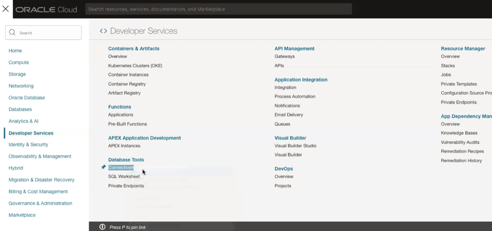

2. Provide Name and Compartment information. Choose **Oracle Autonomous Database** as the Database cloud service, select the Autonomous Database you created in Task 3, and provide the username `ADMIN`.

3. Click **Create password secret**. Provide a name, the Vault and key created in Task 2, and the same password used when you created the Autonomous Database.

    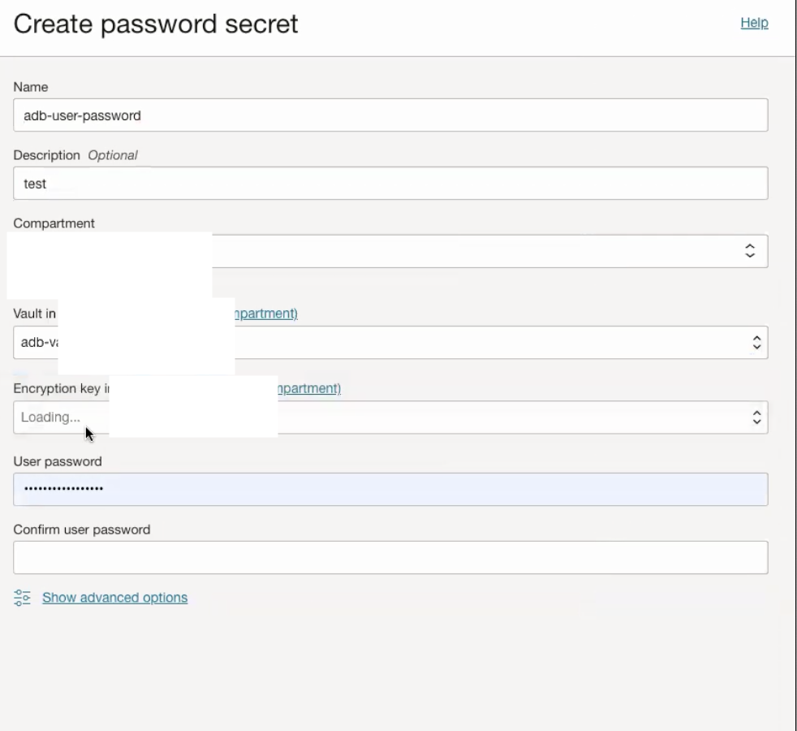

4. Use the newly created password secret as **User password secret**.

5. Under **SSL details**, set **Wallet format** to **Oracle auto-login wallet (for example, `cwallet.sso`)**, then select **Create wallet content secret**.

    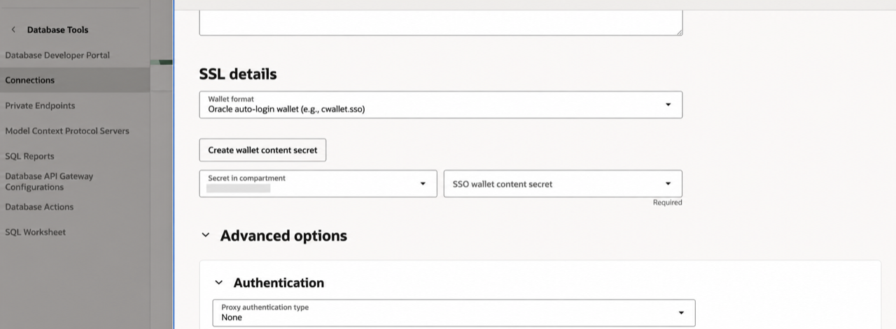

    If you have not already done so, open the Autonomous Database **Database connection** page and download its mTLS wallet. Unzip the download so that you can select `cwallet.sso`. In the dialog, choose the compartment, Vault, and encryption key created in Task 2. Under **Wallet**, select **Upload wallet** (do not select **Retrieve regional wallet from Autonomous AI Database**), then upload `cwallet.sso`. Create the secret and select it as the **SSO wallet content secret**.

    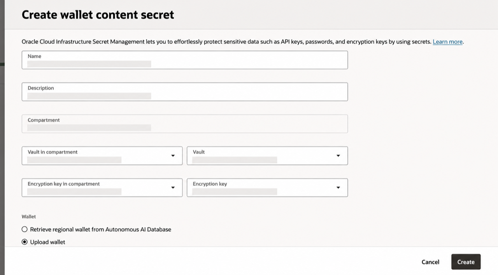

6. On your Autonomous Database details page, select **Database connection**. Copy the connection string for the **low** service using **Mutual TLS (mTLS)** authentication. Return to the Database Tools connection and paste that value into **Connection string**. Do not replace it with a private-IP address.

    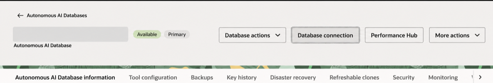

    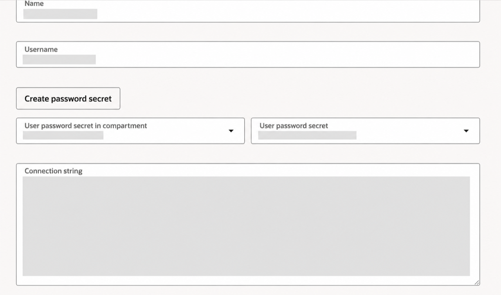

7. Do not select **Access database via a private network** or a Database Tools private endpoint.

8. Click **Create** to create the Database Tools connection.

9. Open the newly created Database Tools connection and select **Validate**.

    > **Production note:** A production database should use private endpoint access, a Database Tools private endpoint, least-privilege network rules, and production data controls. This public-endpoint configuration is intentionally limited to the disposable workshop database and sample data.

## Task 5: Create and Populate Employee Table

1. Navigate to the SQL Worksheet for the database you will use with the SQL tool and run the following statements. In the LiveLabs sandbox, open SQL Worksheet through the pre-provisioned Database Tools connection.

    > **Note:** The sandbox's pre-provisioned sample tables are not required for this workshop. Create the separate `Employees` table below (or use your own equivalent table) and leave the pre-provisioned tables unchanged.

    ```text
    <copy>
    CREATE TABLE Employees (
        EmployeeID INT PRIMARY KEY,
        Name VARCHAR(100) NOT NULL,
        DepartmentID INT,
        HireDate DATE NOT NULL
    );
    </copy>
    ```

    - Populate your table with the following data

    ```text
    <copy>
    INSERT ALL
    INTO Employees (EmployeeID, Name, DepartmentID, HireDate) VALUES (1, 'John Doe', 1, TO_DATE('2020-01-01', 'YYYY-MM-DD'))
    INTO Employees (EmployeeID, Name, DepartmentID, HireDate) VALUES (2, 'Jane Smith', 2, TO_DATE('2020-02-01', 'YYYY-MM-DD'))
    INTO Employees (EmployeeID, Name, DepartmentID, HireDate) VALUES (3, 'Bob Johnson', 1, TO_DATE('2020-03-01', 'YYYY-MM-DD'))
    INTO Employees (EmployeeID, Name, DepartmentID, HireDate) VALUES (4, 'Alice Brown', 3, TO_DATE('2020-04-01', 'YYYY-MM-DD'))
    INTO Employees (EmployeeID, Name, DepartmentID, HireDate) VALUES (5, 'Mike Davis', 2, TO_DATE('2020-05-01', 'YYYY-MM-DD'))
    SELECT * FROM dual;
    COMMIT;
    </copy>
    ```

    > **Note** If you use your own table, large queries can cause timeouts in the agent service. Try filtering your results to avoid timeouts.

## Task 6: Create SQL Tool
1. In the console navigate to your agent and create a new SQL Tool

    

2. Set the tool name to `employee-sql`, add a description such as `Retrieve employee information from the Employees table`, and paste the database schema.

    > **Note** Make sure to use the same schema defined in the previous task.

    ```text
    <copy>
    CREATE TABLE Employees (
        EmployeeID INT PRIMARY KEY,
        Name VARCHAR(100) NOT NULL,
        DepartmentID INT,
        HireDate DATE NOT NULL
    );
    </copy>
    ```

    > **Note** If using your own table, run the following to inspect its schema:

    ```sql
    DESC table_name;
    ```

    in the SQL Worksheet.

3. Select Oracle SQL as the dialect and select the Database Tools connection from Task 4. In the LiveLabs sandbox, select the pre-provisioned connection. Enable SQL Execution and self correction.
4. Select **Test connection** and confirm that the test succeeds.

5. Create the tool.

6. Navigate to your endpoint and launch the chat. Ask a question such as `List all employees`. The agent should invoke the SQL tool, generate Oracle SQL, and return the result.

    > * **Note** If the SQL tool isn't returning the correct response, it can be helpful to provide an inline example to the tool. Also see [SQL Tool Guidelines](https://docs.oracle.com/en-us/iaas/Content/generative-ai-agents/sqltool-guidelines.htm#sqltool-iclexamples)

    > * **Note** Also make sure the agent is using the correct tool for the job. If the agent is using the wrong tool, add a more detailed description or routing instructions.

## Task 7: Create a Weather Tool

1. Navigate to the agent tools and select **Create tool** > **Custom tool**. Under Tool configuration, select **Function calling**, then create a function named `get_weather`.

2. Give the function the following description:

    ```text
    <copy>
      Get the weather for a given location
    </copy>
    ```

3. Paste the following valid JSON schema as the function parameters:

    ```json
    <copy>
    {
      "type": "object",
      "properties": {
        "location": {
          "type": "string",
          "description": "City and country or region for the weather request"
        }
      },
      "required": ["location"],
      "additionalProperties": false
    }
    </copy>
    ```

4. Create the tool and wait for it to become active.

    > **Note:** This workshop configures the function contract only; it doesn't deploy a weather-service implementation. A weather prompt verifies that the agent selects `get_weather` and passes a `location` argument. A production application must execute the function and return its result to the agent.


## Task 8: Chat with your Agent

1. From the agent endpoint, launch chat and test the following prompts:

    * Ask a question about design considerations for generative AI applications to verify RAG routing.
    * Ask `List all employees` to verify the `employee-sql` tool and the committed sample data.
    * Ask about the weather in a location to verify that the agent selects `get_weather` and supplies a location argument.
    * Ask a general question, such as `What is an autonomous agent?`, to verify general chat without a tool.

2. If a prompt selects the wrong tool, refine the tool description or the routing instructions in Task 1, then test again.

## Task 9: Clean Up Workshop Resources

If you are using the LiveLabs sandbox, no cleanup is required. The sandbox and all resources created in it are deleted automatically when the sandbox expires.

If you are using your own tenancy:

1. When you finish the workshop and no longer need the environment, remove the SQL tool from the agent, then delete the Database Tools connection and the Autonomous Database.

2. After the database and connection are deleted, delete the password secret and wallet-content secret. Delete the Vault key and Vault only when they are not used by another resource.

3. If you do not plan to continue experimenting, delete the agent endpoint, agent, knowledge base, and Object Storage bucket created for the workshop. Do not delete shared or organization-managed resources.

4. Verify that the public workshop database no longer appears on the Autonomous Databases page.

## Learn More

* [SQL Tool Guidelines for Generative AI Agents](https://docs.oracle.com/en-us/iaas/Content/generative-ai-agents/sqltool-guidelines.htm)
* [Database Tools - ADB Shared with Public IP](https://docs.oracle.com/en-us/iaas/database-tools/doc/oracle-database-use-cases.html#OCDBT-GUID-87796740-BAE4-4805-BF6D-C75A02A3D1D4)
* [RAG Tool Oracle Database Guidelines for Generative AI Agents](https://docs.oracle.com/en-us/iaas/Content/generative-ai-agents/oracle-db-guidelines.htm)

## Acknowledgements

**Author**
  * **Luke Farley**, Senior Cloud Engineer, NACIE

**Contributors**
  * **Kaushik Kundu**, Master Principal Cloud Architect, NACIE
  * **Abhinav Jain**, Senior Cloud Engineer, NACIE
  * **Yanir Shahak**, Senior Principal Software Engineer
  * **Ale Casas**, Senior Principal Product Marketing
  * **Raj Arora**, Master Principal Analytics Cloud Architect

**Last Updated By/Date**
* **Luke Farley**, Senior Cloud Engineer, NACIE, September 2026
