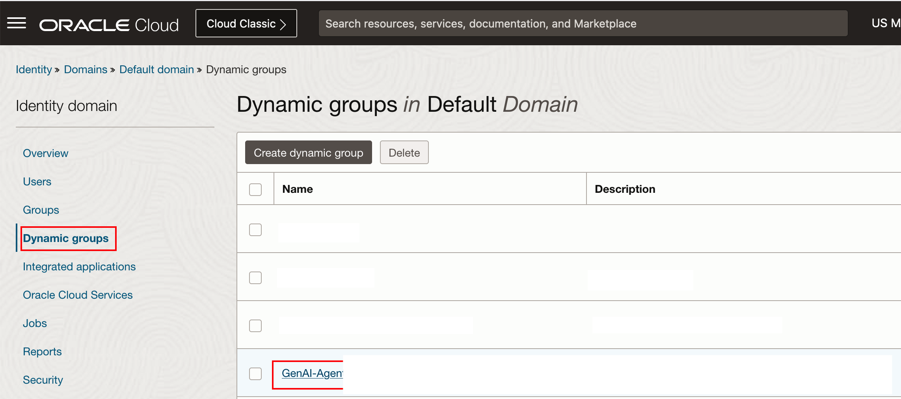
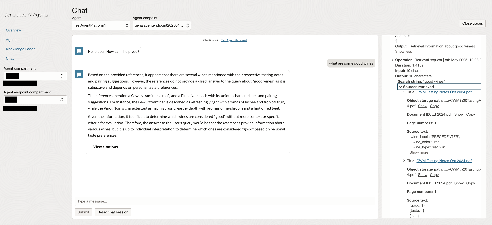
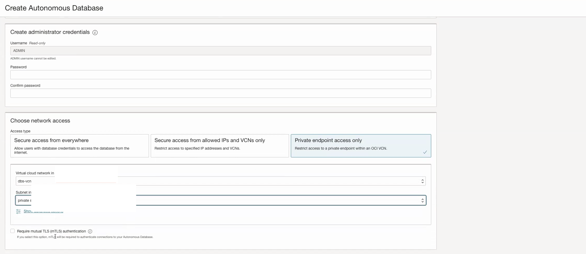
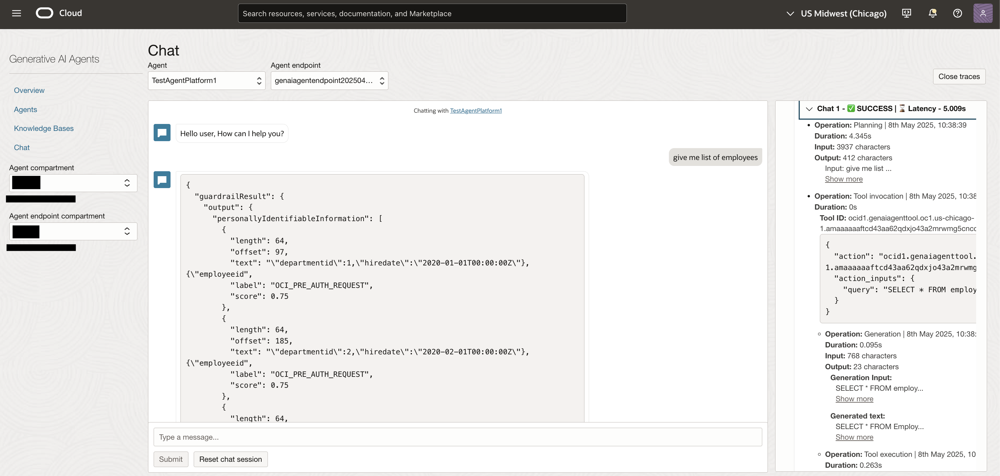

# Lab 2: Deploy Agent Tools

## Introduction

This lab will go through the steps on configuring the GenAI Agent tools. First we'll go through the steps needed to provision Oracle Autonomous Database 23ai and Database Tools Connection, then define the tools through the console. After the tools are configured we will deploy a function that invokes the agent service. The function we deploy will be used in the next lab.

Estimated Time: 120 minutes

### Objectives

In this lab, you will:
* Deploy VCN and subnet for ADB
* Create Vault to store DB secret
* Define agent tools in the OCI console
* Deploy agent functions to function application
* Provision an Oracle ADB 23ai
* Create DB Tools Connection

### Prerequisites

This lab assumes you have:

* An Oracle account
* All previous labs successfully completed
* Must have an Administrator Account or Permissions to manage several OCI Services: Oracle Databases, Networking, Policies.

  > **Note** Tasks 3-8 are for the sql tool. If you don't plan on using the sql tool, you can skip these steps. However, you would need to make sure the function code provisioned later doesn't include the reference to the sql tool.

## Task 1: Dynamic Group and Policy Definition for ADB and DB Tools Connection

This task will help you ensure that the Dynamic Group and Policy are correctly defined.

1. Locate Domains under Identity & Security

    

2. Click on your current domain name

    

3. Click on Dynamic Groups, and then your Dynamic Group name

    

    **Note** The name of your dynamic group can be different.

4. Ensure that your Dynamic Group is properly defined - as follows. Then click on Identity

    

    ```text
     <copy>
      ALL {resource.type='genaiagent'}
     </copy>
    ```

5. Click on Policies, ensure that you are in your "root" compartment, then click on your Policy name

    

    **Note** The name of your policy can be different.

6. Ensure that your Policy is properly defined - as follows. Make sure to change the compartment to your own compartment name where the respective services are hosted. 

    

    ```text
     <copy>
      Allow dynamic-group atom-dev-dg to read database-tools-family in compartment <comp-with-database-connection>
      Allow dynamic-group atom-dev-dg to read secret-bundle in compartment <comp-with-vault-secret>
      allow any-user to read database-tools-family in compartment <database-connection-comp> where any {request.principal.type='genaiagent'}
      allow any-user to read secret-bundle in compartment <vault-comp> where any {request.principal.type='genaiagent'}
      Allow any-user to use database-tools-connections in compartment <database-connection-comp> where any {request.principal.type='genaiagent'}
     </copy>
    ```

    **Note** If you are using a non-default identity domain - then instead of of just supplying the dynamic group name, you need to provide domain-name/group-name in the policy statements.

## Task 2: Create RAG Tool 

1. Navigate to your GenAI Agent created in the previous lab 


2. Select your agent and create a new tool 


3. Give a description of the tool and select the knowledge base you created in the previous lab 


4. Navigate to the agent endpoint and launch the chat. You should now be able to ask questions about your dataset - 



  > **Note** Take note of the RAG Tool id, this will be used later in the lab for the function deployment. 

## Task 3: Create VCN and Private Subnet

This task will help you to create a VCN and private subnet in your compartment. This will be used for the ADB for the SQL Tool.

1. Go to Networking -> Virtual cloud networks and Create VCN. Provide IPv4 CIDR Blocks as 10.0.0.0/16

2. Go to the newly created VCN and click on Create Subnet. Provide IPv4 CIDR Block as 10.0.1.0/24 and click on Private Subnet. You can leave rest as default. Click on Create Subnet.

3. Click on newly created subnet and go to the Security List. Add following ingress rules in the security list. Make sure to have the ingress rule to access database port 1521-1522

    

## Task 4: Create Vault to store database secrets

This task will help you to create vault which would be used to save secrets for the database. The secrets are used for the agent to connect to your database with the db tool connection.

1. Locate Vault under Key Management & Secret Management. Provide Name and click on Create Vault.

    

2. Go to the newly created Vault. Click on Create Key.

3. Provide Name and leave rest as default. Choose Protection Mode as HSM and click on Create Key.

    

## Task 5: Create Autonomous Database

This task involves creating Autonomous Database 23ai.

1. Locate Autonomous Databases under Oracle Databases. Click on Create Autonomous Database.

    

2. Provide information for Compartment, Display name, Database name. Choose workload type as Transaction Processing. Choose deployment type as Serverless. Choose database version as 23ai and give it a password of your preference. 

    

3. Make sure to select the Network Access: Private Endpoint access only, and select the VCN and subnet mentioned in above section. Also, do not check Require mutual TLS (mTLS) authentication.

    

4. Finally provide a valid email ID and click on Create Autonomous Database.

## Task 6: Create Database Tools Connection

This task involves creating a Database Tools Connection which will be used to query the database using SQL Worksheet.

1. Locate Database Tools Connections under Developer Services. Click on Create connection.

    

2. Provide Name and Compartment information. Choose Oracle Autonomous Database as Database cloud service. Provide Username as admin.

3. Click on Create password secret. Provide Name, Vault and Key created in Task 3. Provide same password used at the time of ADB creation in previous task.

    

4. Use the newly created password secret as User password secret.

5. Copy the connection string from your autonomous database. Go to ADB and click on database connection and copy any of the low, medium or high connection strings as shown below,

    

6. Modify the connection string with the following: Reduce retry_count form 20 to 3; Replace host with private ip address. You can get Private IP address from the autonomous database as shown below.

    

7. Click on Create private endpoint. Provide Name and private subnet created in Task 1.

    

8. Choose newly created private endpoint as Private Endpoint.

9. Choose Wallet format as None in SSL details.

10. Click on Create to create a database tools connection.

    

11. Go to newly create Database Tools connection. Click on Validate.

    


## Task 7: Create and Populate Employee Table

1. Navigate to the SQL Worksheet of your newly created ADB and run the following statements: 

> *Note* You can create or use your own tables here; we provided the table below for illustration purposes. 

```text
<copy>
CREATE TABLE Employees (
    EmployeeID INT PRIMARY KEY,
    Name VARCHAR(100) NOT NULL,
    DepartmentID INT,
    HireDate DATE NOT NULL
);
</copy>
```

- Populate your table with the following data 

```text
<copy>
INSERT ALL
INTO Employees (EmployeeID, Name, DepartmentID, HireDate) VALUES (1, 'John Doe', 1, TO_DATE('2020-01-01', 'YYYY-MM-DD'))
INTO Employees (EmployeeID, Name, DepartmentID, HireDate) VALUES (2, 'Jane Smith', 2, TO_DATE('2020-02-01', 'YYYY-MM-DD'))
INTO Employees (EmployeeID, Name, DepartmentID, HireDate) VALUES (3, 'Bob Johnson', 1, TO_DATE('2020-03-01', 'YYYY-MM-DD'))
INTO Employees (EmployeeID, Name, DepartmentID, HireDate) VALUES (4, 'Alice Brown', 3, TO_DATE('2020-04-01', 'YYYY-MM-DD'))
INTO Employees (EmployeeID, Name, DepartmentID, HireDate) VALUES (5, 'Mike Davis', 2, TO_DATE('2020-05-01', 'YYYY-MM-DD'))
SELECT * FROM dual;
</copy>
```

## Task 8: Create SQL Tool
1. In the console navigate to your agent and create a new SQL Tool

  

2. Enter name e.g. atomlab-sql and description, along with the database schema 

> **Note** Make sure to use the same schema defined from the previous task.

```text
<copy>
CREATE TABLE Employees (
    EmployeeID INT PRIMARY KEY,
    Name VARCHAR(100) NOT NULL,
    DepartmentID INT,
    HireDate DATE NOT NULL
);
</copy>
```

> **Note** If you are using your own table, you can get a better idea of the schema by running DESC table_name;


3. Select Oracle SQL as the dialect and select the database tool connection configured in the previous task. Enable SQL Execution and self correction. 
4. Test the connection 


5. Create the tool 

  > **Note** Take note of the toolId, this will be used in a later step. 

6. Navigate to your endpoint and launch the chat. Ask a question such as "Give me list of employees". The agent should invoke the SQL Tool and convert the query to Oracle SQL, then return the result - 

  

  

  > **Note** If your sql tool is not returning the correct response, it can be helpful to provide an in-line example to the tool. Also see [SQL Tool Guidelines](https://docs.oracle.com/en-us/iaas/Content/generative-ai-agents/sqltool-guidelines.htm#sqltool-iclexamples)

  > **Note** Also make sure your agent is using the correct tool for the job. If the agent is using the wrong tool, make sure to add a more detailed description

  > **Note** If you are getting 404 errors, you are likely missing a policy. Refer back to Task 1 step 6. 

  > **Note** The SQL Tool will occasionally throw 500 errors. This is a bug and should be fixed soon. 

## Task 9: Create Analyze Document Tool from Console 

  1. Navigate back to the tools of your agent and create a new function tool - 

  

  - Give the following description - 

    ```text
    <copy>   
      Analyzes document and returns text 
    </copy>
    ```

  - Paste the following function parameters - 

    ```text
    <copy>
      {"type":"object","properties":{"url":{"type":"string"}},"required":"['url']"}
    </copy>
    ```

  2. Create the tool 

  > **Note** You will not be able to test the analyze_doc function yet; this tool will depend on the function we will deploy later.

## Task 10: Create a General Chat Tool

  1. Navigate to your agent tools and create a new tool - 

  

  - Give the following description - 

    ```text
    <copy>
      Takes a general user input and returns answer 
    </copy>
    ```

  - Paste the following function parameters - 

    ```text
    <copy>
      {"type":"object","properties":{"userInput":{"type":"string"}},"required":"['userInput']"}
    </copy>
    ```

  2. Create the tool 

## Task 11: Create a Weather Tool

  1. Navigate to your agent tools and create a new tool called "get_weather" 

  - Give the following description - 

    ```text
    <copy>
      Get the weather for a given location
    </copy>
    ```

  - Paste the following function parameters - 
    ```text
    <copy>
    {"type":"object","properties":{"location":{"type":"string"}},"required":"['location']"}
    </copy>
    ```

  2. Create the tool 

<!---
## Task F: Create an API Endpoint Tool
--> 

## Task 12: Deploy Function to Function Application

The function to be deployed will invoke the agent from the ODA application.

In this section, we will delve into the process of creating and deploying an Oracle Function. OCI Functions provide a serverless environment, allowing you to focus on your code without worrying about server management. We will guide you through the steps of developing and deploying an OCI Function, which can be a powerful tool for extending your application's capabilities. You will learn how to create a function, configure its settings, and deploy it using the Oracle Cloud Infrastructure console or command-line interface. By the end of this section, you will be ready to connect the function to the ODA skill.

1. Download the following file: 

    [Agent ADK Fn](https://idb6enfdcxbl.objectstorage.us-chicago-1.oci.customer-oci.com/n/idb6enfdcxbl/b/Livelabs/o/atom-multi-tool-livelab%2Fagent-multi-tool-fn.zip)

2. Navigate back to your function application created in Task 2

3. Select Getting Started > Cloud setup and take note of the steps to login and deploy the functions.

    

    - This will give you your specific instructions for: 
        - Setting the context
        - Logging in to the container registry 
        - Deploying the function to your application

   > **Note:** You don't need to run the last invoke command. We will be invoking the function later from ODA. 

4. At the top right of the oci console, open a new cloud shell

    


5. Select the gear icon at the top right of the shell and upload the zip file from step 1 

    

6. Create a new directory for your agent multi tool function and move the zip to the directory

``` text 
<copy>
    mkdir agent-multi-tool-fn
    mv agent-multi-tool-fn.zip /agent-multi-tool-fn
    cd /agent-multi-tool-fn
    unzip agent-multi-tool-fn.zip
</copy>
```

7. open the func.yaml and enter your agentEndpointId, sqlToolId, and ragToolId

``` text 
<copy>
    vi func.yaml 
</copy>
```

  - Press 'i' to insert your changes then press escape then ':wq' to save your changes. 

  > **Note** Your agentEndpointId is *not* the same as your AgentId. Please make sure you use the endpoint id.

x. Deploy the function 

``` text 
<copy>
    fn -v deploy --app <your-function-app>
</copy>
```

    - Take note of the function invoke endpoint once created


> **Note** If you get an error with the architecture, you can change the architecture from the cloud shell 


## Learn More

* [SQL Tool Guidelines for Generative AI Agents](https://docs.oracle.com/en-us/iaas/Content/generative-ai-agents/sqltool-guidelines.htm)
* [ADB Shared with Private Endpoint Access](https://docs.oracle.com/en-us/iaas/database-tools/doc/oracle-database-use-cases.html#OCDBT-GUID-C2C8BC15-EDB1-47D6-BDFC-852558C8D650)
* [Database Tools - ADB Shared with Public IP](https://docs.oracle.com/en-us/iaas/database-tools/doc/oracle-database-use-cases.html#OCDBT-GUID-87796740-BAE4-4805-BF6D-C75A02A3D1D4)
* [RAG Tool Oracle Database Guidelines for Generative AI Agents](https://docs.oracle.com/en-us/iaas/Content/generative-ai-agents/oracle-db-guidelines.htm)

## Acknowledgements

* **Author** 
    * **Luke Farley**, Senior Cloud Engineer, NACIE
* **Contributors**
    * **Kaushik Kundu**, Master Principal Cloud Architect, NACIE
    * **Abhinav Jain**, Senior Cloud Engineer, NACIE
* **Last Updated By/Date**
    * **Luke Farley**, Senior Cloud Engineer, NACIE, May 2025