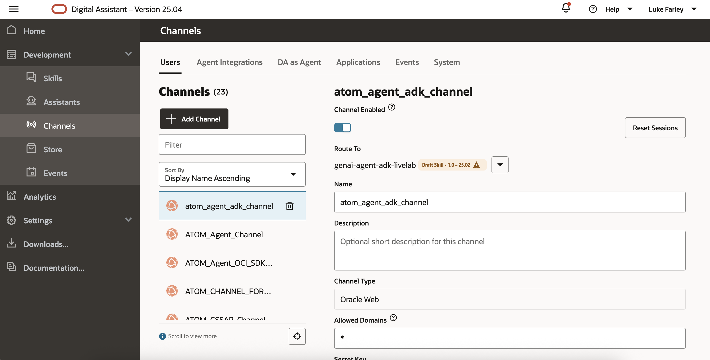
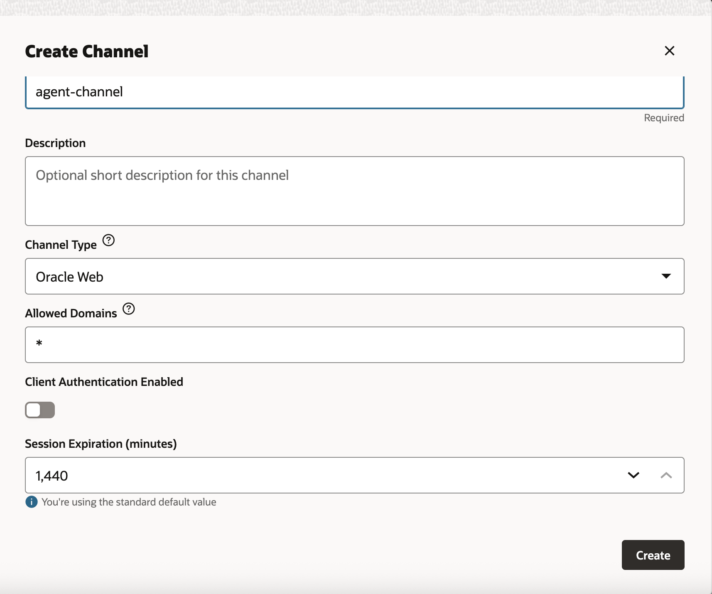
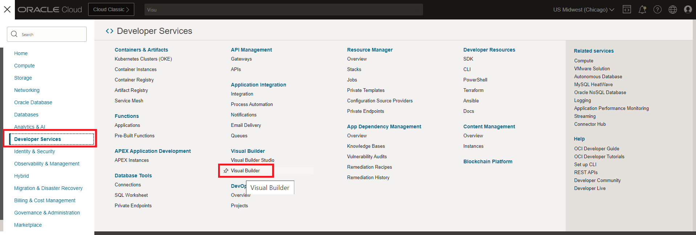
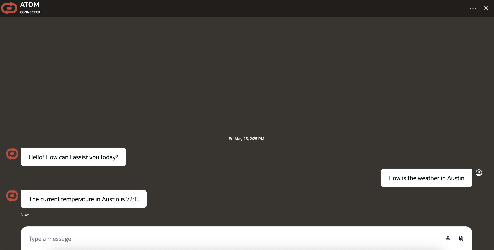
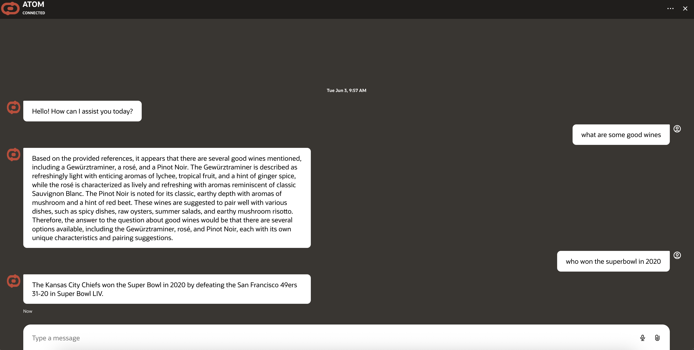

# Lab 3: Provision and Configure Digital Assistant 

## Introduction

This lab will take you through the steps needed to provision and configure Oracle Digital Assistant & Visual Builder Cloud Service. It will also cover dynamic group and policy creation along with the integration with OCI Functions. 

Estimated Time: 60 minutes

### Objectives

In this lab, you will:
* Create Digital Assistant
* Configure ODA skill
* Create Visual Builder Application
* Expose ODA skill on VB application

### Prerequisites

This lab assumes you have:

* An Oracle account
* All previous labs successfully completed
* Must have an Administrator Account or Permissions to manage several OCI Services: Oracle Digital Assistant, Visual Builder, Policies.

### About Oracle Digital Assistant

Oracle Digital Assistant delivers a complete AI platform to create conversational experiences for business applications through text, chat, and voice interfaces

## Task 1: Provision Oracle Digital Assistant

This task will help you to create Oracle Digital Assistant under your chosen compartment.

1. Locate Digital Assistant under AI Services

   

   > **Note:** You can find Digital Assistant under the AI Services.

2. Provide the information for **Compartment**, **Name** , **Description** (optional) & **Shape**. Click **Create**

    

3. In few minutes the status of recently created Digital Assistant will change from **Provisioning** to **Active**

    

## Task 2: Dynamic Group & Policy creation for Oracle Digital Assistant

This task will help you to create desired dynamic group & necessary policy for the Oracle Digital Assistant

Create a Dynamic Group
Go to Identity>>Domains>>Default domain>>Dynamic groups


- Click on Create dynamic group and name it as odaDynamicGroup

- Select radio button - Match any rules defined below
- Add the following rules. Please change the values of OCIDs to your own values here.

Rule 1

```text
     <copy>
    All {instance.id = 'ocid1.odainstance.oc1.us-chicago-1.XXXX'}
     </copy>
```

Rule 2

```text
     <copy>
    All {resource.type='odainstance', resource.compartment.id='ocid1.compartment.oc1..XXXX' }
    </copy>
 ```

Rule 3

```text
    <copy>
    ALL {resource.type = 'fnfunc', resource.compartment.id = 'ocid1.compartment.oc1..XXXX'}
     </copy>
```

1. Attach the policy at the root compartment level. Please change the values of OCIDs to your own values here.

    ```text
    <copy>
    Allow any-user to use fn-invocation in tenancy where request.principal.id='ocid1.odainstance.oc1.us-chicago-1.XXXXXXXXXXXXXXXXXXXX'
    Allow dynamic-group <your-dynamic-group> to use fn-invocation in tenancy
    Allow dynamic-group <your-dynamic-group> to manage genai-agent-family in tenancy
    </copy>
    ```

    > **Note:** Please make sure that the compartmentId should be the one under which the resource is created.

## Task 3: Configure Create Session API Endpoint 

1. Import the following sample yaml file 

    [Create Session yaml](https://idb6enfdcxbl.objectstorage.us-chicago-1.oci.customer-oci.com/n/idb6enfdcxbl/b/Livelabs/o/atom-multi-tool-livelab%2FRESTService-GenAIAgentCreateSession.yaml)

    > **Note** The endpoint can also be configured manually by referring to the [Create Session API Documentation](https://docs.oracle.com/en-us/iaas/api/#/en/generative-ai-agents-client/20240531/Session/CreateSession)

2. Change the path variable to point to your agent endpoint id 

    

3. Test the connection. If successful, you should get a 200 response with a session id. Note the session id for the next Task. 

    > **Note** If you get a 404 error, that likely means a policy is missing or misconfigured. Check Task 2 and make sure the ODA service can connect to the agent service. 

## Task 4: Configure API Endpoint to Agent Function

1. Open your ODA service console provisioned in Task 1 and navigate to API services > Add Service

    

2. Add your function invoke endpoint in the endpoint field and use the following test payload to test the connection 

    

    ``` text 
    <copy>
        {
            "prompt": "Hello how are you",
            "sessionId": "<sample-session-id>" 
        }
    </copy>
    ```
    
    > * **Note** Be sure to include OCI Resource Principal as authentication. 

3. If configured correctly, you should get a success response 

    

    > * **Note** 404 responses usually indicate a policy is missing/misconfigured. Please refer back to Task 2.

    > * **Note** Session IDs by default last for one hour. After one hour you will have to generate a new session id. 

    > * **Note** If your function isn't enabled to have hot starts, the function might need to be invoked twice before getting a 200 response. 

## Task 5: Import Skill

1. Import the following skill under Development > Skills > Import Skill (top right)

    [genai-agent-adk-livelab](https://idb6enfdcxbl.objectstorage.us-chicago-1.oci.customer-oci.com/n/idb6enfdcxbl/b/Livelabs/o/atom-multi-tool-livelab%2Fgenaiagentadklivelab(1.0).zip)

2. Open the 'Create Session' Flow and select the 'createSession' state 

3. Input your agent endpoint id as the value for the parameter 

    

4. Open the 'UnresolvedIntent' flow and select the 'callAgent' state

5. In the REST service select your own function api endpoint 

    

6. In the request body pass the following 

    ``` text 
    <copy>
        {
            "prompt": "${userInput}",
            "sessionId": "${skill.sessionIdResponse.value.responsePayload.id}"
        }
    </copy>
    ```

7. Set the Result variable to 'agentResult'.

8. Train the bot and select preview (top right). Ask a question such as 'How are you'. If everything was configured correctly, you should get a response. 

    > **Note** You can review any unexpected behavior in the preview of ODA to diagnose any issues. 
    
## Task 6: Configure & Expose Skill

1. Navigate to Development > Channels and select 'Add Channel' 

    

2. Select Oracle Web, disable client authentication, and put '*' as allowed domains. Also make sure the channel is routed to the skill and enabled.

    

3. Create the channel and take note of the channel ID. This will be used in the next task.


## Task 7: Create VBCS Instance & Embed ODA Skill in VBCS Application

1. Click on main hamburger menu on OCI cloud console and navigate Developer Services > Visual Builder

    

2. Create Visual Builder Instance by providing the details and click **Create Visual Builder Instance**:
    * **Name** = <name_of_your_choice>
    * **Compartment** = <same_compartment_as_oda>
    * **Node** = <as_per_need>

    

3. Wait for the instance to come to **Active** (green color) status

4. Click on the link to download the VB application (zip file): [ATOM-Multi-Tool-Livelab-Export.zip](https://idb6enfdcxbl.objectstorage.us-chicago-1.oci.customer-oci.com/n/idb6enfdcxbl/b/Livelabs/o/atom-multi-tool-livelab%2FATOM_Multi_Tool_Livelab_Export-1.0.zip)

5. Import the application in provisioned instance as per the screenshots. Users only need one VCBS instance created. They can import/create multiple applications in the instance for each additional chatbot they have

    * Click on Import from Visual Builder Instance

        

    * Choose the option as below

        

    * Provide the App Name with other details and select the provided application zip file

        

6. Once import is completed, open the embedded-chat javascript file in the VB Instance and update the details as follows:

    * **URI** = '<https://oda-XXXXXXXXXXXXXXXXXXXXXX.data.digitalassistant.oci.oraclecloud.com/>'
    * **channelId** = 'XXXXXXXXXXXXXXXXXXXXXXXXXXXX'
    * Please make sure the initUserHiddenMessage on Line 32 is 'Hello'

    

    > **Note**
    > * URI is the hostname of ODA instance provisioned in **Task 1**
    > * channelId is created during **Task 5** - **Step 3**

7. The UI of the chatbot such as theme, color and icon can be changed by modifying the parameters under var chatWidgetSetting from embedded-chat javscript file.

8. Click on the Play button shown in the above image on the top right corner to launch ATOM chatbot and start chatting with ATOM.

9. If the preview is working as expected, you can open your visual builder application and begin conversing with ATOM 

    

    

     > * **Note** If you are using your own tables with lots of data and it occasionally throws 'Oops' errors, this can be fixed by optimizing your sql queries. This can be done by filtering your results to remove unnecessary columns, specifically by providing in-line sql example to the sql tool. Refer back to the previous lab on creating sql tools. 

    * You can also invoke the raq tool or ask general questions 

    

**Troubleshooting** 

1. If there are 404 errors, it's likely a permission issue. Please review the policies. 

2. For other errors, logging can be enabled in the function application under Monitoring > Function Invocation logs.

## Acknowledgements

**Authors**
* **Luke Farley**, Senior Cloud Engineer, NACIE

**Contributors**
* **Kaushik Kundu**, Master Principal Cloud Architect, NACIE
* **Abhinav Jain**, Senior Cloud Engineer, NACIE

**Last Updated By/Date:**
* **Luke Farley**, Senior Cloud Engineer, NACIE, Sept 2025