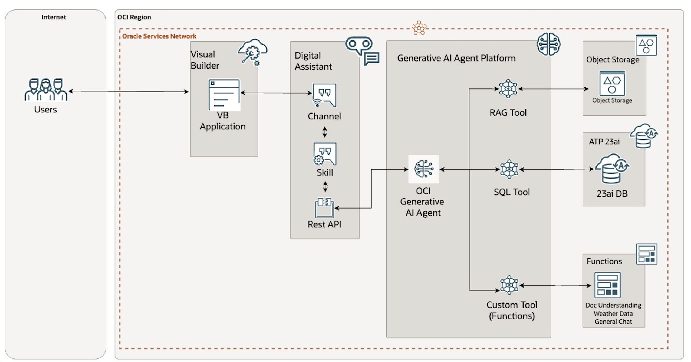

# Introduction

## About this Workshop

Embark on an exciting journey to build and deploy an agentic AI solution using the Oracle Cloud Infrastructure (OCI) AI Agent Framework. In this hands-on LiveLab, you'll explore the power of creating intelligent agents that can revolutionize various industries.
During the lab, you will:
- Understand the fundamentals of the OCI AI Agent Framework and its capabilities.
- Learn how to set up and configure the development environment for building AI agents.
- Create and train an AI agent using natural language processing and machine learning tools provided by OCI.
- Integrate multiple AI tools to enhance the agent's functionality, such as document understanding, llm, and sql queries .
- Deploy and test your agent in a simulated environment, allowing it to interact and respond to user queries.
By the end of this LiveLab, you'll have a solid understanding of building and customizing agentic AI solutions, opening up a world of possibilities for virtual assistants, customer support bots, and smart automation. Get ready to unleash your creativity and harness the power of OCI's AI services.
Remember, this lab is designed to provide a practical, interactive learning experience, so feel free to experiment and explore the potential of agentic AI!

### Objectives
By the end of this lab you will be able to converse with an agent equipped with multiple tool calling capabilities such as general llm chat, get weather, analyze document and more.

* Generative AI Agent - Gen AI Agent Service is fully managed with integrated LLM and tool calling capabilities.
* Digital Assistant - ODA is required to enable chatbot with it's Out Of the Box features and its integration with OCI Gen AI service.
* Visual Builder - VB can be used to embed ODA in a Web Based Application.

In this workshop, you will learn how to: 

* Install, configure & set-up ODA as an LLM powered chatbot
* Install, configure & set-up Visual Builder as a frontend channel for ODA
* Integrate tool calling capabilities such as General Chat (LLM), get weather, and Document Understanding to read documents
* Test out the features and capabilities of ATOM

## Learn More

* [What Is Generative AI? How Does It Work?](https://www.oracle.com/artificial-intelligence/generative-ai/what-is-generative-ai/)
* [Overview of Generative AI Agent Service](https://docs.oracle.com/en-us/iaas/Content/generative-ai-agents/overview.htm#overview)
* [Overview of Digital Assistants and Skills](https://docs.oracle.com/en-us/iaas/digital-assistant/doc/overview-digital-assistants-and-skills.html)
* [Overview of Visual Builder](https://docs.oracle.com/en-us/iaas/visual-builder/doc/oracle-visual-builder.html)

## Acknowledgements

**Author** 
* **Luke Farley**, Senior Cloud Engineer, NACIE

**Contributors**
* **Kaushik Kundu**, Master Principal Cloud Architect, NACIE

**Last Updated By/Date** - Luke Farley, May 2025
