# Lab 1: Provision and Configure GenAI Agent

## Introduction

This lab will walk through the steps of deploying and configuring a Generative AI Agent with an associated knowledge base.

Estimated Time: 45 minutes

### Objectives

In this lab, you will:
* Confirm the region to use for this workshop.
* Provision GenAI Agent
* Configure RAG Tool for Agent in console UI

### Prerequisites

This lab assumes you have:

* Access to the region used for this workshop
* The IAM permissions listed in **Preparing Your Tenancy** in the workshop introduction when using your own tenancy. The LiveLabs sandbox already has the required policies.

> **Sandbox note:** The LiveLabs sandbox includes optional sample documents in a pre-provisioned bucket. They are not used by this workshop. Create a separate bucket and upload the design-considerations document in Tasks 2 and 3; do not change the pre-provisioned bucket or its contents.

## Task 1: Confirm Your Workshop Region

If you are using the LiveLabs green button environment, use the region where the green button pre-provisioned your workshop resources. This is often **US East (Ashburn)**, but use the region assigned to your environment even if it is different. Create the bucket, knowledge base, and agent in that same region so they can work with the pre-provisioned resources used in Lab 2.

1. In the OCI Console, open the **Regions** menu at the top right.

    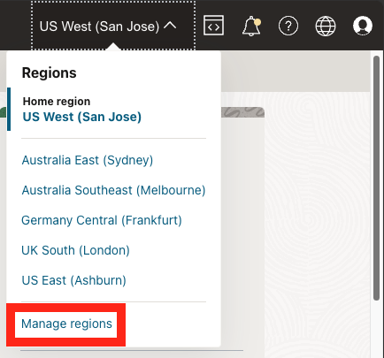

1. If you are using LiveLabs, select the region containing the pre-provisioned Autonomous Database, Vault, and Database Tools connection. Check the workshop environment details if you are unsure which region was assigned. Keep this region selected throughout both labs.

    If you are using your own tenancy, select **US Midwest (Chicago)**. If Chicago is not listed, ask your tenancy administrator to subscribe to it before continuing.

## Task 2: Provision Oracle Object Storage Bucket

Create your own Object Storage bucket in the workshop compartment and region for the RAG tool. In the LiveLabs environment, the green button also pre-provisions a `knowledge-base-articles` bucket. Leave that bucket and its contents unchanged; use the new bucket you create in this task for the rest of Lab 1.

1. Locate Buckets under Object Storage & Archive Storage

    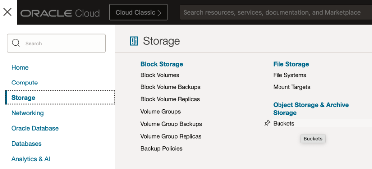

2. Select **Create bucket**. Provide the **Compartment** and a **Bucket Name** for your own bucket, keep its visibility **Private**, and click **Create**.

    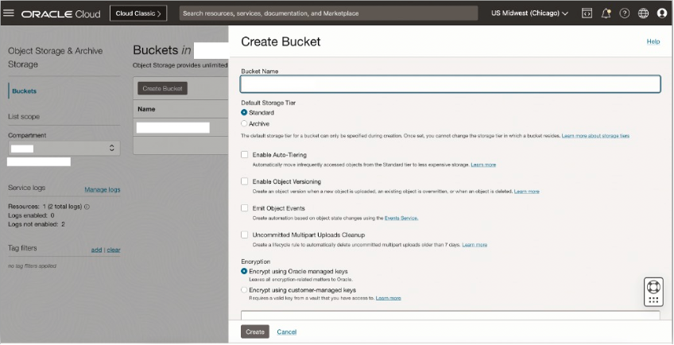

    The example below shows the green button's pre-provisioned `knowledge-base-articles-239045` bucket alongside a separate `multi-tool-bucket` created for this workshop. Your bucket names may differ. Use the bucket you created in the next tasks.

    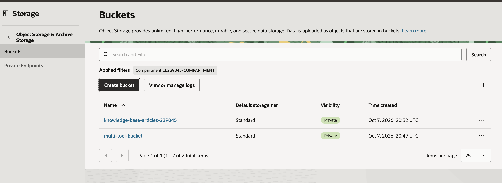

## Task 3: Upload PDF Document(s) to the Object Storage Bucket

1. Click on the Bucket name, then Objects -> Upload button

    Click on “select files” link to select files from your machine. This step can be repeated to select multiple files to upload to the bucket.

    **Note:** For this workshop, upload a PDF or text document that you are permitted to use as a RAG source.

    You can use the sample PDF, [Design Considerations for GenAI Apps](https://objectstorage.us-chicago-1.oraclecloud.com/p/D5X4v88ZpEJ82ui8OrlrRQDkuLU0775OpiXl8tYOALLw6v9imMssIc0KovdN_qKB/n/idb6enfdcxbl/b/Livelabs/o/atom-multi-tool-livelab/Design%20Considerations%20for%20GenAI%20Apps.pdf). If that link is unavailable, upload a PDF or text document you are authorized to use instead.

    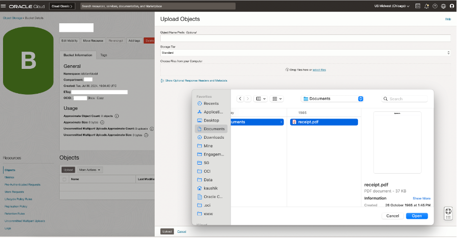

2. Click Upload -> Close to upload the PDF file in the Object Storage Bucket. Before creating the knowledge base, confirm that the uploaded PDF appears on the **Objects** page of the bucket you created in Task 2.

    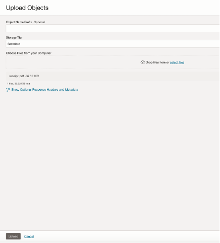

## Task 4: Provision Knowledge Base

This task will help you to create Oracle Generative AI Agent’s Knowledge Base under your chosen compartment.

1. Locate Generative AI Agents under AI Services

    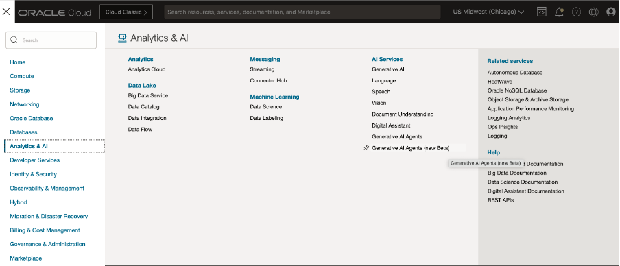

2. Locate Knowledge Bases in the left panel, select the correct Compartment.

    Then click on “Create knowledge base” button

    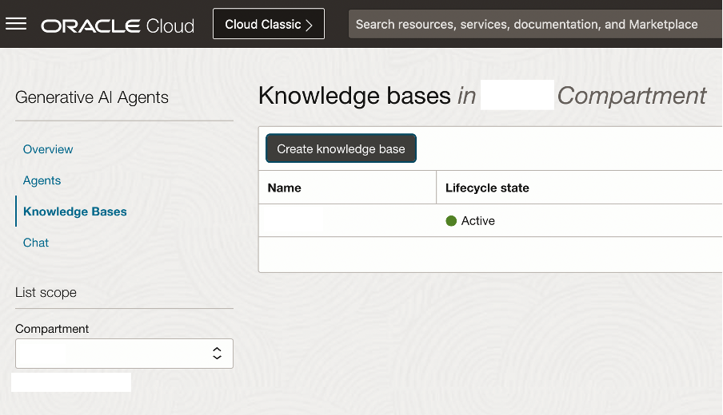

3. Specify the name of the knowledge base, ensure that you have selected the correct compartment.

    Select “Object storage” in the “Select data source” dropdown, and then click on the “Specify data source” button

    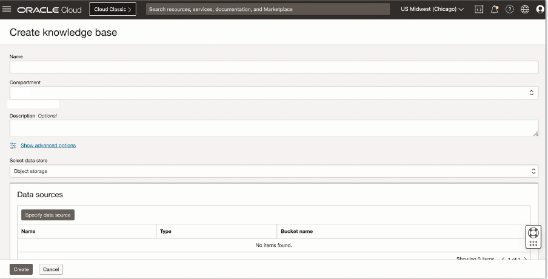

4. Specify the name of the data source and Description (optional).

    Select the workshop compartment and the private bucket you created in Task 2. Turn on **Select all in bucket**.

    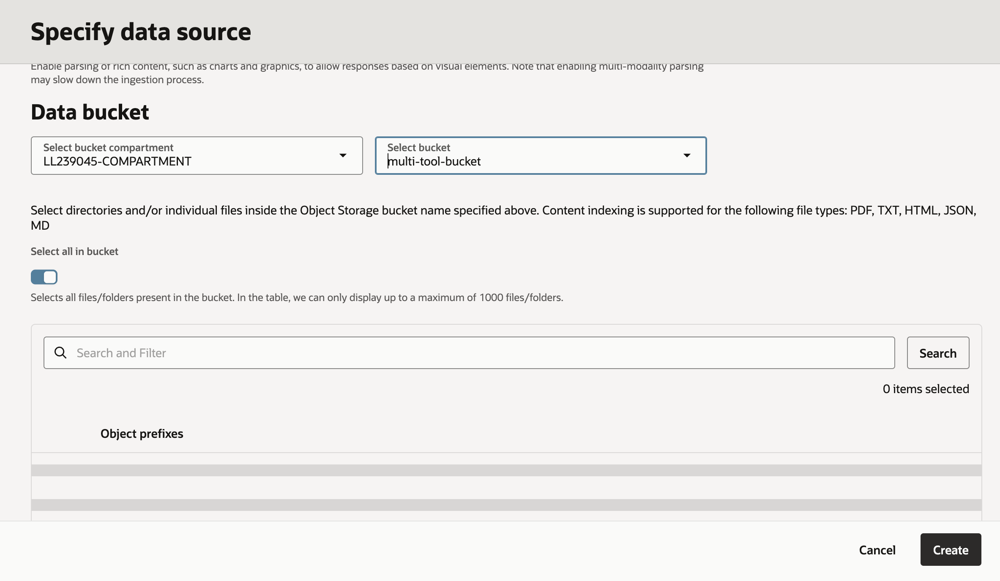

    > **Important:** Select only the bucket you created for this workshop and uploaded the **Design Considerations for GenAI Apps** PDF to in Task 3. Do not select the pre-provisioned sandbox bucket or its documents. Selecting the wrong bucket can require another ingestion run, which might not finish during the event.

    The object list may continue loading after you select the bucket. Once the correct bucket name is shown and **Select all in bucket** is on, click **Create** without waiting for the list to finish loading.

5. Click the “Create” button to create the knowledge base

    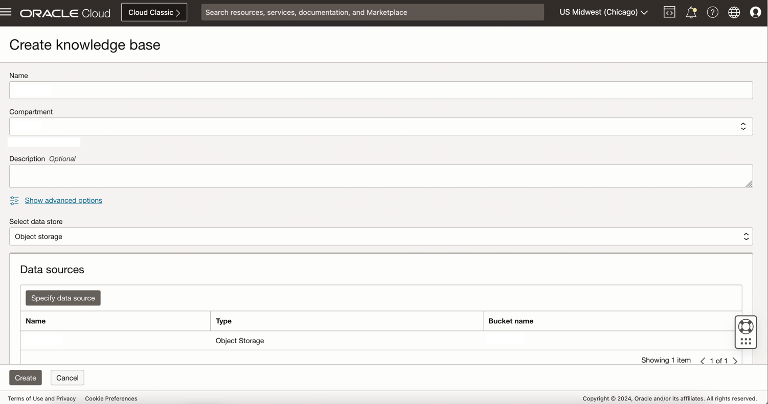

6. The new Knowledge Base may initially show **Creating**. You can continue to Task 5 and attach it to the RAG tool while it is still provisioning.

    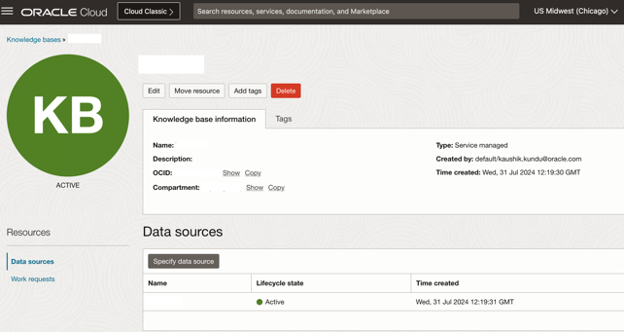

7. Open the data source and start or review its ingestion job. Processing can take up to 30 minutes. Wait until the Knowledge Base is **Active**, ingestion completes successfully, and the uploaded document is listed as ingested before testing the RAG tool. If ingestion fails, review the policy reference in the workshop introduction or contact your tenancy administrator.

    > **If you selected the wrong bucket:** Open the data source, select **Edit**, select the workshop bucket from Task 2, and save the change. Saving the updated data source starts a new ingestion job. Do not create a second knowledge base unless directed by an instructor.

## Task 5: Provision GenAI Agent

This task will help you to create Oracle Generative AI Agent under your chosen compartment.

1. Locate Agents in the left panel, select the correct Compartment.

    Then click on “Create agent” button

    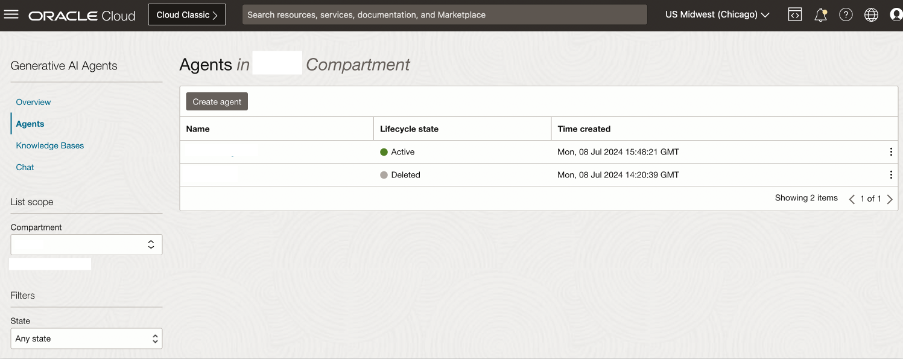

2. Specify the agent name, ensure the correct compartment is selected and indicate a suitable welcome message

    Select Add tool > Choose RAG tool

    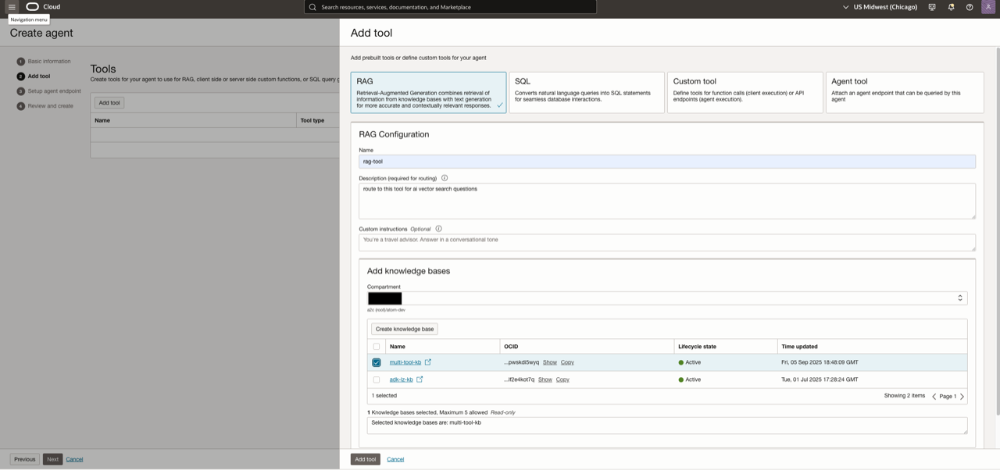

    Select the Knowledge Base that you created in the previous task. You can attach it even if it is still provisioning. For the RAG tool description, use: **Tool to answer questions about design considerations for GenAI apps.** Providing the Welcome message is optional.

    Click the “Create” button.

    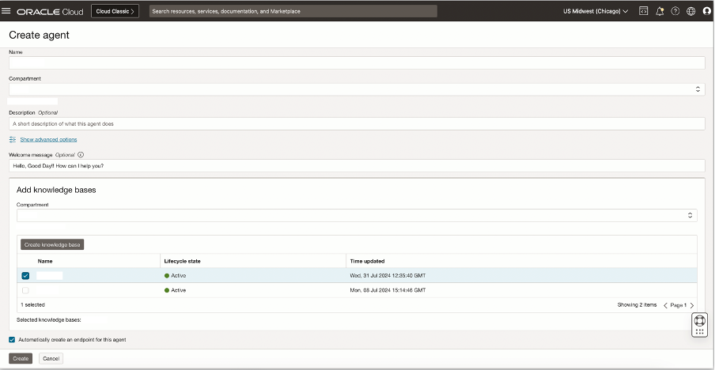

    > **Note** The other agent tools will be configured in the next lab.

3. In few minutes the status of recently created Agent will change from Creating to Active

    Click on “Endpoints” menu item in the left panel and then the Endpoint link in the right panel.

    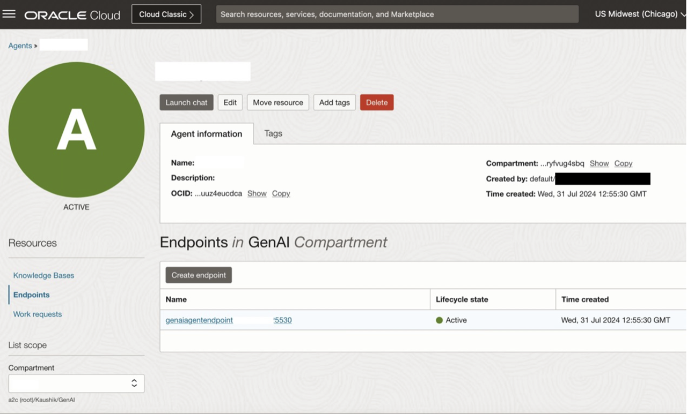

4. It’ll open up the Endpoint Screen. Click on “Launch chat” button.

    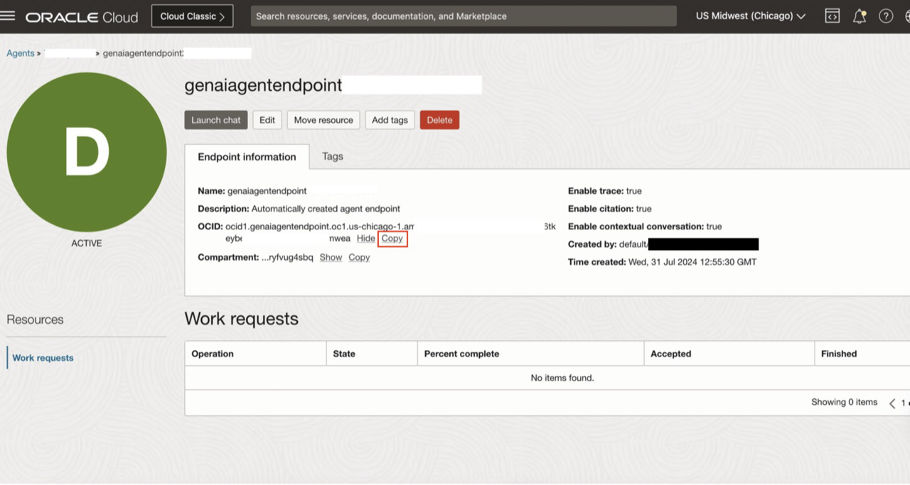

5. Once the Knowledge Base is **Active** and its document ingestion has completed, open the Chat Playground to ask questions in natural language and get responses from your PDF document.

    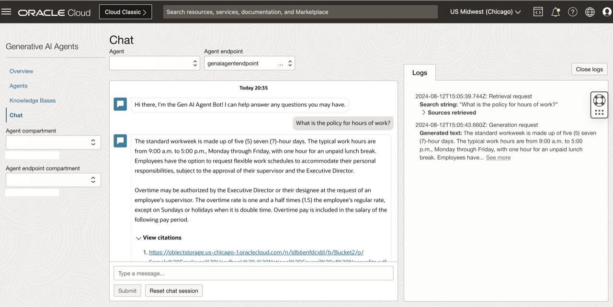

6. You may now **proceed to the next lab**

## Learn More

* [Region subscription](https://docs.oracle.com/en-us/iaas/Content/Identity/Tasks/managingregions.htm#ariaid-title7)
* [Managing Dynamic Groups](https://docs.oracle.com/en-us/iaas/Content/Identity/Tasks/managingdynamicgroups.htm)

## Acknowledgements

**Authors**
* **Luke Farley**, Senior Cloud Engineer

**Contributors**
* **Kaushik Kundu**, Master Principal Cloud Architect
* **JB Anderson**, Senior Cloud Engineer
* **Abhinav Jain**, Senior Cloud Engineer
* **Lyudmil Pelov**, Lyudmil Pelov, Senior Principal Product Manager
* **Yanir Shahak**, Senior Principal Software Engineer
* **Ale Casas**, Senior Principal Product Marketing
* **Raj Arora**, Master Principal Analytics Cloud Architect

**Last Updated By/Date:**
* **Luke Farley**, Senior Cloud Engineer, October 2026
