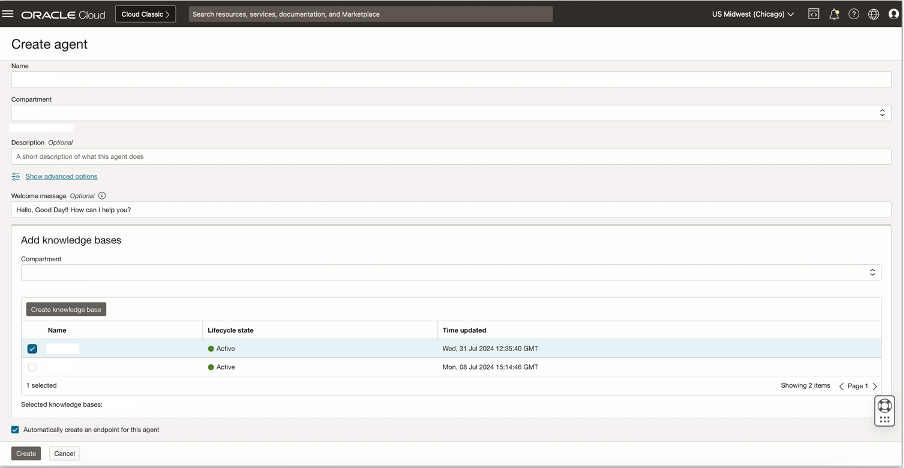
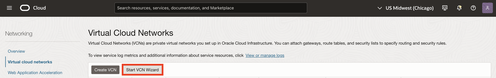

# Lab 1: Provision and Configure GenAI Agent

## Introduction

This lab will walk through the steps of writing access policies to the agent service, deploying and configuring a Generative AI Agent, and deploying a function application. 

The following agent tools will be configured: 
* General LLM Chat
* Document Understanding
* Weather
* RAG 
* SQL

Estimated Time: 120 minutes

### Objectives

In this lab, you will:
* Make sure that our tenancy is subscribed to the Chicago region.
* Create the required permissions for us to be able to use the service in our tenancy.
* Provision GenAI Agent
* Configure Tools for Agent in console UI
* Provision Functions Application

### Prerequisites (Optional)

This lab assumes you have:

* Access to the Chicago Region
* Administrator permissions or permissions to use the Generative AI Agents, Digital Assistant, Functions, Visual Builder and Identity Domains

## Task 1: Ensure Chicago region subscription

The OCI Generative AI Agents service is currently only available in the Chicago region.
If your tenancy is already subscribed to the Chicago region, please skip to the next task.

1. On the top right, click the Regions drop down menu.

  

1. Review the list of regions your tenancy is subscribed in. If you find the **US Midwest (Chicago)** region in the list, please skip to the next task.

1. Click the Manage Regions link at the bottom of the list.

1. In the **Infrastructure Regions** list, locate the **US Midwest (Chicago)** region and click the subscribe button to it's right.

  > **Note:** When you subscribe to a region, you cannot unsubscribe from it.

  

1. Click the **Subscribe** button at the bottom of the **Subscribe to New Region** dialog.

  

The operation might take a few minutes to complete. When complete, the new region will appear on the **US Midwest (Chicago)** will appear in the **Regions** drop down menu on the main screen.

## Task 2: Create access policies

In this task, we are going to create policies which will grant us access to the OCI Generative AI Agents service as well as the Object Storage service.
We will use Object Storage to store the dataset required for this workshop.

First, we are going to create a dynamic group which will allow us to grant access to the OCI Generative AI Agent service to the dataset uploaded to Object Storage.

1. Click the navigation menu on the top left.

1. Click **Identity & Security**.

1. Click **Domains**.

  

1. Under the **List scope**, make sure that the **root** compartment is selected.

1. Click the **Default** domain from the **Domains** table.

  

1. On the left click **Dynamic Groups**.

1. Click thd **Create dynamic group** button at the top of the **Dynamic groups** table.

  

1. Name the dynamic group (example: oci-generative-ai-agents-service)

1. Provide an optional description (example: This group represents the OCI Generative AI Agents service)

1. Select the **Match all rules defined below** option in the **Matching rules** section.

1. Enter the following expression in the **Rule 1** textbox:

    ```text
    <copy>
    all {resource.type='genaiagent'}
    </copy>
    ```

  

Next, we will create the access policies:

1. Click **Identity & Security**.

1. Click **Policies**.

  

1. On the left under **List scope**, select the root compartment. The root compartment should appear first in the list, have the same name as the tenancy itself and have the text **(root)** next to it's name.

1. Click the **Create Policy** button on the top left of the **Policies** table.

  

1. Provide a name for the policy (example: oci-generative-ai-agents-service).

1. Provide a description (example: OCI Generative AI Agents CloudWorld 2024 Hands-On-Lab Policy).

1. Make sure that the root compartment is selected.

1. Enable the **Show manual editor** option.

1. In the policy editor, enter the following policy statements:

  ```text
  <copy>
  allow group <your-user-group-name> to manage genai-agent-family in tenancy
  allow group <your-user-group-name> to manage object-family in tenancy
  allow dynamic-group <dynamic-group-name-created-above> to manage all-resources in tenancy
  </copy>
  ```

  Make sure to replace `<your-user-group-name>` with the user group your user is associated with (for example: `Administrators`).
  Also, please replace `<dynamic-group-name-created-above>` with the name you've provided for the dynamic group created above.

  

## Task 3: Verify access to the service

1. On the top right, click the Regions drop down menu.

1. Click the **US Midwest (Chicago)**.

1. Verify that the appears in bold to indicate it is the active region.

  

1. Click the navigation menu on the top left.

1. Click **Analytics & AI**.

1. Click **Generative AI Agents** under **AI Services**.

  If the **Generative AI Agents** service does not appear under **AI Services**, please review previous tasks.

  

## Task 4: Provision Oracle Object Storage Bucket

This task will help you to create Oracle Object Storage Bucket under your chosen compartment. This will be used for the RAG tool.

1. Locate Buckets under Object Storage & Archive Storage

    

2. Provide the information for **Compartment** and **Bucket Name**. Click Create.
    The Object Storage Bucket will be created. Keep the visibility of bucket as Private.

    

    <!--TODO: may need object events and may want object versioning -->

## Task 5: Upload PDF Document(s) to the Object Storage Bucket

1. Click on the Bucket name, then Objects -> Upload button

    Click on “select files” link to select files from your machine. This step can be repeated to select multiple files to upload to the bucket.

    **Note:** The Gen AI Agents service currently supports .pdf and .txt file formats

    <!--TODO: should we provide a sample dataset? -->

    

2. Click Upload -> Close to upload the PDF file in the Object Storage Bucket.

    

3. Create a PAR (Pre-Authenticated Request) for your newly created bucket.

    

4. Create this PAR at the bucket level and not the object level. Also, change the expiration date to a future date preferably 4-5 years from now.

    

5. Copy over the PAR URL highlighted in the image below. Please copy over the second URL and not the first one.

    

## Task 6: Provision Knowledge Base

This task will help you to create Oracle Generative AI Agent’s Knowledge Base under your chosen compartment.

1. Locate Generative AI Agents under AI Services

    

2. Locate Knowledge Bases in the left panel, select the correct Compartment.

    Then click on “Create knowledge base” button

    

3. Specify the name of the knowledge base, ensure that you have selected the correct compartment.

    Select “Object storage” in the “Select data source” dropdown, and then click on the “Specify data source” button

    

4. Specify the name of the data source and Description (Optional)

    Select the bucket that you have created in the previous lab, and for Object prefix choose “Select all in bucket”

    Click the “Create” button

    

5. Click the “Create” button to create the knowledge base

    

6. In few minutes the status of recently created Knowledge Base will change from Creating to Active

    

## Task 7: Provision GenAI Agent

This task will help you to create Oracle Generative AI Agent under your chosen compartment.

1. Locate Agents in the left panel, select the correct Compartment.

    Then click on “Create agent” button

    

2. Specify the agent name, ensure the correct compartment is selected and indicate a suitable welcome message

    Select the Knowledge Base that you created in the previous task. Providing the Welcome message is optional.

    Click the “Create” button.

    

3. In few minutes the status of recently created Agent will change from Creating to Active

    Click on “Endpoints” menu item in the left panel and then the Endpoint link in the right panel.

    

4. It’ll open up the Endpoint Screen. Copy and keep the OCID of the Endpoint. It’ll be used later.

   Click on “Launch chat” button

   

5. It’ll open up the Chat Playground, where you can ask questions in natural language, and get the responses from your PDF documents

    


## Task 8: Deploy Function Application
In this section, we will deploy a VCN, OCI Function application, and a serverless Function for invoking the agent service.

1. Create VCN
    - In the cloud console, go to Networking > Virtual Cloud Networks

    

    - Select 'Start VCN Wizard' 

    

    - Choose 'Create VCN with Internet Connectivity' 

    

    - Give your VCN a name and keep the default options 

    

    - Navigate to Review and Create and select 'Create'

3. Create function application using subnet in previous step

    - From the Cloud Console, navigate to Developer Services > Functions > Applications 

    

    - Give your application a name and select the VCN + Subnet you created in the previous step. Also select GENERIC_X86 for shape.

    

## Learn More

* [Region subscription](https://docs.oracle.com/en-us/iaas/Content/Identity/Tasks/managingregions.htm#ariaid-title7)
* [Managing Dynamic Groups](https://docs.oracle.com/en-us/iaas/Content/Identity/Tasks/managingdynamicgroups.htm)

**Authors**
* **Luke Farley**, Senior Cloud Engineer, NACIE

**Contributors**
* **Kaushik Kundu**, Master Principal Cloud Architect, NACIE
* **JB Anderson**, Senior Cloud Engineer, NACIE
* **Abhinav Jain**, Senior Cloud Engineer, NACIE
* **Lyudmil Pelov**, Lyudmil Pelov, Senior Principal Product Manager
* **Yanir Shahak**, Senior Principal Software Engineer

**Last Updated By/Date:**
* **Luke Farley**, Senior Cloud Engineer, NACIE, May 2025
