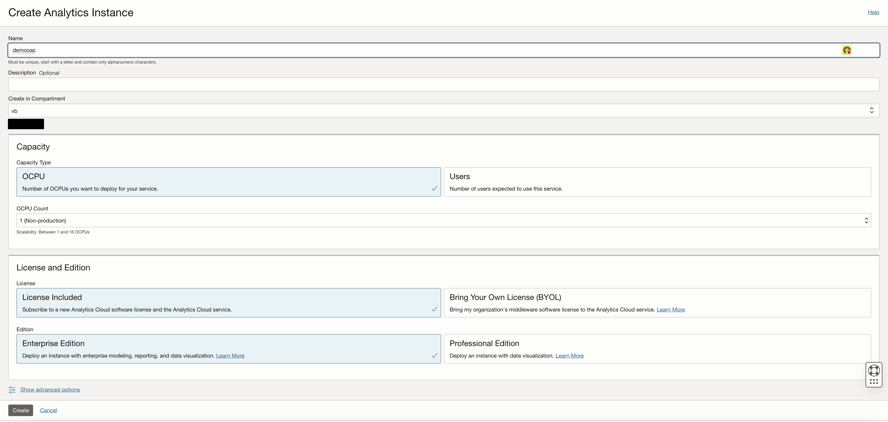
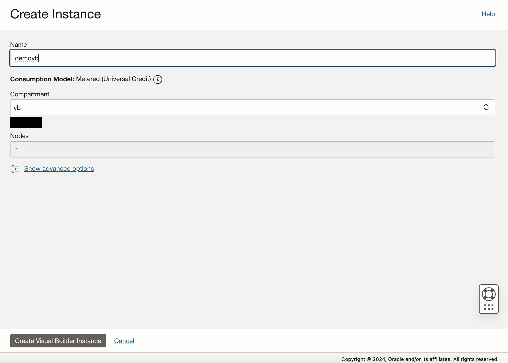
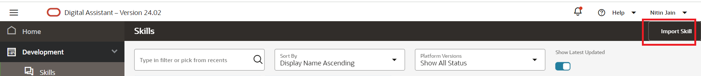
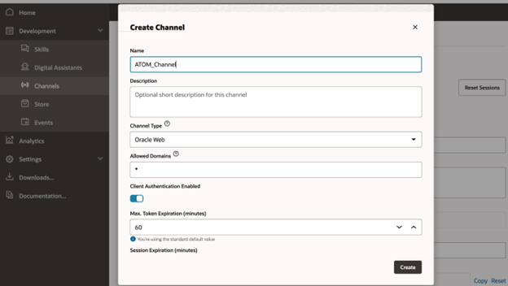

# Configure Visual Builder Application with OAC Charts

## Introduction

This lab will take you through the steps needed to configure a VB application with OAC integration

Estimated Time: 4 hours

### About Visual Builder and Oracle Analytics Cloud 

Oracle Visual Builder and Oracle Analytics Cloud are powerful tools that enable users to quickly and easily develop and deploy cloud-based applications and gain insights from their data. 

Visual Builder provides a visual, drag-and-drop development experience, allowing users to create sophisticated applications without the need for complex coding. With a wide range of pre-built components and templates, users can build and customize applications tailored to their specific needs. 

Oracle Analytics Cloud offers a comprehensive suite of tools for data analysis and visualization. It enables users to explore and understand their data, gain valuable insights, and make data-driven decisions. With self-service capabilities and advanced analytics, organizations can empower their users to discover patterns, predict outcomes, and drive business success. 

Together, Oracle Visual Builder and Oracle Analytics Cloud provide a robust and user-friendly platform for developing applications and deriving valuable insights from data, helping businesses streamline their processes and achieve their goals.

### Objectives

To integrate OAC into a VB application. Please see the VB + OAC block on the right-hand of the architecture diagram below for a better understanding.


### Prerequisites

This lab assumes you have:

* An Oracle Cloud account
* Some experience with OCI
* Administrator permissions or permissions to use Analytics Cloud, Digital Assistant, Visual Builder, and Identity Domains
* (Recommended, not required) Access to the Chicago Region

## Task 1: Provision Oracle Analytics Cloud 

This task will help you to create Oracle Analytics Cloud under your chosen compartment. 

1. Locate Analytics Cloud under Analytics & AI

   

2. Provide the information for **Name**, **Capacity** , **License & Edition**, & **Network Access**. This lab is set up with the following default settings -
    - Capacity Type: OCPU 
        - OCPU Count: 1 (Non-production)
    - License and Edition
        - (Choose your own)
        - Edition: Enterprise
    - Network Access: Public
    - Identity Management 
        - Compartment: root
        - Identity Domain: Default
        - Admin User: (your user)
    - Data Encryption 
        - Encrypt using Oracle-managed Keys
    
    Click **Create**

    

3. In few minutes the status of recently created Analytics Cloud instance will change from **Provisioning** to **Active**

    

## Task 2: Provision Visual Builder Service

This task will help you create a Visual Builder instance in your compartment 

1. Locate Visual Builder under Developer Services

   

2. Provide the information for **Name** & **Nodes**. 
    
    Click **Create**

    

3. In few minutes the status of recently created Visual Builder instance will change from **Provisioning** to **Active**

    

## Task 3: Policy creation for Oracle Analytics Cloud and Visual Builder Access


Click on Create dynamic group and name it as atomDynamicGroup

Select radio button - Match any rules defined below
Add the following rules. Please change the values of OCIDs to your own values here.

Rule 1

```text
    <copy>
    All {instance.compartment.id = '<compartment_ocid>' }
    </copy>
```

Note - This will be ocid of the compartment with the OAC and VB instance

This task will help you to create necessary policy for the API Gateway

1. Attach the policy at the root compartment level. Please change the values of OCIDs to your own values here.

    Fn_Access - Policy to allow dynamic group to access functions
    ```text
        <copy>
        Allow dynamic-group atomDynamicGroup to use fn-invocation in tenancy
        </copy>
    ```

    API-Gateway-Policy - Policy to allow API Gateway to access functions for atom

     ```text
        <copy>
        ALLOW any-user to use functions-family in compartment <compartment-name> where ALL {request.principal.type= 'ApiGateway', request.resource.compartment.id = 'ocid1.compartment.oc1..XXXX'}
        </copy>
    ```

    > **Note:**
    > * Please make sure that the compartmentId should be the one under which the resource is  created.

## Task 4: Configure Oracle Analytics Cloud

## Task 4a: Add Visual Builder as Allowed Origin in Analytics Cloud

## Task 4b: Import Sample Chart 

## Task 5: Configure Visual Builder

## Task 5a: Add OAC Instance as Allowed Origin in Visual Builder

## Task 5b: Import VB App

## Task 7: Import Skill

1. Click on the link to download the required skill (zip file): [Atom Skill DU.zip](https://objectstorage.us-ashburn-1.oraclecloud.com/p/zlXC_E0MVuy2edcz4Zs5GQNTOTy6wVx5ObK3EDNMUVz7ptSUmx90lnA9uj7Dad6V/n/c4u02/b/hosted_workshops/o/ATOM_DU.zip)

2. Import the skill (downloaded). Click on **Import Skill** & select the zip file to import

   

3. Once the skill is imported. Click on the Skill and go to Components as shown in the image below.

    

4. Click on Add Service and give this service a name of your choice. For example - RPlusService. And upload the following .tgz file under Component Service Package Creation Type section. Please make sure to change the CompartmentID and modelID located in Rtransformer.js file in components folder to your own CompartmentID and modelID. So in short, you have to unzip it, change those IDs and zip it again to tgz format. Click to download the file [R_Transformer.tgz](https://objectstorage.us-ashburn-1.oraclecloud.com/p/IZm77Vl42_dHGMca5-8XFpMm8rvAebL44L-7C_mXzVb7KfOrY1G_Uy7Ilqd6Vg9w/n/c4u02/b/hosted_workshops/o/R_Transformer.tgz)

    

5. Click on hamburger menu and locate & click **API Services** under Settings section. Click on LLM Services and Import the following LLM Service as shown in the image below. Please make sure to change the CompartmentID and modelID located in yaml file to your own CompartmentID and modelID. Click to download the file [LLMService-ChatRPlusLLM.yaml](https://objectstorage.us-ashburn-1.oraclecloud.com/p/L3-NZ_Z7sZheGNvgA6hprS4D_5LXTIBN4WKusdq3llb_QtAxvHZLSpBD4KH3HnBK/n/c4u02/b/hosted_workshops/o/LLMService-ChatRPlusLLM.yaml)

    

6. Go to Skills -> Settings -> Configuration -> Large Language Model Services. Click on New LLM Service.

    

7. Provide a name of your choice for this Service. Give LLM Provider value as the one you imported in Step 5. Give Transformation Handler value as the one you imported in Step 4. Click on Check mark under Action to save it as shown in the image below.

    

8. Go to Skills -> Flows. Click on Chat.

    

9. Click on invokeLLM and then click on Component. Select the same LLM Service which was created in Step 7.

    

## Task 5: Changes to Skill

1. Go to Skills -> Settings -> Configuration
Provide a value to da.privateKey (Any Password)

2. Go to Skills -> Flow Designer and make sure there are no errors in documentUnderstandingCC, getSpeechLifecyleState, searchFlow and speechComponent of the flows

## Task 6: Create Channel to embed ODA in Visual Builder Application (provided) or in any custom Web App

1. Click on hamburger menu and select Development > Channels

    

2. Select the following option on the form:

    * **Channel Type** = Oracle Web
    * **Allowed Domain** = *

    

3. After channel creation, enable the Channel by using the toggle button (screenshot).
   * Route it to skill imported in Task 4

   

4. Disable the **Client Authentication Enabled** toggle. (Take note of channelId for **Task 6** in later step).

    

## Task 7: Create VBCS Instance & embed ODA skill in VBCS Application

1. Click on main hamburger menu on OCI cloud console and navigate Developer Services > Visual Builder

    

2. Create Visual Builder Instance by providing the details and click **Create Visual Builder Instance**:
    * **Name** = <name_of_your_choice>
    * **Compartment** = <same_compartment_as_oda>
    * **Node** = <as_per_need>

    

3. Wait for the instance to come to **Active** (green color) status

4. Click on the link to download the VB application (zip file): [ATOM_VB.zip](https://objectstorage.us-ashburn-1.oraclecloud.com/p/UcaJRNLr-UXQ55zFIOdS_rloRYfUSYA49sRGZsBON3ZNYncODcwC1DLdz7Xw4PJd/n/c4u02/b/hosted_workshops/o/ATOM_VB.zip)

5. Import the application in provisioned instance as per the screenshots. Users only need one VCBS instance created. They can import/create multiple applications in the instance for each additional chatbot they have

    * Click on Import from Visual Builder Instance

        

    * Choose the option as below

        

    * Provide the App Name with other details and select the provided application zip file

        

6. Once import is completed, open the index.html file in the VB Instance and update the details as follows:

    * **URI** = '<https://oda-XXXXXXXXXXXXXXXXXXXXXX.data.digitalassistant.oci.oraclecloud.com/>'
    * **channelId** = 'XXXXXXXXXXXXXXXXXXXXXXXXXXXX'
    * Please change value of initUserHiddenMessage on Line 32 from 'what can you do' to 'Hello'

    

    > **Note**
    > * URI is the hostname of ODA instance provisioned in **Task 1**
    > * channelId is created during **Task 5** - **Step 3**

7. The UI of the chatbot such as theme, color and icon can be changed by modifying the parameters under var chatWidgetSetting from index.html

8. Click on the Play button shown in the above image on the top right corner to launch ATOM chatbot and start chatting with ATOM.

9. You may face an issue when you go to publish the live link of the application. It may throw a "forbidden" error. The solution is to remove the "Admin" and "User" role in the JSON tab from all the vb pages - main-start, main-embedded-chat, and the shell page as shown in the image below.

    

## Acknowledgements

**Authors**
* **Luke Farley**, Staff Cloud Engineer, NACIE
