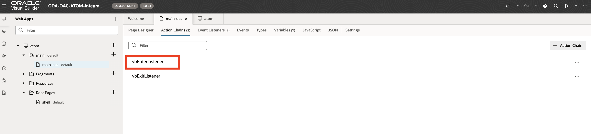

# Configure Visual Builder Application with OAC Charts

## Introduction

This lab will take you through the steps needed to configure a VB application with OAC integration

Estimated Time: 2 hours

### About Visual Builder and Oracle Analytics Cloud 

Oracle Visual Builder and Oracle Analytics Cloud are powerful tools that enable users to quickly and easily develop and deploy cloud-based applications and gain insights from their data. 

Visual Builder provides a visual, drag-and-drop development experience, allowing users to create sophisticated applications without the need for complex coding. With a wide range of pre-built components and templates, users can build and customize applications tailored to their specific needs. 

Oracle Analytics Cloud offers a comprehensive suite of tools for data analysis and visualization. It enables users to explore and understand their data, gain valuable insights, and make data-driven decisions. With self-service capabilities and advanced analytics, organizations can empower their users to discover patterns, predict outcomes, and drive business success. 

Together, Oracle Visual Builder and Oracle Analytics Cloud provide a robust and user-friendly platform for developing applications and deriving valuable insights from data, helping businesses streamline their processes and achieve their goals.

### Objectives

The objective is to integrate OAC into a VB application. Please see the VB + OAC block on the right-hand of the architecture diagram below for a better understanding.


### Prerequisites

This lab assumes you have:

* An Oracle Cloud account
* Some experience with OCI
* Administrator permissions or permissions to use Analytics Cloud, Digital Assistant, Visual Builder, and Identity Domains
* (Recommended, not required) Access to the Chicago Region

## Task 1: Provision Oracle Analytics Cloud 

This task will help you to create Oracle Analytics Cloud under your chosen compartment. 

1. Locate Analytics Cloud under Analytics & AI

   

2. Provide the information for **Name**, **Capacity** , **License & Edition**, & **Network Access**. This lab is set up with the following default settings -
    - Capacity Type: OCPU 
        - OCPU Count: 1 (Non-production)
    - License and Edition
        - (Choose your own)
        - Edition: Enterprise
    - Network Access: Public
    - Identity Management 
        - Compartment: root
        - Identity Domain: Default
        - Admin User: (your user)
    - Data Encryption 
        - Encrypt using Oracle-managed Keys
    
    Click **Create**

    

3. In few minutes the status of recently created Analytics Cloud instance will change from **Provisioning** to **Active**

    

## Task 2: Provision Visual Builder Service

This task will help you create a Visual Builder instance in your compartment 

1. Locate Visual Builder under Developer Services

   

2. Provide the information for **Name** & **Nodes**. 
    
    Click **Create**

    

3. In few minutes the status of recently created Visual Builder instance will change from **Provisioning** to **Active**

    

## Task 3: Policy creation for Oracle Analytics Cloud and Visual Builder Access


Click on Create dynamic group and name it as atomDynamicGroup

Select radio button - Match any rules defined below
Add the following rules. Please change the values of OCIDs to your own values here.

Rule 1

```text
    <copy>
    All {instance.compartment.id = '<compartment_ocid>' }
    </copy>
```

Note - This will be ocid of the compartment with the OAC and VB instance

This task will help you to create necessary policy for the API Gateway

1. Attach the policy at the root compartment level. Please change the values of OCIDs to your own values here.

    Fn_Access - Policy to allow dynamic group to access functions
    ```text
        <copy>
        Allow dynamic-group atomDynamicGroup to use fn-invocation in tenancy
        </copy>
    ```

    API-Gateway-Policy - Policy to allow API Gateway to access functions for atom

     ```text
        <copy>
        ALLOW any-user to use functions-family in compartment <compartment-name> where ALL {request.principal.type= 'ApiGateway', request.resource.compartment.id = 'ocid1.compartment.oc1..XXXX'}
        </copy>
    ```

    > **Note:**
    > * Please make sure that the compartmentId should be the one under which the resource is  created.

## Task 4: Configure Oracle Analytics Cloud

### Task 4a: Add Visual Builder as Allowed Origin in Analytics Cloud

1. Navigate to your Analytics Cloud instance and select the "Analytics Home Page" button

    

2. Navigate to the console in the navigation bar 

    

3. Select "Safe Domains" 

    

4. Open a new tab and navigate to the Visual Builder instance you created in Task 2 
    - Take note of the root domain when you open the home page 
        - e.g. https://<your-vb>-<tenancy>.builder.<region>.ocp.oraclecloud.com

5. Add the new safe domain from the previous step and make sure to check "Allow Frames" and "Embedding"

    

### Task 4b: Import Sample Charts 

1. Return to home and select 'Create' at the top right > Create a new dataset

    

2. Import the following file 

    - [Sample Employees](https://idb6enfdcxbl.objectstorage.us-chicago-1.oci.customer-oci.com/n/idb6enfdcxbl/b/Excel-Chicago/o/Livelabs%2Foac-vb-charts%2FSample%20Employees.xlsx)

3. From the OAC Dashboard, select the three dots next to 'Create' > Import Workbook

    

    Import the following file 

    - [Sample Employee Barchart](https://idb6enfdcxbl.objectstorage.us-chicago-1.oci.customer-oci.com/n/idb6enfdcxbl/b/Excel-Chicago/o/Livelabs%2Foac-vb-charts%2FSample%20Employee%20Barchart.dva)

    Note: Make sure to save the workbook to the 'Shared' directory in the Catalog. Saving to your personal folder can cause issues displaying the charts in visual builder. 

4. Open the imported workbook and select edit

    
    
    - Once in edit select developer mode 

    

    - Copy the canvas and script tags under the 'Embed' tab 

    

    - Open the JSON tab and take note of the XSA expression for departments. Your expression should have your name. This will be required later to configure the VB app

    

5. From the OAC Dashboard, import another workbook 

    [Sample Employee 80/20 chart](https://idb6enfdcxbl.objectstorage.us-chicago-1.oci.customer-oci.com/n/idb6enfdcxbl/b/Excel-Chicago/o/Livelabs%2Foac-vb-charts%2FSample%20Employee%2080_20%20Workbook.dva)

    - As in the previous step, open the new workbook in developer mode and take note of canvas and script tags

## Task 5: Configure Visual Builder

1. Open your Visual Builder Instance

2. Go to Settings and add your OAC instance root domain to allowed origins 

    

3. Download the following VB application

    [VB-OAC-Integration](https://idb6enfdcxbl.objectstorage.us-chicago-1.oci.customer-oci.com/n/idb6enfdcxbl/b/Excel-Chicago/o/Livelabs%2Foac-vb-charts%2FVB_OAC_ATOM_Integration-1.0.24.zip)

4. Import the downloaded app in your VB instance by selecting 'Import' at the top right  

    

5. Open the application and expand the web app atom > main > main-oac
    - In the structure tab select the 'Oracle Analytics Project' to open its properties 
    - Add your own OAC host and project path to your OAC workbook as described in step 4b-4 
        - Also make sure the display tab reflects your own OAC workbook tab 

    

6. Import your second chart using the same steps in step 5
    - In the structure tab select the second 'Oracle Analytics Project' to open its properties
    - Add the same OAC host, with the other project path to the second OAC workbook as described in 4b-5 (80/20 chart)

7. Open the action chain for the vbEnterListener 

    

8. Make sure the filter sColFormula matches the XSA expression noted in OAC Configuration Step 4b-4

    

9. If configured correctly, you should be able to see the chart in the VB preview 
    - You can refresh the preview by selecting the refresh icon below 

    

    Note: If you cannot see the chart, double check the OAC host, Project Path, and Display tab are correct in the OAC component; Also double check the Allowed Origins in both OAC and VB instances are correct, as well as making sure you saved your chart to a shared directory in OAC.

10. Stage the application

    

    Note: You might still get some errors here since this app is dependent on the user prompt message at runtime. If you can see the chart, you should be able to proceed. 

11. Publish the application
    - The publish option will only appear once staged. 

    

    - Take note of the live url of the application for the next lab. 

You are now ready to proceed to the next lab. 

## Acknowledgements

* **Author** - Luke Farley, Staff Cloud Engineer, NACIE
* **Contributor** - Jadd Jennings, Principal Cloud Architect, NACIE
* **Contributor** - Kaushik Kundu, Master Principal Cloud Architect, NACIE