# Expose digital assistant skill as visual builder application

## Introduction

Exposing an Oracle Digital Assistant (ODA) skill as a Visual Builder Application enhances the user experience and extends functionality. With Visual Builder, create a rich, interactive interface, providing an engaging way to interact with your skill. 

Design a custom UI, incorporating visual elements and dynamic content for a more intuitive and natural user experience. Exposing your skill as a Visual Builder Application also offers cross-channel accessibility, making it accessible as a web application and conversational interface. 

Integrating your ODA skill with Visual Builder allows users to interact seemlessly with OAC charts by leveraging the Oracle Web SDK.

Estimated Lab Time: 1 hour 

### Objectives

In this lab, you will:
* Create a new VB Application to host your ODA Skill
* Allow Users to interact with your skill
* Enable UI Customization for your users

### Prerequisites (Optional)

This lab assumes you have:
* An Oracle Cloud account
* All previous labs successfully completed
* Administrator permissions or permissions to manage & use Visual Builder, Digital Assistant

## Task 1: Add Yourself to the Application Role in OAC

1. Navigate to Identity & Security > Domains from the cloud console 

    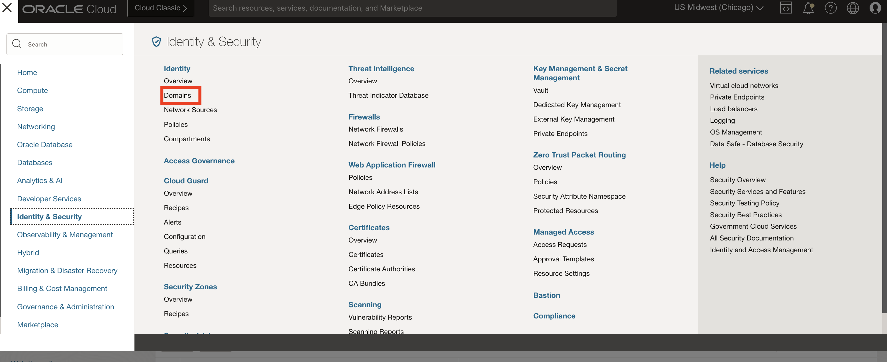

2. Select your domain e.g. Default 

3. Select "Cloud Services" 

    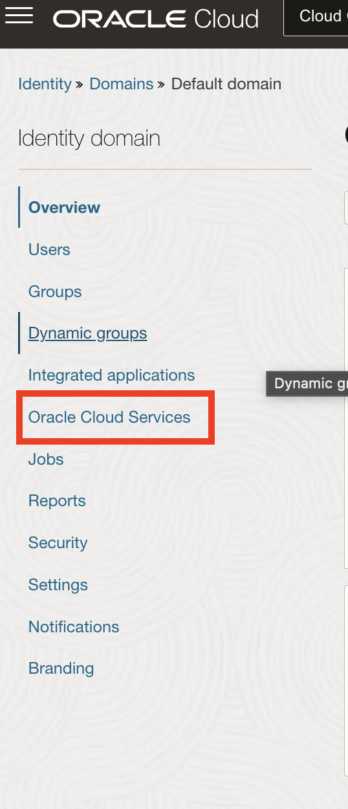

4. Navigate to your OAC instance > application roles

    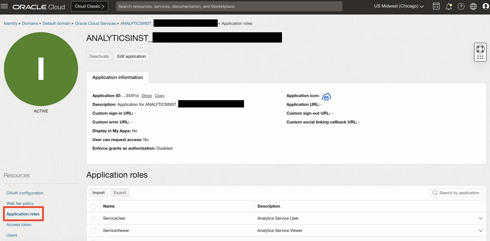

5. Expand the Service Administrator role and select 'Manage' next to assigned users 

6. Select 'Show available users', search for your name, then add yourself to the role 

    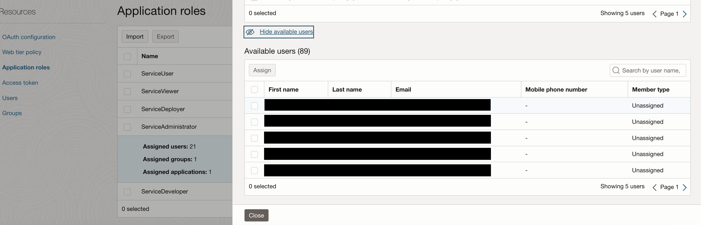

## Task 2: Expose your ODA OAC Skill as a Channel

1. Open your ODA instance and navigate to Development > Channels

    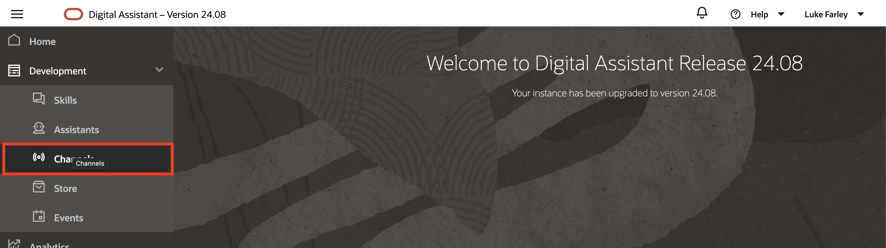

2. Select 'Add Channel' 

    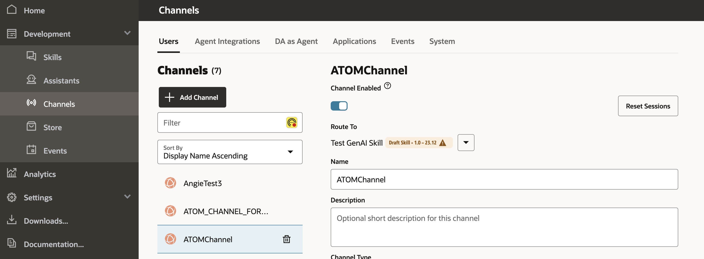

3. Give your channel a name and disable client auth, set allowed domains to '*', then create 

    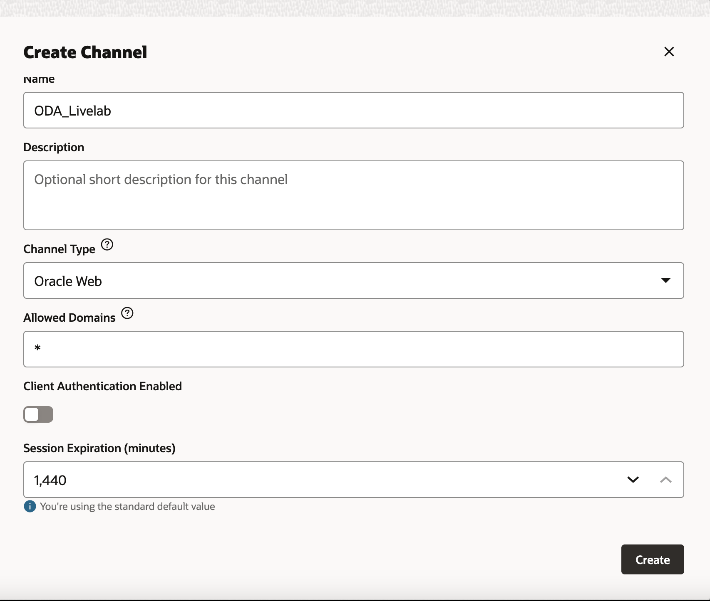

4. When the channel is created, make sure it's enabled and take note of the channel id 

    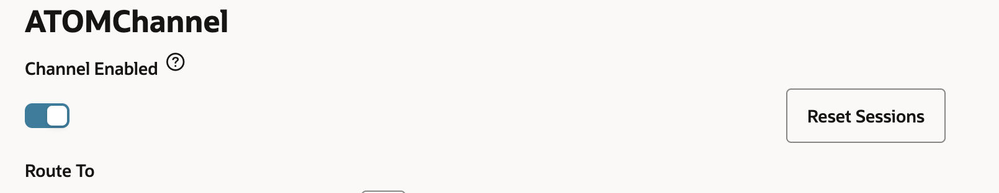
    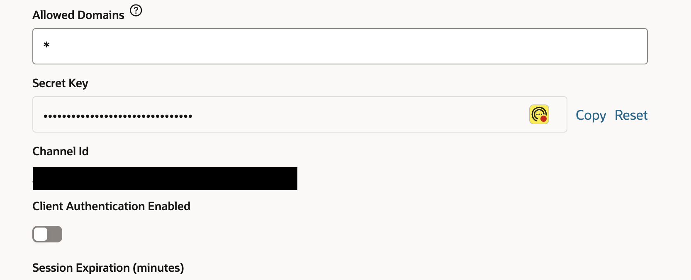

You are now ready to expose the channel in Visual Builder.

## Task 3: Import Sample Application in Visual Builder

0. In settings, add your ODA instance base url to your allowed origins

    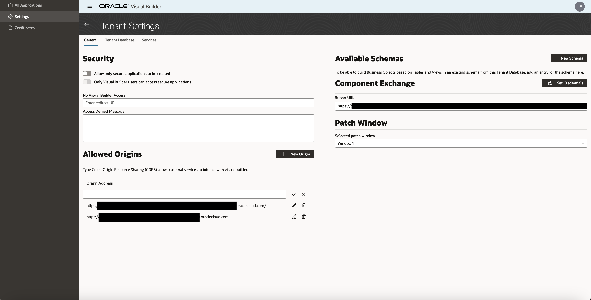

1. Download the following VB application

    [ODA VB App](https://idb6enfdcxbl.objectstorage.us-chicago-1.oci.customer-oci.com/n/idb6enfdcxbl/b/Excel-Chicago/o/Livelabs%2Foac-vb-charts%2FATOM_OAC_ODA_LL_VB.zip)

2. Import the app in your visual builder instance > Import from file

    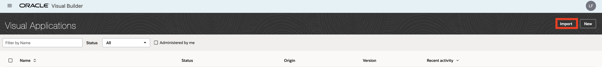

3. Open the application and navigate to web apps > atom > main > main-embedded-chat > Javascript

    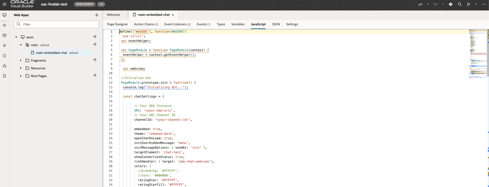

4. Input your ODA instance URI and channel id from Task 1 Step 4 in the respective tags 

5. Open the VB app in preview and check if the application is working as expected 

    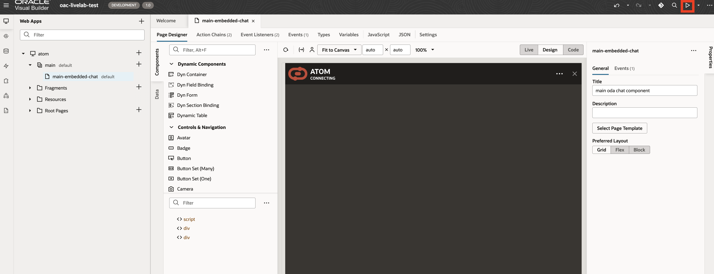

**Note** If you are getting a 404 error when viewing the charts, double check you are assigned the OAC admin application role in step 1.

## Task 4: Publish the Application

1. If the app is working as expected, you can stage and publish the application 

    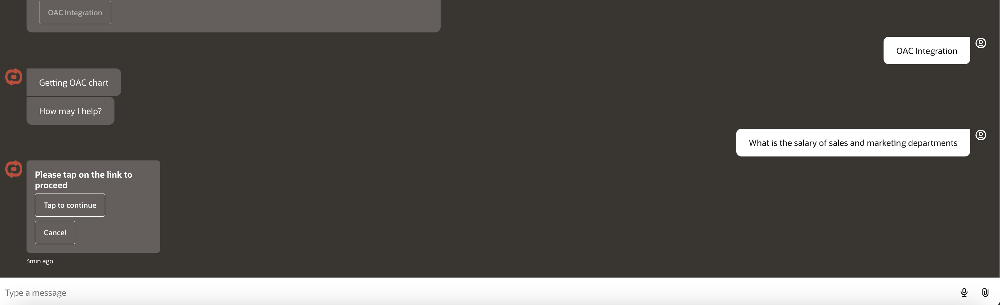

    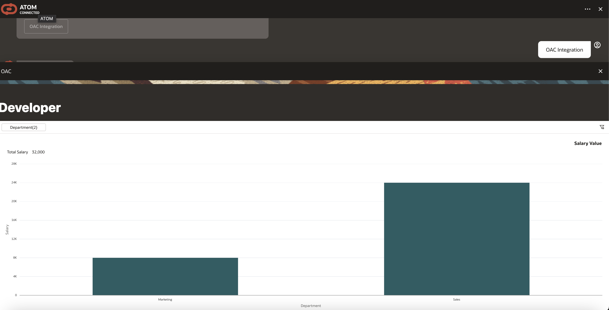

    You can ask questions with different departments to filter the chart

    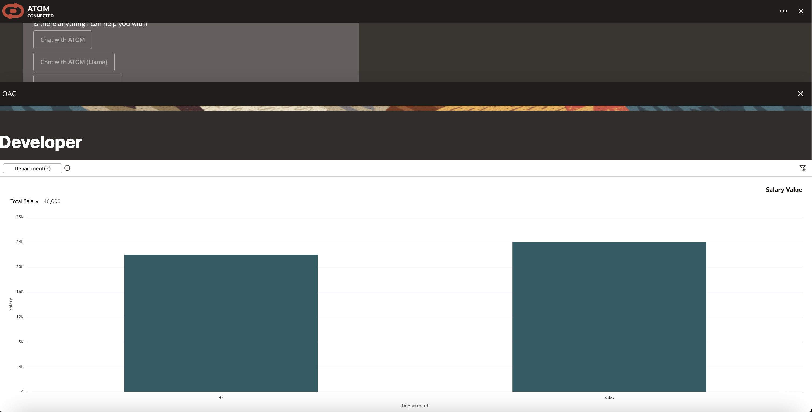

    There is also a manager view which displays a different chart 

    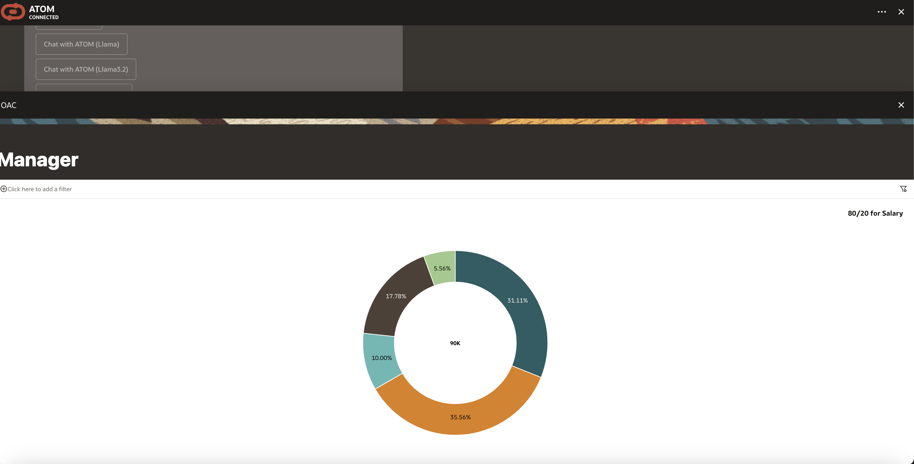

## Acknowledgements
* **Author** - Luke Farley, Staff Cloud Engineer, NACIE>
* **Contributor** - Jadd Jennings, Principal Cloud Architect, NACIE
* **Contributor** -  Kaushik Kundu, Master Principal Cloud Architect, NACIE