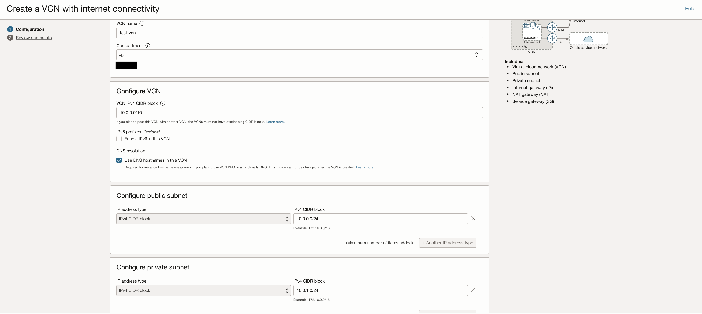
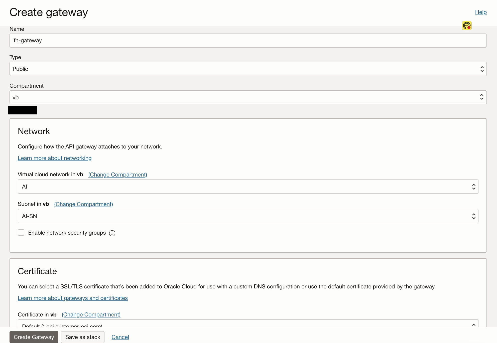

# Expose Visual Builder Application as Webview in ODA

## Introduction

In this technical lab, you will learn how to create a web view in ODA (Oracle Digital Assistant) by linking an Oracle Function to an API Gateway and exposing the API Gateway endpoint as a web interface. 

The first step is to develop an Oracle Function which points to your VB application created in the previous lab, then set up an API Gateway within your Oracle Cloud Infrastructure console. This involves creating a new gateway, configuring routes, and setting up policies to control access and handle requests. You will link this API Gateway to your Oracle Function by specifying the appropriate endpoint and methods. 

Once the API Gateway and Oracle Function are connected, you can expose the API Gateway endpoint as your web view. This step involves configuring the necessary settings in API Gateway to make the endpoint accessible to users. 

By following this lab, you will gain hands-on experience in integrating Oracle Functions with API Gateway to create a seamless and secure web interface for your ODA application. This approach not only enhances the user experience but also provides a scalable and manageable solution for exposing backend functions to end-users. 

Estimated Lab Time: 2 hours 

### Objectives

In this lab, you will:
* Create and deploy an Oracle Function
* Attach the Function to an API Gateway
* Expose the API Gateway Endpoint as a Webview in ODA

Objective of this workshop is to set-up ATOM and its required OCI services. This lab will focus on the middle section of the architecture diagram:


### Prerequisites 

This lab assumes you have:
* An Oracle Cloud account
* All previous labs successfully completed
* The OCI Fn CLI installed and configured
    * See https://docs.oracle.com/en-us/iaas/Content/Functions/Tasks/functionsinstallfncli.htm
* Administrator permissions or permissions to use Functions, API Gateways, and Digital Assistant 

## Task 1: Deploy the necessary infrastructure 

In this section, we will deploy a VCN, an API Gateway for centralized API management, a serverless Functions application for hosting our function, and Oracle Digital Assistant

1. Create VCN
    - In the cloud console, go to Networking > Virtual Cloud Networks

    

    - Select 'Start VCN Wizard' 

    

    - Choose 'Create VCN with Internet Connectivity' 

    

    - Give your VCN a name and keep the default options 

    

    - Navigate to Review and Create and select 'Create'

3. Create function application using subnet in previous step

    - From the Cloud Console, navigate to Developer Services > Functions > Applications 

    

    - Give your application a name and select the VCN + Subnet you created in the previous step. Also select GENERIC_X86 for shape.

    

4. Create API Gateway 

    - From the cloud console, navigate to Developer services > API Management > Gateways 

     

    - Select 'Create Gateway' 

    

    - Give your gateway a name and make sure the type and subnet is public. Click 'Create Gateway' 

    

## Task 2: Create and Deploy a Function as an Intermediary Server 

In this section, we will delve into the process of creating and deploying an Oracle Function. OCI Functions provide a serverless environment, allowing you to focus on your code without worrying about server management. We will guide you through the steps of developing and deploying an OCI Function, which can be a powerful tool for extending your application's capabilities. You will learn how to create a function, configure its settings, and deploy it using the Oracle Cloud Infrastructure console or command-line interface. By the end of this section, you will be ready to connect the function to the API Gateway.

1. Download the sample function

    [fn-oac-oda.zip](https://objectstorage.us-chicago-1.oraclecloud.com/n/idb6enfdcxbl/b/Livelabs/o/oac-vb-charts%2FLivelabs_oac-vb-charts_fn-oda-oac-livelab.zip)

2. Extract the contents and replace the url with the url of your live vb application created in the previous lab 

  

  Note: Make sure to save your file when making changes in your IDE

3. Navigate back to your function application created in Task 1 step 3

4. Select Getting Started > Local setup

    

    - This will give you your specific instructions for: 
        - Setting the context
        - Logging in to the container registry 
        - Deploying the function to your application

   > **Note:** Since we imported the example function file, you don't need to initialize a new fn. Instead, start at step 3. Also make sure to switch into the function directory and/or run the commands from VS code console before running the fn commands.
   

## Task 3: Add your Function as a Route on API Gateway

1. Navigate back to the API Gateway you created in Task 1 Step 4

2. Navigate to 'Deployments' and create a new deployment

    

3. Give your deployment a name and in the CORS section add the following:
    - Allowed Origins: *
    - Allowed headers: Content-Type: application/json
    - Allowed methods: POST 

    

   > **Note:** you can restrict allowed origins if you'd like; this is for demo purposes only.

4. Select 'Next'

5. Keep 'No Auth', select 'Next'

    

6. Create a new route as post and connect your deployed function as the backend 

    

    > **Note:** the route name you give will be needed later to configure the Webview

    - Expand 'Show route request policies and add the following 

    

7. Select 'Next', review the changes then click 'Create'

8. Select the deployment and take note of the endpoint. Append the route name you used in Task 3 Step 6.

    

## Task 4: Provision Oracle Digital Assistant

This task will help you to create Oracle Digital Assistant under your chosen compartment.

1. Locate Digital Assistant under AI Services

   

2. Provide the information for **Compartment**, **Name** , **Description** (optional) & **Shape**. Click **Create**

    

3. In few minutes the status of recently created Digital Assistant will change from **Provisioning** to **Active**

    

> **Note:** Once provisioned, take note of the base web url. This will be used in later labs. 

## Task 5: Dynamic Group & Policy creation for Oracle Digital Assistant

This task will help you to create desired dynamic group & necessary policy for the Oracle Digital Assistant

1. Attach the policy at the root compartment level. Please change the values of OCIDs to your own values here.

    Add policies for managing OAC, VB, API Gateway, Functions
    - Go to Identity & Security > Identity > Policies
    - Create new policy
    - Add the following rules 

    ```text
    <copy>
    ALLOW any-user to use functions-family in compartment <compartment-name> where ALL {request.principal.type= 'ApiGateway', request.resource.compartment.id = '<compartment-id>'}
    </copy>

    # Full manage permissions for OAC (Create, View, Update, Delete, Scale, Start, Stop...)
    <copy>
    allow group <group> to manage analytics-instances in tenancy
    allow group <group> to manage analytics-instance-work-requests in tenancy
    </copy>

    # Full manage permissions for Visual Builder
    <copy>
    allow group <admin_group> to manage visualbuilder-instance in compartment  <compartmentId>
    </copy>

    # Access for Dynamic Group 
    <copy>
    Allow dynamic-group <dynamic-oda-group> to use fn-invocation in tenancy
    </copy>
    ```

    > **Note:**
    > * Please make sure that the compartmentId should be the one under which the resource is  created.

## Task 6: Configure Webview in ODA 

1. Navigate to your Digital Assistant instance  

2. Open the service homepage 

3. Once on the homepage, navigate to Development > Skills then select 'Import Skill' 

    

4. Download and import the following skill 

    [OAC Skill](https://objectstorage.us-chicago-1.oraclecloud.com/n/idb6enfdcxbl/b/Livelabs/o/oac-vb-charts%2FLivelabs_oac-vb-charts_OAC_Livelab_Skill.zip)

5. Once imported, open the skill and navigate to components > webview
    

6. Create a new webview with the Service Hosted radio button turned off, and add the endpoint url for your API endpoint crafted in Task 3 Step 8 

    

7. Navigate to the skill flow and select the webview component 

    

8. Select the new webview you created and make sure the webview component service is using your new webview 

    


You are now ready to move on to the final lab, which will expose your skill on a Visual Builder Application for users.

## Acknowledgements
* **Author** - Luke Farley, Staff Cloud Engineer, NACIE
* **Contributor** - Jadd Jennings, Principal Cloud Architect, NACIE
* **Contributor** -  Abhinav Jain, Senior Cloud Engineer, NACIE
* **Contributor** -  Kaushik Kundu, Master Principal Cloud Architect, NACIE