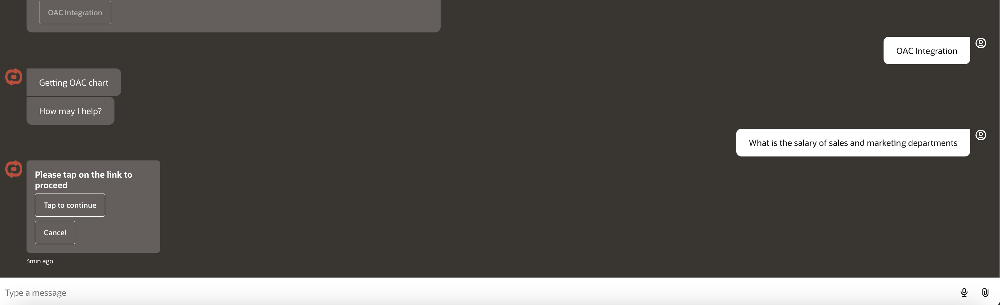
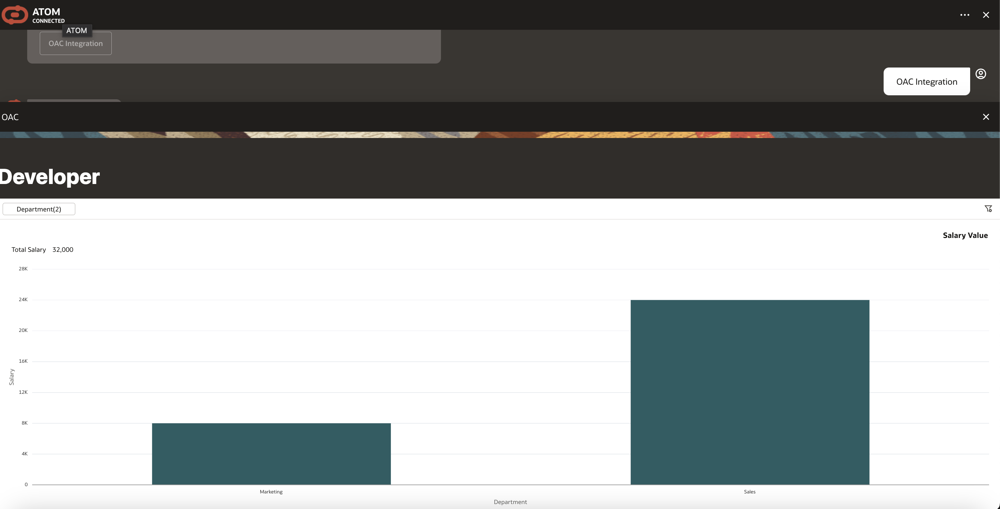
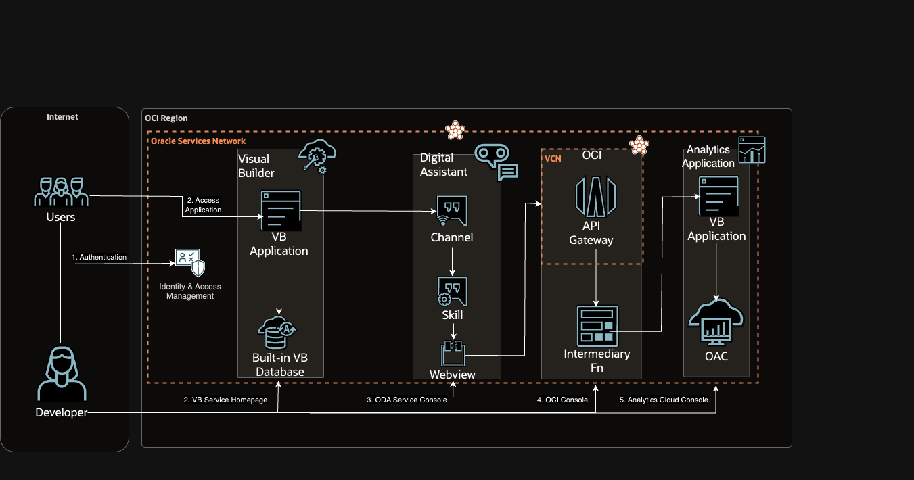

# Introduction

## About this Workshop

This workshop will help to configure, set-up and enable a digital assistant with integrated OAC charts known as ATOM on your own OCI tenancy. Users can ask questions which are reflected in embedded charts of the chat. 

Estimated Workshop Time: 3 hours 

### Objectives

Objective of this workshop is to set-up ATOM and its required OCI services:

* Analytics Cloud - Analytics Cloud will host the predefined charts.
* Digital Assistant - ODA is required to enable chatbot with it's Out Of the Box features and its webview to connect to VB.
* Visual Builder - VB can be used to embed ODA & OAC in a Web Based Application.
* Oracle Functions - Function to be used as an intermediary to redirect to VB with embedded OAC charts
* API Gateway - To expose the Fn as a webview in ODA

In this workshop, you will learn how to: <!-- TODO: these should mostly match our labs and lab sections -->

* Configure visual builder application with OAC charts
* Expose visual builder application as a web view
* Expose digital assistant skill as new visual builder application

### Prerequisites

This lab assumes you have:

* An Oracle Cloud account
* Some experience with OCI
* Administrator permissions or permissions to use Analytics Cloud, Digital Assistant, Visual Builder, and Identity Domains
* (Recommended, not required) Access to the Chicago Region

## Learn More

* [ATOM GenAI Livelab](https://oracle-livelabs.github.io/analytics-ai/atom/workshops/tenancy/?nav=open&lab=introduction#AboutthisWorkshop)
* [Embed Oracle Analytics Content Javascript](https://docs.oracle.com/en/middleware/bi/analytics-server/user-oas/embed-oracle-analytics-content-javascript-embedding-framework.html#GUID-DD102F44-83A5-44FA-A365-4A9D0D73C024)
* [Webview in Externally Hosted VB App](https://blogs.oracle.com/utilities/post/oracle-digital-assistant-webview-externally-hosted-in-vbcs-app)
* [Overview of Digital Assistants and Skills](https://docs.oracle.com/en-us/iaas/digital-assistant/doc/overview-digital-assistants-and-skills.html)
* [Overview of Visual Builder](https://docs.oracle.com/en-us/iaas/visual-builder/doc/oracle-visual-builder.html)

## Acknowledgements

* **Author** Luke Farley, Senior Cloud Engineer, NACIE
* **Contributor** - Jadd Jennings, Principal Cloud Architect, NACIE
* **Contributor**, Kaushik Kundu, Master Principal Cloud Architect, NACIE
* **Contributor** -  Abhinav Jain, Senior Cloud Engineer, NACIE
