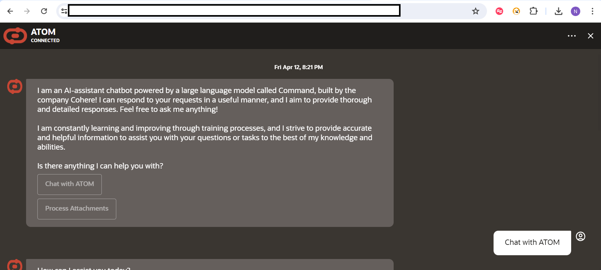
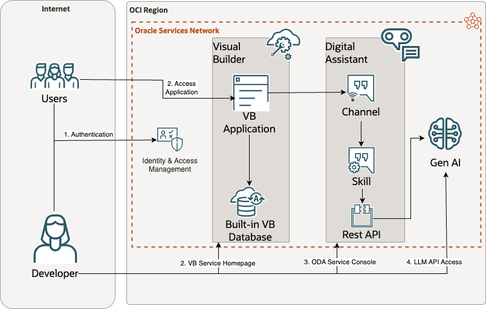

# Introduction

## About this Workshop

This workshop will help to configure, set-up and enable AI Powered Chatbot known as ATOM on your own OCI tenancy.
Users can either chat with the bot or upload a document to either summarize it or provide more context to the prompt. ATOM uses Oracle Digital Assistant and Gen AI LLMs in this application. By following the workshop users can install ATOM in their own tenancy

Estimated Workshop Time: 1 hours 30 minutes

> **Note** The document understanding feature is used for analyzing smaller documents ~20,000 words. If you are looking for a solution to analyze larger files, please see our other RAG solutions: 

[Deploy an ODA Chatbot powered by GenAI Agents (Object Storage)](https://livelabs.oracle.com/pls/apex/r/dbpm/livelabs/run-workshop?p210_wid=4022&p210_wec=&session=126701828086940)
 
[Deploy an ODA Chatbot powered by Generative AI Agents using 23ai Vector DB (23AI DB)](https://apexapps.oracle.com/pls/apex/r/dbpm/livelabs/run-workshop?p210_wid=4070&p210_wec=&session=105575298156069)

### Objectives

Objective of this workshop is to set-up ATOM and its required OCI services:

* Generative AI - Gen AI comes with pretrained foundational LLMs (Large Language Models) that are accessible via an on-demand API. No infrastructure provisioning is required for this service.
* Digital Assistant - ODA is required to enable chatbot with it's Out Of the Box features and its integration with OCI Gen AI service.
* Visual Builder - VB can be used to embed ODA in a Web Based Application.

In this workshop, you will learn how to: 

* Install, configure & set-up ODA as an LLM powered chatbot
* Install, configure & set-up Visual Builder as a frontend channel for ODA
* (Optionally) Integrate Document Understanding and Analyze Speech services
* Test out the features and capabilities of ATOM

### Prerequisites

This lab assumes you have:

* An Oracle Cloud account
* Access to the Chicago Region
* Administrator permissions or permissions to use the Generative AI family, the AI services family, Digital Assistant, Visual Builder, and Identity Domains

## Learn More

* [What Is Generative AI? How Does It Work?](https://www.oracle.com/artificial-intelligence/generative-ai/what-is-generative-ai/)
* [What Is Retrieval-Augmented Generation (RAG)?](https://www.oracle.com/artificial-intelligence/generative-ai/retrieval-augmented-generation-rag/)
* [Overview of Generative AI Service](https://docs.oracle.com/en-us/iaas/Content/generative-ai/overview.htm)
* [Overview of Digital Assistants and Skills](https://docs.oracle.com/en-us/iaas/digital-assistant/doc/overview-digital-assistants-and-skills.html)
* [Overview of Visual Builder](https://docs.oracle.com/en-us/iaas/visual-builder/doc/oracle-visual-builder.html)
* [Oracle Digital Assistant's large language model integration](https://docs.oracle.com/en/cloud/paas/digital-assistant/use-chatbot/llm-blocks-skills.html)

## Acknowledgements

**Authors**

* **Nitin Jain**, Master Principal Cloud Architect, NACIE
* **Abhinav Jain**, Senior Cloud Engineer, NACIE
* **JB Anderson**, Senior Cloud Engineer, NACIE

**Contributors**
* **Luke Farley**, Senior Cloud Engineer, NACIE

**Last Updated By/Date:**
* **Luke Farley**, Senior Cloud Engineer, NACIE, Apr 2025