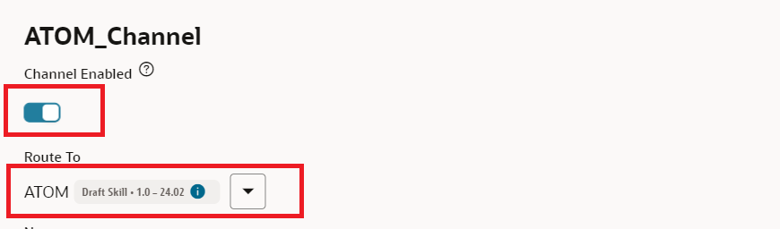
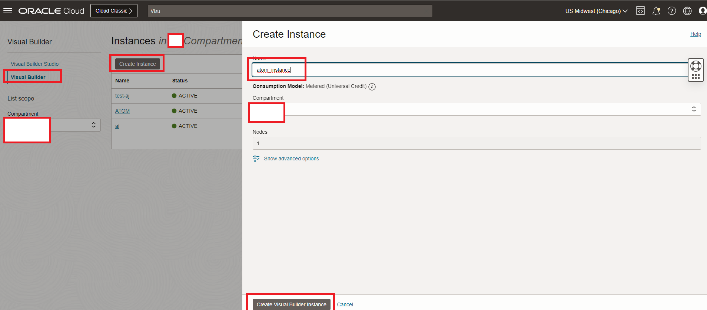
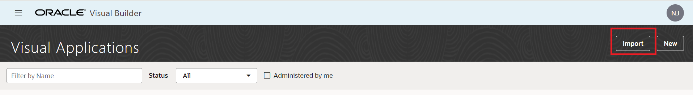
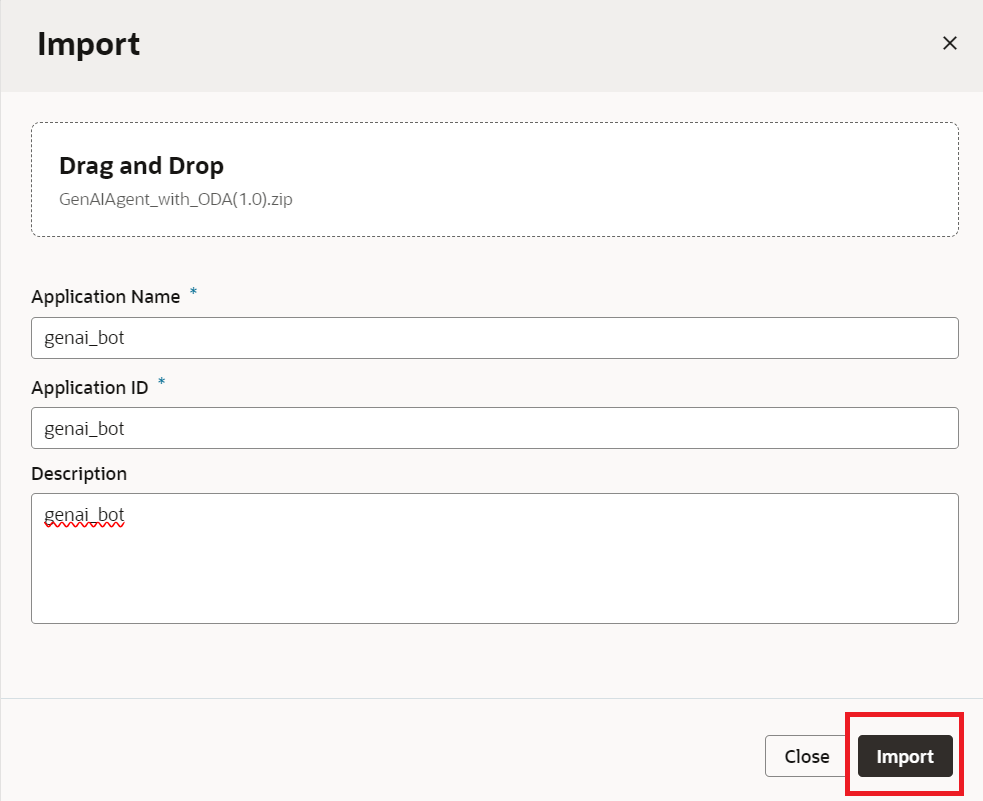
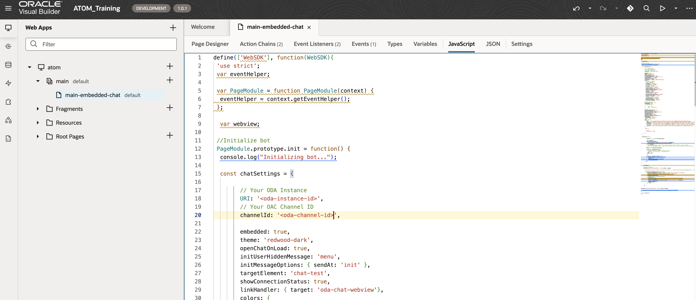

# Provision of Oracle Digital Assistant & Visual Builder Instance

## Introduction

This lab will take you through the steps needed to provision Oracle Digital Assistant & Visual Builder Cloud Service

Estimated Time: 1 hours 30 minutes

### About Oracle Digital Assistant

Oracle Digital Assistant delivers a complete AI platform to create conversational experiences for business applications through text, chat, and voice interfaces

### Objectives

Provisioning of ODA

In this lab, you will:

* **Provision ODA Instance**
  * Follow Task 1 to Task 5 to set-up ODA Instance
* **Provision VBCS Instance**
  * Follow Task 6

### Prerequisites

This lab assumes you have:

* An Oracle account
* Access to the Chicago Region
* Administrator permissions or permissions to use the Generative AI family, the AI services family, Digital Assistant, Visual Builder and Identity Domains

## Task 1: Provision Oracle Digital Assistant

This task will help you to create Oracle Digital Assistant under your choosen compartment.

1. Locate Digital Assistant under AI Services

   

   > **Note:** You can find Digital Assistant under the AI Services.

2. Provide the information for **Compartment**, **Name** , **Description** (optional) & **Shape**. Click **Create**

    

3. In few minutes the status of recently created Digital Assistant will change from **Provisioning** to **Active**

    

## Task 2: Dynamic Group & Policy creation for Oracle Digital Assistant

This task will help you to create desired dynamic group & necessary policy for the Oracle Digital Assistant

1. Attach the policy at the root compartment level. Please change the values of OCIDs to your own values here.

    ```text
    <copy>
    Allow any-user to use ai-service-generative-ai-family in tenancy where request.principal.id='ocid1.odainstance.oc1.us-chicago-1.XXXXXXXXXXXXXXXXXXXXXXXXXX'
    Allow any-user to use generative-ai-family in tenancy where request.principal.id='ocid1.odainstance.oc1.us-chicago-1.XXXXXXXXXXXXXXXXXXXXXX'
    Allow any-user to use fn-invocation in tenancy where request.principal.id='ocid1.odainstance.oc1.us-chicago-1.XXXXXXXXXXXXXXXXXXXX'
    </copy>
    ```

    > **Note:**
    > * Please make sure that the compartmentId should be the one under which the resource is  created.

## Task 3: Create REST Service for the OCI Generative AI Service

This task involves creating REST service which will be used by ODA to connect to OCI Generative AI Service. The REST Service will be created for the ODA created in **Task 1**.  This step only needs to be done once per ODA instance. If users are sharing one ODA instance to create multiple chatbot, only the first person will need to perform this step

1. Locate the ODA created in **Task 1**

    

2. Select the earlier created ODA Instance and click on **Service Console**

    

3. Click on hamburger menu and locate & click **API Services**

    

4. Click on **Add REST Service**. Provide the following details. Please note you will have to change values of CompartmentID and modelID to your own ID values in the Body section. You can follow the next step - Step 5 to see how to retrieve model ID.
    * **Name**

    ```text
    <copy>
    Gen_AI_Service
    </copy>
    ```

    * **Endpoint**

    ```text
    <copy>
    https://inference.generativeai.us-chicago-1.oci.oraclecloud.com/20231130/actions/chat
     </copy>
    ```

    * **Description (Optional)** : `Optional`
    * **Authentication Type** : OCI Resource Principal
    * **Method** : POST
    * **Request**
    * **Body**

    ```text
    <copy>
    {
        "compartmentId": "ocid1.compartment.oc1..XXXXXXXXXXX",
        "servingMode": {
            "modelId": "ocid1.generativeaimodel.oc1.us-chicago-1.XXXXXXXX",
            "servingType": "ON_DEMAND"
        },
        "chatRequest": {
            "apiFormat": "COHERE",
            "message": "Hi, how are you",
            "isStream": true
        }
    }
    </copy>
    ```

5. This step is broken down into following 3 steps
    * Step 1: Click on hamburger menu of OCI console and select **AI Services** > **Generative AI**

    

    * Step 2: Select Chat (under **Playground** heading)

    

    * Step 3: For the **Model**=**cohere.command-r-plus v1.7**, Click **View Model Details**, and then click on **copy** link for the **cohere.command-r-plus** and **version** = 1.7

        > **Note:** v1.7 is the latest model as of this livelab release. This lab should work with any version of the cohere model. 

    

6. Click **Test Request** to make sure the connection is successful

   

    > **Note**
    > * Retrieve the modelId (OCID) from OCI Gen AI Services Playground and use a compartmentId where the ODA is hosted inside
    > * If you are using a different name (and not Gen AI Service) for your Rest service then please make a change in your LLM Provider in Settings as well. To do that Go to Skills -> Settings -> Configuration -> Large Language Model Services -> LLM Provider. Choose the new Rest Service for both GenAI LLM and  GenAI Truncate LLM

    

## Task 4: Import Skill (Provided)

1. Click on the link to download the required skill (zip file): [Atom Skill txt.zip](https://objectstorage.us-ashburn-1.oraclecloud.com/p/2ZHprOu2tSai8mJNQQm34NX65oLDcFMs46FiPKlA4cHZD0XJpvIFeycEd2aPMdkm/n/c4u02/b/hosted_workshops/o/ATOM_Skill_txt.zip)

2. Import the skill (downloaded). Click on **Import Skill** & select the zip file to import

   

3. Once the skill is imported. Click on the Skill and go to Components as shown in the image below.

    

4. Click on Add Service and give this service a name of your choice. For example - RPlusService. And upload the following .tgz file under Component Service Package Creation Type section. Please make sure to change the CompartmentID and modelID located in Rtransformer.js file in components folder to your own CompartmentID and modelID. So in short, you have to unzip it, change those IDs and zip it again (using bots-node-sdk by following the steps provided in the note section below) to tgz format. Click to download the file [R_Transformer.tgz](https://objectstorage.us-ashburn-1.oraclecloud.com/p/IZm77Vl42_dHGMca5-8XFpMm8rvAebL44L-7C_mXzVb7KfOrY1G_Uy7Ilqd6Vg9w/n/c4u02/b/hosted_workshops/o/R_Transformer.tgz)

     

    > **Note:**
    > * You will need to use the bots node sdk to zip the folder. Run this command in your terminal to install -
        ```text
        <copy>
        npm install @oracle/bots-node-sdk
        </copy>
        ```
    > * Once installed - cd into the folder and run the below command to zip the folder.
        ```text
        <copy>
        npx @oracle/bots-node-sdk pack
        </copy>
        ```

5. Click on Add Service again and give a name - ProcessAttachmentService. Upload the following .tgz file under Component Service Package Creation Type section. Click to download the file [Process.tgz](https://objectstorage.us-ashburn-1.oraclecloud.com/p/O9BuH61wORNYq5E13l9b7GKbMnCXaBRNd2SiUtW0v1dTjCXYGcHkCTlbEM7ZOeDk/n/c4u02/b/hosted_workshops/o/process-attachment-component-1.tgz)

6. Click on hamburger menu and locate & click **API Services** under Settings section. Click on LLM Services and Import the following LLM Service as shown in the image below. Please make sure to change the CompartmentID and modelID located in yaml file to your own CompartmentID and modelID. Click to download the file [LLMService-ChatRPlusLLM.yaml](https://objectstorage.us-ashburn-1.oraclecloud.com/p/L3-NZ_Z7sZheGNvgA6hprS4D_5LXTIBN4WKusdq3llb_QtAxvHZLSpBD4KH3HnBK/n/c4u02/b/hosted_workshops/o/LLMService-ChatRPlusLLM.yaml)

    

7. Go to Skills -> Settings -> Configuration -> Large Language Model Services. Click on New LLM Service.

    

8. Provide a name of your choice for this Service. Give LLM Provider value as the one you imported in Step 6. Give Transformation Handler value as the one you imported in Step 4. Click on Check mark under Action to save it as shown in the image below.

    

9. Go to Skills -> Flows. Click on Attachment.

    

10. Click on Process attachment. In the pop up box under Custom Component section choose the one under ProcessAttachmentService.

    

11. Next, under Component tab fill in the following values as shown in the screenshot.

    

12. Click on invokeLLM in the Attachment flow as shown.

    

13. Under Component change the LLM Service to the one in Step 8.

    

14. Go to Skills -> Flows. Click on Chat.

    

15. Click on invokeLLM and then click on Component. Select the same LLM Service which was created in Step 8.

    

16. Click on Preview in the top right corner and start chatting with ATOM Chatbot.

    

## Task 5: Create Channel to embed ODA in Visual Builder Application (provided) or in any custom Web App

1. Click on hamburger menu and select Development > Channels

    

2. Select the following option on the form:

    * **Channel Type** = Oracle Web
    * **Allowed Domain** = *

    

3. After channel creation, enable the Channel by using the toggle button (screenshot).
   * Route it to skill imported in Task 4

   

4. Disable the **Client Authentication Enabled** toggle. (Take note of channelId for **Task 6** in later step).

    

## Task 6: Create VBCS Instance & embed ODA skill in VBCS Application (Please directly move to Step 5 incase you already have a VBCS instance provisioned)

1. Click on main hamburger menu on OCI cloud console and navigate Developer Services > Visual Builder

    

2. Create Visual Builder Instance by providing the details and click **Create Visual Builder Instance**:
    * **Name** = <name_of_your_choice>
    * **Compartment** = <same_compartment_as_oda>
    * **Node** = <as_per_need>

    

3. Wait for the instance to come to **Active** (green color) status

4. Click on the link to download the VB application (zip file): [ATOM_Training.zip](https://objectstorage.us-chicago-1.oraclecloud.com/n/idb6enfdcxbl/b/Excel-Chicago/o/Livelabs%2Fdoc-understanding%2FATOM_Training-1.0.1.zip)

5. Import the application in provisioned instance as per the screenshots. Users only need one VCBS instance created. They can import/create multiple applications in the instance for each additional chatbot they have

    * Click on Import from Visual Builder Instance

        

    * Choose the option as below

        

    * Provide the App Name with other details and select the provided application zip file

        

6. Once import is completed, open the embedded-chat javascript file in the VB Instance and update the details as follows:

    * **URI** = '<https://oda-XXXXXXXXXXXXXXXXXXXXXX.data.digitalassistant.oci.oraclecloud.com/>'
    * **channelId** = 'XXXXXXXXXXXXXXXXXXXXXXXXXXXX'
    * Please change value of initUserHiddenMessage on Line 32 from 'what can you do' to 'Hello'

    

    > **Note**
    > * URI is the hostname of ODA instance provisioned in **Task 1**
    > * channelId is created during **Task 5** - **Step 3**

7. The UI of the chatbot such as theme, color and icon can be changed by modifying the parameters under var chatWidgetSetting from embedded-chat javscript file.

8. Click on the Play button shown in the above image on the top right corner to launch ATOM chatbot and start chatting with ATOM.

**Troubleshooting** 

You may face an issue when you go to publish the live link of the application. It may throw a "forbidden" error. The solution is to remove the "Admin" and "User" role in the JSON tab from all the vb pages - main-start, main-embedded-chat, and the shell page as shown in the image below.
    

## Acknowledgements

**Authors**

* **Nitin Jain**, Master Principal Cloud Architect, NACIE
* **Abhinav Jain**, Senior Cloud Engineer, NACIE
* **JB Anderson**,  Senior Cloud Engineer, NACIE

**Contributors**
* **Luke Farley**, Senior Cloud Engineer, NACIE

**Last Updated By/Date:**
* **Luke Farley**, Senior Cloud Engineer, NACIE, Apr 2025
