# Implement Speech Analysis

## Introduction

This lab will show how to implement mp4 video processing with genai. 

OCI Speech is an AI service that uses automatic speech recognition technology to transform audio content to text and textual content to speech. Get accurate, text-normalized, time-stamped transcriptions via the OCI console, OCI Data Science notebooks, and REST APIs as well as command-line interfaces or SDKs.

Estimated Time: 1 hours 30 minutes

### Objectives

To use the Speech service. Please find detail architecture diagram for better understanding.

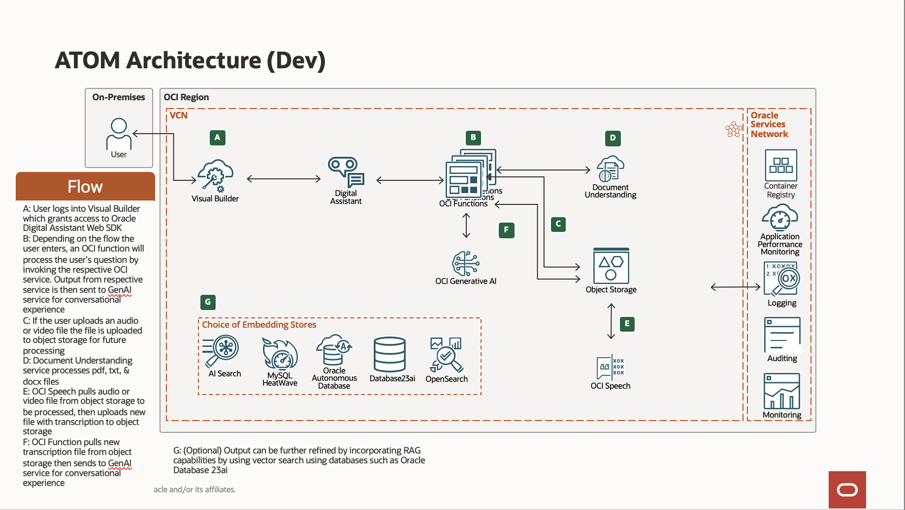

### Prerequisites

This lab assumes you have:

* An Oracle account
* Access to the Chicago and Ashburn Region
* Administrator permissions or permissions to use the Generative AI family, the AI services family, Digital Assistant, Visual Builder and Identity Domains

## Task 1: Create Speech Policies 

ODA-Speech-Policy - Allows ODA Dev to connect to speech service. Also includes access to object storage.

    ```text
        <copy>
        allow any-user to manage ai-service-speech-family in tenancy where request.principal.id='ocid1.odainstance.oc1.us-chicago-1.XXXX'

        allow any-user to manage object-family in tenancy where request.principal.id='ocid1.odainstance.oc1.us-chicago-1.XXXX'

        allow any-user to read tag-namespaces in tenancy where request.principal.id='ocid1.odainstance.oc1.us-chicago-1.XXXX'

        allow dynamic-group odaDynamicGroup to manage ai-service-speech-family in tenancy

        allow dynamic-group odaDynamicGroup to manage object-family in tenancy

        allow dynamic-group odaDynamicGroup to read tag-namespaces in tenancy

        ALLOW dynamic-group odaDynamicGroup to use fn-invocation in compartment vb

        Allow dynamic-group odaDynamicGroup to read objectstorage-namespaces in tenancy

        Allow dynamic-group odaDynamicGroup to manage logging-family in compartment vb

        Allow dynamic-group odaDynamicGroup to read metrics in compartment vb
        </copy>
     ```


## Task 2: Create REST Services 

1. Click on **Add REST Service**. Provide the following details:
    * **Name**

    ```text
    <copy>
    getTranscriptionJobListService
    </copy>
    ```

    * **Endpoint**

    ```text
    <copy>
    https://speech.aiservice.us-ashburn-1.oci.oraclecloud.com/20220101/transcriptionJobs/{transcriptionJobId}/transcriptionTasks/
    </copy>
    ```

    * **Description (Optional)** : `Optional`
    * **Authentication Type** : OCI Resource Principal
    * **Method** : GET

    Click **Test Request** to make sure the connection is successful.

   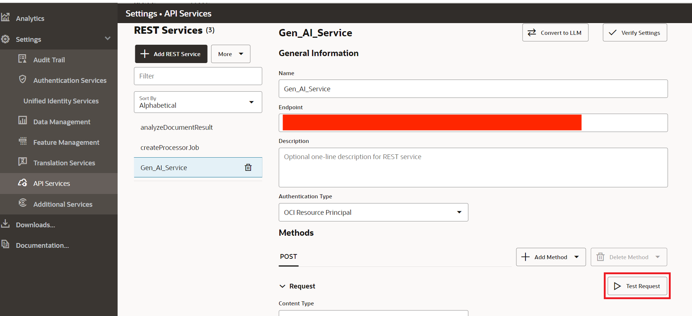

> **Note:** You would need to run a sample job in the speech service of OCI console to get a new **transcriptionJobId** to test the connection to the endpoint. However, this connection test is optional because the skill itself generates the **transcriptionJobId** at runtime. 

2. Click on **Add REST Service**. Provide the following details:
    * **Name**

    ```text
    <copy>
    getTranscriptionTaskService
    </copy>
    ```

    * **Endpoint**

    ```text
    <copy>
    https://speech.aiservice.us-ashburn-1.oci.oraclecloud.com/20220101/transcriptionJobs/{transcriptionJobId}/transcriptionTasks/{transcriptionTaskId}
     </copy>
    ```

    * **Description (Optional)** : `Optional`
    * **Authentication Type** : OCI Resource Principal
    * **Method** : GET

    Click **Test Request** to make sure the connection is successful.

   

   > **Note:** As above, you would need to run a sample job in the speech service of OCI console to get a new **transcriptionJobId** and **transcriptionTaskId** to test the connection to the endpoint. However, this connection test is optional because the skill itself generates the **transcriptionJobId** at runtime.

3. Click on **Add REST Service**. Provide the following details. Please note you will have to change values of CompartmentID, bucket name, namespace and object name to your own values in the Body section.
    * **Name**

    ```text
    <copy>
    SpeechService
    </copy>
    ```

    * **Endpoint**

    ```text
    <copy>
    https://speech.aiservice.us-ashburn-1.oci.oraclecloud.com/20220101/transcriptionJobs
     </copy>
    ```

    * **Description (Optional)** : `Optional`
    * **Authentication Type** : OCI Resource Principal
    * **Method** : POST
    * **Content Type** : application/json
    * **Body**

    ```text
    <copy>
    {
    "compartmentId": "ocid1.compartment.oc1..aXXXXXX",
    "inputLocation": {
        "locationType": "OBJECT_LIST_INLINE_INPUT_LOCATION",
        "objectLocations": [
            {
                "bucketName": "Your bucket",
                "namespaceName": "Your namespace",
                "objectNames": [
                    "Your_test_file.mp4"
                ]
            }
        ]
    },
    "outputLocation": {
        "bucketName": "Your bucket",
        "namespaceName": "Your namespace",
        "prefix": "output/"
    }
    }
    </copy>
    ```

    Click **Test Request** to make sure the connection is successful

   


## Task 3: Create and Deploy a Function 

In this section, we will delve into the process of creating and deploying an Oracle Function. OCI Functions provide a serverless environment, allowing you to focus on your code without worrying about server management. We will guide you through the steps of developing and deploying an OCI Function, which can be a powerful tool for extending your application's capabilities. You will learn how to create a function, configure its settings, and deploy it using the Oracle Cloud Infrastructure console or command-line interface. By the end of this section, you will be ready to connect the function to the ODA skill.

1. Download the following file: 

    [Speech Functions](https://objectstorage.us-chicago-1.oraclecloud.com/n/idb6enfdcxbl/b/Livelabs/o/docunderstanding%2Fspeech-functions-livelab.zip)

2. Navigate back to your function application created in the Document Understanding Lab Task 4

3. Select Getting Started > Cloud setup and take note of the steps to login and deploy the functions.

    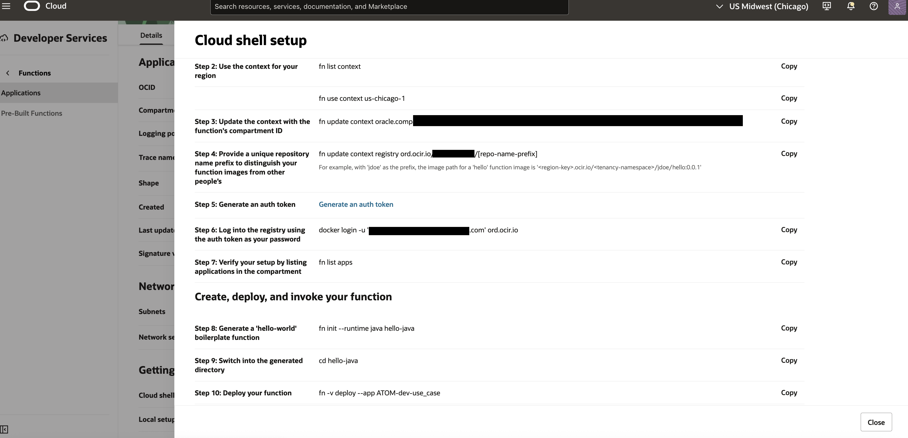

    - This will give you your specific instructions for: 
        - Setting the context
        - Logging in to the container registry 
        - Deploying the function to your application

   > **Note:** You don't need to run the last invoke command. We will be invoking the function later from ODA. 

4. At the top right of the oci console, open a new cloud shell

    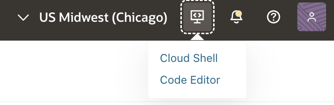


5. Select the gear icon at the top right of the shell and upload the zip file from step 1 

    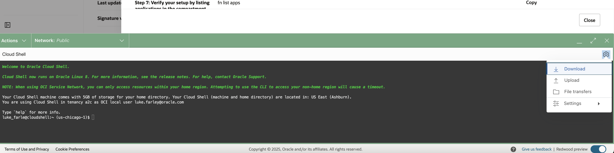

6. Create a new directory for your speech functions and move the zip to the directory

``` text 
<copy>
    mkdir speech
    mv docunderstanding_docupload-functions-livelab.zip /speech
    unzip docunderstanding_docupload-functions-livelab.zip
</copy>
```

7. Configure the dnuploadcc function 

``` text
<copy>
    cd dnuploadcc/config
    vi config.js 
</copy>
```

    - Change the bucket name atom-dev to the bucket in your tenancy you'd like to store the transcriptions in 

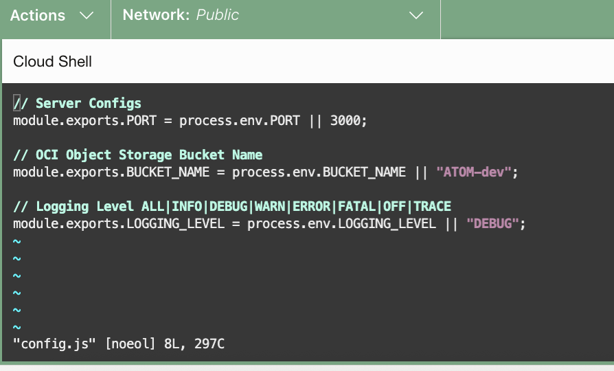

    - Press escape then ':wq' to save the file 

8. Navigate back to the dnuploadcc directory and deploy the function 

``` text 
<copy>
    fn -v deploy --app <your-function-app>
</copy>
```

    - Take note of the function invoke endpoint once created

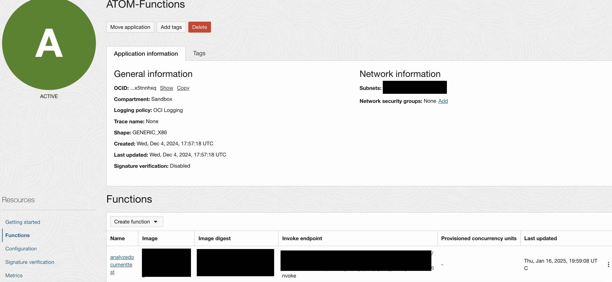

> **Note** If you get an error with the architecture, you can change the architecture from the cloud shell 

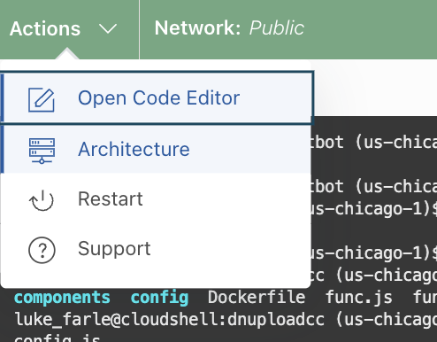

9. Navigate to the gettranscriptcc directory and change the config.js as described in step 7

10. Deploy the gettranscriptcc function 

``` text
<copy>
    fn -v deploy --app <your-function-app>
</copy>
```

## Task 3: Update Skill Flow and Components with Deployed Function Endpoints 

2. In the components of the skill, change the endpoints of the downloadUploadObjectStorageFn and getTranscriptCC components to the dnuploadcc function and gettranscriptcc endpoints respectively.

    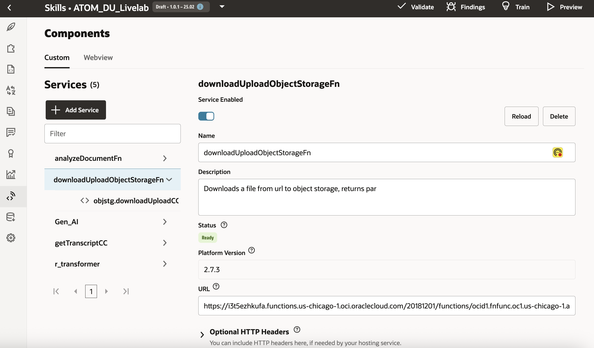

3. Within the speechComponent flow select the callSpeechService and change the bucket name of the request payload to the bucket you'd like to upload to. Also change the namespace name to your tenancy namespace and the compartment id to your compartment id. 

    ``` text 
    <copy>
        {
        "compartmentId": "<your-compartment-id>",
        "inputLocation": {
            "locationType": "OBJECT_LIST_INLINE_INPUT_LOCATION",
            "objectLocations": [
                {
                    "bucketName": "<your-bucketname>",
                    "namespaceName": "<your-tenancy-namespace>",
                    "objectNames": [
                        "${fileName}"
                    ]
                }
            ]
        },
        "outputLocation": {
            "bucketName": "<your-bucketname>",
            "namespaceName": "<your-tenancy-namespace>",
            "prefix": "output/"
        }
    }
    </copy>
    ```

    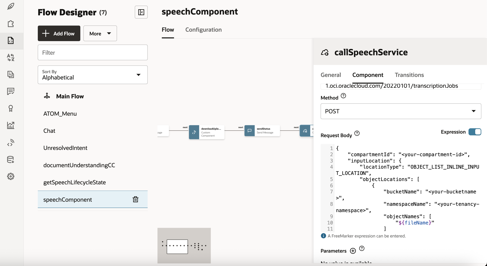

4. Make sure there are no errors in the speechComponent and getSpeechLifecycleState flows 

>**Note** After updating the endpoints in the components, you may need to reselect the function component in the visual flow designer

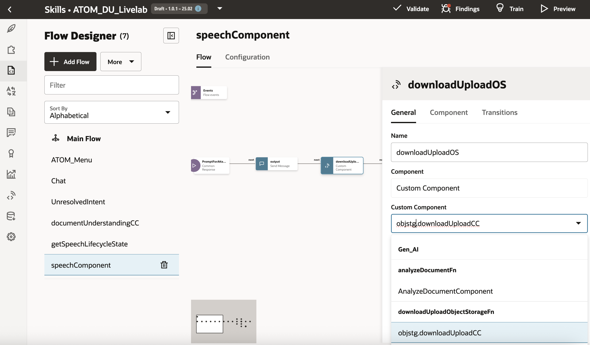

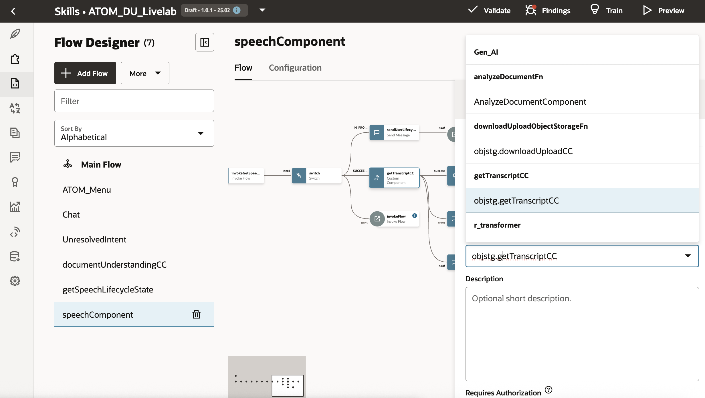

5. Navigate to your visual builder application configured in the previous lab, invoke analyze speech and upload an mp4 file

    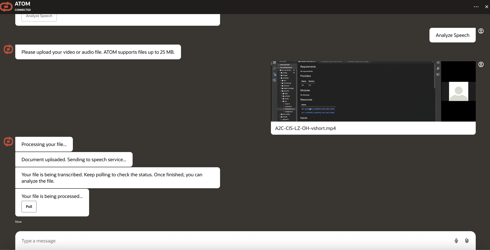

    - The transcription can take some time. Continue to poll until the transcription is complete 

    

> **Note** To further debug issues, you can upload files through the ODA preview by uploading a sample mp4 to your object storage bucket, creating a PAR request, then adding the PAR request in the preview.

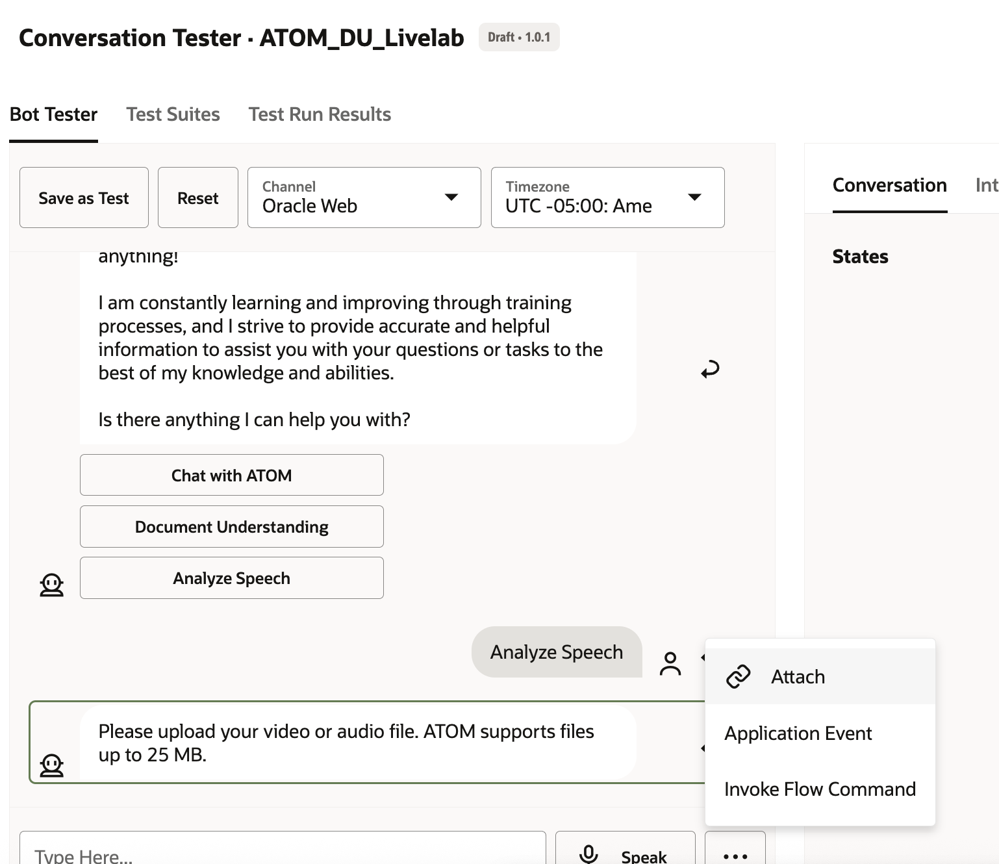

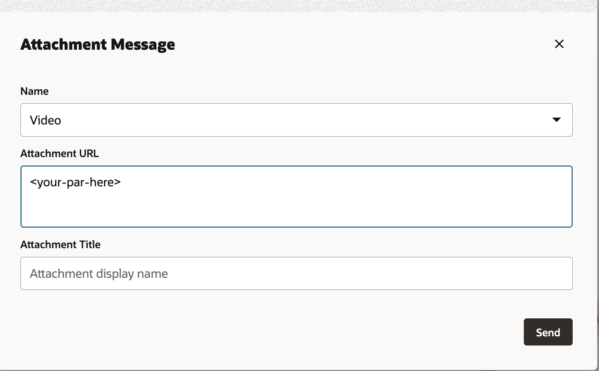

> **Note** If you get 404 errors, that likely means a policy is missing. Please review the policies. Also note it can take a couple minutes for policies to reflect. 

> **Note** If you have issues with larger files, try increasing the memory of your function. Also note the limit for the size of uploads via the web sdk is 25 mb. 

## Acknowledgements

**Authors**
* **Abhinav Jain**, Senior Cloud Engineer, NACIE

**Contributors**
* **Luke Farley**, Senior Cloud Engineer, NACIE

**Last Updated By/Date:**
* **Luke Farley**, Senior Cloud Engineer, NACIE, Apr 2025