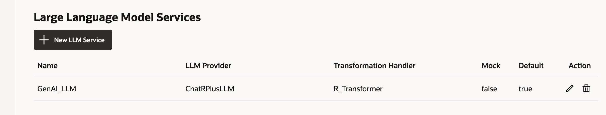
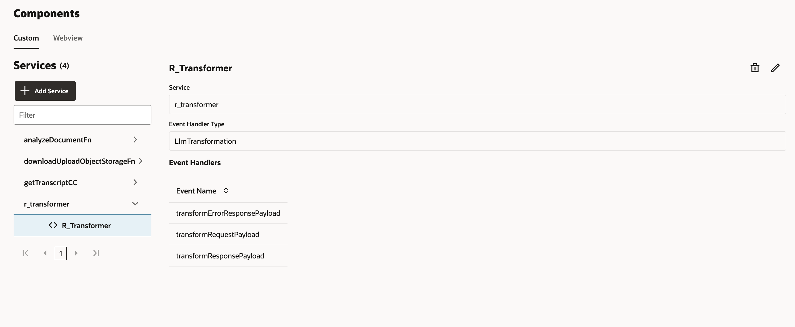
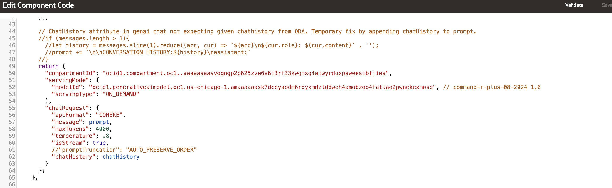
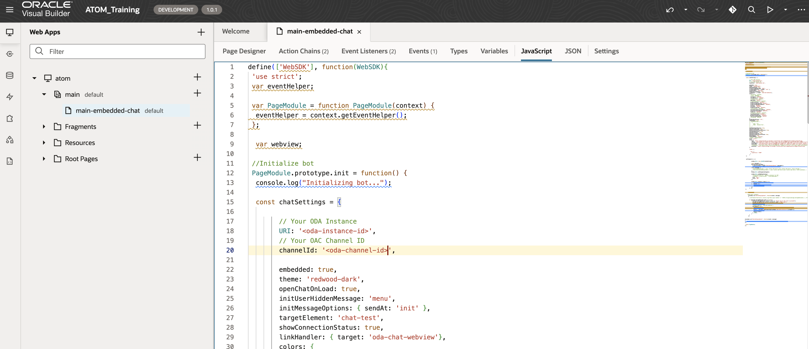

# Using Document Understanding Service

## Introduction

This lab will take you through the steps needed to use the Document Understanding service

Estimated Time: 2 hours 30 minutes

### About Oracle Document Understanding & Speech service

Oracle Cloud Infrastructure (OCI) Document Understanding is an AI service that enables developers to extract text, tables, and other key data from document files through APIs and command line interface tools. With OCI Document Understanding, you can automate tedious business processing tasks with prebuilt AI models and customize document extraction to fit your industry-specific needs.

### Objectives

To use the Document Understanding service. Please find detail architecture diagram for better understanding.


### Prerequisites

This lab assumes you have:

* An Oracle account
* Access to the Chicago and Ashburn Region
* Administrator permissions or permissions to use the Generative AI family, the AI services family, Digital Assistant, Visual Builder and Identity Domains

## Task 1: Provision Oracle Digital Assistant

This task will help you to create Oracle Digital Assistant under your chosen compartment. OCI Document Understanding service is only available in Ashburn region. Since we're using Ashburn region for this we will have to create a new Digital Assistant in Ashburn region.

> **Note:** Update 1/25 Document Understanding is now available in chicago region as well.

1. Locate Digital Assistant under AI Services

   

   > **Note:** You can find Digital Assistant under the AI Services.

2. Provide the information for **Compartment**, **Name** , **Description** (optional) & **Shape**. Click **Create**

    

3. In few minutes the status of recently created Digital Assistant will change from **Provisioning** to **Active**

    

## Task 2: Policy creation for Oracle Document Understanding Access

Create a Dynamic Group
Go to Identity>>Domains>>Default domain>>Dynamic groups


Click on Create dynamic group and name it as odaDynamicGroup

Select radio button - Match any rules defined below
Add the following rules. Please change the values of OCIDs to your own values here.

Rule 1

```text
     <copy>
    All {instance.id = 'ocid1.odainstance.oc1.us-chicago-1.XXXX'}
     </copy>
```

Rule 2

```text
     <copy>
    All {resource.type='odainstance', resource.compartment.id='ocid1.compartment.oc1..XXXX' }
    </copy>
 ```

Rule 3

```text
    <copy>
    ALL {resource.type = 'fnfunc', resource.compartment.id = 'ocid1.compartment.oc1..XXXX'}
     </copy>
```

> **Note:** Please make sure that the compartmentId should be the one under which the resources are created.

This task will help you to create necessary policy for the Oracle Document Understanding Service

1. Attach the policy at the root compartment level. Please change the values of OCIDs to your own values here.

    ODA_Access - Policy to allow users access to ODA

    ```text
        <copy>
        Allow any-user to use ai-service-generative-ai-family in tenancy where request.principal.id='ocid1.odainstance.oc1.us-chicago-1.XXXXXXXXXXXXXXXXXXXXXXXXXX'
        Allow any-user to use generative-ai-family in tenancy where request.principal.id='ocid1.odainstance.oc1.us-chicago-1.XXXXXXXXXXXXXXXXXXXXXX'
        Allow any-user to use fn-invocation in tenancy where request.principal.id='ocid1.odainstance.oc1.us-chicago-1.XXXXXXXXXXXXXXXXXXXX'
        Allow dynamic-group odaDynamicGroup to use fn-invocation in tenancy
        </copy>
    ```

     Document Understanding Policy - Allows function to connect to document understanding 

     ```text
        <copy>
        Allow dynamic-group odaDynamicGroup to manage ai-service-document-family in tenancy
        </copy>
    ```

> **Note** It can take a couple minutes for policies to reflect.

## Task 3: Create REST Service

This task involves creating REST service which will be used by ODA to connect to OCI Generative AI Service. The REST Service will be created for the ODA created in **Task 1**. This step only needs to be done once per ODA instance. If users are sharing one ODA instance to create multiple chatbot, only the first person will need to perform this step.

1. Locate the ODA created in **Task 1**

    

2. Select the earlier created ODA Instance and click on **Service Console**

    

3. Click on hamburger menu and locate & click **API Services**

    

4. Click on **Add REST Service**. Provide the following details. Please note you will have to change values of CompartmentID and modelID to your own ID values in the Body section. You can follow the next step - Step 5 to see how to retrieve model ID.
    * **Name**

    ```text
    <copy>
    Gen_AI_Service
    </copy>
    ```

    * **Endpoint**

    ```text
    <copy>
    https://inference.generativeai.us-chicago-1.oci.oraclecloud.com/20231130/actions/chat
     </copy>
    ```

    * **Description (Optional)** : `Optional`
    * **Authentication Type** : OCI Resource Principal
    * **Method** : POST
    * **Body**

    ```text
    <copy>
    {
        "compartmentId": "ocid1.compartment.oc1..XXXXXXXXXXX",
        "servingMode": {
            "modelId": "ocid1.generativeaimodel.oc1.us-chicago-1.XXXXXXXX",
            "servingType": "ON_DEMAND"
        },
        "chatRequest": {
            "apiFormat": "COHERE",
            "message": "Hi, how are you",
            "isStream": true
        }
    }
    </copy>
    ```

5. This step is broken down into following 3 steps
    * Step 1: Click on hamburger menu of OCI console and select **AI Services** > **Generative AI**

    

    * Step 2: Select Chat (under **Playground** heading)

    

    * Step 3: For the **Model**=**cohere.command-r-plus v1.7**, Click **View Model Details**, and then click on **copy** link for the **cohere.command-r-plus** and **version** = 1.7

        > **Note:** v1.7 is the latest model as of this livelab release. This lab should work with any version of the cohere model. 

    

6. Click **Test Request** to make sure the connection is successful

   

    > **Note**
    > * Retrieve the modelId (OCID) from OCI Gen AI Services Playground and use a compartmentId where the ODA is hosted inside
    > * If you are using a different name (and not Gen AI Service) for your Rest service then please make a change in your LLM Provider in Settings as well. To do that Go to Skills -> Settings -> Configuration -> Large Language Model Services -> LLM Provider. Choose the new Rest Service for the Gen AI LLM 

    

    

## Task 4: Deploy Function Application
In this section, we will deploy a VCN, OCI Function application, and a serverless Function for document understanding.

1. Create VCN
    - In the cloud console, go to Networking > Virtual Cloud Networks

    

    - Select 'Start VCN Wizard' 

    

    - Choose 'Create VCN with Internet Connectivity' 

    

    - Give your VCN a name and keep the default options 

    

    - Navigate to Review and Create and select 'Create'

3. Create function application using subnet in previous step

    - From the Cloud Console, navigate to Developer Services > Functions > Applications 

    

    - Give your application a name and select the VCN + Subnet you created in the previous step. Also select GENERIC_X86 for shape.

    

## Task 5: Create and Deploy a Function 

In this section, we will delve into the process of creating and deploying an Oracle Function. OCI Functions provide a serverless environment, allowing you to focus on your code without worrying about server management. We will guide you through the steps of developing and deploying an OCI Function, which can be a powerful tool for extending your application's capabilities. You will learn how to create a function, configure its settings, and deploy it using the Oracle Cloud Infrastructure console or command-line interface. By the end of this section, you will be ready to connect the function to the ODA skill.

1. Download the following file: 

    [Document Understanding Fn](https://objectstorage.us-chicago-1.oraclecloud.com/n/idb6enfdcxbl/b/Livelabs/o/docunderstanding%2Fdoc-function.zip)

2. Navigate back to your function application created in Task 4 step 3

3. Select Getting Started > Cloud setup and take note of the steps to login and deploy the functions.

    

    - This will give you your specific instructions for: 
        - Setting the context
        - Logging in to the container registry 
        - Deploying the function to your application

   > **Note:** You don't need to run the last invoke command. We will be invoking the function later from ODA. 

4. At the top right of the oci console, open a new cloud shell

    


5. Select the gear icon at the top right of the shell and upload the zip file from step 1 

    

6. Create a new directory for your document understanding function and move the zip to the directory

``` text 
<copy>
    mkdir docunderstanding
    mv docunderstanding_doc-function.zip /docunderstanding
    unzip docunderstanding_doc-function.zip
</copy>
```

7. Deploy the function 

``` text 
<copy>
    fn -v deploy --app <your-function-app>
</copy>
```

    - Take note of the function invoke endpoint once created


> **Note** If you get an error with the architecture, you can change the architecture from the cloud shell 


## Task 5: Import Skill

1. Click on the link to download the required skill (zip file): [Atom Skill.zip](https://objectstorage.us-chicago-1.oraclecloud.com/n/idb6enfdcxbl/b/Livelabs/o/docunderstanding%2FATOM_DU_Livelab_Deployment_skill(1.0.1).zip)

2. Import the skill (downloaded). Click on **Import Skill** & select the zip file to import

   

3. Once the skill is imported. Click on the Skill and go to Components.

4. Edit the R Transformer by selecting the pencil icon in the top right 

    

5. Edit the model and compartment id to your own 

    

4. Click on hamburger menu and locate & click **API Services** under Settings section. Click on LLM Services and Import the following LLM Service as shown in the image below. Please make sure to change the CompartmentID and modelID located in yaml file to your own CompartmentID and modelID. Click to download the file [LLMService-ChatRPlusLLM.yaml](https://objectstorage.us-ashburn-1.oraclecloud.com/p/L3-NZ_Z7sZheGNvgA6hprS4D_5LXTIBN4WKusdq3llb_QtAxvHZLSpBD4KH3HnBK/n/c4u02/b/hosted_workshops/o/LLMService-ChatRPlusLLM.yaml)

    

5. Go to Skills -> Settings -> Configuration -> Large Language Model Services. Configure the LLM Service.

    

6. Configure the LLM Provider value as the one you imported in Step 4. Use the R Transformer as the transformation handler. Click on Check mark under Action to save it as shown in the image below.

    

8. Go to Skills -> Flows. Click on Chat.

    

9. Click on invokeLLM and then click on Component. Select the same LLM Service which was created in Step 7.

    

## Task 6: Changes to Skill

1. Go to Skills -> Settings -> Configuration
Provide a value to da.privateKey 'None'

2. Go to Skills -> Components and modify the 'analyzedocfn' service with your own function endpoint id from Task 4 Step 5

    

    > **Note** if analyzedocumentfn is not available, go ahead and create a new service with your function invoke endpoint

    

2. Go to Skills -> Flow Designer and make sure there are no errors in documentUnderstandingCC flow

## Task 7: Create Channel to embed ODA in Visual Builder Application (provided) or in any custom Web App

1. Click on hamburger menu and select Development > Channels

    

2. Select the following option on the form:

    * **Channel Type** = Oracle Web
    * **Allowed Domain** = *

    

3. After channel creation, enable the Channel by using the toggle button (screenshot).
   * Route it to skill imported in Task 4

   

4. Disable the **Client Authentication Enabled** toggle. (Take note of channelId for **Task 6** in later step).

    

## Task 8: Create VBCS Instance & embed ODA skill in VBCS Application

1. Click on main hamburger menu on OCI cloud console and navigate Developer Services > Visual Builder

    

2. Create Visual Builder Instance by providing the details and click **Create Visual Builder Instance**:
    * **Name** = <name_of_your_choice>
    * **Compartment** = <same_compartment_as_oda>
    * **Node** = <as_per_need>

    

3. Wait for the instance to come to **Active** (green color) status

4. Click on the link to download the VB application (zip file): [ATOM_VB.zip](https://objectstorage.us-chicago-1.oraclecloud.com/n/idb6enfdcxbl/b/Livelabs/o/docunderstanding%2FLivelabs_doc-understanding_ATOM_Training-1.0.1.zip)

5. Import the application in provisioned instance as per the screenshots. Users only need one VCBS instance created. They can import/create multiple applications in the instance for each additional chatbot they have

    * Click on Import from Visual Builder Instance

        

    * Choose the option as below

        

    * Provide the App Name with other details and select the provided application zip file

        

6. Once import is completed, open the javascript tab in the VB Instance and update the details as follows:

    * **URI** = '<https://oda-XXXXXXXXXXXXXXXXXXXXXX.data.digitalassistant.oci.oraclecloud.com/>'
    * **channelId** = 'XXXXXXXXXXXXXXXXXXXXXXXXXXXX'
    * Please change value of initUserHiddenMessage on Line 32 from 'what can you do' to 'Hello'

    

    > **Note**
    > * URI is the hostname of ODA instance provisioned in **Task 1**
    > * channelId is created during **Task 5** - **Step 3**

7. The UI of the chatbot such as theme, color and icon can be changed by modifying the parameters under var chatWidgetSetting in the embedded-chat javascript tab

8. Click on the Play button shown in the above image on the top right corner to launch ATOM chatbot and start chatting with ATOM.

9. From here you should be able to converse with the contents of your file 

    

> **Note** As mentioned at the beginning of this lab, there is a limit to the size of the files that can be shared. This is due to the context window of the llm. If you are looking for a solution to analyze larger files, please see our other RAG solutions: 

[Deploy an ODA Chatbot powered by GenAI Agents (Object Storage)](https://livelabs.oracle.com/pls/apex/r/dbpm/livelabs/run-workshop?p210_wid=4022&p210_wec=&session=126701828086940)
 
[Deploy an ODA Chatbot powered by Generative AI Agents using 23ai Vector DB (23AI DB)](https://apexapps.oracle.com/pls/apex/r/dbpm/livelabs/run-workshop?p210_wid=4070&p210_wec=&session=105575298156069)

**Appendix** 

1. You may face an issue when you go to publish the live link of the application. It may throw a "forbidden" error. The solution is to remove the "Admin" and "User" role in the JSON tab from all the vb pages - main-start, main-embedded-chat, and the shell page as shown in the image below.

    

2. If you get the message 'Unable to route message', confirm the private key is set as mentioned in Task 6 step 1 

    
    
## Acknowledgements

**Authors**
* **Abhinav Jain**, Senior Cloud Engineer, NACIE

**Contributors**
* **Luke Farley**, Senior Cloud Engineer, NACIE

**Last Updated By/Date:**
* **Luke Farley**, Senior Cloud Engineer, NACIE, Apr 2025