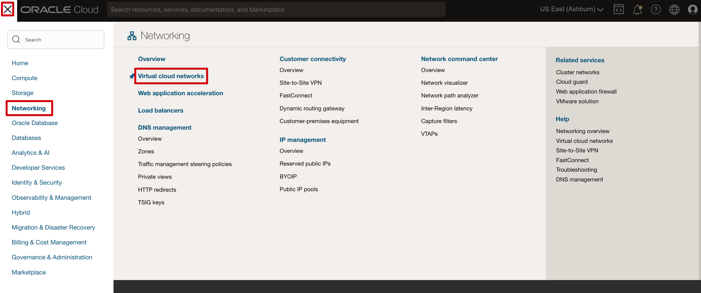

# Using Document Understanding Service

## Introduction

This lab will take you through the steps needed to use the Document Understanding service

Estimated Time: 1 hours 30 minutes

### About Oracle Document Understanding Service

Oracle Cloud Infrastructure (OCI) Document Understanding is an AI service that enables developers to extract text, tables, and other key data from document files through APIs and command line interface tools. With OCI Document Understanding, you can automate tedious business processing tasks with prebuilt AI models and customize document extraction to fit your industry-specific needs.

**Limitations** This lab supports files up to ~20,000 words with support for JPEG, PNG, PDF, DOCX and TIFF. If you need to query against larger files, please see our other RAG solutions here 

[Deploy an ODA Chatbot powered by GenAI Agents (Object Storage)](https://livelabs.oracle.com/pls/apex/r/dbpm/livelabs/run-workshop?p210_wid=4022&p210_wec=&session=126701828086940)
 
[Deploy an ODA Chatbot powered by Generative AI Agents using 23ai Vector DB (23AI DB)](https://apexapps.oracle.com/pls/apex/r/dbpm/livelabs/run-workshop?p210_wid=4070&p210_wec=&session=105575298156069)

### Objectives

To use the Document Understanding service. Please find detail architecture diagram for better understanding.


### Prerequisites

This lab assumes you have:

* An Oracle account
* Completed Lab 1
* Access to the Chicago and Ashburn Region
* Administrator permissions or permissions to use the Generative AI family, the AI services family, Digital Assistant, Visual Builder and Identity Domains

## Task 1: Policy creation for Oracle Document Understanding Access

1. Attach the following policy at the root compartment level. The odaDynamicGroup was created in the previous lab - 

    - Document Understanding Policy - Allows function to connect to document understanding 

     ```text
        <copy>
        Allow dynamic-group odaDynamicGroup to manage ai-service-document-family in tenancy
        </copy>
    ```

> **Note** It can take a couple minutes for policies to reflect. Also please make sure the function application in the following steps is created in the same compartment as your other resources associated with your odaDynamicGroup

## Task 2: Deploy Function Application
In this section, we will deploy a VCN, OCI Function application, and a serverless Function for document understanding.

1. Create VCN
    - In the cloud console, go to Networking > Virtual Cloud Networks

    

    - Select 'Start VCN Wizard' 

    

    - Choose 'Create VCN with Internet Connectivity' 

    

    - Give your VCN a name and keep the default options 

    

    - Navigate to Review and Create and select 'Create'

3. Create function application using subnet in previous step

    - From the Cloud Console, navigate to Developer Services > Functions > Applications 

    

    - Give your application a name and select the VCN + Subnet you created in the previous step. Also select GENERIC_X86 for shape.

    

## Task 3: Create and Deploy a Function 

In this section, we will delve into the process of creating and deploying an Oracle Function. OCI Functions provide a serverless environment, allowing you to focus on your code without worrying about server management. We will guide you through the steps of developing and deploying an OCI Function, which can be a powerful tool for extending your application's capabilities. You will learn how to create a function, configure its settings, and deploy it using the Oracle Cloud Infrastructure console or command-line interface. By the end of this section, you will be ready to connect the function to the ODA skill.

1. Download the following file: 

    [Document Understanding Fn](https://objectstorage.us-chicago-1.oraclecloud.com/n/idb6enfdcxbl/b/Livelabs/o/docunderstanding%2Fdoc-function.zip)

2. Navigate back to your function application created in Task 2

3. Select Getting Started > Cloud setup and take note of the steps to login and deploy the functions.

    

    - This will give you your specific instructions for: 
        - Setting the context
        - Logging in to the container registry 
        - Deploying the function to your application

   > **Note:** You don't need to run the last invoke command. We will be invoking the function later from ODA. 

4. At the top right of the oci console, open a new cloud shell

    


5. Select the gear icon at the top right of the shell and upload the zip file from step 1 

    

6. Create a new directory for your document understanding function and move the zip to the directory

``` text 
<copy>
    mkdir docunderstanding
    mv docunderstanding_doc-function.zip /docunderstanding
    unzip docunderstanding_doc-function.zip
</copy>
```

7. Deploy the function 

``` text 
<copy>
    fn -v deploy --app <your-function-app>
</copy>
```

    - Take note of the function invoke endpoint once created


> **Note** If you get an error with the architecture, you can change the architecture from the cloud shell 


## Task 4: Changes to Skill

1. Open your ODA skill from the previous lab. Go to Skills -> Settings -> Configuration
Provide a value to da.privateKey 'None'

2. Go to Skills -> Components and modify the 'analyzedocfn' service with your own function endpoint id from Task 3

    

    > **Note** if analyzedocumentfn is not available, go ahead and create a new service with your function invoke endpoint

    

2. Go to Skills -> Flow Designer and validate the docUnderstanding component in the documentUnderstandingCC flow is using the new function endpoint from Task 3 and the input and resultVar parameters are populated. Also make sure the following LLM component is using the LLM configured from the previous lab - 

    


## Task 5: Test Your Application

8. Click on the Play button shown in the above image on the top right corner to launch ATOM chatbot and start chatting with ATOM.

    

9. Upload a small sample document to object storage and create a PAR to test 
    - Navigate to OCI console > Storage > Buckets 

    

    - Create a private bucket if not created already, or use an existing bucket 

    - Upload a sample document to the bucket. Supported files are pdf, docx, jpeg, png

    > **Note** The document should be less than five pages or ~20,000 words. This is due to the limits of the context size of the LLM.

    - Create the PAR by selecting the three dots on the right hand side of the uploaded file > Create Pre-Authenticated request

    

    > **Note** Please save the par somewhere safe since it won't be shown again

10. Go back to your ODA preview and select the three dots next to the chat input and select 'Attach'

    

    - Paste your PAR created in the previous step

    

    > **Note** Make sure to select File if uploading a pdf or docx file, or image if uploading a jpeg or png

    - You should now be able to converse with the contents of the file 

    

    > **Note** Again, if the word contents of the file go beyond the context window of the LLM (~20,000 words), it will error out. This is expected behavior. Please use smaller files. 

9. Navigate back to your visual builder application created in the previous lab. From here you should be able to converse with the contents of your file, uploading a file directly instead of using a Pre-Authenticated Request. 

    

> **Note** As mentioned at the beginning of this lab, there is a limit to the size of the files that can be shared. This is due to the context window of the llm. If you are looking for a solution to analyze larger files, please see our other RAG solutions: 

[Deploy an ODA Chatbot powered by GenAI Agents (Object Storage)](https://livelabs.oracle.com/pls/apex/r/dbpm/livelabs/run-workshop?p210_wid=4022&p210_wec=&session=126701828086940)
 
[Deploy an ODA Chatbot powered by Generative AI Agents using 23ai Vector DB (23AI DB)](https://apexapps.oracle.com/pls/apex/r/dbpm/livelabs/run-workshop?p210_wid=4070&p210_wec=&session=105575298156069)

**Appendix** 

1. You may face an issue when you go to publish the live link of the application. It may throw a "forbidden" error. The solution is to remove the "Admin" and "User" role in the JSON tab from all the vb pages - main-start, main-embedded-chat, and the shell page as shown in the image below.

    

2. If you get the message 'Unable to route message', confirm the private key is set as mentioned in Task 6 step 1 

    

3. Another common issue is 404 not found/authentication issues. Please review the policies in the beginning of the labs. 

## Acknowledgements

**Authors**
* **Abhinav Jain**, Senior Cloud Engineer, NACIE

**Contributors**
* **Luke Farley**, Senior Cloud Engineer, NACIE

**Last Updated By/Date:**
* **Luke Farley**, Senior Cloud Engineer, NACIE, Apr 2025