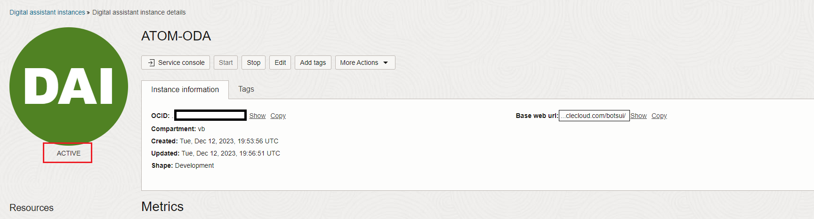
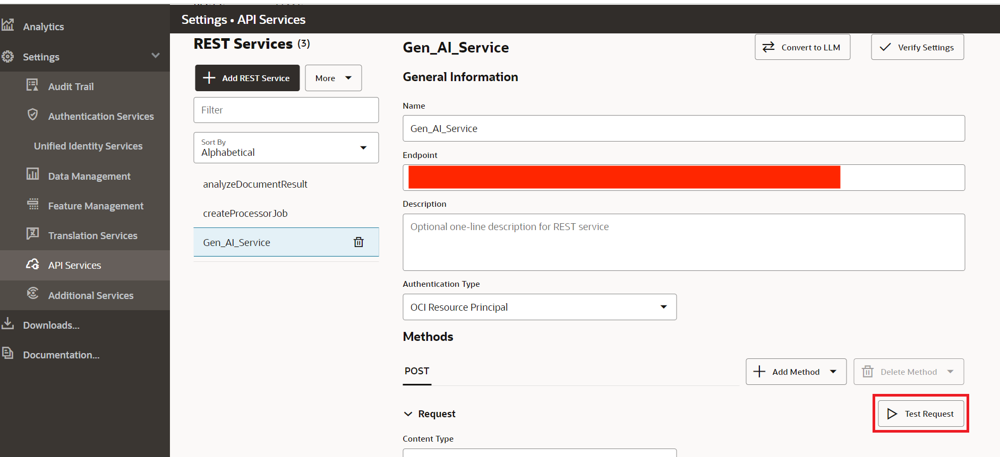
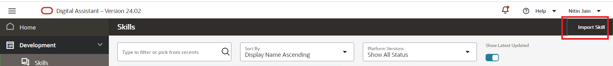
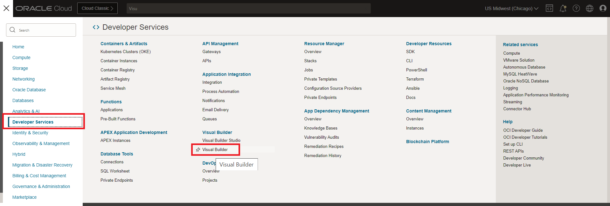
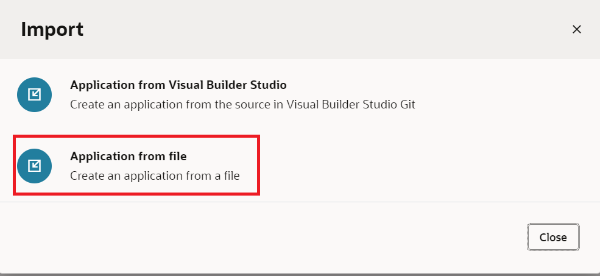
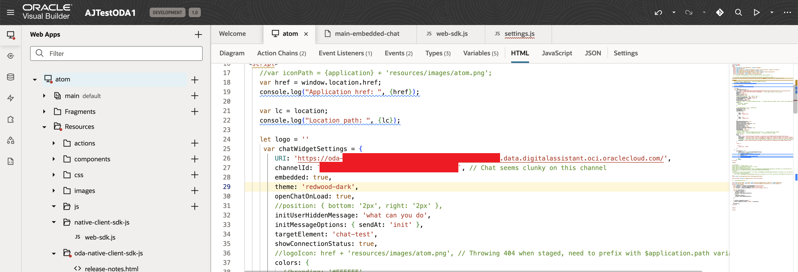
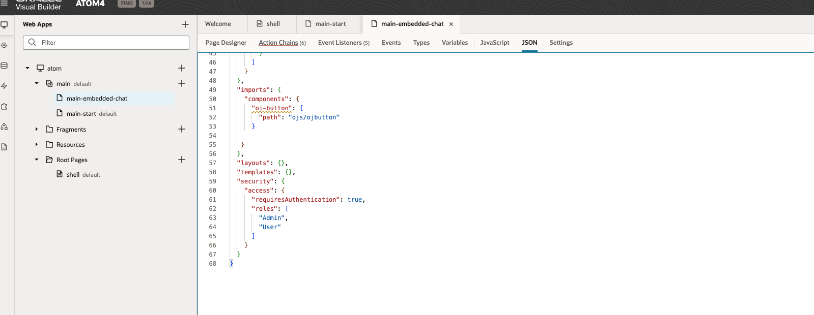

# Using Document Understanding & Speech service

## Introduction

This lab will take you through the steps needed to use Document Understanding & Speech service

Estimated Time: 2 hours 30 minutes

### About Oracle Document Understanding & Speech service

Oracle Cloud Infrastructure (OCI) Document Understanding is an AI service that enables developers to extract text, tables, and other key data from document files through APIs and command line interface tools. With OCI Document Understanding, you can automate tedious business processing tasks with prebuilt AI models and customize document extraction to fit your industry-specific needs.

OCI Speech is an AI service that uses automatic speech recognition technology to transform audio content to text and textual content to speech. Get accurate, text-normalized, time-stamped transcriptions via the OCI console, OCI Data Science notebooks, and REST APIs as well as command-line interfaces or SDKs.

### Objectives

To use Document Understanding & Speech services.Please find detail architecture diagram for better understanding.


### Prerequisites

This lab assumes you have:

* An Oracle account
* Access to the Chicago and Ashburn Region
* Administrator permissions or permissions to use the Generative AI family, the AI services family, Digital Assistant, Visual Builder and Identity Domains

## Task 1: Provision Oracle Digital Assistant

This task will help you to create Oracle Digital Assistant under your chosen compartment. OCI Document Understanding service is only available in Ashburn region. Since we're using Ashburn region for this we will have to create a new Digital Assistant in Ashburn region.

1. Locate Digital Assistant under AI Services

   

   > **Note:** You can find Digital Assistant under the AI Services.

2. Provide the information for **Compartment**, **Name** , **Description** (optional) & **Shape**. Click **Create**

    

3. In few minutes the status of recently created Digital Assistant will change from **Provisioning** to **Active**

    

## Task 2: Policy creation for Oracle Document Understanding and Speech Access

Create a Dynamic Group
Go to Identity>>Domains>>Default domain>>Dynamic groups


Click on Create dynamic group and name it as odaDynamicGroup

Select radio button - Match any rules defined below
Add the following rules. Please change the values of OCIDs to your own values here.

Rule 1

```text
     <copy>
    All {instance.id = 'ocid1.odainstance.oc1.us-chicago-1.XXXX'}
     </copy>
```

Note - This will be ocid of Digital Assistant in Chicago region

Rule 2

```text
     <copy>
    All {resource.type='odainstance', resource.compartment.id='ocid1.compartment.oc1..XXXX' }
    </copy>
 ```

Rule 3

```text
    <copy>
    ALL {resource.type = 'fnfunc', resource.compartment.id = 'ocid1.compartment.oc1..XXXX'}
     </copy>
```

Rule 4

```text
     <copy>
    All {instance.id = 'ocid1.odainstance.oc1.iad.XXX'}
    </copy>
```

Note - This will be ocid of Digital Assistant in Ashburn region

This task will help you to create necessary policy for the Oracle Document Understanding Service

1. Attach the policy at the root compartment level. Please change the values of OCIDs to your own values here.

    ODA_Access - Policy to allow users access to ODA

    ```text
        <copy>
        Allow any-user to use ai-service-generative-ai-family in tenancy where request.principal.id='ocid1.odainstance.oc1.us-chicago-1.XXXXXXXXXXXXXXXXXXXXXXXXXX'
        Allow any-user to use generative-ai-family in tenancy where request.principal.id='ocid1.odainstance.oc1.us-chicago-1.XXXXXXXXXXXXXXXXXXXXXX'
        Allow any-user to use fn-invocation in tenancy where request.principal.id='ocid1.odainstance.oc1.us-chicago-1.XXXXXXXXXXXXXXXXXXXX'
        Allow dynamic-group odaDynamicGroup to use fn-invocation in tenancy
        </copy>
    ```

    API-Gateway-Policy - Policy to allow API Gateway to access functions for atom

     ```text
        <copy>
        ALLOW any-user to use functions-family in compartment vb where ALL {request.principal.type= 'ApiGateway', request.resource.compartment.id = 'ocid1.compartment.oc1..XXXX'}
        </copy>
    ```

    ODA-Speech-Policy - Allows ODA Dev to connect to speech service. Also includes access to object storage.

    ```text
        <copy>
        allow any-user to manage ai-service-speech-family in tenancy where request.principal.id='ocid1.odainstance.oc1.us-chicago-1.XXXX'

        allow any-user to manage object-family in tenancy where request.principal.id='ocid1.odainstance.oc1.us-chicago-1.XXXX'

        allow any-user to read tag-namespaces in tenancy where request.principal.id='ocid1.odainstance.oc1.us-chicago-1.XXXX'

        allow dynamic-group odaDynamicGroup to manage ai-service-speech-family in tenancy

        allow dynamic-group odaDynamicGroup to manage object-family in tenancy

        allow dynamic-group odaDynamicGroup to read tag-namespaces in tenancy

        ALLOW dynamic-group odaDynamicGroup to use fn-invocation in compartment vb

        Allow dynamic-group odaDynamicGroup to read objectstorage-namespaces in tenancy

        Allow dynamic-group odaDynamicGroup to manage logging-family in compartment vb

        Allow dynamic-group odaDynamicGroup to read metrics in compartment vb
        </copy>
     ```

    > **Note:**
    > * Please make sure that the compartmentId should be the one under which the resource is  created.

## Task 3: Create REST Service

This task involves creating REST service which will be used by ODA to connect to OCI Generative AI Service. The REST Service will be created for the ODA created in **Task 1**. This step only needs to be done once per ODA instance. If users are sharing one ODA instance to create multiple chatbot, only the first person will need to perform this step

1. Locate the ODA created in **Task 1**

    

2. Select the earlier created ODA Instance and click on **Service Console**

    

3. Click on hamburger menu and locate & click **API Services**

    

4. Click on **Add REST Service**. Provide the following details. Please note you will have to change values of CompartmentID and modelID to your own ID values in the Body section. You can follow the next step - Step 5 to see how to retrieve model ID.
    * **Name**

    ```text
    <copy>
    Gen_AI_Service
    </copy>
    ```

    * **Endpoint**

    ```text
    <copy>
    https://inference.generativeai.us-chicago-1.oci.oraclecloud.com/20231130/actions/chat
     </copy>
    ```

    * **Description (Optional)** : `Optional`
    * **Authentication Type** : OCI Resource Principal
    * **Method** : POST
    * **Body**

    ```text
    <copy>
    {
        "compartmentId": "ocid1.compartment.oc1..XXXXXXXXXXX",
        "servingMode": {
            "modelId": "ocid1.generativeaimodel.oc1.us-chicago-1.XXXXXXXX",
            "servingType": "ON_DEMAND"
        },
        "chatRequest": {
            "apiFormat": "COHERE",
            "message": "Hi, how are you",
            "isStream": true
        }
    }
    </copy>
    ```

5. This step is broken down into following 3 steps
    * Step 1: Click on hamburger menu of OCI console and select **AI Services** > **Generative AI**

    

    * Step 2: Select Chat (under **Playground** heading)

    

    * Step 3: For the **Model**=**cohere.command-r-plus v1.2**, Click **View Model Details**, and then click on **copy** link for the **cohere.command-r-plus** and **version** = 1.2

    

6. Click **Test Request** to make sure the connection is successful

   

    > **Note**
    > * Retrieve the modelId (OCID) from OCI Gen AI Services Playground and use a compartmentId where the ODA is hosted inside
    > * If you are using a different name (and not Gen AI Service) for your Rest service then please make a change in your LLM Provider in Settings as well. To do that Go to Skills -> Settings -> Configuration -> Large Language Model Services -> LLM Provider. Choose the new Rest Service for both Gen AI LLM and  Gen AI Truncate LLM

    

7. Click on **Add REST Service**. Provide the following details:
    * **Name**

    ```text
    <copy>
    getTranscriptionJobListService
    </copy>
    ```

    * **Endpoint**

    ```text
    <copy>
    https://speech.aiservice.us-ashburn-1.oci.oraclecloud.com/20220101/transcriptionJobs/{transcriptionJobId}/transcriptionTasks/
    </copy>
    ```

    * **Description (Optional)** : `Optional`
    * **Authentication Type** : OCI Resource Principal
    * **Method** : GET

    Click **Test Request** to make sure the connection is successful.

   

8. Click on **Add REST Service**. Provide the following details:
    * **Name**

    ```text
    <copy>
    getTranscriptionTaskService
    </copy>
    ```

    * **Endpoint**

    ```text
    <copy>
    https://speech.aiservice.us-ashburn-1.oci.oraclecloud.com/20220101/transcriptionJobs/{transcriptionJobId}/transcriptionTasks/{transcriptionTaskId}
     </copy>
    ```

    * **Description (Optional)** : `Optional`
    * **Authentication Type** : OCI Resource Principal
    * **Method** : GET

    Click **Test Request** to make sure the connection is successful.

   

9. Click on **Add REST Service**. Provide the following details. Please note you will have to change values of CompartmentID, bucket name, namespace and object name to your own values in the Body section.
    * **Name**

    ```text
    <copy>
    SpeechService
    </copy>
    ```

    * **Endpoint**

    ```text
    <copy>
    https://speech.aiservice.us-ashburn-1.oci.oraclecloud.com/20220101/transcriptionJobs
     </copy>
    ```

    * **Description (Optional)** : `Optional`
    * **Authentication Type** : OCI Resource Principal
    * **Method** : POST
    * **Content Type** : application/json
    * **Body**

    ```text
    <copy>
    {
    "compartmentId": "ocid1.compartment.oc1..aXXXXXX",
    "inputLocation": {
        "locationType": "OBJECT_LIST_INLINE_INPUT_LOCATION",
        "objectLocations": [
            {
                "bucketName": "Your bucket",
                "namespaceName": "Your namespace",
                "objectNames": [
                    "Your_test_file.mp4"
                ]
            }
        ]
    },
    "outputLocation": {
        "bucketName": "Your bucket",
        "namespaceName": "Your namespace",
        "prefix": "output/"
    }
    }
    </copy>
    ```

    Click **Test Request** to make sure the connection is successful

   

## Task 4: Import Skill

1. Click on the link to download the required skill (zip file): [Atom Skill DU.zip](https://objectstorage.us-ashburn-1.oraclecloud.com/p/zlXC_E0MVuy2edcz4Zs5GQNTOTy6wVx5ObK3EDNMUVz7ptSUmx90lnA9uj7Dad6V/n/c4u02/b/hosted_workshops/o/ATOM_DU.zip)

2. Import the skill (downloaded). Click on **Import Skill** & select the zip file to import

   

3. Once the skill is imported. Click on the Skill and go to Components as shown in the image below.

    

4. Click on Add Service and give this service a name of your choice. For example - RPlusService. And upload the following .tgz file under Component Service Package Creation Type section. Please make sure to change the CompartmentID and modelID located in Rtransformer.js file in components folder to your own CompartmentID and modelID. So in short, you have to unzip it, change those IDs and zip it again to tgz format. Click to download the file [R_Transformer.tgz](https://objectstorage.us-ashburn-1.oraclecloud.com/p/IZm77Vl42_dHGMca5-8XFpMm8rvAebL44L-7C_mXzVb7KfOrY1G_Uy7Ilqd6Vg9w/n/c4u02/b/hosted_workshops/o/R_Transformer.tgz)

    

5. Click on hamburger menu and locate & click **API Services** under Settings section. Click on LLM Services and Import the following LLM Service as shown in the image below. Please make sure to change the CompartmentID and modelID located in yaml file to your own CompartmentID and modelID. Click to download the file [LLMService-ChatRPlusLLM.yaml](https://objectstorage.us-ashburn-1.oraclecloud.com/p/L3-NZ_Z7sZheGNvgA6hprS4D_5LXTIBN4WKusdq3llb_QtAxvHZLSpBD4KH3HnBK/n/c4u02/b/hosted_workshops/o/LLMService-ChatRPlusLLM.yaml)

    

6. Go to Skills -> Settings -> Configuration -> Large Language Model Services. Click on New LLM Service.

    

7. Provide a name of your choice for this Service. Give LLM Provider value as the one you imported in Step 5. Give Transformation Handler value as the one you imported in Step 4. Click on Check mark under Action to save it as shown in the image below.

    

8. Go to Skills -> Flows. Click on Chat.

    

9. Click on invokeLLM and then click on Component. Select the same LLM Service which was created in Step 7.

    

## Task 5: Changes to Skill

1. Go to Skills -> Settings -> Configuration
Provide a value to da.privateKey (Any Password)

2. Go to Skills -> Flow Designer and make sure there are no errors in documentUnderstandingCC, getSpeechLifecyleState, searchFlow and speechComponent of the flows

## Task 6: Create Channel to embed ODA in Visual Builder Application (provided) or in any custom Web App

1. Click on hamburger menu and select Development > Channels

    

2. Select the following option on the form:

    * **Channel Type** = Oracle Web
    * **Allowed Domain** = *

    

3. After channel creation, enable the Channel by using the toggle button (screenshot).
   * Route it to skill imported in Task 4

   

4. Disable the **Client Authentication Enabled** toggle. (Take note of channelId for **Task 6** in later step).

    

## Task 7: Create VBCS Instance & embed ODA skill in VBCS Application

1. Click on main hamburger menu on OCI cloud console and navigate Developer Services > Visual Builder

    

2. Create Visual Builder Instance by providing the details and click **Create Visual Builder Instance**:
    * **Name** = <name_of_your_choice>
    * **Compartment** = <same_compartment_as_oda>
    * **Node** = <as_per_need>

    

3. Wait for the instance to come to **Active** (green color) status

4. Click on the link to download the VB application (zip file): [ATOM_VB.zip](https://objectstorage.us-ashburn-1.oraclecloud.com/p/UcaJRNLr-UXQ55zFIOdS_rloRYfUSYA49sRGZsBON3ZNYncODcwC1DLdz7Xw4PJd/n/c4u02/b/hosted_workshops/o/ATOM_VB.zip)

5. Import the application in provisioned instance as per the screenshots. Users only need one VCBS instance created. They can import/create multiple applications in the instance for each additional chatbot they have

    * Click on Import from Visual Builder Instance

        

    * Choose the option as below

        

    * Provide the App Name with other details and select the provided application zip file

        

6. Once import is completed, open the index.html file in the VB Instance and update the details as follows:

    * **URI** = '<https://oda-XXXXXXXXXXXXXXXXXXXXXX.data.digitalassistant.oci.oraclecloud.com/>'
    * **channelId** = 'XXXXXXXXXXXXXXXXXXXXXXXXXXXX'
    * Please change value of initUserHiddenMessage on Line 32 from 'what can you do' to 'Hello'

    

    > **Note**
    > * URI is the hostname of ODA instance provisioned in **Task 1**
    > * channelId is created during **Task 5** - **Step 3**

7. The UI of the chatbot such as theme, color and icon can be changed by modifying the parameters under var chatWidgetSetting from index.html

8. Click on the Play button shown in the above image on the top right corner to launch ATOM chatbot and start chatting with ATOM.

9. You may face an issue when you go to publish the live link of the application. It may throw a "forbidden" error. The solution is to remove the "Admin" and "User" role in the JSON tab from all the vb pages - main-start, main-embedded-chat, and the shell page as shown in the image below.

    

## Acknowledgements

**Authors**
* **Abhinav Jain**, Senior Cloud Engineer, NACIE

**Last Updated By/Date:**
* **Abhinav Jain**, Senior Cloud Engineer, NACIE, Sep 2024