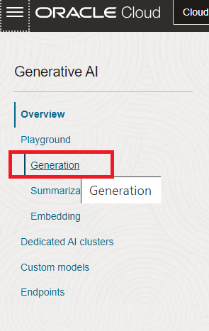
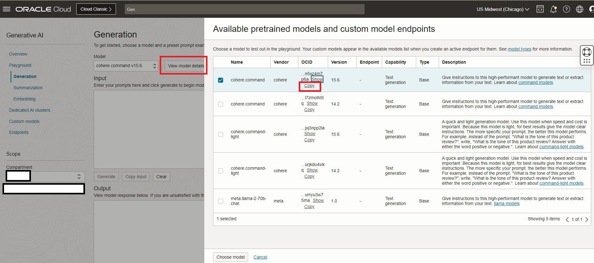

# Using Document Understanding & Speech service

## Introduction

This lab will take you through the steps needed to use Document Understanding & Speech service

Estimated Time: 2 hours 30 minutes

### About Oracle Document Understanding & Speech service

Oracle Cloud Infrastructure (OCI) Document Understanding is an AI service that enables developers to extract text, tables, and other key data from document files through APIs and command line interface tools. With OCI Document Understanding, you can automate tedious business processing tasks with prebuilt AI models and customize document extraction to fit your industry-specific needs.

OCI Speech is an AI service that uses automatic speech recognition technology to transform audio content to text and textual content to speech. Get accurate, text-normalized, time-stamped transcriptions via the OCI console, OCI Data Science notebooks, and REST APIs as well as command-line interfaces or SDKs.

### Objectives

To use Document Understanding & Speech services.Please find detail architecture diagram for better understanding.


### Prerequisites

This lab assumes you have:

* An Oracle account
* Access to the Chicago and Ashburn Region
* Administrator permissions or permissions to use the Generative AI family, the AI services family, Digital Assistant, Visual Builder and Identity Domains

## Task 1: Provision Oracle Digital Assistant

This task will help you to create Oracle Digital Assistant under your choosen compartment. OCI Document Understanding service is only available in Ashburn region. Since we're using Ashburn region for this we will have to create a new Digital Assistant in Ashburn region.

1. Locate Digital Assistant under AI Services

   

   > **Note:** You can find Digital Assistant under the AI Services.

2. Provide the information for **Compartment**, **Name** , **Description** (optional) & **Shape**. Click **Create**

    

3. In few minutes the status of recently created Digital Assistant will change from **Provisioning** to **Active**

    

## Task 2: Policy creation for Oracle Document Understanding and Speech Access

Create a Dynamic Group

Go to Identity>>Domains>>Default domain>>Dynamic groups


Click on Create dynamic group and name it as odaDynamicGroup

Select radio button - Match any rules defined below
Add the following rules

Rule 1

```text
    <copy>
    All {instance.id = 'ocid1.odainstance.oc1.us-chicago-1.XXXX'}
    </copy>
    ```
Note - This will be ocid of Digital Assistant in Chicago region

Rule 2
```text
    <copy>
    All {resource.type='odainstance', resource.compartment.id='ocid1.compartment.oc1..XXXX' }
    </copy>
    ```


Rule 3
```text
    <copy>
    ALL {resource.type = 'fnfunc', resource.compartment.id = 'ocid1.compartment.oc1..XXXX'}
    </copy>
    ```

Rule 4
```text
    <copy>
    All {instance.id = 'ocid1.odainstance.oc1.iad.XXX'}
    </copy>
    ```
Note - This will be ocid of Digital Assistant in Ashburn region

This task will help you to create necessary policy for the Oracle Document Understanding Service

1. Attach the policy at the root compartment level

    ODA_Access - Policy to allow users access to ODA
    ```text
    <copy>
    Allow any-user to use ai-service-generative-ai-family in tenancy where request.principal.id='ocid1.odainstance.oc1.us-chicago-1.XXXXXXXXXXXXXXXXXXXXXXXXXX'
    Allow any-user to use generative-ai-family in tenancy where request.principal.id='ocid1.odainstance.oc1.us-chicago-1.XXXXXXXXXXXXXXXXXXXXXX'
    Allow any-user to use fn-invocation in tenancy where request.principal.id='ocid1.odainstance.oc1.us-chicago-1.XXXXXXXXXXXXXXXXXXXX'
    Allow dynamic-group odaDynamicGroup to use fn-invocation in tenancy
    </copy>
    ```
    API-Gateway-Policy - Policy to allow API Gateway to access functions for atom
    ```text
    <copy>
    ALLOW any-user to use functions-family in compartment vb where ALL {request.principal.type= 'ApiGateway', request.resource.compartment.id = 'ocid1.compartment.oc1..XXXX'}
    </copy>
    ```
    ODA-Speech-Policy - Allows ODA Dev to connect to speech service. Also includes access to object storage.
    ```text
    <copy>
    allow any-user to manage ai-service-speech-family in tenancy where request.principal.id='ocid1.odainstance.oc1.us-chicago-1.XXXX'

    allow any-user to manage object-family in tenancy where request.principal.id='ocid1.odainstance.oc1.us-chicago-1.XXXX'

    allow any-user to read tag-namespaces in tenancy where request.principal.id='ocid1.odainstance.oc1.us-chicago-1.XXXX'

    allow dynamic-group odaDynamicGroup to manage ai-service-speech-family in tenancy

    allow dynamic-group odaDynamicGroup to manage object-family in tenancy

    allow dynamic-group odaDynamicGroup to read tag-namespaces in tenancy

    ALLOW dynamic-group odaDynamicGroup to use fn-invocation in compartment vb

    Allow dynamic-group odaDynamicGroup to read objectstorage-namespaces in tenancy

    Allow dynamic-group odaDynamicGroup to manage logging-family in compartment vb

    Allow dynamic-group odaDynamicGroup to read metrics in compartment vb
    </copy>
    ```

    > **Note:**
    > * Please make sure that the compartmentId should be the one under which the resource is  created.

## Task 3: Create REST Service

This task involves creating REST service which will be used by ODA to connect to OCI Generative AI Service. The REST Service will be created for the ODA created in **Task 1**. This step only needs to be done once per ODA instance. If users are sharing one ODA instance to create multiple chatbot, only the first person will need to perform this step

1. Locate the ODA created in **Task 1**

    

2. Select the earlier created ODA Instance and click on **Service Console**

    

3. Click on hamburger menu and locate & click **API Services**

    

4. Click on **Add REST Service**. Provide the following details:
    * **Name**

    ```text
    <copy>
    Gen_AI_Service
    </copy>
    ```

    * **Endpoint**

    ```text
    <copy>
    https://inference.generativeai.us-chicago-1.oci.oraclecloud.com/20231130/actions/generateText
     </copy>
    ```

    * **Description (Optional)** : `Optional`
    * **Authentication Type** : OCI Resource Principal
    * **Method** : POST
    * **Request**
    * **Body**

    ```text
    <copy>
    {
        "compartmentId": "ocid1.compartment.oc1..XXXXXXXXXXX",
        "servingMode": {
            "modelId": "ocid1.generativeaimodel.oc1.us-chicago-1.XXXXXXXX",
            "servingType": "ON_DEMAND"
        },
        "inferenceRequest": {
            "prompt": "What is OCAF?",
            "maxTokens": 600,
            "temperature": 1,
            "frequencyPenalty": 0,
            "presencePenalty": 0,
            "topP": 0.75,
            "topK": 0,
            "returnLikelihoods": "GENERATION",
            "isStream": true,
            "stopSequences": [],
            "runtimeType": "COHERE"
        }
    }
    </copy>
    ```

5. This step is broken down into following 3 steps
    * Step 1: Click on hamburger menu of OCI console and select **AI Services** > **Generative AI**

    

    * Step 2: Select Generation (under **Playground** heading)

    

    * Step 3: For the **Model**=**cohere.command.v15.6**, Click **View Model Details**, and then click on **copy** link for the **cohere.command** and **version** = 15.6

    

6. Click **Test Request** to make sure the connection is successful

   

    > **Note**
    > * Retrieve the modelId (OCID) from OCI Gen AI Services Playground and use a compartmentId where the ODA is hosted inside
    > * If you are using a different name (and not Gen_AI_Service) for your Rest service then please make a change in your LLM Provider in Settings as well. To do that Go to Skills -> Settings -> Configuration -> Large Language Model Services -> LLM Provider. Choose the new Rest Service for both GenAI_LLM and  GenAI_Truncate_LLM

    

7. Click on **Add REST Service**. Provide the following details:
    * **Name**

    ```text
    <copy>
    getTranscriptionJobListService
    </copy>
    ```

    * **Endpoint**

    ```text
    <copy>
    https://speech.aiservice.us-ashburn-1.oci.oraclecloud.com/20220101/transcriptionJobs/{transcriptionJobId}/transcriptionTasks/
     </copy>
    ```

    * **Description (Optional)** : `Optional`
    * **Authentication Type** : OCI Resource Principal
    * **Method** : GET
    * **Request**
    * **Body**
    * **Parameters**
    Key: transcriptionJobId
    Value: ocid1.aispeechtranscriptionjob.oc1.iad.amaXXXXXX
    Type: Path

    Click **Test Request** to make sure the connection is successful. Note you will have to create your own job in Speech Services to get the value of transcription job ocid.

   

8. Click on **Add REST Service**. Provide the following details:
    * **Name**

    ```text
    <copy>
    getTranscriptionTaskService
    </copy>
    ```

    * **Endpoint**

    ```text
    <copy>
    https://speech.aiservice.us-ashburn-1.oci.oraclecloud.com/20220101/transcriptionJobs/{transcriptionJobId}/transcriptionTasks/{transcriptionTaskId}
     </copy>
    ```

    * **Description (Optional)** : `Optional`
    * **Authentication Type** : OCI Resource Principal
    * **Method** : GET
    * **Request**
    * **Body**
    * **Parameters**
    Key: transcriptionJobId
    Value: ocid1.aispeechtranscriptionjob.oc1.iad.XXXXXXXX
    Type: Path

    Key: transcriptionTaskId
    Value: ocid1.aispeechtranscriptiontask.oc1.iad.amaXXXXXXX
    Type: Path

    Click **Test Request** to make sure the connection is successful. Note you will have to create your own job in Speech Services to get the value of transcription task ocid.


   

9. Click on **Add REST Service**. Provide the following details:
    * **Name**

    ```text
    <copy>
    SpeechService
    </copy>
    ```

    * **Endpoint**

    ```text
    <copy>
    https://speech.aiservice.us-ashburn-1.oci.oraclecloud.com/20220101/transcriptionJobs
     </copy>
    ```

    * **Description (Optional)** : `Optional`
    * **Authentication Type** : OCI Resource Principal
    * **Method** : POST
    * **Request**
    * **Content Type** : application/json
    * **Body**

    ```text
    <copy>
    {
    "compartmentId": "ocid1.compartment.oc1..aXXXXXX",
    "inputLocation": {
        "locationType": "OBJECT_LIST_INLINE_INPUT_LOCATION",
        "objectLocations": [
            {
                "bucketName": "Your bucket",
                "namespaceName": "Your namespace",
                "objectNames": [
                    "Your_test_file.mp4"
                ]
            }
        ]
    },
    "outputLocation": {
        "bucketName": "Your bucket",
        "namespaceName": "Your namespace",
        "prefix": "output/"
    }
    }
    </copy>
    ```
    * **Parameters**

    Click **Test Request** to make sure the connection is successful

   

## Task 4: Import Skill

1. Click on the link to download the required skill (zip file): [Atom_Skill_DU.zip](https://objectstorage.us-ashburn-1.oraclecloud.com/p/zlXC_E0MVuy2edcz4Zs5GQNTOTy6wVx5ObK3EDNMUVz7ptSUmx90lnA9uj7Dad6V/n/c4u02/b/hosted_workshops/o/ATOM_DU.zip)

2. Import the skill (downloaded). Click on **Import Skill** & select the zip file to import

   

## Task 5: Changes to Skill

1. Go to Skills -> Settings -> Configuration
Provide a value to da.privateKey (Any Password)

2. Go to Skills -> Flow Designer and make sure there are no errors in documentUnderstandingCC, getSpeechLifecyleState, searchFlow and speechComponent of the flows

## Task 6: Create Channel to embed ODA in Visual Builder Application (provided) or in any custom Web App

1. Click on hamburger menu and select Development > Channels

    

2. Select the following option on the form:

    * **Channel Type** = Oracle Web
    * **Allowed Domain** = *

    

3. After channel creation, enable the Channel by using the toggle button (screenshot).
   * Route it to skill imported in Task 4

   

4. Disable the **Client Authentication Enabled** toggle. (Take note of channelId for **Task 6** in later step).

    

## Task 7: Create VBCS Instance & embed ODA skill in VBCS Application

1. Click on main hamburger menu on OCI cloud console and navigate Developer Services > Visual Builder

    

2. Create Visual Builder Instance by providing the details and click **Create Visual Builder Instance**:
    * **Name** = <suitable_name>
    * **Compartment** = <same_compartment_as_oda>
    * **Node** = <as_per_need>

    

3. Wait for the instance to come to **Active** (green color) status

4. Click on the link to download the VB application (zip file): [ATOM_VB.zip](https://objectstorage.us-ashburn-1.oraclecloud.com/p/UcaJRNLr-UXQ55zFIOdS_rloRYfUSYA49sRGZsBON3ZNYncODcwC1DLdz7Xw4PJd/n/c4u02/b/hosted_workshops/o/ATOM_VB.zip)

5. Import the application in provisioned instance as per the screenshots. Users only need one VCBS instance created. They can import/create multiple applications in the instance for each additional chatbot they have

    * Click on Import from Visual Builder Instance

        

    * Choose the option as below

        

    * Provide the App Name with other details and select the provided application zip file

        

6. Once import is completed, open the index.html file in the VB Instance and update the details as follows:

    * **URI** = '<https://oda-XXXXXXXXXXXXXXXXXXXXXX.data.digitalassistant.oci.oraclecloud.com/>'
    * **channelId** = 'XXXXXXXXXXXXXXXXXXXXXXXXXXXX'
    * Please change value of initUserHiddenMessage on Line 32 from 'what can you do' to 'Hello'

    

    > **Note**
    > * URI is the hostname of ODA instance provisioned in **Task 1**
    > * channelId is created during **Task 5** - **Step 3**

7. The UI of the chatbot such as theme, color and icon can be changed by modifying the parameters under var chatWidgetSetting from index.html

8. Click on the Play button shown in the above image on the top right corner to launch ATOM chatbot and start chatting with ATOM.

## Acknowledgements

**Authors**
* **Abhinav Jain**, Senior Cloud Engineer, NACIE