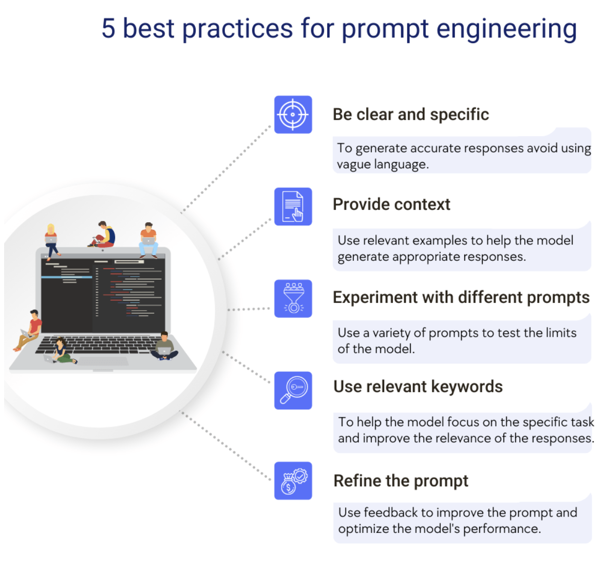
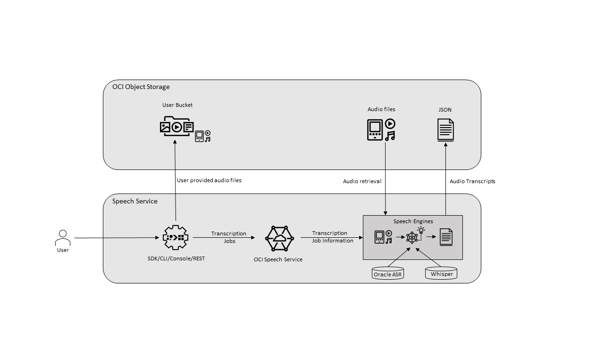

# Using ATOM and Developer Info

## Introduction

This lab will serve as a guide as to how to use ATOM.

Estimated Time: 1 hours 30 minutes

### Objectives

Learn how to use ATOM

### Prerequisites

This lab assumes you have:

* An Oracle account
* Access to the Chicago and Ashburn Region
* Administrator permissions or permissions to use the Generative AI family, the AI services family, Digital Assistant, Visual Builder and Identity Domains

## Task 1: About ATOM (Autonomous Target Operating Model)

Once you've completed all the previous labs you'll have the option to interact with ATOM in following ways -

1. Chat with ATOM

2. Process Attachments
ATOM currently supports word-based files in such as .txt, pdf, or csv. Large files may have issues.

3. Document Understanding
ATOM currently supports files in JPEG, PNG, PDF, DOCX and TIFF documents with five pages or fewer. Large files may have issues.
This is due to the fact when processing the content of the document in the llm, the [token window](https://docs.oracle.com/en-us/iaas/releasenotes/generative-ai/command-r-08-2024.htm) for the cohere model as of writing is 128k tokens, which is roughly equivalent to 40k words. 

4. Analyze Speech
ATOM supports files up to 25 MB. This is a limitation of the [Oracle Web SDK](https://docs.oracle.com/en/cloud/paas/digital-assistant/sdk-js/index.html)

Let's look at Chat with ATOM in more detail

Generative AI is a method of generating content based on a natural language description of the desired response. This description of the desired response is called a prompt and it is the primary mechanism to invoke a response from a Generative AI model.  It works by statistically predicting the next word (token) in the response it has generated thus far. Those models behind it are typically Large Language Models (LLM) that have been pre-trained with millions/billions of data points from a very large corpus of text (or other content). So, you prompt the model to obtain the best response for your use case. This experimentation cycle is often called "prompt engineering" and is an iterative process of trial and error.

### What is Prompt engineering?
Prompt engineering is the process where you guide generative AI solutions to generate desired outputs. Even though generative AI attempts to mimic humans, it requires detailed instructions to create high-quality and relevant output. In prompt engineering, you choose the most appropriate formats, phrases, words, and symbols that guide the AI to interact with your users more meaningfully. Prompt engineers use creativity plus trial and error to create a collection of input texts, so an application's generative AI works as expected.

### What is a Prompt?
A prompt is a natural language text that requests the generative AI to perform a specific task.

Generative AI systems require context and detailed information to produce accurate and relevant responses. When you systematically design prompts, you get more meaningful and usable creations. In prompt engineering, you continuously refine prompts until you get the desired outcomes from the AI system. A prompt for a language model is a set of instructions or input provided by a user to guide the model's response, helping it understand the context and generate relevant and coherent language-based output, such as answering questions, completing sentences, or engaging in a conversation. There is an art to getting an LLM to do what you want them to do. People generally refer to this as Prompt Engineering.

### Tips to Enhance Prompt Engineering
As AI-powered tools become increasingly prevalent, prompt engineering is becoming a skill that developers need to master. Large language models (LLMs) and other generative foundation models require contextual, specific, and tailored natural language instructions to generate the desired output. This means that developers need to write prompts that are clear, concise, and informative.

### Tip #1: Know the model’s strengths and weaknesses

As AI models evolve and become more complex, developers need to comprehend their capabilities and limitations. Understanding these strengths and weaknesses can help you, as a developer, avoid making mistakes and create safer, more reliable applications.

### Tip #2: Be as specific as possible

AI models can comprehend a variety of prompts. Although AI models can be very knowledgeable, they are still imperfect and can misinterpret prompts that are not specific enough. For AI models to navigate ambiguity, it is important to tailor your prompts specifically to your desired outcome.

### Tip #3: Utilise contextual prompts

Utilise contextual information in your prompts to help the model gain an in-depth understanding of your requests. Contextual prompts can include the specific task you want the model to perform, a replica of the output you're looking for, or a persona to emulate.

> **Note:** Make sure the context you add is relevent. If the context is not relevant, it can confuse the llm. 

### Tip #4: Provide AI models with examples

When creating prompts for AI models, it is helpful to provide examples. This is because prompts act as instructions for the model, and examples can help the model understand what you are asking for.

### Tip #5: Experiment with prompts and personas

The way you construct your prompt impacts the model’s output. By creatively exploring different requests, you will soon have an understanding of how the model weighs its answers, and what happens when you interfuse your domain knowledge, expertise, and lived experience with the power of a multi-billion parameter large language model.

### Tip #6: Try chain-of-thought prompting

Chain of thought prompting is a technique for improving the reasoning capabilities of large language models (LLMs). It works by breaking down a complex problem into smaller steps and then prompting the LLM to provide intermediate reasoning for each step. This helps the LLM to understand the problem more deeply, and to generate more accurate and informative answers.

**Best Practices for Prompt Engineering**

https://help.openai.com/en/articles/6654000-best-practices-for-prompt-engineering-with-openai-api

**Introduction to OCI Document Understanding**

https://docs.oracle.com/en-us/iaas/Content/document-understanding/using/overview.htm

Document Understanding is a serverless, multitenant service, accessible using the Console, REST APIs, SDK, or CLI.

You can upload documents to detect and classify text and objects in them. You can process individual files or batches of documents using the ProcessorJob API endpoint. The following pretrained models are supported:

* Optical Character Recognition (OCR): Document Understanding can detect and recognize text in a document.
* Text extraction: Document Understanding provides the word level and line level text, and the bounding box coordinates of where the text is found.
* Key-value extraction: Document Understanding extracts a predefined list of key-value pair information from receipts, invoices, passports, and driver IDs.
* Table extraction: Document Understanding extracts content in tabular format, maintaining the row and column relationships of cells.
* Document classification: Document Understanding classifies documents into different types based on visual appearance, high-level features, and extracted keywords. For example, document types such as invoice, receipt, and resume.
* Optical Character Recognition (OCR) PDF: Document Understanding generates a searchable PDF file in Object Storage.

### What is AI Speech to Text?
https://docs.oracle.com/en-us/iaas/Content/speech/using/speech.htm

OCI Speech is an AI service that applies automatic speech recognition technology to transform audio-based content into text. Developers can easily make API calls to integrate OCI Speech’s pre-trained models into their applications. OCI Speech can be used for accurate, text-normalized, time-stamped transcription via the console and REST APIs as well as command-line interfaces or SDKs. You can also use OCI Speech in an OCI Data Science notebook session. With OCI Speech, you can filter profanities, get confidence scores for both single words and complete transcriptions, and more.

## Acknowledgements

**Authors**
* **Abhinav Jain**, Senior Cloud Engineer, NACIE

**Contributors**
* **Luke Farley**, Staff Cloud Engineer, NACIE

**Last Updated By/Date:**
* **Luke Farley**, Staff Cloud Engineer, NACIE, Jan 2025