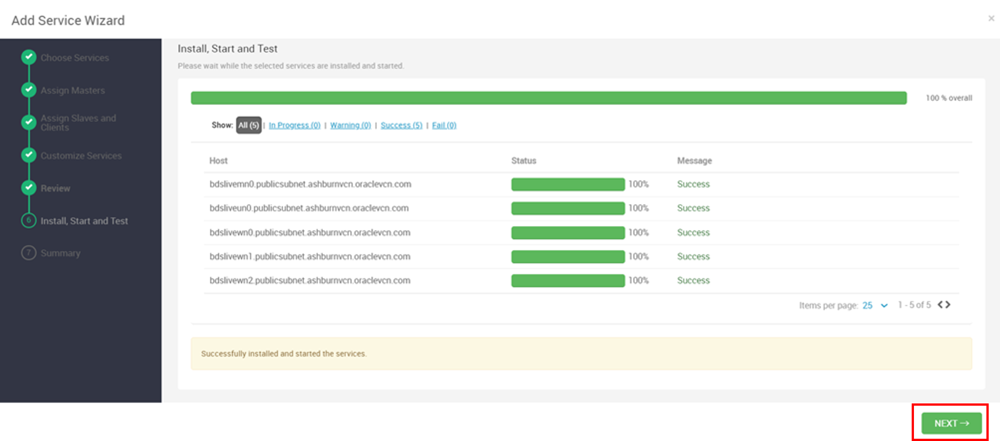

# Lab 1: Set Up Your Environment

## Introduction
In this lab, you'll be guided to prepare follow environment:
BDS Environment
MDS Environment
OAC Environment
Also you will be guided to download a source code and deploy it to BDS.

***Estimated Time***: 2 hours

## Task 1:Prepare BDS Environment
1.	Create an BDS (ODH 2.0) environment on OCI. Refer to the following link for the details.
Get Started with Oracle Big Data Service (non-HA)
[https://apexapps.oracle.com/pls/apex/r/dbpm/livelabs/run-workshop?p210_wid=762&p210_wec=&session=7776710278482
]()

2.  Add Kafka and Flink services. Log into Ambari with the following URL. Enter username and password, then click SIGN IN.


3.  Click … icon beside Services, then select Add Service.


4.  Check Kafka and Flink, then click Next


5.  Click Next to accept all the default settings.
6.  Click Deploy.


7.  After installation, click NEXT.



8.  Click COMPLETE.


9.  Repeat the following steps to restart all affected components. Click RESTART, select Restart All Affected.


10. Click CONFIRM RESTART ALL.


11. After restart, click OK.


12. Execute the following steps to upload jar so you can access MDS and Kafka with Flink and Spark.
Log into BDS node(un0). Download [lib.zip](https://objectstorage.ap-tokyo-1.oraclecloud.com/p/bhsTSKQYGjbeGwm5JW63Re3_o9o2JOrKiQVi_-6hrQfrB7lGSvA1z5RPyDLy3lpU/n/sehubjapacprod/b/live-lab/o/download/lib.zip) to any directory (eg. /tmp/upload，you can change it wherever you want). Unzip it.
Execute the following command to copy jar to all the BDS nodes.
```    
sudo su –
dcli -C "rm -f /usr/odh/current/flink/lib/flink-table-planner-loader-1.15.2.jar"
scp lib/*.jar bdsun0:/usr/odh/current/flink/lib
scp lib/*.jar bdswn0:/usr/odh/current/flink/lib
scp lib/*.jar bdswn1:/usr/odh/current/flink/lib
scp lib/*.jar bdswn2:/usr/odh/current/flink/lib
scp lib/*.jar bdsmn0:/usr/odh/current/flink/lib

hadoop fs -put lib/*.jar /flink/lib/flink-libs
hadoop fs -put /usr/odh/current/flink/connectors/*.jar /flink/lib/flink-libs/

scp lib/mysql-connector-java-8.0.28.jar bdsun0:/usr/odh/current/spark3-client/jars
scp lib/mysql-connector-java-8.0.28.jar bdswn0:/usr/odh/current/spark3-client/jars
scp lib/mysql-connector-java-8.0.28.jar bdswn1:/usr/odh/current/spark3-client/jars
scp lib/mysql-connector-java-8.0.28.jar bdswn2:/usr/odh/current/spark3-client/jars
scp lib/mysql-connector-java-8.0.28.jar bdsmn0:/usr/odh/current/spark3-client/jars
 ```

## Task2: Prepare MDS Environment
Create a MDS (MySQL) environment on OCI.
1. In OCI homepage, select Database > DB Systems.


2. Click Create DB system.


3. Select Development or testing. Input Name. Select Standalone. Input Username and Password.


4. Select VCN and subnet.


5. At the bottom, open Show advanced options. Select Connections tab and input Hostname. Click Create.


6. After a few minutes, MDS is created successfully. Select Connections tab to check the Internal FQDN.


7. Log into BDS un0 node to connect MDS.
 ```
sudo su -
mysql -u <username> -h <MDS Internal FQDN> -p’<Password>’
#eg. mysql -uadmin -h bdslivelab.sub07110452230.shenzhuvcn2.oraclevcn.com -p'Welcome12345#'
 ```
8. Create Database with the following command.
 ```
CREATE DATABASE <database_name>;
#eg. CREATE DATABASE livelab_db;
 ```
9. Create a native user with the following command.
 ```
CREATE USER '<username>'@'%' IDENTIFIED WITH mysql_native_password BY '<password>';
#eg. CREATE USER 'livelab_test'@'%' IDENTIFIED WITH mysql_native_password BY 'Oracle123456!';
 ```
10.	Grant privilege to the native user.
 ```
GRANT ALL PRIVILEGES ON <database_name>.* TO '<username>'@'%';
#eg. GRANT ALL PRIVILEGES ON livelab_db.* TO 'livelab_test'@'%';
 ```
11.	Connect MDS with the native user.
 ```
mysql -u <username> -h <MDS Internal FQDN> -p’<Password>’
#eg. mysql -ulivelab_test -h bdslivelab.sub07110452230.shenzhuvcn2.oraclevcn.com -p'Oracle123456!'
 ```
12. Change the Database.
 ```
use livelab_db;
 ```
## Task3: Prepare OAC Environment
For data visualization ,you need to create an OAC environment on OCI. Refer to the following link for the details.
Getting Started with Oracle Analytics Cloud (OAC)
Task 0: Create an OAC Instance
[https://oracle.github.io/learning-library/solutions-library/cloud-data-platform/workshops/freetier/index.html?lab=oac-data-flow#Task0:CreateanOACInstance(ONLYifyoudonotalreadyhaveone)](For data visualization ,you need to create an OAC environment on OCI. Refer to the following link for the details.

After creating a OAC instance, you need to create connection with MySQL.For accessing MySQL in OAC, you need to create a Private Channel Access.

1.	Click on Private Access Channel.


2.	Click Configure Private Access Channel.


3.	Provide Name for your access channel. Select VCN you want your private access channel to use. Provide DNS Zones. Click Configure.


4.	 To check the status of your private access channel, click on Activity Log. After a few minutes, configuration completed.


5.	Create MySQL connection. Log into OAC home page. Click Create > Connection.


6.	Select MySQL.


7.	Provide Connection Name, Host, Port, Database Name, Username and Password. Then click Save.


## Task4: Deploy Souce Code on BDS
1.	Log into BDS node(un0). Download source.zip to any directory (eg. /tmp/upload，you can change it wherever you want).
source.zip download link:
[source.zip](https://objectstorage.ap-tokyo-1.oraclecloud.com/p/CxV2eZlF7eVrQhIMOIy5t9iWWeSmgW4vDDSrHzPiHSsq9raprO3gP6wc-w-iqyXv/n/sehubjapacprod/b/live-lab/o/download/source.zip)
2. Unzip source.zip.
 ```
sudo su -
chmod -R 777 source
 ```
3.	Replace the parameters in env configuraton file (/source/conf/env.conf) with your actual values.
 ```
#configurations of HDFS
#you can get this value from Ambari kafka configuration page Services-> HDFS -> Configs
#get the value of propertie:fs.defaultFS in Advanced core-site
#example:hdfs://localhost:8020
defaultFs=hdfs://livelabmn0.sub07110452230.shenzhuvcn2.oraclevcn.com:8020

#Mysql configurations
#host:localhost or a Ip Address
mysql_host=livelabdb.sub07110452230.shenzhuvcn2.oraclevcn.com
#username:username for login to mysql
mysql_username=livelab_test
#password:password for login to mysql
mysql_password=Welcome1234!
#port number like:3306
mysql_port=3306

#configurations of kafka bootstap-sever
#you can get this value from Ambari kafka configuration page Services-> Kafka -> Configs
#you need to get the broker host and port.
#example:livelabwn0:6667,livelabwn1:6667,livelabwn2:6667
kafka_bootstrap_server=livelabwn0:6667,livelabwn1:6667,livelabwn2:6667

 ```
4.	Execute clear script (source/bin/clear.sh) to clear MySQL, HDFS, Hive and Kafka.
 ```
sudo su - hdfs
./clear.sh
 ```
5.	After completing the step4, execute init script (source/bin/init.sh) in the same terminal, it will init MySQL tables, Hive tables and create Kafka topic.
 ```
./init.sh
 ```
