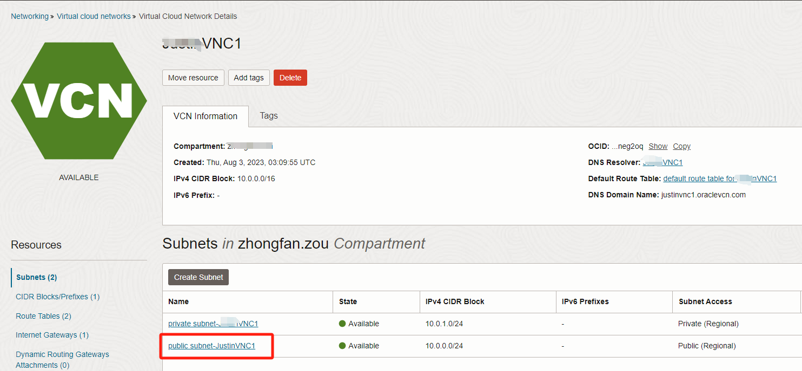
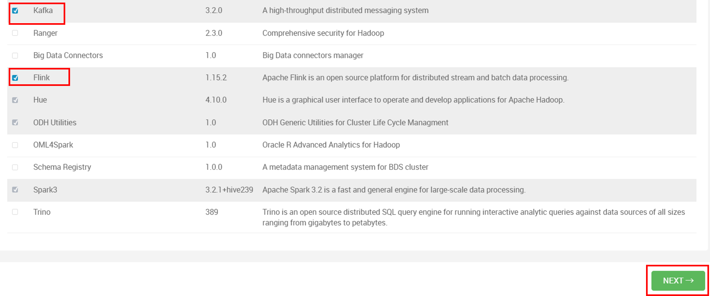
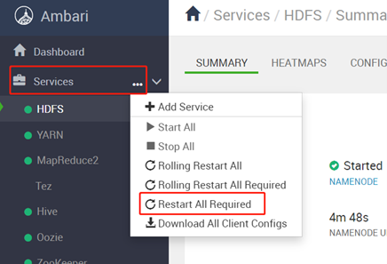

# Lab 1: Initialize the BDS Environment

## Introduction

In this lab, you'll be guided to prepare follow environment:
BDS, MDS and OAC environment. Then, you will be guided to download a source code and deploy it to BDS.

***Estimated Time***: 2 hours

### Objectives

* Prepare environments for the live lab.
* Download and deploy source code.

### Prerequisites

* Create your Oracle OCI Free Trial Account and sign into your account.

## Task 1: Prepare BDS Environment

1. Create an BDS (ODH 2.0) environment on OCI.Please select 3 OCPU for worker nodes. And set the cluster name as bds-cluster. Refer to the following link to created BDS cluster.
   [Get Started with Oracle Big Data Service (non-HA)](https://livelabs.oracle.com/pls/apex/f?p=133:180:115193385491492::::wid:762)

   You should follow below labs:

   Lab 1: Setup the BDS Environment

   Lab 2: Create a BDS Hadoop Cluster

   Lab 4: Access a BDS Node Using a Public IP Address
2. Create Ingress Security Rules (and Open Ports) for Ambari. In this step, you will add ingress security rules to the default security list in your cluster's VCN. This will allow access from anywhere on the internet to Ambari on port **`7183`**.
3. Log in to the **Oracle Cloud Console** as the Cloud Administrator, if you are not already logged in. On the **Sign In** page, select your `tenancy`, enter your `username` and `password`, and then click **Sign In**. The **Oracle Cloud Console** Home page is displayed.
4. Click the **Navigation** menu and navigate to **Networking > Virtual Cloud Networks**.

   
5. On the **Virtual Cloud Networks** page, click your cluster's Virtual Cloud Network, **`training-vcn`**, to display the **Virtual Cloud Network Details** page.


4. Next, you will update the default security list for the public subnet in your VCN. Remember, when you created the cluster, you needed to specify that your cluster belongs to a public subnet. On the **Virtual Cloud Network Details** page, scroll-down to the **Subnets** section. In the **Name** column, click the public subnet for the selected network, **`Public Subnet-training-vcn`**.

  

5. On the **Subnet Details** page, scroll-down to the **Security Lists** section. In the **Name** column, click your **Default Security List** link for your selected network, **`Default Security List for training-vcn`**.


6. On the **Security List Details** page, scroll-down to the **Ingress Rules** section. This section shows the currently available security rules in the selected **Default Security List**. Next, click **Add Ingress Rules**.


7. In the **Add Ingress Rules** dialog box, add the rule for the TCP protocol which enables you to use Ambari to access your cluster. You can add values to this dialog box to meet your security needs. In our example, we are opening up the port for Ambari to all sources by entering **`0.0.0.0/0`** for the **Source CIDR**. Anyone on the internet can access port **`7183`** for Ambari. No egress rule is required to allow the response traffic. Update the source to a more restrictive CDIR if required. Provide the following information:

   + For the **STATELESS** checkbox, leave it unchecked which makes the rule stateful. Any response to the incoming traffic is allowed back to the originating host, regardless of any egress rules applicable to the instance.
   + For the **SOURCE TYPE**, select **`CIDR`**.
   + For the **SOURCE CIDR**, enter **`0.0.0.0/0`**.
   + For the **IP PROTOCOL**, select **`TCP`**.
   + For the **SOURCE PORT RANGE**, enter **`All`**.
   + For the **DESTINATION PORT RANGE**, enter **`7183`**.
   + For the **DESCRIPTION**, enter **`Access Ambari on Port 7183`**.


8. Here are ingress rules are added to the **Default Security List**.


9. Add Kafka and Flink services. Log into Ambari with the following URL.

https://`<bdsclusun0-hostname>`:7183/

Enter **username** and **password**, then click **SIGN IN**.


10. Click **…** icon beside **Services**, then select **Add Service**.


11. Check **Kafka** and **Flink**, then click **Next**.



12. Click **Next** to accept all the default setting. If you see the following recommended configurations, click **PROCEED ANYWAY**.


13. Click **Deploy**.


14. After installation, click **NEXT**.


15. Click **COMPLETE**.


16. Restart all affected components. Click **…** icon beside **Services**, select **Restart All Required**.



17. Click **CONFIRM RESTART ALL**.


18. After restart, click **OK**.


19. Execute the following steps to upload jar so you can access MDS and Kafka with Flink and Spark.
    Log into BDS node(un0) as root user.

```
<copy>
sudo su -
</copy>
```

Download [lib.zip](https://objectstorage.ap-tokyo-1.oraclecloud.com/p/bhsTSKQYGjbeGwm5JW63Re3_o9o2JOrKiQVi_-6hrQfrB7lGSvA1z5RPyDLy3lpU/n/sehubjapacprod/b/live-lab/o/download/lib.zip) to any directory (eg. /tmp) and unzip it.

```
<copy>
cd /tmp
wget https://objectstorage.ap-tokyo-1.oraclecloud.com/p/bhsTSKQYGjbeGwm5JW63Re3_o9o2JOrKiQVi_-6hrQfrB7lGSvA1z5RPyDLy3lpU/n/sehubjapacprod/b/live-lab/o/download/lib.zip
#unzip lib
unzip /tmp/lib.zip
</copy>
```

Execute the following command to copy jar to all the BDS nodes.

```
<copy>
#copy kafka related jar files in bds cluster to flink classpath
dcli -C "cp /usr/odh/current/flink/connectors/*kafka*.jar  /usr/odh/current/flink/lib"
dcli -C "cp /usr/lib/flink/connectors/flink-connector-jdbc-1.15.2.jar  /usr/odh/current/flink/lib"
dcli -C "cp /usr/odh/current/kafka-broker/libs/kafka-clients-3.2.0.jar  /usr/odh/current/flink/lib"

#copy mysql connector jar file to flink classpath
scp /tmp/lib/mysql-connector-java-8.0.28.jar bdsclusun0:/usr/odh/current/flink/lib
scp /tmp/lib/mysql-connector-java-8.0.28.jar bdscluswn0:/usr/odh/current/flink/lib
scp /tmp/lib/mysql-connector-java-8.0.28.jar bdscluswn1:/usr/odh/current/flink/lib
scp /tmp/lib/mysql-connector-java-8.0.28.jar bdscluswn2:/usr/odh/current/flink/lib
scp /tmp/lib/mysql-connector-java-8.0.28.jar bdsclusmn0:/usr/odh/current/flink/lib

#copy mysql connector jar file to spark3 classpath
scp /tmp/lib/mysql-connector-java-8.0.28.jar bdsclusun0:/usr/odh/current/spark3-client/jars
scp /tmp/lib/mysql-connector-java-8.0.28.jar bdscluswn0:/usr/odh/current/spark3-client/jars
scp /tmp/lib/mysql-connector-java-8.0.28.jar bdscluswn1:/usr/odh/current/spark3-client/jars
scp /tmp/lib/mysql-connector-java-8.0.28.jar bdscluswn2:/usr/odh/current/spark3-client/jars
scp /tmp/lib/mysql-connector-java-8.0.28.jar bdsclusmn0:/usr/odh/current/spark3-client/jars

#copy kafka and mysql connector jar to flink cluster classpath
su - hdfs
hadoop fs -put /usr/odh/current/flink/connectors/*.jar /flink/lib/flink-libs/
hadoop fs -put /usr/odh/current/kafka-broker/libs/kafka-clients-3.2.0.jar /flink/lib/flink-libs/
hadoop fs -put /tmp/lib/mysql-connector-java-8.0.28.jar /flink/lib/flink-libs/
</copy>
```

## Task2: Prepare MDS Environment

Create a MDS (MySQL) environment on OCI.

1. In OCI homepage, select **Database** > **DB Systems**.


2. Click **Create DB system**.


3. Select **Development or testing**. Input **Name**. Select **Standalone**. Input **Username** and **Password**.


4. Select **VCN** and **Subnet**.


5. At the bottom, open **Show advanced options**. Select **Connections** tab and input **Hostname**. Click **Create**.


6. After a few minutes, MDS is created successfully. Select **Connections** tab to check the **Internal FQDN**.


You also need to add Ingress Rules for connection MDS with port 3306. Click **subnet details** > **View subnet details.**


Click **Default Security List for ...**.


Click **Add Ingress Rules**.

Source Type: **CIDR**

Source CIDR: **0.0.0.0/0**

IP Protocol: **TCP**

Destination Port Range: **3306**

Click **Add Ingress Rules**.


7. Log into BDS un0 node as root user and connect MDS.

```
<copy>
sudo su -
mysql -u <username> -h <MDS Internal FQDN> -p'<Password>'
#eg. mysql -uadmin -h bdslivelab.sub07110452230.shenzhuvcn2.oraclevcn.com -p'Welcome12345#'
</copy>
```

8. Create Database with the following command.

```
<copy>
CREATE DATABASE <database_name>;
#eg. CREATE DATABASE livelab_db;
</copy>
```

9. Create a native user with the following command.

```
<copy>
CREATE USER '<username>'@'%' IDENTIFIED WITH mysql_native_password BY '<password>';
#eg. CREATE USER 'livelab_test'@'%' IDENTIFIED WITH mysql_native_password BY 'Oracle123456!';
</copy>
```

10. Grant privilege to the native user.

```
<copy>
GRANT ALL PRIVILEGES ON <database_name>.* TO '<username>'@'%';
#eg. GRANT ALL PRIVILEGES ON livelab_db.* TO 'livelab_test'@'%';
</copy>
```

11. Connect MDS with the native user.

```
<copy>
mysql -u <username> -h <MDS Internal FQDN> -p’<Password>’
#eg. mysql -ulivelab_test -h bdslivelab.sub07110452230.shenzhuvcn2.oraclevcn.com -p'Oracle123456!'
</copy>
```

12. Change the Database.

```
<copy>
use livelab_db;
</copy>
```

## Task3: Prepare OAC Environment

For data visualization, you need to create an OAC environment on OCI.

1. In OCI homepage, select Analytics
   & AI > Analytics Cloud.


2. Click **Create Instance.** Input **Name** and click **Create**.


3. After creating a OAC instance, you need to create connection with MySQL. For accessing MySQL in OAC, you need to create a Private Channel Access. In OAC instance page, scroll down to **Resources** section, then click **Private Access Channel**.


4. Click **Configure Private Access Channel**.


5. Provide **Name** for your access channel. Select **Virtual Cloud Network** and **Subnet** you want your private access channel to use. Provide **DNS Zones**. Click **Configure**.


6. To check the status of your private access channel, click on **Activity Log**. After a few minutes, configuration completed.


7. Copy OAC home page URL from OAC instance page and open URL.


8. Create MySQL connection. In OAC home page, click **Create** > **Connection**.


9. Select **MySQL**.


10. Provide **Connection Name**, **Host**, **Port**, **Database Name**, **Username** and **Password**. Then click **Save**.


## Task4: Deploy Source Code on BDS

1. Log into BDS node(un0) as root user. Download source.zip to any directory (eg. /tmp) and unzip it.
   source.zip download link:
   [source.zip](https://objectstorage.ap-tokyo-1.oraclecloud.com/p/CxV2eZlF7eVrQhIMOIy5t9iWWeSmgW4vDDSrHzPiHSsq9raprO3gP6wc-w-iqyXv/n/sehubjapacprod/b/live-lab/o/download/source.zip)

```
<copy>
sudo su -
cd /tmp
wget https://objectstorage.ap-tokyo-1.oraclecloud.com/p/CxV2eZlF7eVrQhIMOIy5t9iWWeSmgW4vDDSrHzPiHSsq9raprO3gP6wc-w-iqyXv/n/sehubjapacprod/b/live-lab/o/download/source.zip
unzip /tmp/source.zip
chmod -R 777 source
</copy>
```

2. Replace the parameters in env configuration file (/tmp/source/conf/env.conf) with your actual values.

```
<copy>
#configurations of HDFS
#you can get this value from Ambari kafka configuration page Services-> HDFS -> Configs
#get the value of propertie:fs.defaultFS in Advanced core-site
#example:hdfs://localhost:8020
defaultFs=hdfs://bdsclusmn0.sub08030309530.justinvnc1.oraclevcn.com:8020

#Mysql configurations
#host:localhost or a Ip Address
#MDS Internal FQDN
mysql_host=livelabdb.sub07110452230.shenzhuvcn2.oraclevcn.com
#username:native username for login to mysql
mysql_username=livelab_test
#password:native password for login to mysql
mysql_password=Oracle123456!
#port number like:3306
mysql_port=3306

#configurations of kafka bootstap-sever
#you can get this value from Ambari kafka configuration page Services-> Kafka -> Configs
#you need to get the broker host and port.
#example:livelabwn0:6667,livelabwn1:6667,livelabwn2:6667
kafka_bootstrap_server=bdscluswn0:6667,bdscluswn1:6667,bdscluswn2:6667
</copy>
```

You can get defaultFs value from Ambari > HDFS >CONFIG >ADVANCED > fs.defaultFS.


You can get kafka_bootstrap_server value from Ambari > Kafka > CONFIGS > Kafka Broker host.


3. Execute clear script (/tmp/source/bin/clear.sh) as hdfs user to clear MySQL, HDFS, Hive and Kafka.
   You should skip this step for the first time.

```
<copy>
sudo su - hdfs
cd /tmp/source/bin/
./clear.sh
</copy>
```

4. After completing the step4, execute init script (/tmp/source/bin/init.sh) in the same terminal, it will init MySQL tables, Hive tables and create Kafka topic.

```
<copy>
sudo su - hdfs
cd /tmp/source/bin/
./init.sh
</copy>
```

You may now **proceed to the next lab**.

## Acknowledgements

* **Author:**

  * Xuying Xie, Senior Data Engineer, Japan & APAC Hub
  * Qian Jiang, Senior Cloud Engineer, Japan & APAC Hub
  * Justin Zou, Principal Data Engineer, Japan & APAC Hub
  * Anand Chandak, Principal Product Manager, Big Data Services
* **Last Updated By/Date:** Justin Zou, Aug 2023
