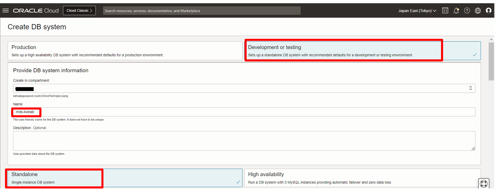

# Lab 1: Set Up Your Environment

## Introduction

In this lab, you'll be guided to prepare follow environment:
BDS Environment
MDS Environment
OAC Environment
Also you will be guided to download a source code and deploy it to BDS.

***Estimated Time***: 2 hours

## Task 1:Prepare BDS Environment

1. Create an BDS (ODH 2.0) environment on OCI. Refer to the following link for the details.
   [Get Started with Oracle Big Data Service (non-HA)](https://apexapps.oracle.com/pls/apex/f?p=133:180:115193385491492::::wid:762)
   You should follow below labs:

   Lab 1: Setup the BDS Environment

   Lab 2: Create a BDS Hadoop Cluster

   Lab 4: Access a BDS Node Using a Public IP Address

   Lab 5: Use Cloudera Manager and Hue to Access a BDS Cluster

cluster name: bds-cluster

2. Add Kafka and Flink services. Log into Ambari with the following URL.

https://`<bdsclusun0-hostname>`:7183/

Enter **username** and **password**, then click **SIGN IN**.


3. Click **…** icon beside **Services**, then select **Add Service**.


4. Check **Kafka** and **Flink**, then click **Next**.


5. Click **Next** to accept all the default setting. If you see the following recommended configurations, click **PROCEED ANYWAY**.


6. Click **Deploy**.


7. After installation, click **NEXT**.


8. Click **COMPLETE**.


9. Restart all affected components. Click **…** icon beside **Services**, select **Restart All Required**.


10. Click **CONFIRM RESTART ALL**.


11. After restart, click **OK**.


12. Execute the following steps to upload jar so you can access MDS and Kafka with Flink and Spark.
    Log into BDS node(un0) as root user.

```
sudo su -
```

Download [lib.zip](https://objectstorage.ap-tokyo-1.oraclecloud.com/p/bhsTSKQYGjbeGwm5JW63Re3_o9o2JOrKiQVi_-6hrQfrB7lGSvA1z5RPyDLy3lpU/n/sehubjapacprod/b/live-lab/o/download/lib.zip) to any directory (eg. /tmp) and unzip it.

```
cd /tmp
wget https://objectstorage.ap-tokyo-1.oraclecloud.com/p/bhsTSKQYGjbeGwm5JW63Re3_o9o2JOrKiQVi_-6hrQfrB7lGSvA1z5RPyDLy3lpU/n/sehubjapacprod/b/live-lab/o/download/lib.zip
#unzip lib
unzip /tmp/lib.zip
```

Execute the following command to copy jar to all the BDS nodes.

```
#copy kafka related jar files in bds cluster to flink classpath
dcli -C "cp /usr/odh/current/flink/connectors/*kafka*.jar  /usr/odh/current/flink/lib"
dcli -C "cp /usr/lib/flink/connectors/flink-connector-jdbc-1.15.2.jar  /usr/odh/current/flink/lib"
dcli -C "cp /usr/odh/current/kafka-broker/libs/kafka-clients-3.2.0.jar  /usr/odh/current/flink/lib"

#copy mysql connector jar file to flink classpath
scp /tmp/lib/mysql-connector-java-8.0.28.jar bdsclusun0:/usr/odh/current/flink/lib
scp /tmp/lib/mysql-connector-java-8.0.28.jar bdscluswn0:/usr/odh/current/flink/lib
scp /tmp/lib/mysql-connector-java-8.0.28.jar bdscluswn1:/usr/odh/current/flink/lib
scp /tmp/lib/mysql-connector-java-8.0.28.jar bdscluswn2:/usr/odh/current/flink/lib
scp /tmp/lib/mysql-connector-java-8.0.28.jar bdsclusmn0:/usr/odh/current/flink/lib

#copy mysql connector jar file to spark3 classpath
scp lib/mysql-connector-java-8.0.28.jar bdsclusun0:/usr/odh/current/spark3-client/jars
scp lib/mysql-connector-java-8.0.28.jar bdscluswn0:/usr/odh/current/spark3-client/jars
scp lib/mysql-connector-java-8.0.28.jar bdscluswn1:/usr/odh/current/spark3-client/jars
scp lib/mysql-connector-java-8.0.28.jar bdscluswn2:/usr/odh/current/spark3-client/jars
scp lib/mysql-connector-java-8.0.28.jar bdsclusmn0:/usr/odh/current/spark3-client/jars

#copy kafka and mysql connector jar to flink cluster classpath
su - hdfs
hadoop fs -put /usr/odh/current/flink/connectors/*.jar /flink/lib/flink-libs/
hadoop fs -put /usr/odh/current/kafka-broker/libs/kafka-clients-3.2.0.jar /flink/lib/flink-libs/
hadoop fs -put /tmp/lib/mysql-connector-java-8.0.28.jar /flink/lib/flink-libs/
```

## Task2: Prepare MDS Environment

Create a MDS (MySQL) environment on OCI.

1. In OCI homepage, select **Database** > **DB Systems**.


2. Click **Create DB system**.


3. Select **Development or testing**. Input **Name**. Select **Standalone**. Input **Username** and **Password**.




4. Select **VCN** and **Subnet**.


5. At the bottom, open **Show advanced options**. Select **Connections** tab and input **Hostname**. Click **Create**.


6. After a few minutes, MDS is created successfully. Select **Connections** tab to check the **Internal FQDN**.


You also need to add Ingress Rules for connection MDS with port 3306. Click **subnet details** > **View subnet details.**


Click **Default Security List for ...**.


Click **Add Ingress Rules**.

Source Type: **CIDR**

Source CIDR: **0.0.0.0/0**

IP Protocal: **TCP**

Destination Port Range: **3306**

Click **Add Ingress Rules**.


7. Log into BDS un0 node as root user and connect MDS.

```
sudo su -
mysql -u <username> -h <MDS Internal FQDN> -p'<Password>'
#eg. mysql -uadmin -h bdslivelab.sub07110452230.shenzhuvcn2.oraclevcn.com -p'Welcome12345#'
```

8. Create Database with the following command.

```
CREATE DATABASE <database_name>;
#eg. CREATE DATABASE livelab_db;
```

9. Create a native user with the following command.

```
CREATE USER '<username>'@'%' IDENTIFIED WITH mysql_native_password BY '<password>';
#eg. CREATE USER 'livelab_test'@'%' IDENTIFIED WITH mysql_native_password BY 'Oracle123456!';
```

10. Grant privilege to the native user.

```
GRANT ALL PRIVILEGES ON <database_name>.* TO '<username>'@'%';
#eg. GRANT ALL PRIVILEGES ON livelab_db.* TO 'livelab_test'@'%';
```

11. Connect MDS with the native user.

```
mysql -u <username> -h <MDS Internal FQDN> -p’<Password>’
#eg. mysql -ulivelab_test -h bdslivelab.sub07110452230.shenzhuvcn2.oraclevcn.com -p'Oracle123456!'
```

12. Change the Database.

```
use livelab_db;
```

## Task3: Prepare OAC Environment

For data visualization ,you need to create an OAC environment on OCI.

1. In OCI homepage, select Analytics
   & AI > Analytics Cloud.


2. Click **Create Instance.** Input **Name** and click **Create**.


3. After creating a OAC instance, you need to create connection with MySQL. For accessing MySQL in OAC, you need to create a Private Channel Access. In OAC instance page, scroll down to **Resources** section, then click **Private Access Channel**.


4. Click **Configure Private Access Channel**.


5. Provide **Name** for your access channel. Select **Virtual Cloud Network** and **Subnet** you want your private access channel to use. Provide **DNS Zones**. Click **Configure**.


6. To check the status of your private access channel, click on **Activity Log**. After a few minutes, configuration completed.


7. Create MySQL connection. Log into OAC home page. You can copy OAC home page URL from OAC instance page. Click **Create** > **Connection**.


8. Select **MySQL**.


9. Provide **Connection Name**, **Host**, **Port**, **Database Name**, **Username** and **Password**. Then click **Save**.


## Task4: Deploy Souce Code on BDS

1. Log into BDS node(un0) as root user. Download source.zip to any directory (eg. /tmp) and unzip it.
   source.zip download link: 
   [source.zip](https://objectstorage.ap-tokyo-1.oraclecloud.com/p/CxV2eZlF7eVrQhIMOIy5t9iWWeSmgW4vDDSrHzPiHSsq9raprO3gP6wc-w-iqyXv/n/sehubjapacprod/b/live-lab/o/download/source.zip)

```
sudo su -
cd /tmp
wget https://objectstorage.ap-tokyo-1.oraclecloud.com/p/CxV2eZlF7eVrQhIMOIy5t9iWWeSmgW4vDDSrHzPiHSsq9raprO3gP6wc-w-iqyXv/n/sehubjapacprod/b/live-lab/o/download/source.zip
unzip /tmp/source.zip
chmod -R 777 source
```

3. Replace the parameters in env configuraton file (/tmp/source/conf/env.conf) with your actual values.

```
#configurations of HDFS
#you can get this value from Ambari kafka configuration page Services-> HDFS -> Configs
#get the value of propertie:fs.defaultFS in Advanced core-site
#example:hdfs://localhost:8020
defaultFs=hdfs://livelabmn0.sub07110452230.shenzhuvcn2.oraclevcn.com:8020

#Mysql configurations
#host:localhost or a Ip Address
#MDS Internal FQDN
mysql_host=livelabdb.sub07110452230.shenzhuvcn2.oraclevcn.com
#username:native username for login to mysql
mysql_username=livelab_test
#password:native password for login to mysql
mysql_password=Oracle123456!
#port number like:3306
mysql_port=3306

#configurations of kafka bootstap-sever
#you can get this value from Ambari kafka configuration page Services-> Kafka -> Configs
#you need to get the broker host and port.
#example:livelabwn0:6667,livelabwn1:6667,livelabwn2:6667
kafka_bootstrap_server=livelabwn0:6667,livelabwn1:6667,livelabwn2:6667

```

You can get defaultFs value from Ambari > HDFS >CONFIG >ADVANCED > fs.defaultFS.


You can get kafka_bootstrap_server value from Ambari > Kafka > CONFIGS > Kafka Broker host.


4. Execute clear script (/tmp/source/bin/clear.sh) as hdfs user to clear MySQL, HDFS, Hive and Kafka.
   You should skip this step for the first time.

```
sudo su - hdfs
cd /tmp/source/bin/
./clear.sh
```

5. After completing the step4, execute init script (/tmp/source/bin/init.sh) in the same terminal, it will init MySQL tables, Hive tables and create Kafka topic.

```
sudo su - hdfs
cd /tmp/source/bin/
./init.sh
```
