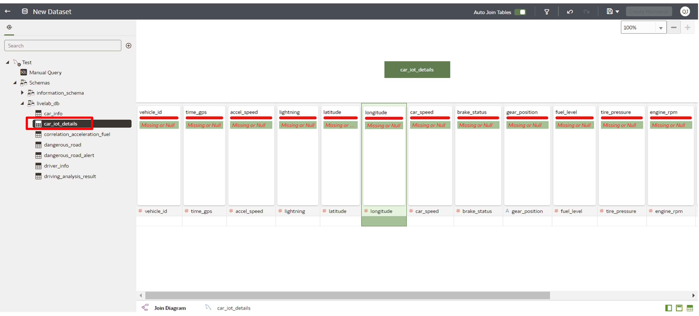
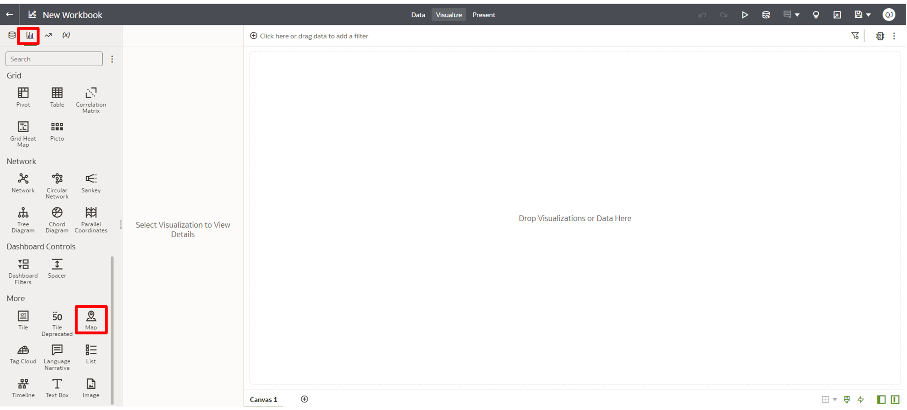
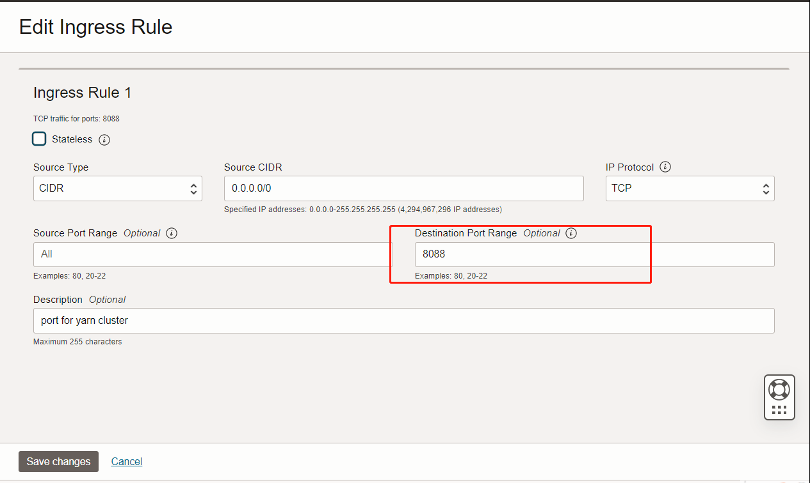
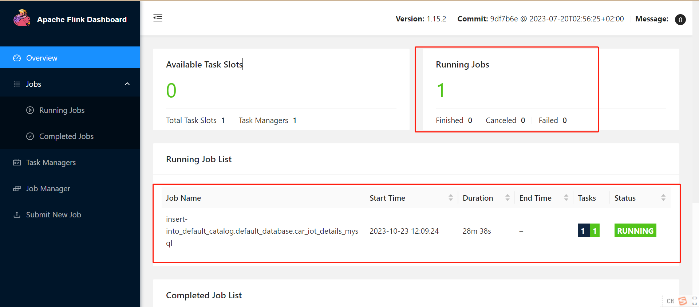

# Lab 2: Monitor Real-time Truck Driving

## Introduction

In this lab, you'll be guided on setting up a Flink task for real-time processing. This involves capturing real-time location data and visualizing it on a map, enabling the display of live location monitoring on a dedicated screen. Such monitoring allows for real-time querying of each truck's location, its distance and time to destination, any deviations from its path, and its adherence to expected routes.

The data input consists of truck location details, captured every 5 seconds by individual IoT devices. This data encompasses vehicle codes, timestamps, longitude, latitude, and more.

The system employs Kafka to gather truck location data in real-time. Flink is then used to filter out any erroneous data, which is subsequently directed to MySQL. The Oracle Analytics Cloud (OAC) periodically fetches the updated data from MySQL to render the position point map.

***Estimated Time***: 30 minutes

### Objectives

* In Flink SQL, create table to access data from Kafka. Filter out data that does not contain latitude or longitude, then save the result into Hive and MySQL.
* Create table to access data from MySQL.
  Execute SQL statement to analyze whether the car is located on a dangerous road section.
* Create dashboard in OAC to show warning messages to the driver if they are on dangerous road sections.

### Prerequisites

This lab assumes that you have successfully completed the following labs in the Contents menu:

* Lab 1: Setup Your Environment

## Task1: Execute Flink SQL Script

1. Start Flink session with the following commands on BDS node un0 as hdfs user.

```
<copy>
sudo su - hdfs
export HADOOP_CLASSPATH=`hadoop classpath`
/usr/odh/current/flink/bin/yarn-session.sh -n 2 -jm 2048m -tm 4096m -d
</copy>
```

When the following message is displayed, it means Flink session started successfully. Keep this terminal window open until you finished Lab2 and Lab3.


2. Open another terminal window on node un0, execute the following command to start Flink Client.

```
<copy>
sudo su - hdfs
export HADOOP_CLASSPATH=`hadoop classpath`
/usr/odh/current/flink-client/bin/sql-client.sh
</copy>
```

When the following message is displayed, it means Flink Client started successfully. Keep the terminal open until you finished Lab2 and Lab3.


3. Execute the following Flink SQL command in Flink SQL terminal to configure client. You need to execute these commands one by one.

```
<copy>
SET 'sql-client.execution.result-mode' = 'tableau';
SET 'execution.runtime-mode' = 'streaming';
SET 'execution.checkpointing.interval' = '3s';
</copy>
```

4. Execute the following Flink SQL command to create table which stores real-time car IoT data from Kafka. Note: Replace the parameters before execution.

```
<copy>
CREATE TABLE kafka_source (
`vehicle_id` INT,               --Vehicle identity
`time_gps` BIGINT,              --Time
`accel_speed` DOUBLE,           --Accel speed
`lightning` INT,                --0-on;1-off
`latitude` DOUBLE,              --latitude
`longitude` DOUBLE,             --longitude
`car_speed` DOUBLE,             --Driving speed
`brake_status` INT,             --whether the brake pedal is pressed or not (0/1)
`gear_position` STRING,         --the position of the car's transmission (park, drive, reverse, neutral)
`fuel_level` DOUBLE,            --the level of fuel in the car's tank in liters
`tire_pressure` DOUBLE,         --the pressure of each tire in pounds per square inch (PSI)
`engine_rpm` INT,               --the revolutions per minute of the car's engine
`oil_surplus` DOUBLE,           --oil surplus
`battery_surplus` DOUBLE,       --battery surplus
`engine_temperature` DOUBLE,    --Car Tempreture (C)
`driver_heartbeats` INT         --Driver heart: Heart rate variability is where the amount of time between your heartbeats fluctuates slightly.
)
WITH (
'connector' = 'kafka',
'topic' = 'car_iot_details',
'properties.bootstrap.servers' = '{kafka_bootstrap_server}',
'properties.group.id' = 'flink-runtime',
'scan.startup.mode' = 'earliest-offset',
'format' = 'json',
'json.fail-on-missing-field' = 'false',
'json.ignore-parse-errors' = 'true'
);
</copy>
```

5. Execute the following Flink SQL command to create view which filters out invalid data.

```
<copy>
CREATE VIEW car_iot_details_view AS SELECT
vehicle_id,
TO_TIMESTAMP_LTZ(time_gps,0) AS time_gps,
accel_speed,
lightning,
latitude,
longitude,
car_speed,
brake_status,
gear_position,
fuel_level,
tire_pressure,
engine_rpm,
oil_surplus,
battery_surplus,
engine_temperature,
driver_heartbeats
FROM kafka_source WHERE latitude IS NOT NULL AND longitude IS NOT NULL;
</copy>
```

6. Execute the following Flink SQL command to put car IoT data into HDFS. Note: Replace the parameters before execution.

```
<copy>
CREATE TABLE car_iot_details_hdfs (
`vehicle_id` INT,
`time_gps` TIMESTAMP,
`accel_speed` DOUBLE,
`lightning` INT,
`latitude` DOUBLE,
`longitude` DOUBLE,
`car_speed` DOUBLE,
`brake_status` INT,
`gear_position` STRING,
`fuel_level` DOUBLE,
`tire_pressure` DOUBLE,
`engine_rpm` INT,
`oil_surplus` DOUBLE,
`battery_surplus` DOUBLE,
`engine_temperature` DOUBLE,
`driver_heartbeats` INT
)
WITH (
'connector' = 'filesystem',
'path' = '{defaultFs}/livelab_db/car_iot_details',
'format'= 'csv'
);
</copy>
```

```
<copy>
INSERT INTO car_iot_details_hdfs SELECT * FROM car_iot_details_view;
</copy>
```

7. Execute the following Flink SQL command to put car IoT data into MySQL. Note: Replace the parameters before execution.

```
<copy>
CREATE TABLE car_iot_details_mysql (
`vehicle_id` INT,
`time_gps` TIMESTAMP,
`accel_speed` DOUBLE,
`lightning` INT,
`latitude` DOUBLE,
`longitude` DOUBLE,
`car_speed` DOUBLE,
`brake_status` INT,
`gear_position` STRING,
`fuel_level` DOUBLE,
`tire_pressure` DOUBLE,
`engine_rpm` INT,
`oil_surplus` DOUBLE,
`battery_surplus` DOUBLE,
`engine_temperature` DOUBLE,
`driver_heartbeats` INT
)
WITH (
'connector' = 'jdbc',
'url' = 'jdbc:mysql://{mysql_host}:{mysql_port}/livelab_db',
'username' = '{mysql_username}',
'password' = '{mysql_password}',
'table-name' = 'car_iot_details'
);
</copy>
```

```
<copy>
INSERT INTO car_iot_details_mysql SELECT * FROM car_iot_details_view where vehicle_id in (10,11,12);
</copy>
```

## Task2: Visualize data in OAC

1. In OAC instance page, copy OAC Home Page URL and open it with browser.


2. Create a dataset in OAC Home Page. Click **Create** > **Dataset**.


3. Select MySQL connection that you created.


4. Double click table **"car\_iot\_details"** under MySQL database.



5. Click **car\_iot\_details** tab. Set column **vehicle**, **latitude**, **longitude** as **attribute**.


6. Change the following column name Click **...** icon beside column name, then select **Rename**.
   vehicle_id -->Vehicle ID, latitude --> Car Latitude, longitude -->Car Longitude. 


7. Set Data Access to Live. Click **Edit Definition**. Select **Live** from Data Access list. Then click **OK**.


8. Save dataset. Click **Save As**, set **Name** as **Driving Info**. Click **OK**.


9. After saving dataset, you can create a workbook. Click **Create Workbook**.


10. On the workbook page select **Visualizations** tab, then double click **Map** visualization.



11. Go to **Data** tab. Drag and drop **latitude** and **longitude** into **Category**. Drag and drop **vehicle_id** into **Color**. Because there is not any data by now, you cannot see the car position.


12. Click Save icon and select **Save As**. Save this workbook as **Truck Position Point Map**.


13. Open another terminal window and log into bdscluswn0 node as hdfs user. Execute the following script (/tmp/source/bin/send-data.sh) to send data to Kafka.

```
<copy>
sudo su - hdfs
cd /tmp/source/bin
./send-data.sh
</copy>
```
This send-data.sh script will generate a batch of data and send all of them to kafka. After that it will send 3 cars which ids are 10,11,12 realtime data every 20 seconds to kafka. 
You should keep this terminal running until the process finished as below:


14. Get back to OAC page. Click **refresh** button to check car position. You can refresh it several times, then you will find out that the car is moving.
    You can also change Background Map if you want. Click **Properties**, select the **map**.


## Task3: Monitor flink jobs in Flink Dashboard

1. Map the Private IP Address of the First Master Node to a Public IP Address.

Refer to lab4 in [Get Started with Oracle Big Data Service (non-HA)](https://livelabs.oracle.com/pls/apex/f?p=133:180:115193385491492::::wid:762)

In this example, we replaced the ip-address with the private IP address of our first Master node like below.


2. Create Ingress Security Rules (and Open Ports) for Yarn. In this step, you will add ingress security rules to the default security list in your cluster's VCN. This will allow access from anywhere on the internet to Yarn on port **`8088`**.
Refer to Lab1->Task1 and steps 4-7. And you need to replace the **DESTINATION PORT RANGE** with **`8088`**.
Here are ingress rules are added to the **Default Security List**.


3. Get the application id of flink.
In Task1 when you start flink session you will get information about the application as below:

copy the application id in the red circle. and remember that is you flink application id.

4. Open Flink Dashboard in you browser. 
link:http://{mn0-ip}:8088/proxy/{flink-application-ip}/#/overview

Replace the **{mn0-ip}** with the public IP Address of First Master Node you were just created in step1.
And replace the {flink-application-ip} with application id of flink where you get in step3

This is flink dashboard link sample:http://138.2.85.27:8088/proxy/application_1697598756447_0008/#/overview

the Flink Dashboard will be as below:


5. You can monitor or manager the flink jobs.


You may now **proceed to the next lab**.

## Acknowledgements

* **Author:**

  * Xuying Xie, Senior Data Engineer, Japan & APAC Hub
  * Qian Jiang, Senior Cloud Engineer, Japan & APAC Hub
  * Justin Zou, Principal Data Engineer, Japan & APAC Hub
  * Anand Chandak, Principal Product Manager, Big Data Services
* **Last Updated By/Date:** Justin Zou, Sept 2023
