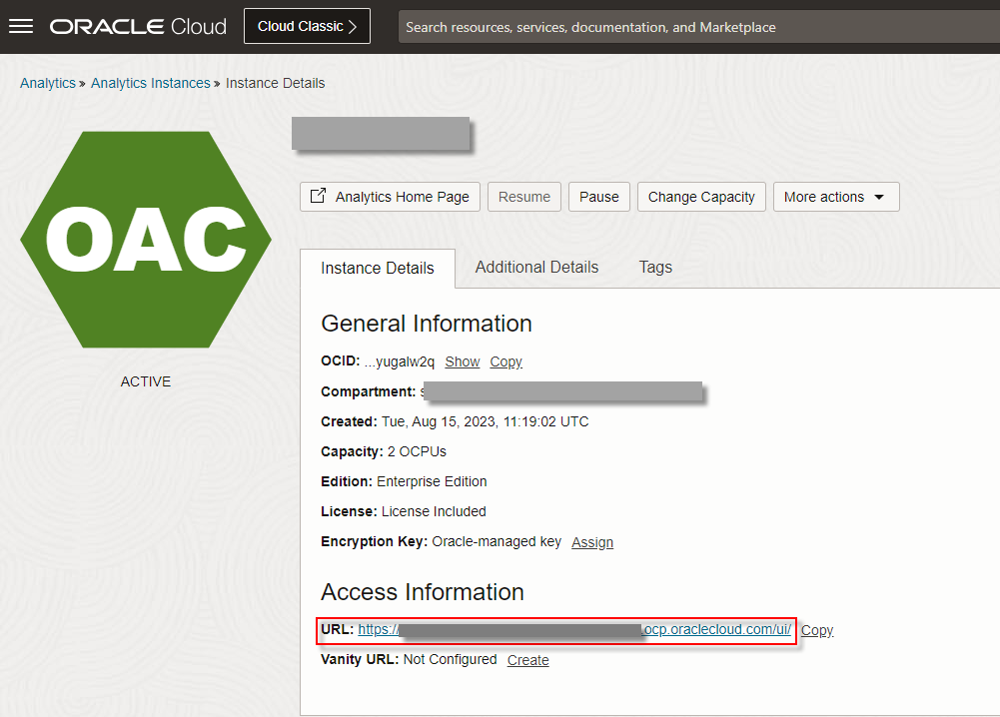
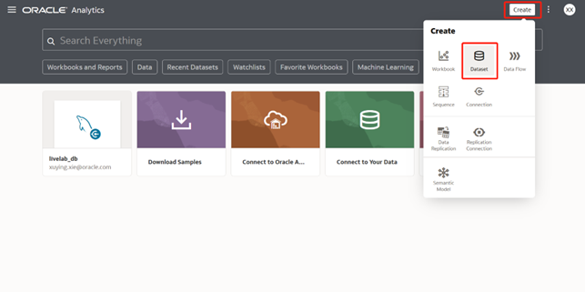
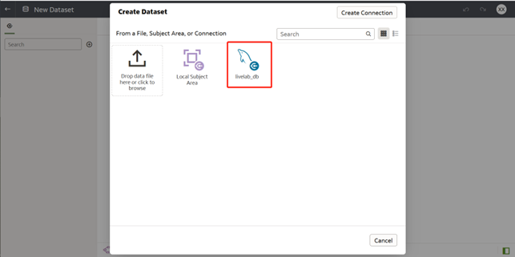
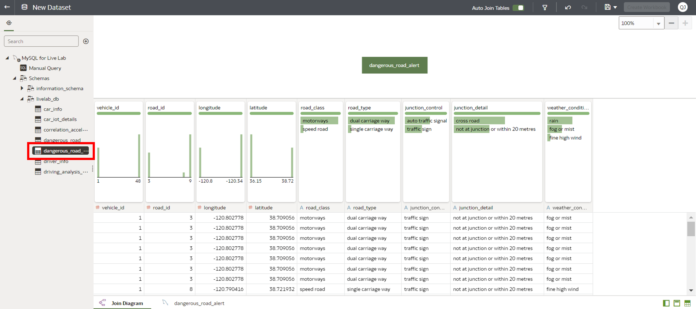
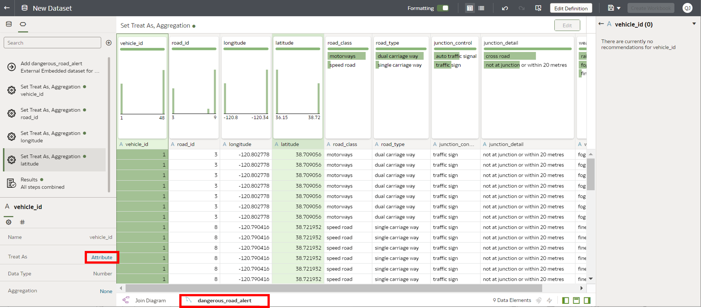
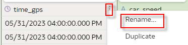
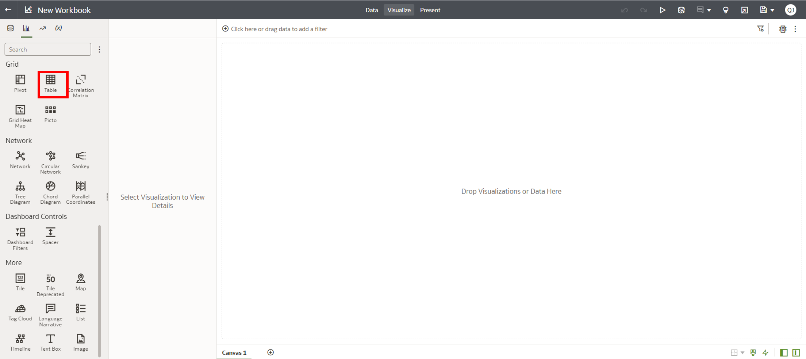
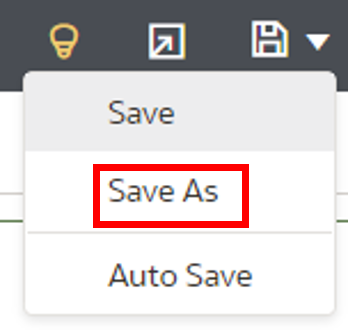
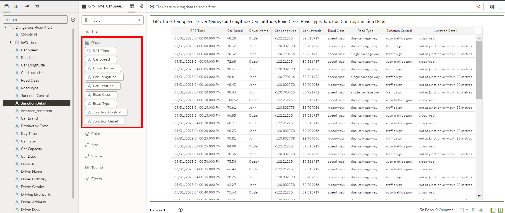

# Lab 3: Warning of dangerous road sections

## Introduction

In this lab, you'll learn to set up a Flink task for real-time processing. The focus is on analyzing historical accident data to identify hazardous road sections. Using real-time truck location data, the system determines if a truck is on one of these dangerous sections. If a match is found, a safety alert is dispatched to the driver, urging caution.

The system relies on two primary data sources: driving information sourced from Kafka and records of dangerous road locations from MySQL. Within Flink, these datasets are merged, filtering out any incomplete or irrelevant entries, to produce the desired results.


***Estimated Time***: 30 minutes

### Objectives

In this lab, you will:

- In Spark SQL, create temporary view to access data from MySQL.
- Execute SQL statement to analyze driving operations in Sark SQL.
- Create dashboard in OAC to visualize analysis result.

### Prerequisites

This lab assumes that you have successfully completed the following labs in the Contents menu:

- Lab 1: Setup Your Environment
- Lab 2: Monitoring the truck real-time driving

## Task 1:Start Flink Session and Client

1.In the Flink Client, execute the following command to read data from MySQL table. Note: Replace the parameters before execution.

```
CREATE TABLE car_info (
`vehicle_id` INT,
`car_brand` STRING,
`productive_time` DATE,
`buy_time` DATE,
`car_type` STRING,
`capacity` INT,
`driver_id` INT,
`car_desc` STRING
)
 WITH (
   'connector' = 'jdbc',
   'url' = 'jdbc:mysql://{mysql_host}:{mysql_port}/livelab_db',
   'username' = '{mysql_username}',
   'password' = '{mysql_password}',
   'table-name' = 'car_info'
);

CREATE TABLE driver_info (
`driver_id` INT,
`driver_name` STRING,
`birthday` DATE,
`gender` STRING,
`driving_license_id` STRING,
`driver_address` STRING,
`driver_desc` STRING
)
 WITH (
   'connector' = 'jdbc',
   'url' = 'jdbc:mysql://{mysql_host}:{mysql_port}/livelab_db',
   'username' = '{mysql_username}',
   'password' = '{mysql_password}',
   'table-name' = 'driver_info'
);

CREATE TABLE dangerous_road (
`road_id` INT,
`longitude` DOUBLE,
`latitude` DOUBLE,
`road_class` STRING,
`road_type` STRING,
`junction_control` STRING,
`junction_detail` STRING,
`weather_condition` STRING
)
 WITH (
   'connector' = 'jdbc',
   'url' = 'jdbc:mysql://{mysql_host}:{mysql_port}/livelab_db',
   'username' = '{mysql_username}',
   'password' = '{mysql_password}',
   'table-name' = 'dangerous_road'
);

CREATE TABLE dangerous_road_alert (
`vehicle_id` INT,
`time_gps` TIMESTAMP,
`car_speed` DOUBLE, 
`road_id` INT,
`longitude` DOUBLE,
`latitude` DOUBLE,
`road_class` STRING,
`road_type` STRING,
`junction_control` STRING,
`junction_detail` STRING,
`weather_condition` STRING,
`car_brand` STRING,
`productive_time` DATE,
`buy_time` DATE,
`car_type` STRING,
`capacity` INT,
`car_desc` STRING,
`driver_id` INT,
`driver_name` STRING,
`birthday` DATE,
`gender` STRING,
`driving_license_id` STRING,
`driver_address` STRING,
`driver_desc` STRING
)
 WITH (
   'connector' = 'jdbc',
   'url' = 'jdbc:mysql://{mysql_host}:{mysql_port}/livelab_db',
   'username' = '{mysql_username}',
   'password' = '{mysql_password}',
   'table-name' = 'dangerous_road_alert'
);
```

2.Execute the following command to determine whether the current location is a dangerous road section,then insert alert into MySQL.

```
CREATE VIEW alert_view AS
SELECT a.vehicle_id,
 	   a.time_gps,
 	   a.car_speed,
       b.road_id,
 	   b.longitude,
 	   b.latitude,
 	   b.road_class,
 	   b.road_type,
 	   b.junction_control,
 	   b.junction_detail,
 	   b.weather_condition
FROM car_iot_details_view a, dangerous_road b
WHERE (6370000 * 2 * ASIN(SQRT(POWER(SIN((RADIANS( a.latitude) - RADIANS( b.latitude)) / 2), 2) + COS(RADIANS( a.latitude)) * COS(RADIANS( b.latitude)) * POWER(SIN((RADIANS(a.longitude) - RADIANS(b.longitude)) / 2), 2)))) <= 2000;

INSERT INTO dangerous_road_alert 
SELECT a.vehicle_id,
 	   a.time_gps,
 	   a.car_speed,
       a.road_id,
 	   a.longitude,
 	   a.latitude,
 	   a.road_class,
 	   a.road_type,
 	   a.junction_control,
 	   a.junction_detail,
 	   a.weather_condition,
 	   b.car_brand,
 	   b.productive_time,
 	   b.buy_time,
 	   b.car_type,
 	   b.capacity,
 	   b.car_desc,
 	   c.driver_id,
 	   c.driver_name,
 	   c.birthday,
 	   c.gender,
 	   c.driving_license_id,
 	   c.driver_address,
 	   c.driver_desc
FROM alert_view a JOIN car_info b ON a.vehicle_id=b.vehicle_id
JOIN driver_info c ON c.driver_id=b.driver_id;
```

3.You can execute the following command in MySQL to check data is written into MySQL database..

```
  select * from dangerous_road_alert limit 10;
```

## Task2: Visualize data in OAC

1.First create a dataset. Log into **OAC Home Page**. Click **Create > Dataset**.

 

2.Select **MySQL** connection that you created.

 

3.Double click table **dangerous_road_alert** under MySQL database.



4.Click **dangerous_road_alert** tab to set all the columns as attribute.



5.You can change column name.

6.Set **Data Access** to **Live** as the previous step.

7.Click **Save As**, set **Name** as **Dangerous Road Alert**. Click **OK**.





8.After saving dataset, you can create a workbook. Click **Create Workbook**.


9.On the workbook page select **Table visualization**.



10.Drag&Drop **GPS Time, Car Speed, Driver Name, Car Longitude, Car Latitude, Road Class, Road Type, Junction Control and Junction Detail** into **Rows**.


11.Click **Save** icon and select **Save As**. Save this workbook as **Warning of Dangerous Road Sections**.





Now you can close Flink Client.

## Acknowledgements

* **Author:**

  * Qian Jiang, Senior Cloud Engineer, Japan & APAC Hub
  * Xuying Xie, Senior Data Engineer, Japan & APAC Hub
  * Justin Zou, Principal Data Engineer, Japan & APAC Hub
  * Anand Chandak, Principal Product Manager, Big Data Services
* **Last Updated By/Date:** Justin Zou, Aug 2023
