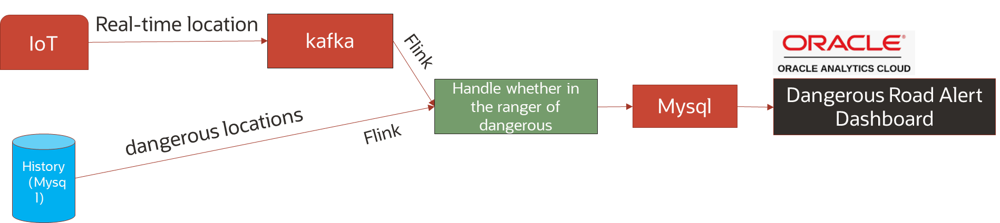

# Lab 3: Identify Hazardous Road Segments

## Introduction

In this lab, you'll learn to set up a Flink task for real-time processing. The focus is on analyzing historical accident data to identify hazardous road sections. Using real-time truck location data, the system determines if a truck is on one of these dangerous sections. If a match is found, a safety alert is dispatched to the driver, urging caution.

The system relies on two primary data sources: driving information sourced from Kafka and records of dangerous road locations from MySQL. Within Flink, these datasets are merged, filtering out any incomplete or irrelevant entries, to produce the desired results.



***Estimated Time***: 30 minutes

### Objectives

- In Spark SQL, create temporary view to access data from MySQL.
- Execute SQL statement to analyze driving operations in Sark SQL.
- Create dashboard in OAC to visualize analysis result.

### Prerequisites

This lab assumes that you have successfully completed the following labs in the Contents menu:

- Lab 1: Setup Your Environment
- Lab 2: Monitor the truck real-time drive

## Task 1: Start Flink Session and Client

1. In the Flink Client, execute the following command to read data from MySQL table. Note: Replace the parameters before execution.

```
<copy>
CREATE TABLE car_info (
`vehicle_id` INT,               --Vehicle identity
`car_brand` STRING,             --Car brand
`productive_time` DATE,         --Production date
`buy_time` DATE,                --Purchase date
`car_type` STRING,              --Car type: oil or electric
`capacity` INT,                 --Car capacity
`driver_id` INT,                --Driver identity
`car_desc` STRING               --Car description
)
 WITH (
   'connector' = 'jdbc',
   'url' = 'jdbc:mysql://{mysql_host}:{mysql_port}/livelab_db',
   'username' = '{mysql_username}',
   'password' = '{mysql_password}',
   'table-name' = 'car_info'
);
</copy>
```

```
<copy>
CREATE TABLE driver_info (
`driver_id` INT,               --Driver identity
`driver_name` STRING,          --Driver name
`birthday` DATE,               --Driver birthday
`gender` STRING,               --Driver gender
`driving_license_id` STRING,   --Driver license identity
`driver_address` STRING,       --Driver address
`driver_desc` STRING           --Driver description
)
 WITH (
   'connector' = 'jdbc',
   'url' = 'jdbc:mysql://{mysql_host}:{mysql_port}/livelab_db',
   'username' = '{mysql_username}',
   'password' = '{mysql_password}',
   'table-name' = 'driver_info'
);
</copy>
```

```
<copy>
CREATE TABLE dangerous_road (
`road_id` INT,                 --Driver identity
`longitude` DOUBLE,            --location longitude
`latitude` DOUBLE,             --location latitude
`road_class` STRING,           --Road class: speed road or motorways
`road_type` STRING,            --Road type: dual carriage way or single carriage way
`junction_control` STRING,     --Junction control: auto traffic signal or traffic sign
`junction_detail` STRING,      --Junction detail: cross road,T or staggered junction,not at junction or within 20 metres
`weather_condition` STRING     --Weather condition: fine high wind,fine no wind, fog or mist,rain,snow
)
 WITH (
   'connector' = 'jdbc',
   'url' = 'jdbc:mysql://{mysql_host}:{mysql_port}/livelab_db',
   'username' = '{mysql_username}',
   'password' = '{mysql_password}',
   'table-name' = 'dangerous_road'
);
</copy>
```

```
<copy>
CREATE TABLE dangerous_road_alert (
`vehicle_id` INT,
`time_gps` TIMESTAMP,
`car_speed` DOUBLE, 
`road_id` INT,
`longitude` DOUBLE,
`latitude` DOUBLE,
`road_class` STRING,
`road_type` STRING,
`junction_control` STRING,
`junction_detail` STRING,
`weather_condition` STRING,
`car_brand` STRING,
`productive_time` DATE,
`buy_time` DATE,
`car_type` STRING,
`capacity` INT,
`car_desc` STRING,
`driver_id` INT,
`driver_name` STRING,
`birthday` DATE,
`gender` STRING,
`driving_license_id` STRING,
`driver_address` STRING,
`driver_desc` STRING
)
 WITH (
   'connector' = 'jdbc',
   'url' = 'jdbc:mysql://{mysql_host}:{mysql_port}/livelab_db',
   'username' = '{mysql_username}',
   'password' = '{mysql_password}',
   'table-name' = 'dangerous_road_alert'
);
</copy>
```

2. Execute the following command to determine whether the current location is a dangerous road section, then insert alert into MySQL.

```
<copy>
CREATE VIEW alert_view AS
SELECT a.vehicle_id,
 	   a.time_gps,
 	   a.car_speed,
       b.road_id,
 	   b.longitude,
 	   b.latitude,
 	   b.road_class,
 	   b.road_type,
 	   b.junction_control,
 	   b.junction_detail,
 	   b.weather_condition
FROM car_iot_details_view a, dangerous_road b
WHERE (6370000 * 2 * ASIN(SQRT(POWER(SIN((RADIANS( a.latitude) - RADIANS( b.latitude)) / 2), 2) + COS(RADIANS( a.latitude)) * COS(RADIANS( b.latitude)) * POWER(SIN((RADIANS(a.longitude) - RADIANS(b.longitude)) / 2), 2)))) <= 2000;
</copy>
```

```
<copy>
INSERT INTO dangerous_road_alert 
SELECT a.vehicle_id,
 	   a.time_gps,
 	   a.car_speed,
       a.road_id,
 	   a.longitude,
 	   a.latitude,
 	   a.road_class,
 	   a.road_type,
 	   a.junction_control,
 	   a.junction_detail,
 	   a.weather_condition,
 	   b.car_brand,
 	   b.productive_time,
 	   b.buy_time,
 	   b.car_type,
 	   b.capacity,
 	   b.car_desc,
 	   c.driver_id,
 	   c.driver_name,
 	   c.birthday,
 	   c.gender,
 	   c.driving_license_id,
 	   c.driver_address,
 	   c.driver_desc
FROM alert_view a JOIN car_info b ON a.vehicle_id=b.vehicle_id
JOIN driver_info c ON c.driver_id=b.driver_id;
</copy>
```

3. You can execute the following command in MySQL to check data is written into MySQL database.

```
<copy>
  select * from dangerous_road_alert limit 10;
</copy>
```

## Task2: Visualize data in OAC

1. In OAC instance page, copy OAC Home Page URL and open it with browser.

 

2. First create a dataset. Log into **OAC Home Page**. Click **Create > Dataset**.

 

3. Select **MySQL** connection that you created.

 

4. Double click table **"dangerous\_road\_alert"** under MySQL database.


5. Click **dangerous\_road\_alert** tab to set all the columns (except time_gps) as attribute.


6. Change the following column name Click **...** icon beside column name, then select **Rename**.
   time\_gps -->GPS Time, car\_speed-->Car Speed, driver\_name-->Driver Name, longitude-->Car Longitude, latitude-->Car Latitude, road\_class-->Road Class, road\_type-->Road Type, junction\_control-->Junction Control, junction\_detail-->Junction Detail.


7. Set **Data Access** to **Live** as the previous step.
8. Click **Save As**, set **Name** as **Dangerous Road Alert**. Click **OK**.


9. After saving dataset, you can create a workbook. Click **Create Workbook**.


10. On the workbook page select **Table visualization**.


11. Drag and drop **GPS Time, Car Speed, Driver Name, Car Longitude, Car Latitude, Road Class, Road Type, Junction Control and Junction Detail** into **Rows**.


12. Click **Save** icon and select **Save As**. Save this workbook as **Warning of Dangerous Road Sections**.


Now you can close Flink client.

## Task3: Monitor flink jobs in Flink Dashboard
refer to lab2:monitor real time truck driving and task3.open or refresh the Flink Dashboard.

You may now **proceed to the next lab**.

## Acknowledgements

* **Author:**

  * Qian Jiang, Senior Cloud Engineer, Japan & APAC Hub
  * Xuying Xie, Senior Data Engineer, Japan & APAC Hub
  * Justin Zou, Principal Data Engineer, Japan & APAC Hub
  * Anand Chandak, Principal Product Manager, Big Data Services
* **Last Updated By/Date:** Justin Zou, Sept 2023
