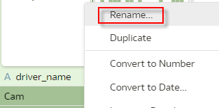
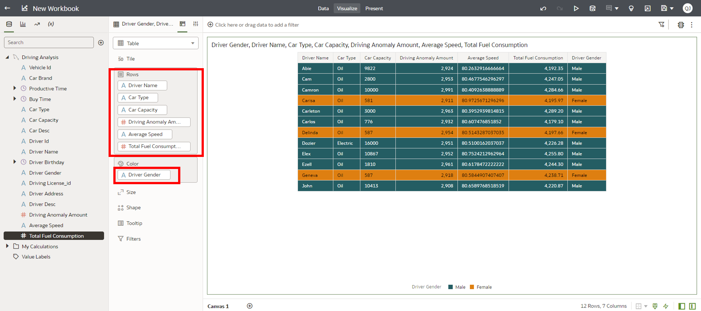

# Lab 4: Analyze drive behavior

## Introduction

In this lab, you'll analyze various aspects of a truck driver's operations, including acceleration, braking, and speeding patterns, as well as vehicle conditions like fuel consumption and engine temperature. This analysis will help determine potential instances of dangerous or fatigued driving.


***Estimated Time***: 30 minutes

### Objectives

- In Spark SQL, create temporary view to access data from MySQL.
- Execute SQL statement to analyze driving operations in Sark SQL.
- Create dashboard in OAC to visualize analysis result.

### Prerequisites

This lab assumes that you have successfully completed the following labs in the Contents menu:

- Lab 1: Setup Your Environment
- Lab 2: Monitor the truck real-time drive
- Lab 3: Identify dangerous road sections

## Task 1: Execute Spark SQL Script

1. Log into your BDS node un0. Replace the parameters in /tmp/source/sql/spark-sql.sql file with actual values.
2. Execute Spark SQL script with the following command.

```
<copy>
sudo su - hdfs
/usr/lib/spark/bin/spark-sql  \
--master yarn \
--num-executors 1 \
--executor-memory 1G \
--executor-cores 1 \
-f /tmp/source/sql/spark-sql.sql
</copy>
```

**Source Code Explanation**
The following part in spark-sql.sql create temporary view to access data from MySQL.

```
<copy>
CREATE TEMPORARY VIEW car_info
USING org.apache.spark.sql.jdbc
OPTIONS (
    url "jdbc:mysql://{mysql_host}:{mysql_port}/livelab_db",
    dbtable "livelab_db.car_info",
    user '{mysql_username}',
    password '{mysql_password}',
    driver 'com.mysql.cj.jdbc.Driver'
);

CREATE TEMPORARY VIEW dangerous_road
USING org.apache.spark.sql.jdbc
OPTIONS (
    url "jdbc:mysql://{mysql_host}:{mysql_port}/livelab_db",
    dbtable "livelab_db.dangerous_road",
    user '{mysql_username}',
    password '{mysql_password}',
    driver 'com.mysql.cj.jdbc.Driver'
);

CREATE TEMPORARY VIEW driver_info
USING org.apache.spark.sql.jdbc
OPTIONS (
    url "jdbc:mysql://{mysql_host}:{mysql_port}/livelab_db",
    dbtable "livelab_db.driver_info",
    user '{mysql_username}',
    password '{mysql_password}',
    driver 'com.mysql.cj.jdbc.Driver'
);

CREATE TEMPORARY VIEW driving_analysis_result
USING org.apache.spark.sql.jdbc
OPTIONS (
    url "jdbc:mysql://{mysql_host}:{mysql_port}/livelab_db",
    dbtable "livelab_db.driving_analysis_result",
    user '{mysql_username}',
    password '{mysql_password}',
    driver 'com.mysql.cj.jdbc.Driver'
);

CREATE TEMPORARY VIEW correlation_acceleration_fuel
USING org.apache.spark.sql.jdbc
OPTIONS (
    url "jdbc:mysql://{mysql_host}:{mysql_port}/livelab_db",
    dbtable "livelab_db.correlation_acceleration_fuel",
    user '{mysql_username}',
    password '{mysql.password}',
    driver 'com.mysql.cj.jdbc.Driver'
);
</copy>
```

The following part find out drivers who exhibit anomalous driving behavior, such as sudden changes in speed or braking, then write the result into MySQL.

```
<copy>
--1,Which drivers exhibit anomalous driving behavior, such as sudden changes in speed or braking?
WITH anomalous_driving_behavior AS (
 SELECT vehicle_id, COUNT(1) AS num_anomalies FROM 
 ( 
 SELECT vehicle_id, 
 LAG(car_speed) OVER (PARTITION BY vehicle_id ORDER BY time_gps) AS prev_speed, 
 car_speed, 
 LAG(brake_status) OVER (PARTITION BY vehicle_id ORDER BY time_gps) AS prev_brake_status, 
 brake_status FROM livelab_db.car_iot_details ) AS driving_data 
 WHERE ABS(car_speed - prev_speed) > 10 OR (brake_status = 1 AND prev_brake_status = 0) 
 GROUP BY vehicle_id HAVING COUNT(*) > 10 
 ORDER BY num_anomalies DESC
 ),

--2,What is the average speed of each driver over the last month?
average_speed_monthly AS (
 SELECT driver.driver_id, AVG(iot.car_speed) AS avg_speed 
 FROM livelab_db.car_iot_details iot 
 JOIN car_info car ON car.vehicle_id = iot.vehicle_id
 JOIN driver_info driver ON car.driver_id = driver.driver_id
 GROUP BY driver.driver_id
  ),

--3,Which vehicles have the highest and lowest fuel consumption?
fuel_consumption_monthly AS (
 SELECT vehicle_id, 
 SUM(fuel_consumption) AS total_fuel_consumption 
 FROM 
 ( 
 SELECT 
 vehicle_id, 
 (MAX(fuel_level) - MIN(fuel_level)) AS fuel_consumption 
 FROM livelab_db.car_iot_details 
 GROUP BY vehicle_id, to_date(time_gps)
 ) AS fuel_consumption_table 
 GROUP BY vehicle_id 
 ORDER BY total_fuel_consumption ASC
  )
 
--join driver info and car info
INSERT INTO driving_analysis_result
SELECT
car.vehicle_id,
car.car_brand,
car.productive_time,
car.buy_time,
car.car_type,
car.capacity,
car.car_desc,
driver.driver_id,
driver.driver_name,
driver.birthday,
driver.gender,
driver.driving_license_id,
driver.driver_address,
driver.driver_desc,
adb.num_anomalies,
asm.avg_speed,
fsm.total_fuel_consumption
FROM car_info car
JOIN driver_info driver ON car.driver_id = driver.driver_id
JOIN anomalous_driving_behavior adb ON car.vehicle_id = adb.vehicle_id
JOIN average_speed_monthly asm ON car.driver_id = asm.driver_id
JOIN fuel_consumption_monthly fsm ON car.vehicle_id = fsm.vehicle_id;

--4,Is there a correlation between acceleration and fuel consumption?
INSERT INTO correlation_acceleration_fuel
 SELECT 
 AVG(fuel_level) AS avg_fuel_consumption, 
 AVG(ABS(accel_speed)) AS avg_acceleration 
 FROM livelab_db.car_iot_details;
</copy>
```

## Task2: Visualize the Analysis Result in OAC

1. First create a dataset. Log into **OAC Home Page**. Click **Create > Dataset**.


2. Select **MySQL** connection that you created.


3. Double click table **driving\_analysis\_result** under MySQL database.


4. Click **driving\_analysis\_result** tab. Set **vehicle\_id, driver\_id, capacity, avg\_speed** as attribute.


5. Click **Save As**, set **Name** as **Driving Analysis**. Click **OK**.




6. After saving dataset, you can create a workbook. Click **Create Workbook**.


7. On the workbook page select **Table** visualization. Drag and drop **Driver Name, Car Type, Car Capacity, Driving Anomaly Amount, Average Speed and Total Fuel Consumption** into **Rows**. Drag and drop **Driver gender** into **Color**.


8. Click **Save** icon. Save this workbook as **Driving Analysis**. Click **Save** button.



## Acknowledgements

* **Author:**

  * Qian Jiang, Senior Cloud Engineer, Japan & APAC Hub
  * Xuying Xie, Senior Data Engineer, Japan & APAC Hub
  * Justin Zou, Principal Data Engineer, Japan & APAC Hub
  * Anand Chandak, Principal Product Manager, Big Data Services
* **Last Updated By/Date:** Justin Zou, Sept 2023
