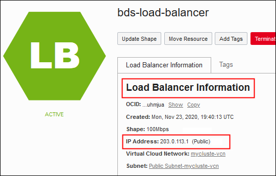

#  Use the Load Balancer to Access Services on the Cluster

After you've completed the steps in the previous lab, you can access the services through the load balancer.

## Objective
* Access services like Hue on the cluster by using the load balancer address appended by the port on which the service runs.

This lab assumes you have successfully completed **Lab 2 Create the Load Balancer** in this workshop. It may take a few minutes after completing all the steps in the previous lab for the backend sets and listeners to be ready to receive requests.

Estimated lab time: 10 minutes

## Task 1: Access the Services on the Cluster

To access the services configured with this load balancer:

1. Find the IP address or the hostname used for your load balancer.

    * **IP address**

      Find the IP address in the **Load Balancer Information** panel at the top of the load balancer pages.

      <!---->
      

    * **DNS hostname**

      (DNS hostname is optional.) After the load balancer is created and it's been given an IP address, you or another administrator must add a DNS entry to your DNS name servers, to resolve your desired hostname (for example, `bds-frontend.mycompany.com`) to the public IP address of the load balancer. Then, the services registered in the load balancer will be accessible by using that hostname; for example, `bds-frontend.mycompany.com:7183` for Cloudera Manager.

      For information about using DNS in Oracle Cloud Infrastructure, see [Overview of the DNS Service](https://docs.cloud.oracle.com/en-us/iaas/Content/DNS/Concepts/dnszonemanagement.htm) in the Oracle Cloud Infrastructure documentation.

2. In a web browser, enter the address as follows:

    * To use the load balancer's IP address: `https://`*`<load-balancer-ip-address>`*:*`<port>`*

    * To use the load balancer's hostname in a domain: `https://`*`<hostname>`*:*`<port>`*

    That is, for Cloudera Manager:

    * `https://`*`<load-balancer-ip-address>`*`:7183`

      <!---->
      

      * `https://`*`<hostname>`*`:7183`

    For Hue:
      * `https://`*`<load-balancer-ip-address>`*`:8889`
      * `https://`*`<hostname>`*`:8889`

    For Big Data Studio:
      * `https://`*`<load-balancer-ip-address>`*`:30000`
      * `https://`*`<hostname>`*`:30000`

**This concludes this workshop.**

## Learn More

* [Oracle Big Data Service](https://docs.oracle.com/en/cloud/paas/big-data-service/)

## Acknowledgements

* **Last Updated Date:** April 2021
