#  Create the Load Balancer

## Introduction

Follow these steps to create and use a load balancer for a highly-available (HA) Big Data Service cluster.

Estimated lab time: 90 minutes

## Task 1: Gather Information

Gather the following information before you start:

  | Information | What It Is and Where To Find It |
| :--- | :--- |
| SSH private key file | The name and location of the SSH private key file that is paired with with the SSH public key associated with the cluster. <br/><br/>The public key was associated with the cluster when the cluster was created. (See "Lab 2: Create a BDS Hadoop Cluster" in [Getting Started with Oracle Big Data Service (HA Cluster)](https://apexapps.oracle.com/pls/apex/dbpm/r/livelabs/view-workshop?wid=674&session=3565379308288).) If you don't have the private key, contact the cluster administrator or the person who created the cluster.<br/><br/>In the examples shown in this workshop, the example SSH key pair is `my-ssh-key` (the  private key) and `my-ssh-key.pub` (the public key). In the examples, the private key is located in `C:\Users\MYHOME\bds\ssh\`. |
|Private IP address of the first utility node |The private IP address assigned to the first utility node when it was created. <br/><br/> Find this address in the **Node Information** box on the **Big Data > Clusters > Cluster Details > Nodes > Node Details** page for the first utility node of your cluster.<br/><br/>In the example shown in this workshop, the private IP address is `198.51.100.0`. Your IP address will be different. |
|Private IP address of the second utility node |The private IP address assigned to the second utility node when it was created. <br/><br/> Find this address in the **Node Information** box on the **Big Data > Clusters > Cluster Details > Nodes > Node Details** page for the second utility node of your cluster.<br/><br/>In the example shown in this workshop, the private IP address is `198.51.100.1`. Your IP address will be different. |
|Public IP address of the first utility node |The public IP address of the first utility node. <br/><br/>If you followed the steps in the [Getting Started with Oracle Big Data Service (HA Cluster)](https://apexapps.oracle.com/pls/apex/dbpm/r/livelabs/view-workshop?wid=674&session=3565379308288) workshop, this is the public IP address that you mapped to the first utility node's private IP address. <br/><br/>If you're using a bastion host, Oracle FastConnect, or Oracle IPSec VPN, find the IP addresses of the nodes assigned via those solutions. Note that IP addresses available via these solutions aren't reachable from the public internet. However, for convenience, they are called "public" in this lab.<br/><br/>In the examples shown in this workshop, the public IP address of the first utility node is `192.0.2.0`. Your IP address will be different.|
|Public IP address of the second utility node |The public IP address of the second utility node. <br/><br/>If you followed the steps in the [Getting Started with Oracle Big Data Service (HA Cluster)](https://apexapps.oracle.com/pls/apex/dbpm/r/livelabs/view-workshop?wid=674&session=3565379308288) workshop, this is the public IP address that you mapped to the second utility node's private IP address. <br/><br/>If you're using a bastion host, Oracle FastConnect, or Oracle IPSec VPN, find the IP addresses of the nodes assigned via those solutions.<br/><br/>In the examples shown in this workshop, the public IP address of the second utility node is `192.0.2.1`. Your IP address will be different.|


## Task 2: Copy SSL Certificates from the Cluster

In this step, you'll obtain self-signed SSL certificates and keys that are included in your cluster. They're located in the `/opt/cloudera/security/x509` directories of the first and second utility nodes.

You'll copy the following certificates and keys:
* From the first utility node:

    * `/opt/cloudera/security/x509/`_&lt;first\_utility\_node\_certificate&gt;_`.pem`

    * `/opt/cloudera/security/x509/node.hue.key`

* From the second utility node:

    * `/opt/cloudera/security/x509/`_&lt;second\_utility\_node\_certificate&gt;_`.pem`

    * `/opt/cloudera/security/x509/node.hue.key`

To copy the files:

1. On the Windows taskbar, right-click the Windows **Start** button and select **Windows PowerShell**.

    <!--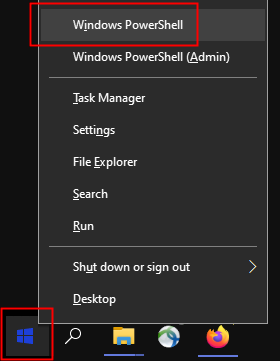-->
    

    **Note:** If you use a Virtual Private Network (VPN), you may need to disconnect from VPN before using PowerShell to connect to your cluster. Re-establish your VPN connection when you move on to **STEP 3: Create the Load Balancer,** below.

2. In PowerShell, use `ssh` with your private key to connect to the first utility node:

    ```
    PS C:\Users\MYHOME\&gt; <copy>ssh -i &lt;private-ssh-key&gt; opc@&lt;first-util-node-public-ip-address&gt;</copy>
      ```
    For example:
    * If you're entering commands from your `C:\Users\MYHOME` directory,
    * and your private key file `my-ssh-key` is in `C:\Users\MYHOME\bds\ssh`,
    * and the public IP address of the first utility node of your cluster is `192.0.2.0`,

    then enter:

      ```
    PS C:\Users\MYHOME\&gt; <copy>ssh -i bds/ssh/my-ssh-key opc@192.0.2.0</copy>
    Last login: Tue Nov 10 17:59:41 2020 from some-host
    [opc@myclustun0 ~]$

      ```

      Notice that the name of the first utility node is shown in the Linux prompt. In the example above, it's `myclustun0`.

3. At the Linux prompt, list the contents of ``/opt/cloudera/security/x509/``, which is the directory that contains the SSL files on the node. For example:

      ```
    [opc@myclustun0 ~]$ <copy>ls -1 /opt/cloudera/security/x509/</copy>
    agents.pem
    hostname.key
    hostname.pem
    hue.pem
    node_myclustmn0.sub12345678901.myclustevcn.oraclevcn.com.pem
    node_myclustmn1.sub12345678901.myclustevcn.oraclevcn.com.pem
    node_myclustun0.sub12345678901.myclustevcn.oraclevcn.com.pem
    node_myclustun1.sub12345678901.myclustevcn.oraclevcn.com.pem
    node_myclustwn0.sub12345678901.myclustevcn.oraclevcn.com.pem
    node_myclustwn1.sub12345678901.myclustevcn.oraclevcn.com.pem
    node_myclustwn2.sub12345678901.myclustevcn.oraclevcn.com.pem
    node.cert
    node.hue.key
    node.key
      ```

4. Copy and save the file *names* of the PEM files for the first and second utility nodes. You can identify them by looking at the first parts of the names, where ``<cluster>`` is the first seven letters of the cluster name, `un0` identifies the first utility node, and  `un1` identifies the second utility node. For example, in a cluster named `mycluster`, the first utility node is:

    `node_`**`myclustun0`**`.sub12345678901.myclustevcn.oraclevcn.com.pem`

    And the second utility node is:

      `node_`**`myclustun1`**`.sub12345678901.myclustevcn.oraclevcn.com.pem`

      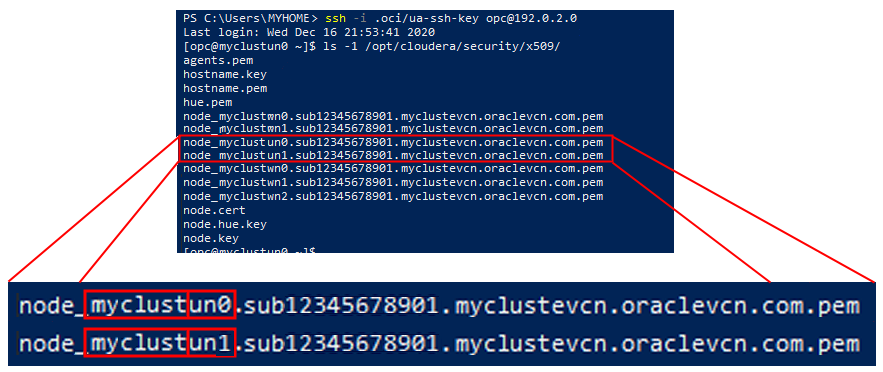

    You'll use these names in the following steps, when you issue commands to download the files.

5. At the Linux prompt, type `exit` to disconnect from the cluster.

6. Remain in PowerShell. For convenience later, create a directory for saving the SSL file. For example, if you have a `bds` directory under your home directory, you can create the `ssl-files` directory under it:

      ```
    PS C:\Users\MYHOME\&gt; <copy>mkdir bds/ssl-files</copy>

      ```

7. Use the `scp` command to copy the SSL certificate from the first utility node  (`node0`) to a `<target>` location on your computer, for example the `ssl-files` directory you just created. For convenience later, copy the file to an easily recognizable name, with a `.pem` filename extension:

      ```
    PS C:\Users\MYHOME\&gt; <copy>scp -i &lt;ssh-private-key&gt; opc@&lt;first-util-node-public-ip-address&gt;:/opt/cloudera/security/x509/&lt;ssl-cert-file-name&gt; &lt;target-dir/filename&gt;</copy>
      ```

    For example,:
    * If you're entering the command from your `C:\Users\MYHOME` directory,
    * and you want to copy the file to your `C:\Users\MYHOME\bds\ssl-files\` directory,
    * and you want to rename the file to `first-util-node-cert.pem`,

    then enter:

      ```
    PS C:\Users\MYHOME\&gt; <copy>scp -i bds/my-ssh-key opc@192.0.2.0:/opt/cloudera/security/x509/node_myclustun0.sub12345678901.myclustevcn.oraclevcn.com.pem bds/ssl-files/first-util-node-cert.pem</copy>
      ```

      Notice that the public IP address is for the first utility node. In this example, it's  `192.0.2.0`.

8. Copy the SSL key file (named `node.hue.key`) for the ***first*** utility node (`node0`) to the target location on your computer, for example the `ssl-files` directory. For convenience later, copy the file to an easily recognizable name, with a `.key` filename extension, for example, `first-util-node.key`.  

      ```
    PS C:\Users\MYHOME\&gt; <copy>scp -i &lt;ssh-private-key&gt; opc@&lt;first-util-node-public-ip-address&gt;:/opt/cloudera/security/x509/node.hue.key &lt;target-dir/filename&gt;</copy>
      ```

      For example:

      ```
    PS C:\Users\MYHOME\&gt; <copy>scp -i bds/my-ssh-key opc@198.51.100.0:/opt/cloudera/security/x509/node.hue.key bds/ssl-files/first-util-node.key</copy>
      ```
9. Use the `scp` command to copy the SSL certificate from the ***second*** utility node  (`node1`) to the target location on your computer, for example the `ssl-files` directory. Copy the file to an easily recognizable name, with a `.pem` filename extension:

      ```
    PS C:\Users\MYHOME\&gt; <copy>scp -i &lt;ssh-private-key&gt; opc@&lt;second-util-node-ip-address&gt;:/opt/cloudera/security/x509/&lt;ssl-cert-file-name&gt; &lt;target-dir/filename&gt;</copy>
      ```

    For example, :
    * If you're entering the command from your `C:\Users\MYHOME` directory,
    * and you want to copy the file to your `C:\Users\MYHOME\bds\ssl-files\` directory,
    * and you want to rename the file to `second-util-node-cert.pem`,

    then enter:

      ```
    PS C:\Users\MYHOME\&gt; <copy>scp -i bds/my-ssh-key opc@192.0.2.1:/opt/cloudera/security/x509/node_myclustun0.sub12345678901.myclustevcn.oraclevcn.com.pem bds/ssl-files/second-util-node-cert.pem</copy>
      ```

      Notice that the public IP address is for the second utility node. In this example, it's  `192.0.2.1`.

10. Copy the SSL key file (named `node.hue.key`) for the second utility node to the target location. For convenience later, copy the file to an easily recognizable name, with a `.key` filename extension, for example, `second-util-node.key`.  

      ```
    PS C:\Users\MYHOME\&gt; <copy>scp -i &lt;ssh-private-key&gt; opc@&lt;second-util-node-ip-address&gt;:/opt/cloudera/security/x509/node.hue.key &lt;target-dir/filename&gt;</copy>
      ```

      For example:

      ```
    PS C:\Users\MYHOME\&gt; <copy>scp -i bds/my-ssh-key opc@198.51.100.1:/opt/cloudera/security/x509/node.hue.key bds/ssl-files/second-util-node.key</copy>
      ```
11. List your downloaded files to make sure the files were downloaded appropriately, for example:

      ```
    PS C:\Users\MYHOME\&gt; <copy>ls</copy> bds/ssl-files

    Directory: C:\Users\MYHOME\ssl-files

    Mode      LastWriteTime            Length Name
    ----      -------------  ------    ----
    -a----    11/17/2020     9:26 AM   1285 first-util-node-cert.pem
    -a----    11/17/2020     9:30 AM   1675 first-util-node.key
    -a----    11/17/2020     9:35 AM   1285 second-util-node-cert.pem
    -a----    11/17/2020     9:40 AM   1675 second-util-node.key
      ```

10. Close Windows PowerShell.

## Task 3: Create the Load Balancer

1.   **Note:** If you use VPN to connect to Oracle Cloud, and you disconnected from VPN to perform STEP 2, above, reconnect to VPN before continuing.

  Sign in to the **Oracle Cloud Console** as an administrator. See [Signing In to the Console](https://docs.cloud.oracle.com/en-us/iaas/Content/GSG/Tasks/signingin.htm).

2. Click the **Navigation Menu** in the upper left, navigate to **Networking**, and select **Load Balancer**.

	

3. On the **Load Balancers in *&lt;compartment&gt;* Compartment** page, under **Compartment** in the panel on the left, select the compartment containing your cluster, and then click **Create Load Balancer**.

    <!--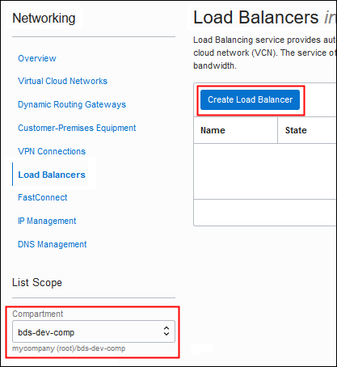-->
    

4. On the **Add Details** page of the **Create Load Balancer** wizard, enter the following information:

    * **Load Balancer Name:** Enter a name to identify the load balancer; for example, `bds-load-balancer`.

    * **Choose Visibility Type:** Click **Public** to create a load balancer that will be accessible from the public internet.

    * **Assign a public IP address:** Click **Ephemeral IP Address** to have an ephemeral IP address assigned to the load balancer. An ephemeral IP address is an IP address that doesn't persist beyond the life of the resource. When the load balancer is deleted, this IP address will return to the pool of available IP addresses in the tenancy.

    * **Choose Total Bandwidth:** Accept the default **Small**.

    * **Virtual Cloud Networking in *&lt;compartment&gt;*:** Click the **Select a virtual cloud network** list and select the VCN where your cluster is running. If the network is in a different compartment, click **Change Compartment** and select the compartment from the list.

     * **Subnet in *&lt;compartment&gt;*:** Click the **Select a subnet** list and select a public subnet in your VCN to use for the load balancer. (A public subnet is required for a public load balancer.) If the subnet is in a different compartment, click **Change Compartment** and select the compartment from the list.

     * **Use network security groups to control traffic:** Leave this box unchecked.

    <!--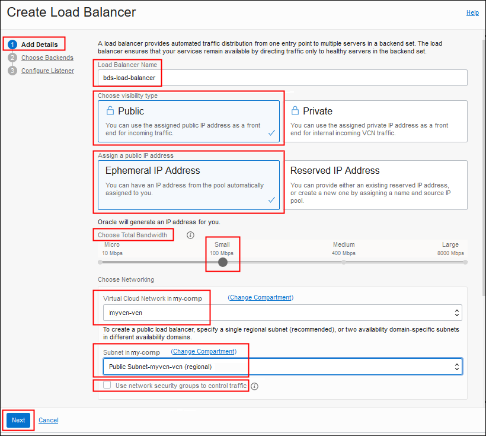-->
    

5. Click **Next**.

6. On the **Choose Backends** page of the wizard, enter the following information to create a backend set for Cloudera Manager:

    * **Specify a Load Balancing Policy:** Accept the default **Weighted Round Robin**.

    * **Select Backend Servers:** Skip this option. You'll add a backend server later.

    * **Specify Health Check Policy:** Enter the following for the health check policy for this Cloudera Manager backend set:

        * **Protocol:** Select **HTTP**.

        * **Port:** Enter **7183**, which is the port on which Cloudera Manager listens.

        * **Interval in ms (Optional):** You can accept the default or change the value to suit your needs.

        * **Timeout in ms (Optional):** You can accept the default or change the value to suit your needs.

        * **Number of Retries (Optional):** You can accept the default or change the value to suit your needs.

        * **Status Code (Optional):** You can accept the default or change the value to suit your needs.

        * **URL Path (URI):** Keep the default forward slash (**/**).

        * **Use SSL:** Leave this box unchecked. You'll configure SSL for this backend set later.

        <!--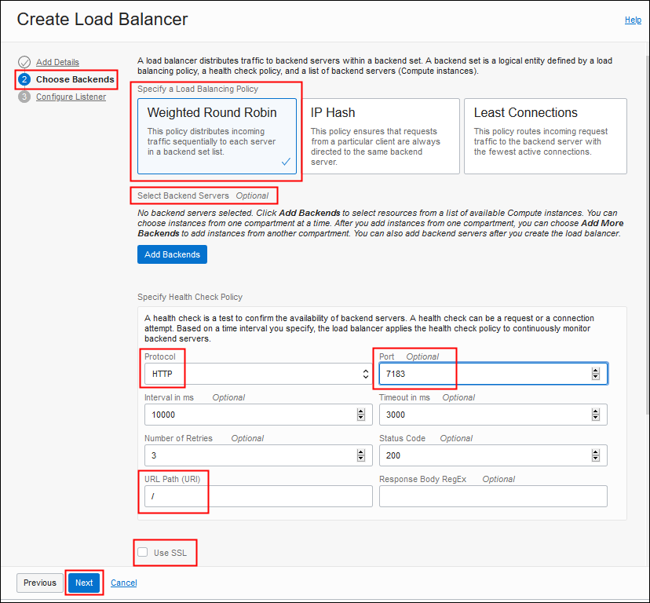-->
        

    **Note:** When the load balancer is created, it will include this backend set for Cloudera Manager. The name of the backend set will be something like **bs\_lb\_&lt;date-timestamp&gt;**; for example, **bs\_lb\_2020-1117-1226**. You can't change this name.

7. Click **Next**.

8. On the **Configure Listener** page of the wizard, enter the following information:

    * **Listener Name:** Enter a name for the listener for Cloudera Manager; for example, `cm-listener`.

    * **Specify the type of traffic your listener handles:** Select **HTTP**. You'll change this to HTTPS later, by configuring SSL.

    * **Specify the port your listener monitors for ingress traffic**: Enter **7183**.

    <!---->
    

9. Click **Submit**. When the large load balancer status icon at the top of the **Load Balancer Details** page turns from orange to green and the label is "Active," you can continue with the steps below. It may take a few minutes to create the load balancer.

  <!--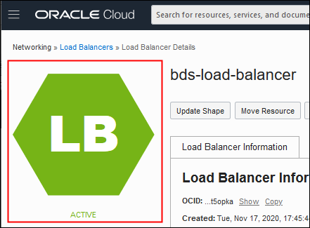-->
  

## Task 4: Create Certificate Bundles

In this step, you'll create two certificate bundles with the SSL certificate and key files that you downloaded in **STEP 2: Copy SSL Certificates from the Cluster**. You'll use them later to configure SSL for backend sets and listeners.  

1. On the left side of the **Load Balancer Details** page, under **Resources**, click **Certificates** and then click **Add Certificate**.

    <!---->
    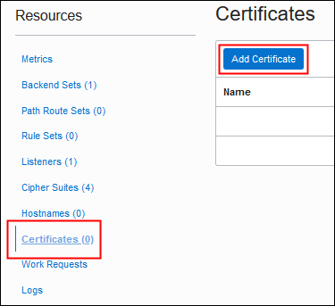

2. On the **Add Certificate** page, enter the following information:

    * **Certificate Name:** Enter `first-util-node-cert-bundle` (or a name of your choice).

    * **SSL Certificate:** In the **SSL Certificates** box, click the **select one** link, find and select the SSL certificate you downloaded from the ***first*** utility node; for example, `first-util-node-cert.pem` in `C:\Users\MYHOME\bds\ssl-files`, and click **Open**.

        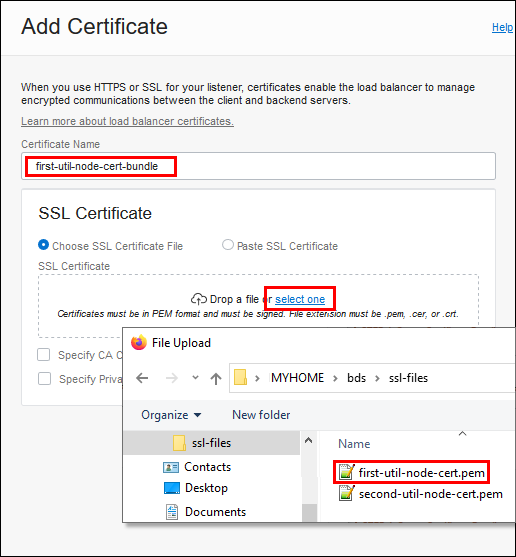

      **Note:** If you don't see your `.pem` and `.key` files in the directory where you saved them in **STEP 2: Copy SSL Certificates from the Cluster**, above, make sure that all files types are displayed in the Windows **File Upload** dialog box by selecting **All Files (\*.\*)** from the list above the **Open** button.

      <!---->
      

    * **Specify CA Certificate:** Check this box, and then click the **select one** link to add the same file that you just added for **SSL Certificate**, above; for example, `first-util-node-cert.pem`.

    * **Specify Private Key**: Check this box, and then click the **select one** link to add the SSL key you downloaded from the first utility node; for example, `first-util-node.key`.

    <!---->
    

3. Click **Add Certificate**, and then click **Close** in the **Work Request Submitted** dialog box. It may take a few moments for the bundle to be added to the **Certificates** table at the bottom of the **Certificates** page.

    <!---->
    

    **Note:** If you get an error that the certificate and key files don't match, check to make sure that you added the PEM and KEY files that you downloaded from the same (first) utility node.

4. Remain on the **Load Balancer Details > Certificates** page, and click **Add Certificate** again.

    <!---->
    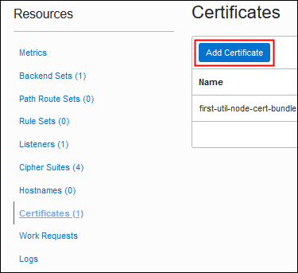

5. On the **Add Certificate** page, enter the following information:

    * **Certificate Name:** Enter `second-util-node-cert-bundle` (or a name of your choice).

    * **SSL Certificate:** In the **SSL Certificates** box, click the **select one** link, find and select the SSL certificate you downloaded from the ***second*** utility node; for example, `second-util-node-cert.pem` in `C:\Users\MYHOME\bds\ssl-files`, and click **Open**.

        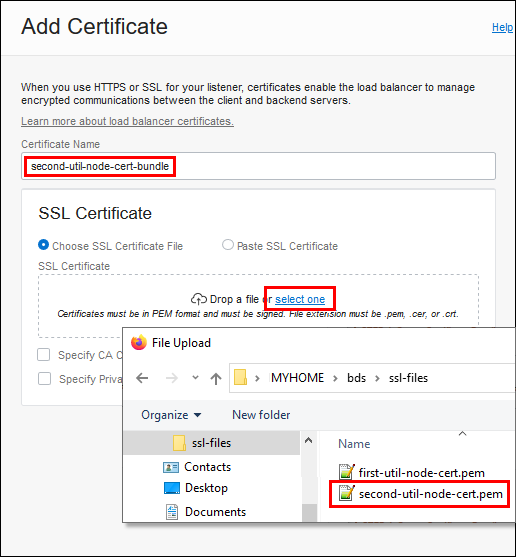

    * **Specify CA Certificate:** Check this box, and then click the **select one** link to add the same file that you just added for **SSL Certificate**, above; for example, `second-util-node-cert.pem`.

    * **Specify Private Key**: Check this box, and then click the **select one** link to add the SSL key you downloaded from the ***second*** utility node; for example, `second-util-node.key`.

    <!--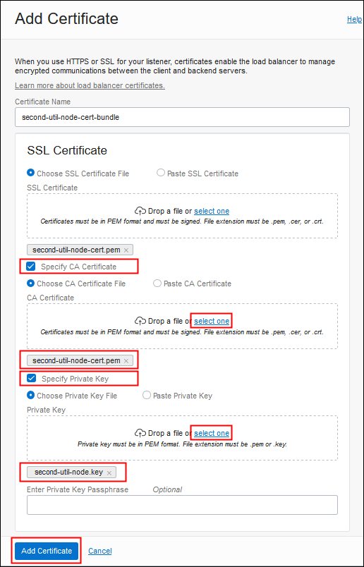-->
    

6. Click **Add Certificate**, and then click **Close** in the **Work Request Submitted** dialog box. It may take a few moments for the bundle to be added to the **Certificates** table at the bottom of the **Certificates** page.

    <!--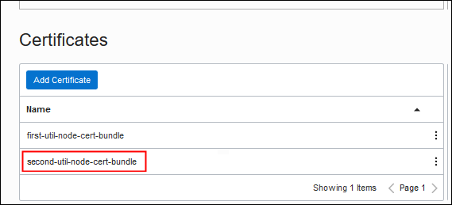-->
    

    **Note:** If you get an error that the certificate and key files don't match, check to make sure that you added the PEM and KEY files that you downloaded from the same (second) utility node.


## Task 5: Configure the Backend Set for Cloudera Manager

1. On the left side of the **Certificates** page, under **Resources**, click **Backend Sets**. The backend set you created for Cloudera Manager in [STEP 3: Create the Load Balancer](#Step3:CreatetheLoadBalancer) is displayed in the **Backend Sets** table, with a name like **`bs_lb_<date-timestamp>`**; for example, **bs\_lb\_2020-1117-1226**. Click the **Action**  menu at the end of the row containing this backend set, and select **Edit**.

    <!---->
    

3. On the **Edit Backend Set** page, enter the following information.

    * **Name:** This read-only field shows the name that was created for you by the wizard, for example, **bs\_lb\_2020-1117-1226**.

    * **Traffic Distribution Policy:** Accept the default **Weighted Round Robin**.

    * **Use SSL:** Select this box. Then, under **Certificate Name**, select the bundle you created with the self-signed SSL certificate for the ***first*** utility node; for example, **first-util-node-cert-bundle**.

    * **Verify Peer Certificate:** Check this box.

    * **Verify Depth:** Set to **1**.

    * **Session Persistence:** Accept the default **Disable Session Persistence**.

    <!---->
    

4. Click **Update Backend Set**, and then click **Close** in the **Work Request Submitted** dialog box. When complete, a cipher suite name is added to the **Cipher Suite** field for the backend set. It may take a few moments for the name to appear.

    <!-- 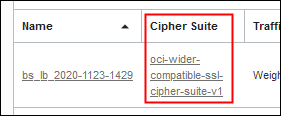-->
    

## Task 6: Create a Backend Set for Hue

1. Remain on the **Backed Sets** page and click **Create Backend Set**. On the **Create Backend Set** page, enter the following information.

    * **Name:** Enter a name; for example, **`hue-backend-set`**.

    * **Traffic Distribution Policy:** Accept the default **Weighted Round Robin**.

    * **Use SSL:** Select this box. Then, under **Certificate Name**, select the bundle you created with the self-signed SSL certificate for the ***second*** utility node; for example, **second-util-node-cert-bundle**.

    * **Verify Peer Certificate:** Check this box.

    * **Verify Depth:** Set to **1**.

    * **Session Persistence:** Accept the default **Disable Session Persistence**.

    * **Health Check:** Enter the following information:

        * **Protocol:** Select **TCP**.

        * **Port:** Enter **`8889`**, which is the port on which Hue listens.

    <!-- 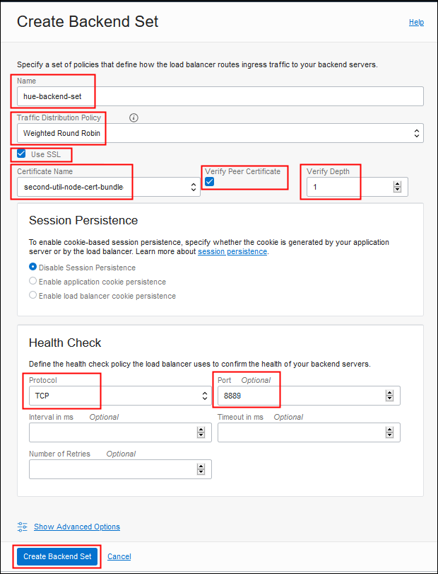-->
    


2. Click **Create Backend Set**, and then click **Close** in the **Work Request Submitted** dialog box. It may take a few moments for the backend set to be added to the **Backend Sets** table.

## Task 7: Create a Backend Set for Big Data Studio

1. Remain on the **Backend Sets** page and click **Create Backend Set** again. On the **Create Backend Sets** page, enter the following information.

    * **Name:** Enter a name; for example, **`data-studio-backend-set`**.

    * **Traffic Distribution Policy:** Accept the default **Weighted Round Robin**.

    * **Use SSL:** Select this box, then, under **Certificate Name**, select the bundle you created with the self-signed SSL certificate for the ***second*** utility node; for example,  **second-util-node-cert-bundle**.

    * **Verify Peer Certificate:** Check this box.

    * **Verify Depth:** Set to **1**.

    * **Session Persistence:** Accept the default **Disable Session Persistence**.

    * **Health Check:** Enter the following information:

        * **Protocol:** Select **HTTP**.

        * **Port:** Enter **`30000`**, which is the port on which Big Data Studio listens.

        * **URL Path (URI)**: Enter a forward slash (**/**).

2. Click **Create Backend Set**, and then click **Close** in the **Work Request Submitted** dialog box. It may take a few moments for the backend set to be added to the **Backend Sets** table.

## Task 8: Add a Backend Server for Cloudera Manager

1. Remain on the **Backend Sets** page. In the **Backend Sets** table, click the name of the backend set for Cloudera Manager; for example, **bs\_lb\_2020-0928-1136**. (Remember, the **Create Load Balancer** wizard assigned this name to first backend set; that is, the one for Cloudera Manager.)

2. On the left side of the **Backend Set Details** page, under **Resources**, click **Backends**.

    <!--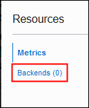-->
    

3. On the **Backends** page, click **Add Backends**, and then enter the following information on the **Add Backends** page:

    * **IP Addresses:** Select this option at the top of the page, so you can enter a specific IP address.

    * **IP Address**: Enter the private IP address of the ***first*** utility node of your cluster; for example, `198.51.100.0`.

      * **Port:** Enter **`7183`**, which is the port on which Cloudera Manager listens.

      * **Weight:** Accept the default value **1**.

    <!---->
    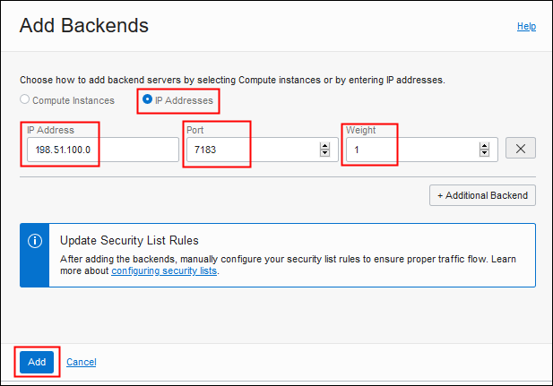

4. Click **Add**, and then click **Close** in the **Work Request Submitted** dialog box. It may take a few moments for the backend server to be added to the **Backends** table.

## Task 9: Add a Backend Server for Hue

1. Click **Backend Sets** in the breadcrumbs at the top of the page to return to the **Backend Sets** page. In the **Backend Sets** table, click the name of the backend set you created for Hue; for example, **hue-backend-set**.

2. On the left side of the **Backend Set Details** page, under **Resources**, click **Backends**. Then click **Add Backends**.

3. On the **Backends** page, click **Add Backends**, and then enter the following information on the **Add Backends** page:

    * **IP Addresses:** Select this option at the top of the page, so you can enter a specific IP address.

    * **IP Address:** Enter the private IP address of the ***second*** utility node; for example, **`198.51.100.1`**.

    * **Port:** Enter **`8889`**, which is the port on which Hue listens.

    * **Weight:** Accept the default value **1**.

4. Click **Add**, and then click **Close** in the **Work Request Submitted** dialog box. It may take a few moments for the backend server to be added to the **Backends** table.

## Task 10: Add a Backend Server for Big Data Studio

1. Click **Backend Sets** in the breadcrumbs at the top of the page to return to the **Backend Sets** page. In the **Backend Sets** table, click the name of the backend set you created for Big Data Studio; for example, **data-studio-backend-set**.

2. On the left side of the **Backend Set Details** page, under **Resources**, click **Backends**. Then click **Add Backends**.

3. On the **Backends** page, click **Add Backends**, and then enter the following information on the **Add Backends** page:

    * **IP Addresses:** Select this option at the top of the page, so you can enter a specific IP address.

    * **IP Address:** Enter the private IP address of the ***second*** utility node; for example, `198.51.100.1`.

    * **Port:** Enter **`30000`**, for the port where Big Data Studio listens.

    * **Weight:** Accept the default value **1**.

4. Click **Add**, and then click **Close** in the **Work Request Submitted** dialog box. It may take a few moments for the backend server to be added to the **Backends** table.

## Task 11: Configure the Listener for Cloudera Manager

1. Click **Load Balancer Details** in the breadcrumbs at the top of the page. On the left side of the **Load Balancer Details** page, under **Resources**, click **Listeners**. Notice that the **Listeners** table includes the listener you created for Cloudera Manager in **STEP 3: Create the Load Balancer**; for example, **cm-listener**.

2. Click the **Action**  menu at the end of the row containing the listener, and select **Edit**.

3. On the **Edit Listener** page, enter the following information. (Most of these options were set when you created the load balancer in **STEP 3: Create the Load Balancer**, above. The option you'll change in this step is **Use SSL**.)

    * **Name:** Read only.

    * **Protocol:** Select **HTTP**. (This should be set already, because you selected it in **STEP 3: Create the Load Balancer**.)

    * **Port:** Enter **`7183`**, which is the port on which Cloudera Manager listens.  (This should be set already, because you selected it in **STEP 3: Create the Load Balancer**.)

    * **Use SSL:** Select this box. Then, under **Certificate Name**, select the bundle you created with the self-signed SSL certificate for the ***first*** utility node; for example, **first-util-node-cert-bundle**.

    * **Verify Peer Certificate:** Leave this box unchecked.

    * **Backend Set:** From the list, select the backend set you created for Cloudera Manager; for example, **bs\_lb\_2020-0928-1136**.  (This should be set already, because you selected it in **STEP 3: Create the Load Balancer**. Remember, the wizard assigned this name when you created the load balancer.)

    <!---->
    

4. Click **Update Listener**, and then click **Close** in the **Work Request Submitted** dialog box. It may take a few moments for the listener to be updated in the **Listeners** table, so that **Use SSL** is **Yes**.

## Task 12: Create a Listener for Hue

1. Remain on the **Listeners** page and click **Create Listener**. Then, on the **Create Listener** page, enter the following information:

    * **Name:** Enter a name for the listener; for example, hue-listener.

    * **Protocol:** Select **HTTP**.

    * **Port:** Enter **`8889`**, which is the port on which Hue listens.

    * **Use SSL:** Select this box. Then, under **Certificate Name**, select the bundle you created with the self-signed SSL certificate for the ***second*** utility node; for example,  **second-util-node-cert-bundle**.

    * **Verify Peer Certificate:** Leave this box unchecked.

    * **Backend Set:** From the list, select the backend set you created for Hue in **STEP 6: Create a Backend Set for Hue**; for example, **hue-backend-set**.


2. Click **Create Listener**, and then click **Close** in the **Work Request Submitted** dialog box. It may take a few moments for the listener to be added to the **Listeners** table.

## Task 13: Create a Listener for Big Data Studio

1. Remain on the **Listeners** page. Click **Create Listener** again. Then, on the **Create Listener** page, enter the following information:

    * **Name:** Enter a name for the listener; for example, **data-studio-listener**.

    * **Protocol:** Select **HTTP**.

    * **Port:** Enter **30000**, which is the port on which Big Data Studio listens.

    * **Use SSL:** Select this box. Then, under **Certificate Name**, select the bundle you created with the self-signed SSL certificate for the ***second*** utility node; for example,  **second-util-node-cert-bundle**.

    * **Verify Peer Certificate:** Leave this box unchecked.

    * **Backend Set:** From the list, select the backend set you created for Big Data Studio in **STEP 7: Create a Backend Set for Big Data Studio**; for example, **data-studio-backend-set**.

2. Click **Create Listener**, and then click **Close** in the **Work Request Submitted** dialog box. It may take a few moments for the listener to be added to the **Listeners** table.

You may now [proceed to the next lab](#next).

## Learn More

* [Oracle Big Data Service](https://docs.oracle.com/en/cloud/paas/big-data-service/)

* [Overview of Load Balancing](https://docs.cloud.oracle.com/en-us/iaas/Content/Balance/Concepts/balanceoverview.htm)

* [Managing SSL Certificates](https://docs.cloud.oracle.com/en-us/iaas/Content/Balance/Tasks/managingcertificates.htm)

## Acknowledgements

* **Last Updated Date:** April 2021
