# Cleanse and Transform data and upload to Hive with Python (PySpark)

## Introduction

In this lab, you will wear the hat of a **Data Engineer**. As this persona you will Cleanse and Transform raw data present in Oracle Object Storage and store it in a particular form into an Object Storage bucket using Spark that is offered as a part of **Big Data Service (BDS)**. Then you will store this data in an external **Hive** table. The data set that we are going to use is the famous Taxi Data Set.

The python script will read the data from a csv file in Object Storage, cleanse and tranform that data and load that data into a Object Storage bucket in parquet format. Transformed data is also stored in an external Hive table.

Estimated Time: 60 minutes

### Objectives

* Creat an Object Storage API Key for the Cluster
* Enable BDS Cluster connectivity to Object Storage
* Create Object Storage bucket for trnsformed data
* Login to Utility node using SSH and submit a Spark job.
* Verify transformed data in Object Storage Bucket.
* Verify transformed data uploaded to Hive.
* Grant write permissions to livy user on Hive Database.

## Task 1: Creat an Object Storage API Key for the Cluster

1. Login to Oracle Cloud Console and open the navigation menu. Click **Analytics & AI**. Under **Data Lake**, click **Big Data Service**.

2. Under Compartment, select the compartment that contains the cluster and in the list of clusters, click the name of the cluster that was created earlier in this workshop.

3. On the **Cluster details** page, under **Resources** on the left pane, click **API keys**. Click **Create key**.

    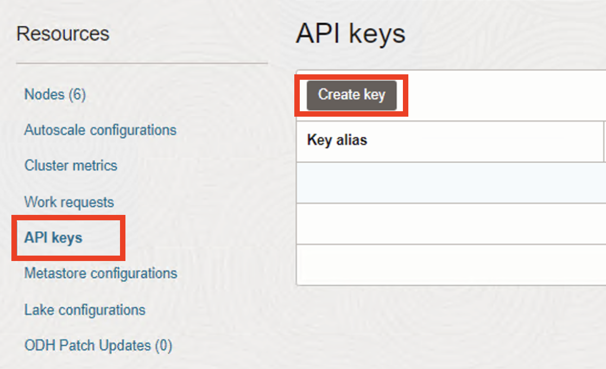

4. In the **Create API key** panel, enter the following :

    **Key alias** :  BDSTrainingAPIKey

    **User OCID** : Enter the OCID of the user.

    **Create passphrase** : Enter a passphrase. This passphrase is used to encrypt the API key and can't be changed later.

    **Confirm passphrase** : Confirm the passphrase.

    **Default Region** : Select a default region that's used to establish the Object Storage endpoint name.

    Click **Create**.

    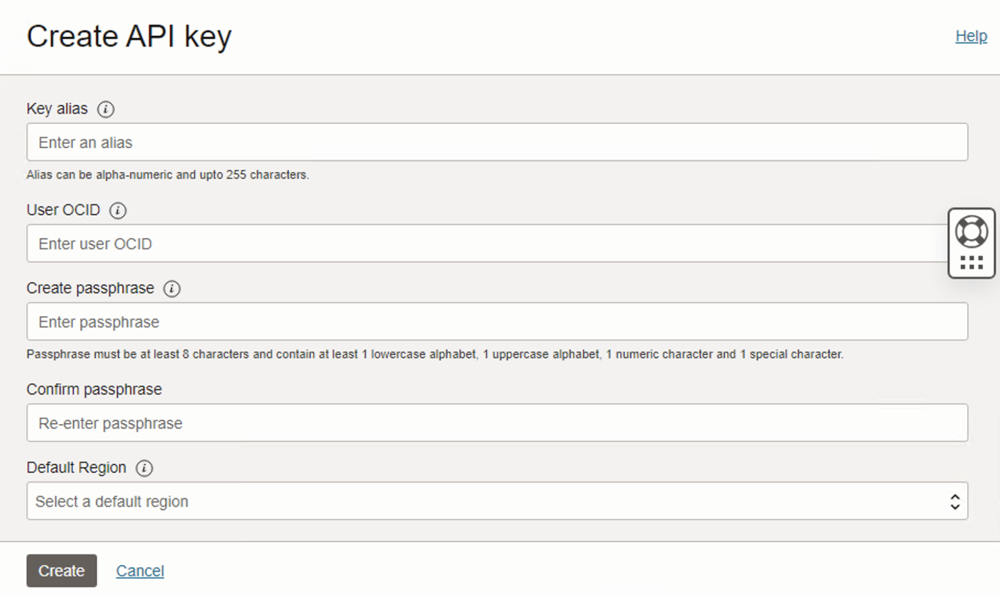

5. The API key is listed in the **API keys** page. When the API key is successfully created, its status changes to **Active**. Click "View configuration file" to get the details of the API key that will be required in the next step.

    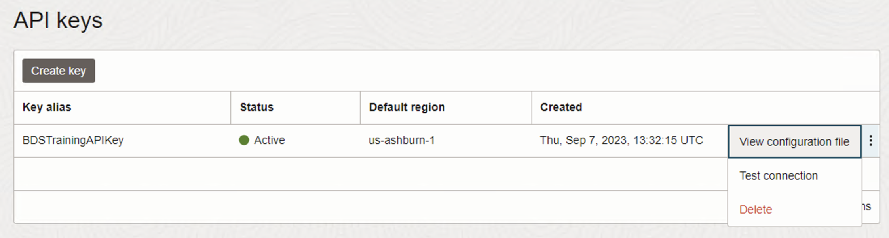

6. Note down the variables displayed on **View configuration file** panel.

    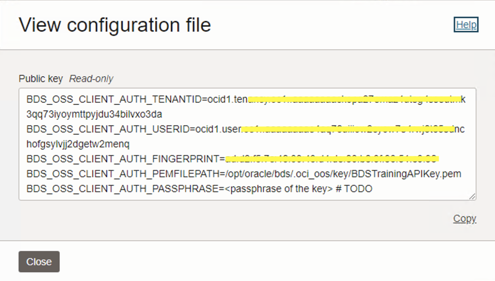

## Task 2: Update HDFS configuration to enable connectivity to Object Storage

1. Login to Ambari and on the left pane click **HDFS**.

    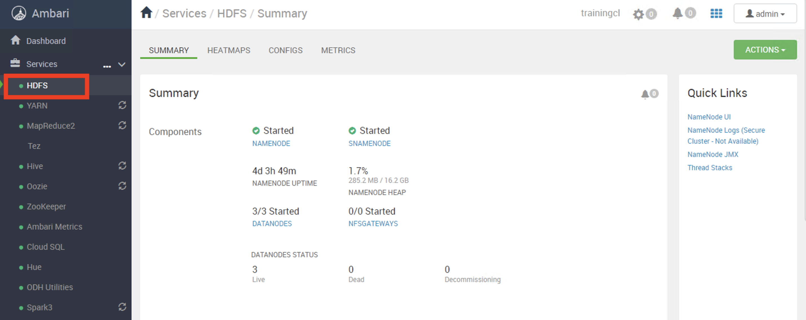

2. Click **ADVANCED** under **CONFIGS**.

    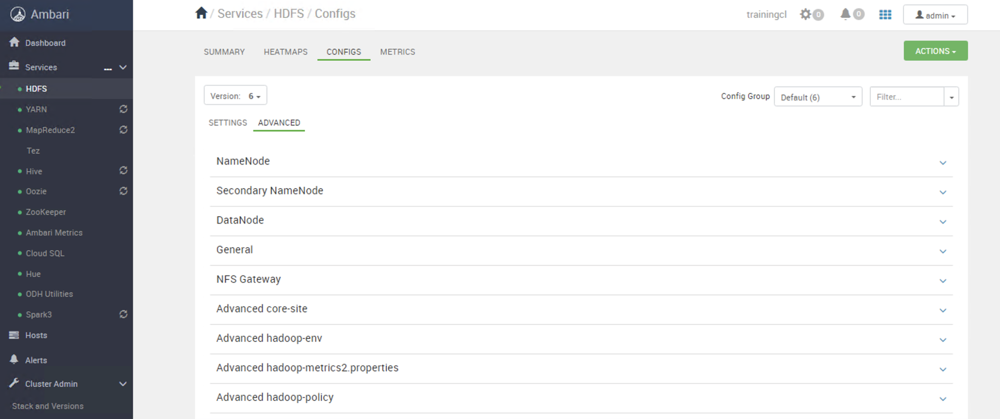

3. Scroll down to update variables under **Custom core-site**. Update the variables with values noted from **View configuration file**. Click **SAVE**.

    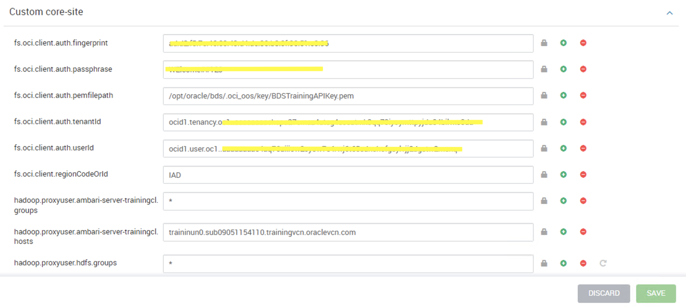

4. Click **SAVE** to confirm the changes.

    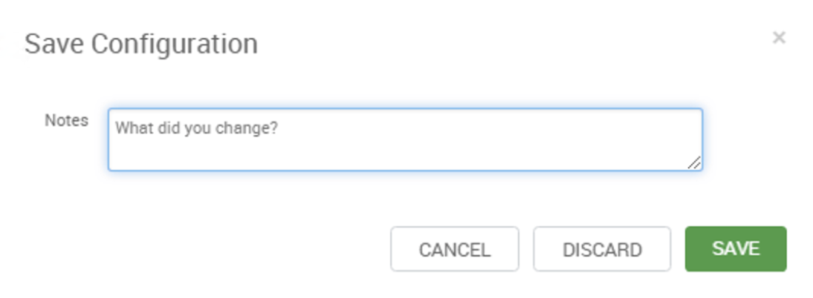

5. Review the recommended changes and click **PROCEED ANYWAY**.

    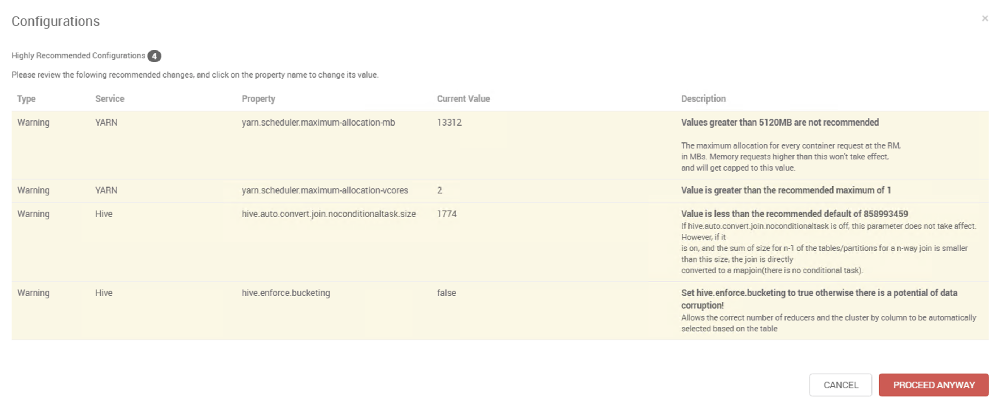

6. Once the changes are saved a pop-up message is displayed with the message **Service configuration changes saved successfully**.

    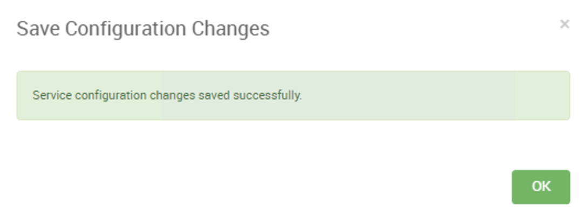

7. At this point you will be prompted to Restart services. Click **RESTART** and then select **Rolling Restart All Affected**.

    

8. Click **CONFIRM ROLLING RESTART ALL**.

    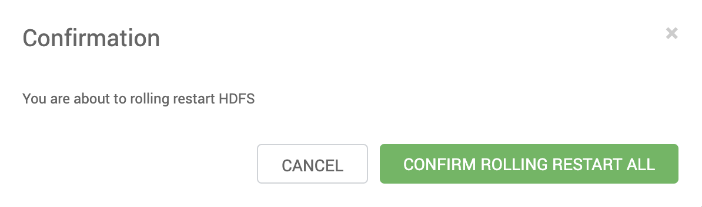

9. This will restart all required services. Click **OK** when restart is complete.

    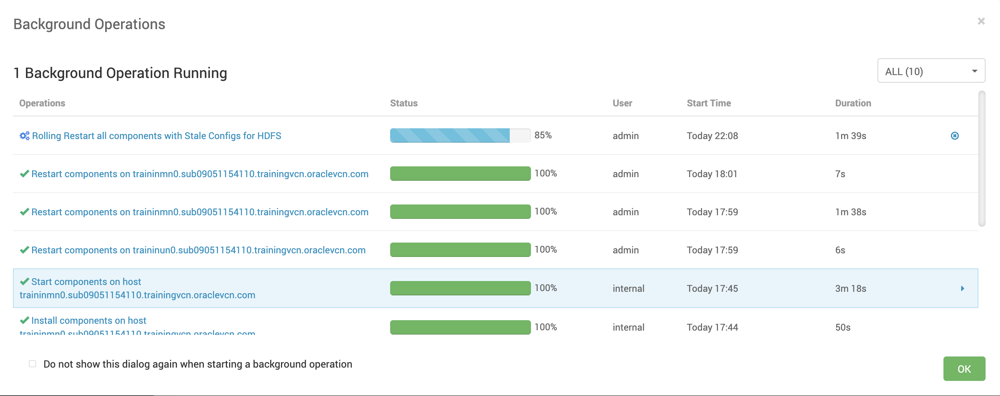

## Task 3: Create an Object Storage bucket

1. Login to Oracle Cloud Console and open the navigation menu. Click **Storage**. Under **Object Storage & Archive Storage**, click **Buckets**.

2. Click **Create Bucket** to create a new Object Storage bucket.

3. Under **Create Bucket** pane, enter the Bucket Name - **Taxi_Data**. Leave rest as default. Click **Create**.

    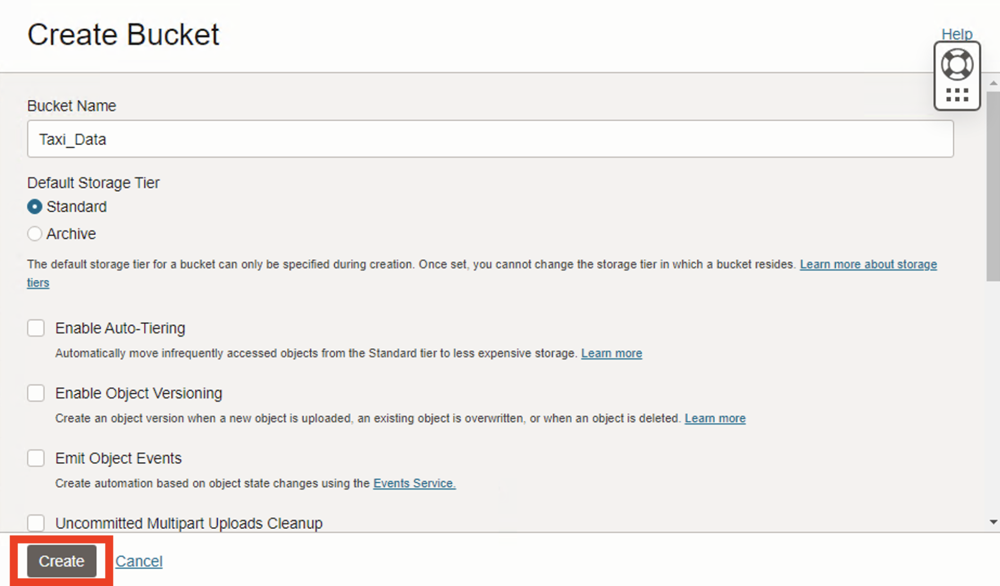

4. From the list of buckets, click on the bucket that we just created **Taxi_Data**. Under **Bucket Details** page, note down the **Namespace** for Object Storage.

    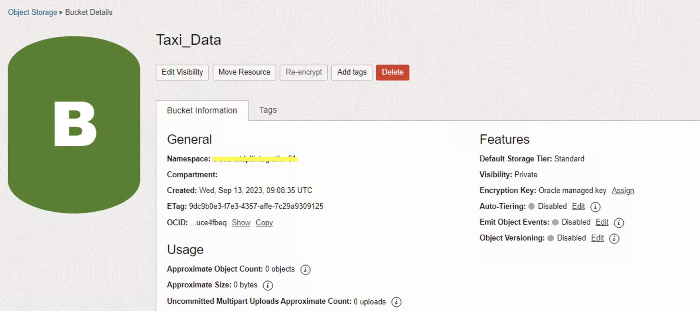

## Task 4: Login to Utility node using SSH and submit a Spark job

1. SSH to the Utility node using the Public IP address of the Utility node. Change to **training** user.

    ```
    $ <copy>sudo su - training</copy>
    ```

2. Download the Python script

    ```
    $ <copy>wget https://objectstorage.us-ashburn-1.oraclecloud.com/p/SQ-xjdbN9yZZq1-v6Au8Apq9G71aKTpGKyJWOO2c3SnGZ3tNL7IgOJSYhcgWadTr/n/orasenatdpltintegration01/b/Taxi/o/taxi_trip_data_cleansing.py</copy>
    ```

3. Edit the Python script (line number 25) and update the **Namespace** as noted in the previous step.

 df.write.parquet("oci://Taxi\_Data@Namespace/yellow\_tripdata\_output/yellow\_tripdata\_2016-03.parquet")

4. Execute the Python script using **spark-submit**

    ```
    $ <copy>spark-submit --deploy-mode cluster --master yarn --driver-memory 1g --num-executors 3 --executor-memory 2g --executor-cores 2 --queue default taxi_trip_data_cleansing.py</copy>
    ```
    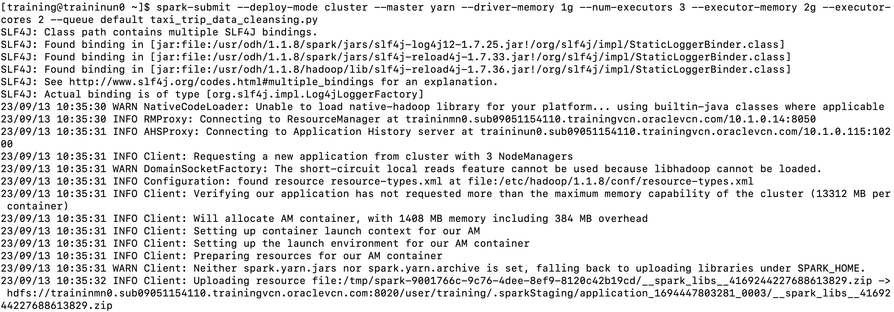

5. Monitor the job to completion.

    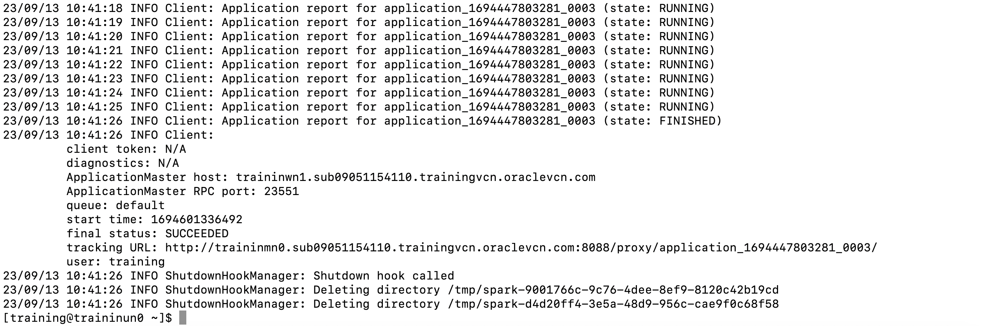

## Task 5: Verify transformed data in Object Storage Bucket

1. Login to Oracle Cloud Console and open the navigation menu. Click **Storage**. Under **Object Storage & Archive Storage**, click **Buckets**.

2. From the list of buckets, click on the bucket that we created earlier **Taxi_Data**. Validate the parquet file created.

    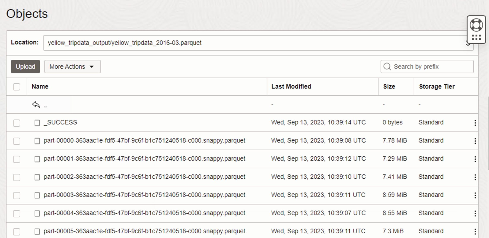

## Task 6: Verify transformed data in Hive table

1. Login to **Hue** and on the **Editor** page click **default** to view the list of databases.

    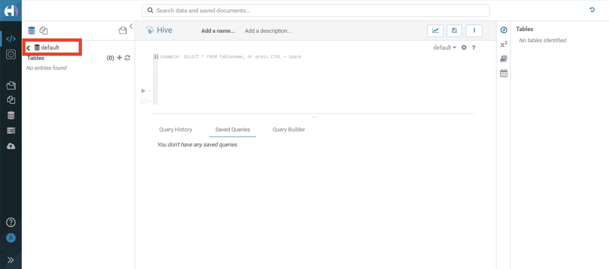

2. Click the database that was created by the Spark job - **bds\_demo\_db**.

    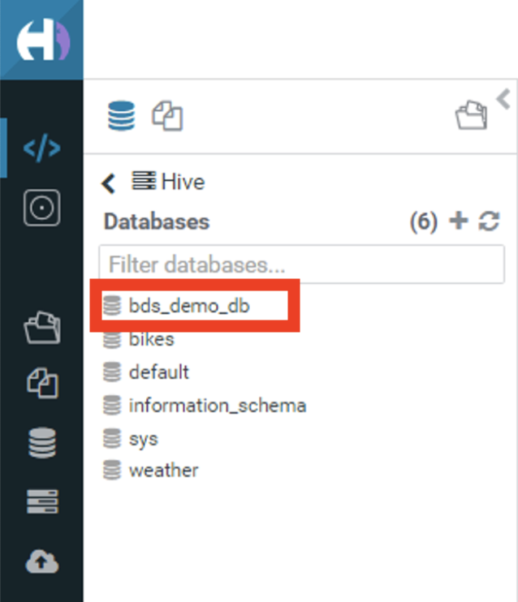

3. This will list the tables created under **bds\_demo\_db** - **your\_cleansed\_data\_table**.

4. Enter the query in query editor - 

    ```
    <copy>select * from bds_demo_db.your_cleansed_data_table</copy>
    ```

5. Execute the query to get the output.

    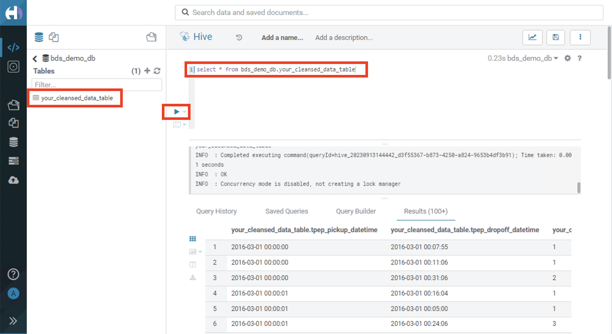

## Task 7: Grant write permissions to livy user on Hive Database

1. In the next lab **livy** user will create a table in **bds\_demo\_db** database. Presently only **training** user can create tables in **bds\_demo\_db** database. Grant access to other users to write to **bds\_demo\_db** database. SSH to Utility Node and execute following steps :

    ```
    $ <copy>sudo su - training</copy>
    $ <copy>hadoop fs -ls /apps/spark/warehouse/</copy>
    $ <copy>hadoop fs -chmod 777 /apps/spark/warehouse/bds_demo_db.db</copy>
    $ <copy>hadoop fs -ls /apps/spark/warehouse/</copy>

    ```
    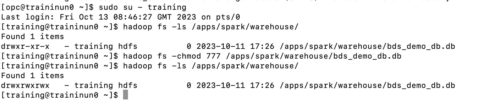

This concludes this lab. You may now **proceed to the next lab**.

## Acknowledgements

* **Author:**  
    + Vivek Verma, Master Principal Cloud Architect, North America Cloud Engineering
* **Contributors:**  
    + Anand Chandak, Principal Product Manager, Data and AI
* **Last Updated By/Date:** Vivek Verma, October 2023