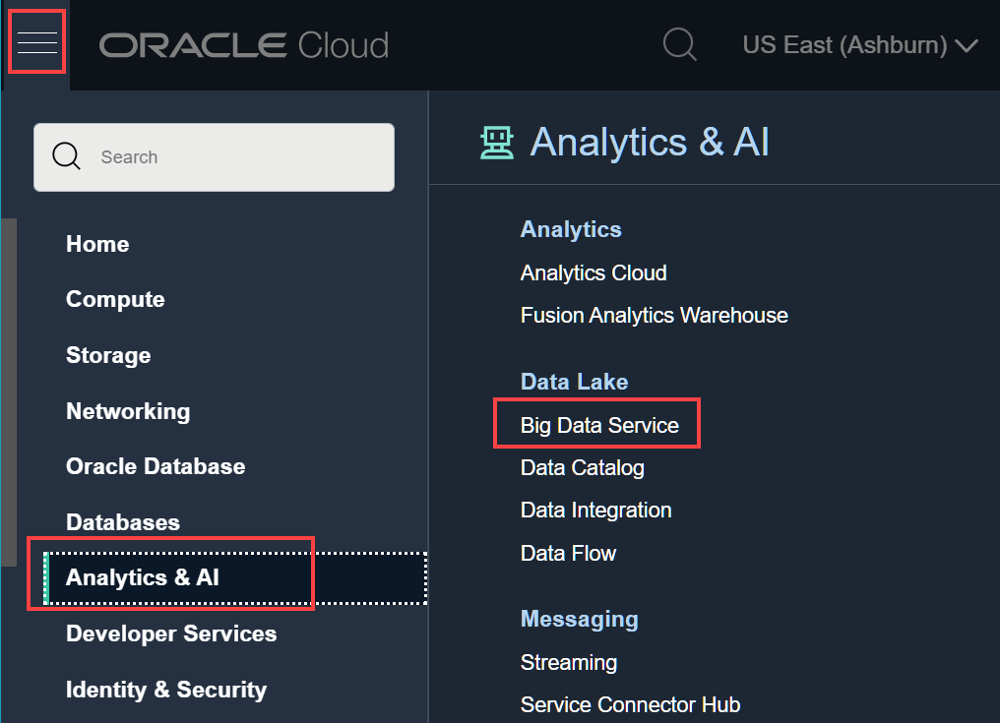

# Clean up Resources Used in this Workshop (Optional)

## Introduction

In this lab, you will learn how to delete the resources that you created in this workshop. If you want to run the labs in this workshop again, perform these clean up tasks.

> **Note:**    
If you are using a **Free Trial** account to run this workshop, Oracle recommends that you at least delete the BDS cluster that you created when you complete the workshop, to avoid unnecessary charges.

Estimated Time: 25 minutes

### Objectives

* Delete your **`training-cluster`** Big Data Service Cluster.
* Delete the resources that you created in your **`training-compartment`** as part of this workshop. This includes your IAM group, IAM user, IAM policies, VCN, reserved IP addresses, object storage bucket and its objects, and so on.

### Prerequisites
This lab assumes that you have successfully completed all of the preceding labs in the **Contents** menu.

> **Note:**     
If you want to list the resources in your **`training-compartment`**, you can use the **Tenancy Explorer** page. From the **Navigation** menu, navigate to **Governance & Administration**. In the  **Governance** section, click **Tenancy Explorer**. On the **Tenancy Explorer** page, in the **Search compartments** field, type **`training`**, and then select **`training-compartment`** from the list of compartments. The resources in the **`training-compartment`** are displayed.

## Task 1: Delete Your Big Data Service Cluster

1. Log in to the **Oracle Cloud Console** as the Cloud Administrator that you used in the workshop.

2. Click the **Navigation** menu and navigate to **Analytics & AI > Big Data Service**.

 	

3. On the **Clusters** page, on the row for **`training-cluster`**, click the **Actions** button, and then select **Terminate Big Data Cluster** from the context menu.

      

4. A confirmation message box is displayed. Enter the name of the cluster, and then click **Terminate**. The status of the cluster in the **State** column is **Deleting**. It can take up to 30 minutes before the cluster is deleted.  

      

5. The status of the cluster in the **State** column changes from **Active** to **Deleting**.

      

6. To view the status of the deletion process, click the cluster's name link in the **Name** column to display the **Cluster Details** page. In the **Resources** section at the bottom left-hand side of the page, click **Work Requests**. In the **Work Requests** section, you can see the **% Complete** information.   

    > **Note:** For additional details on the deletion process, click **CREATE\_BDS** in the **Operation** column. The **DELETE_BDS** page displays the logs, and errors, if any.

7. Click the **Clusters** link in the breadcrumbs to return to the **Clusters** page. When the cluster is successfully deleted, the status of the cluster in the **State** column changes from **Deleting** to **Deleted**.

## Task 2: Delete Your IAM Group, IAM User, and IAM Policies

1. Click the **Navigation** menu and navigate to **Identity & Security > Groups**.

2. From the list of available groups, search for your **training-bds-admin-group**. You cannot delete a group that contains any members; therefore, you will need to remove the **training-bds-admin** user from this group first. Click the group's name link in the **Name** column.

3. In the **Groups Detail** page, scroll down to the **Groups Members** section. Click the **Actions** button associated with the user that you want to remove from this group, and then select **Remove member from group** from the context menu.  A confirmation message box is displayed, click **Remove**.

4.  At the top of the **Groups Detail** page, click **Delete**. A confirmation message box is displayed, click **Delete**. The group is deleted and the **Groups** page is re-displayed.

5. In the **Identity** section on the left pane, click **Users**. From the list of available users, search for your **training-bds-admin** user. Click the **Actions** button associated with this user, and then select **Delete** from the context menu. A confirmation message box is displayed, click **Delete**.

6. In the **Identity** section on the left pane, click **Policies**. Click the **Actions** button associated with the **training-admin-policy** policy, and then select **Delete** from the context menu. A confirmation message box is displayed, click **Delete**.

7. Click the **Actions** button associated with the **training-bds-policy** policy, and then select **Delete** from the context menu. A confirmation message box is displayed, click **Delete**.

## Task 3: Delete Your Virtual Cloud Network (VCN)

To delete a VCN, it must first be empty and have no related resources or attached gateways such as internet gateway, dynamic routing gateway, and so on. To delete a VCN's subnets, they must first be empty too.

1. Click the **Navigation** menu and navigate to **Networking > Virtual Cloud Networks**.

2. From the list of available VCNs in your compartment, click the **training-vcn** name link in the **Name** column. The **Virtual Cloud Network Details** page is displayed.

  

3. In the **Subnets** section, click the **Actions** button associated with **Private Subnet-training-vcn**. Select **Terminate** from the context menu. A confirmation message box is displayed. Click **Terminate**.

4. In the **Subnets** section, click the **Actions** button associated with **Public Subnet-training-vcn**. Select **Terminate** from the context menu. A confirmation message box is displayed. Click **Terminate**.

5. In the **Resources** section on the left pane, click **Route Tables**.

6. In the **Routes Tables** section, click the **Actions** button associated with **Route Table for Private Subnet-training-vcn**. Select **Terminate** from the context menu. A confirmation message box is displayed. Click **Terminate**.

7. In the **Routes Tables** section, click the **Default Route Table for training-vcn** link in the **Name** column. The **Route Table Details** page is displayed. In the **Route Rules** section, click the **Actions** icon associated with **Internet Gateway-training-vcn**. Select **Remove** from the context menu. A confirmation message box is displayed. Click **Remove**. Click **training-vcn** in the breadcrumbs to return to the **training-vcn** page.

8. In the **Resources** section on the left pane, click **Internet Gateways**. In the **Internet Gateways** section, click the **Actions** button associated with **Internet Gateway-training-vcn**. Select **Terminate** from the context menu. A confirmation message box is displayed. Click **Terminate**.

9. In the **Resources** section on the left pane, click **Security Lists**. In the **Security Lists** section, click the **Actions** button associated with **Security List for Private Subnet-training-vcn**. Select **Terminate** from the context menu. A confirmation message box is displayed. Click **Terminate**.

10. In the **Resources** section on the left pane, click **NAT Gateways**. In the **NAT Gateways** section, click the **Actions** button associated with **NAT Gateway-training-vcn**. Select **Terminate** from the context menu. A confirmation message box is displayed. Click **Terminate**.

11. In the **Resources** section on the left pane, click **Service Gateways**. In the **Service Gateways** section, click the **Actions** button associated with **Service Gateway-training-vcn**. Select **Terminate** from the context menu. A confirmation message box is displayed. Click **Terminate**.

12. At the top of the page, click **Terminate** to terminate your VCN. A **Terminate Virtual Cloud Network** window is displayed. After less than a minute, the **Terminate All** button is enabled. To delete your VCN, click **Terminate All**.

  

13. When the termination operation is completed successfully, a **Virtual Cloud Network termination complete** message is displayed in the window. Click **Close**.

  

## Task 4: Delete Your Reserved Public IP Addresses

1. Click the **Navigation** menu and navigate to **Networking**. In the **IP Management** section, click **Reserved IPs**. The **Reserved Public IP Addresses** page is displayed.

2. In the **List Scope** on the left pane, make sure that your **training-compartment** is selected.

3. In this workshop, you have created three reserved IP addresses: `traininmn0-public-ip`, `traininqs0-public-ip`, and `traininun0-public-ip`.

  

4. Click the **Actions** button associated with **`traininmn0-public-ip`**. Select **Terminate** from the context menu. A confirmation message box is displayed. Click **Terminate**.

5. Click the **Actions** button associated with **`traininqs0-public-ip`**. Select **Terminate** from the context menu. A confirmation message box is displayed. Click **Terminate**.

6. Click the **Actions** button associated with **`traininun0-public-ip`**. Select **Terminate** from the context menu. A confirmation message box is displayed. Click **Terminate**.

## Task 5: Delete Your Object Storage Bucket

1. Click the **Navigation** menu and navigate to **Storage**. In the **Object Storage & Archive Storage** section, click **Buckets**. The **Buckets** page is displayed. In the **List Scope** on the left pane, make sure that your **training-compartment** is selected. In the list of available buckets, the newly created **training** bucket is displayed in the **Name** column. Click the **training** link.

    > **Note:** Before you can delete a bucket that contains objects, you must delete all the objects in the bucket first.

2. The **Bucket Details** page for the **training** bucket is displayed. Scroll-down to the **Objects** section.

3. On the row for the **biketrips** object, click the **Actions** button, and then select **Delete Folder** from the context menu.

  

4. A confirmation message box is displayed. Enter **biketrips** in the **Type the folder name to confirm deletion** text box, and then click **Delete**. The object is deleted and the **Bucket Details** page is re-displayed.

5. On the row for the **stations** object, click the **Actions** button, and then select **Delete Folder** from the context menu.

6. A confirmation message box is displayed. Enter **stations** in the **Type the folder name to confirm deletion** text box, and then click **Delete**. The object is deleted and the  **Bucket Details** page is re-displayed.

7. On the row for the **weather** object, click the **Actions** button, and then select **Delete Folder** from the context menu.

8. A confirmation message box is displayed. Enter **weather** in the **Type the folder name to confirm deletion** text box, and then click **Delete**. The object is deleted and the  **Bucket Details** page is re-displayed.

9. Scroll up the page, and then click the **Delete** button. A confirmation message box is displayed. Click **Delete**. The bucket is deleted and the **Buckets** page is re-displayed.

## Task 6: Delete Your Compartment

1. Click the **Navigation** menu and navigate to **Identity & Security > Compartments**. From the list of available compartments, search for your **training-compartment**.

2. On the **Compartments** page, click the **Actions** button associated with **training-compartment**. Select **Delete** from the context menu.

3. A confirmation message box is displayed. Click **Delete**. The status of the deleted compartment changes from **Active** to **Deleting** until the compartment is successfully deleted. You can click on the compartment name link in the **Name** column to display the status of this operation.

    

This concludes the workshop.

## Want to Learn More?

* [Using Oracle Big Data Service](https://docs.oracle.com/en/cloud/paas/big-data-service/user/index.html)
* [Oracle Cloud Infrastructure Documentation](https://docs.cloud.oracle.com/en-us/iaas/Content/GSG/Concepts/baremetalintro.htm)
* [Overview of Oracle Cloud Infrastructure Identity and Access Management](https://docs.cloud.oracle.com/en-us/iaas/Content/Identity/Concepts/overview.htm)

## Acknowledgements

* **Author:**  
    + Lauran Serhal, Principal User Assistance Developer, Oracle Database and Big Data User Assistance
* **Contributors:**  
    + Martin Gubar, Director, Oracle Big Data Product Management
    + Alexey Filanovskiy, Senior Principal Product Manager, DW & Big Data Global Leaders Program
    + Ben Gelernter, Principal User Assistance Developer, DB Development - Documentation
* **Last Updated By/Date:** Lauran Serhal, July 2021
