# Create a Hadoop Administrator User

## Introduction

Big Data Service nodes are by default assigned private IP addresses, which aren't accessible from the public internet. In **Lab 3: Access a BDS Node Using a Public IP Address**, you learned about the different methods that you can use to make the nodes in the cluster publicly available on the internet.

In this lab, you will create a Hadoop Administrator (superuser) that will be used for the Big Data Service Cluster. This user will have full access to all the data and metadata on the cluster.

Estimated Time: 45 minutes

### Objectives

* Connect to the cluster's first master node using PuTTY.
* Create a new Linux administrator user.
* Access HDFS using the newly created user.
* Add the new user to Hue.

### Prerequisites   
This lab assumes that you have successfully completed all of the preceding labs in the **Contents** menu.

## Task 1: Connect to the Cluster's Master Node Using Secure Shell (SSH)

In this task, you will connect to the master node using SSH as user **`opc`** (the default Oracle Public Cloud user). 

You will use the reserved public IP address that is associated with traininmn0-public-ip that you created in Lab 3, Access a BDS Node Using a Public IP Address.

Remember, in **Lab 2**, we used our own SSH public key pair that we created using Windows **PuTTYgen** named `mykey.pub` and associated that key with our cluster. In this lab, we will connect to our cluster using Windows **PuTTY** and provide the SSH private key named `mykey.ppk` which is associated with our `mykey.pub` public key. If you created or used an OpenSSH key pair (using your Linux system or Windows PowerShell), you cannot use PuTTY to connect to your cluster; instead, you will need to use your Linux system or Windows PowerShell using the **`ssh`** command below. PuTTY uses a different key file format than OpenSSH. For information on how to connect to your instance using SSH from a Unix-style system or from a Windows system using OpenSSH, see the [Connecting to Your Instance](https://docs.cloud.oracle.com/en-us/iaas/Content/GSG/Tasks/testingconnection.htm?Highlight=connect%20to%20an%20instance%20using%20ssh) OCI documentation.

> **Note:** You cannot use PuTTY while you are connected to a Virtual Private Network (VPN).

```
<b>$</b> <copy>ssh –i private_key username@public-ip-address</copy>
```

+ **`private_key`** is the full path and name of the file that contains the private key associated with the instance you want to access.
+  **`username`** is the default name for the cluster. The default user name is **`opc`**.
+ **`public-ip-address`** is the public IP address of the cluster node you want to access.

For additional information on connecting to a node in the cluster using SSH, see [Connect to a Cluster Node By Using Secure Shell (SSH)](https://docs.oracle.com/en/cloud/paas/big-data-service/user/connect-cluster-ssh.html) in the Using Oracle Big Data Service documentation.

_If you are already connected to your cluster's first master node using the OpenSSH format with the **`ssh`** command above, you can skip the rest of the tasks in this section and proceed to **Task 2, Create the training Linux OS Administrator User**._

1. To SSH into your cluster using your Windows PuTTYgen generated SSH key pair, start Putty. The **PuTTY Configuration** window is displayed. In the **Category** pane, select the **Session** parameter, if not already selected. In the **Basic options for your PuTTY session** section, provide the following information:

    + **Host Name (or IP address):** **`opc@master-node-0-ip-address`**.    
        > **Note:** In the above string, substitute `master-node-0-ip-address` with your IP address that you created for your **`traininmn0`** master node.

    + **Port:** **`22`**.
    + **Connection type:** **`SSH`**.   
    + **Saved Sessions:** A description of this ssh connection such as `ssh to traininmn0 on BDS cluster`.

    <if type="freetier">
    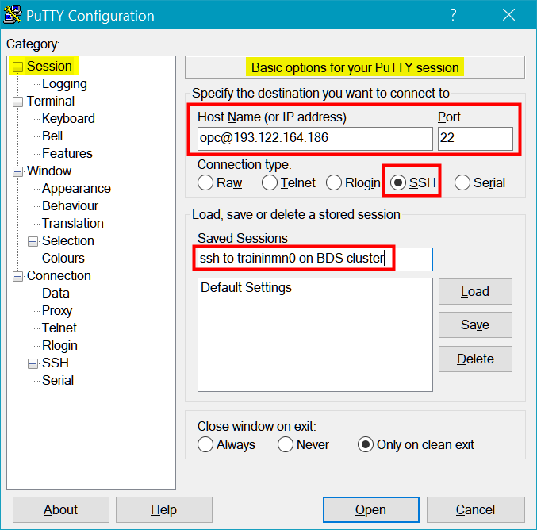
    </if>

    <if type="livelabs">
    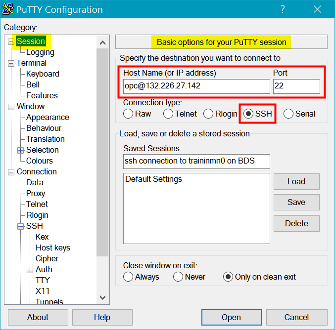
    </if>

2. In the **Category** pane, expand **Connection**, expand **SSH**, and then click **Auth**. In the **Options controlling SSH authentication** section, in the **Private key file for authentication** section, click **Browse**. In the **Select private key file** window, select your **_private key_** that is associated with your cluster's **_public key_** that you used when your created your BDS cluster.    

  <if type="freetier">
  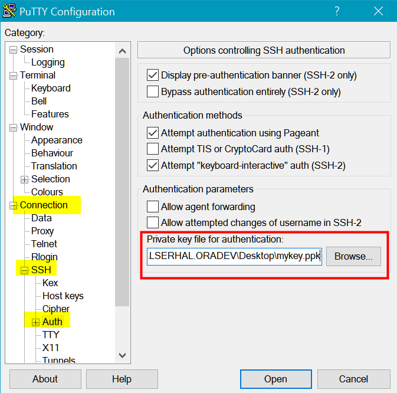
  </if>

  <if type="livelabs">
  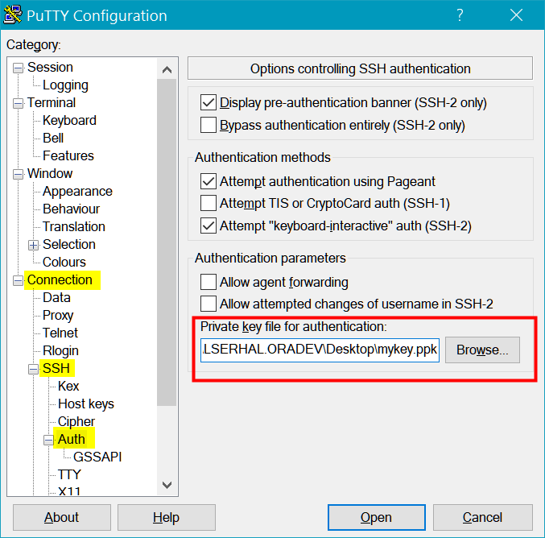
  </if>

3. In the **Category** pane, select the **Session** parameter, and then click **Save** to save your session for easier future access. Your saved session is displayed in the **Saved Sessions** list.

    > **Note:** The next time you need to connect to this node, select the connection name from the **Saved Sessions** list, click **Load**, and then click **Open**.  

  <if type="freetier">
  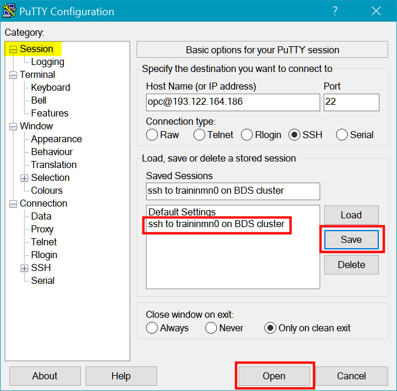
  </if>

  <if type="livelabs">
  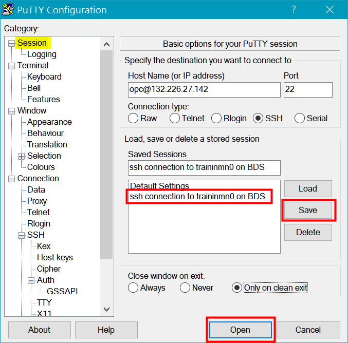
  </if>

4. Click **Open** to start the ssh session. If this is your first time connecting to your first master node in the cluster, the following **PuTTY Security Alert** message box is displayed. Click **Yes**.

  <if type="freetier">
  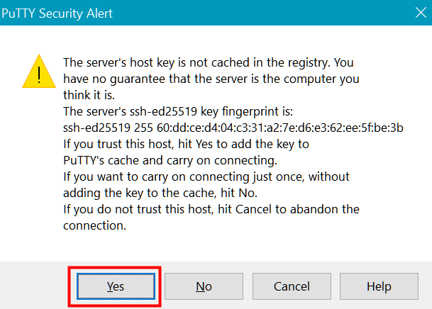
  </if>

  <if type="livelabs">
  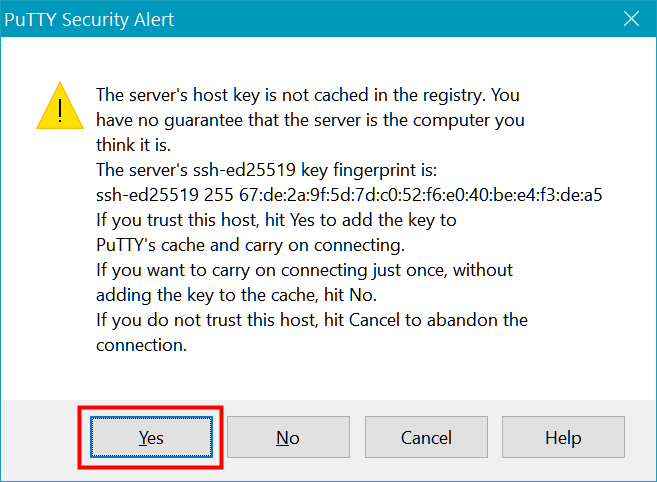
  </if>

   You are now connected to the **`traininmn0`** master node.

  <if type="freetier">    
  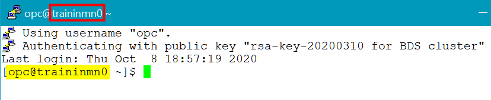
  </if>

  <if type="livelabs">    
  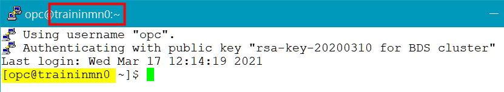
  </if>

## Task 2: Create the **`training`** Linux OS Administrator User

Create the **`training`** Linux administrator user and the OS group **`supergroup`**. Assign **`training`** the **`supergroup`** superuser group as the primary group, and **hdfs**, **hadoop**, and **hive** as the secondary groups.

1. The **`opc`** user has **`sudo`** privileges on the cluster which allows it to switch to the `root` user in order to run privileged commands. Change to the `root` user as follows:

    ```
    $ <copy>sudo bash</copy>
    ```
    <if type="freetier">
    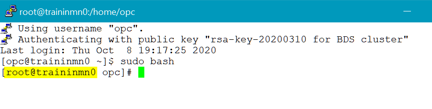
    </if>

    <if type="livelabs">
    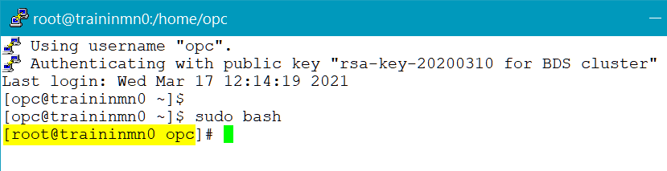
    </if>

2. The **`dcli`** utility allows you to run the command that you specify across each node of the cluster. The syntax for the **`dcli`** utility is as follows:

    ```
    dcli [option] [command]
    ```
    Use the **`-C`** option to run the specified command on all the nodes in the cluster.

    Enter the following command at the **`#`** prompt to create the OS group
    **`supergroup`** which is defined as the **`superuser`** group in hadoop.

    ```
    # <copy>dcli -C "groupadd supergroup"</copy>
    ```
    <if type="freetier">
    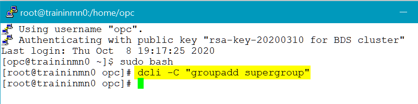
    </if>

    <if type="livelabs">
    
    </if>

3. Enter the following command at the **`#`** prompt to create the **`training`** administrator user and add it to the listed groups on each node in the **`training-cluster`**. The **`useradd`** linux command creates the new **`training`** user and adds it to the specified groups.

    ```
    # <copy>dcli -C "useradd -g supergroup -G hdfs,hadoop,hive training"</copy>
    ```
    <if type="freetier">
    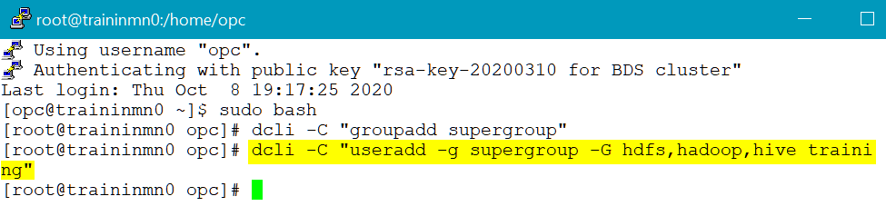
    </if>

    <if type="livelabs">
    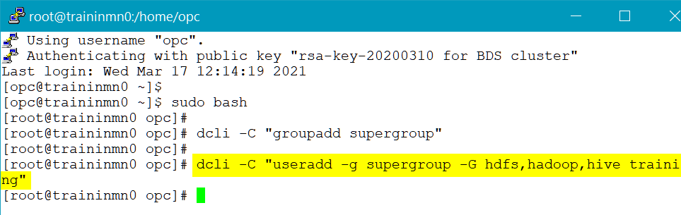
    </if>

    The preceding command creates a new user named **`training`** on each node of the cluster. The **`-g`** option assigns the **`supergroup`** group as the primary group for **`training`**. The **`-G`** option assigns the **`hdfs`**, **`hadoop`**, and **`hive`** groups as the secondary groups for **`training`**.

    > **Note:** Since the **`training`** user is part of the **hive** group, it is considered an administrator for Sentry.

4. Use the linux **`id`** command to confirm the creation of the new user and to list its groups membership.

    ```
    # <copy>id training</copy>
    ```

5. You can now access HDFS using the new **`training`** administrator user on any node in the cluster such as the **first master node** in this example. Change to the `training` user as follows:

    ```
    # <copy>sudo -su training</copy>
    ```

6. Use the linux **`id`** command to confirm that you are connected now as the **`training`** user.

    ```
    $ <copy>id</copy>
    ```
    <if type="freetier">
    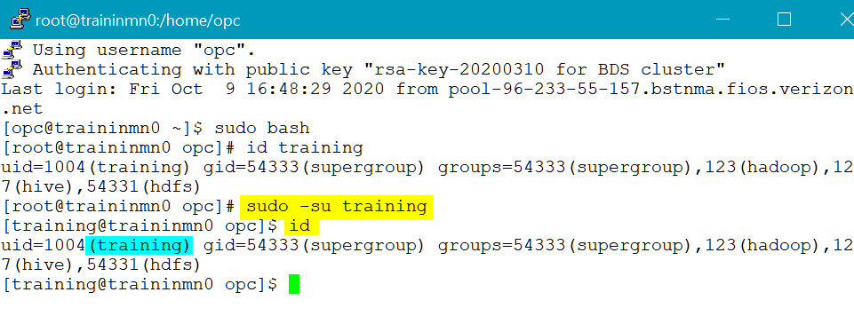
    </if>

    <if type="livelabs">
    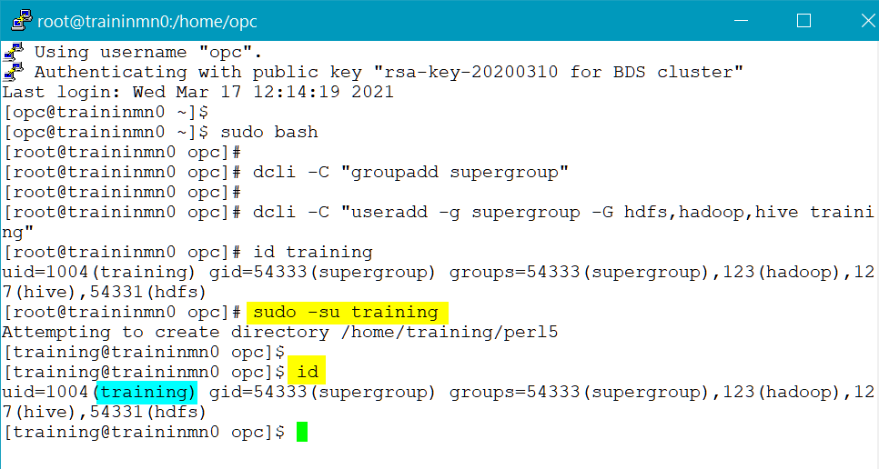
    </if>

7.  Perform a file listing of HDFS as the `training` user using the following command:

    ```
    $ <copy>hadoop fs -ls /</copy>
    ```
    <if type="freetier">
    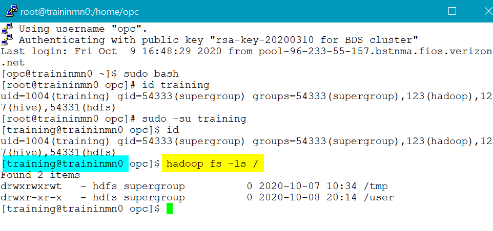
    </if>

    <if type="livelabs">
    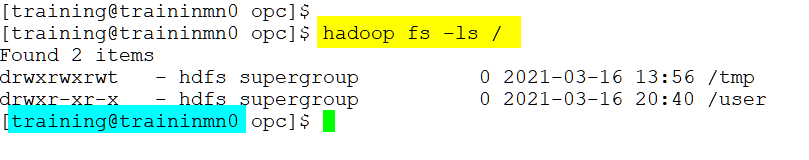
    </if>

## Task 3: Add the **`training`** User to Hue (optional)

In this task, you log into Hue as an administrator and add the **`training`** user as an administrator. In a non-HA cluster, Hue runs on the first utility node. You will use the reserved public IP address that is associated with **`traininun0`** that you created in **Lab 3, Access a BDS Node Using a Public IP Address**.

1. Open a Web browser window.

2. Enter the following URL:

    ```
    https://<ip-address>:8888
    ```
    > **Note:**    
    In the preceding command, substitute **_``ip-address``_** with your own **_``ip-address``_** that is associated with the **first utility node** in your cluster, **`traininun0`**, which you created in a previous lab.

  In our example, we used the reserved public IP address that is associated with our first utility node as follows:

    <if type="freetier">
    ```
    https://129.80.209.87:8888
    ```
    </if>

    <if type="livelabs">
    ```
    https://129.80.209.87:8888
    ```
    </if>

3. If this is the first time you are accessing Hue, the Hue Login screen is displayed. Enter your **`username`** (**`admin`** by default) and the **`password`** that you specified when you created the cluster such as **`Training#123`**.

  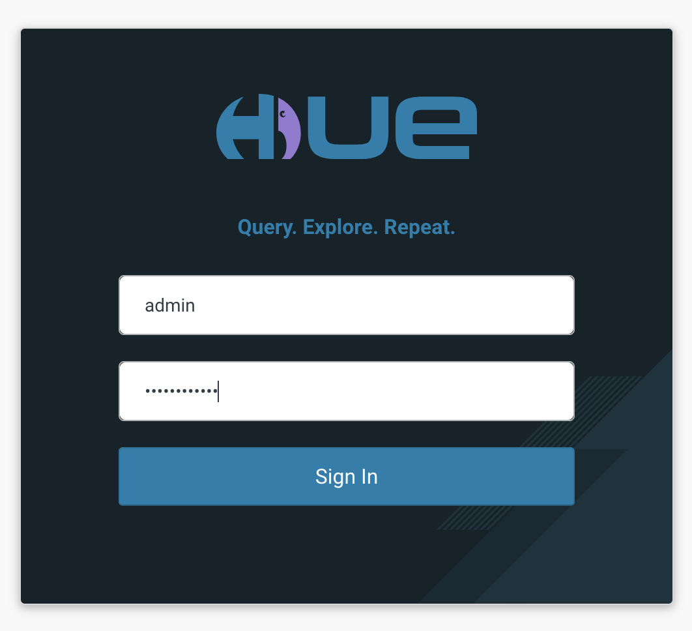

  The **Hue Editor** page is displayed.

  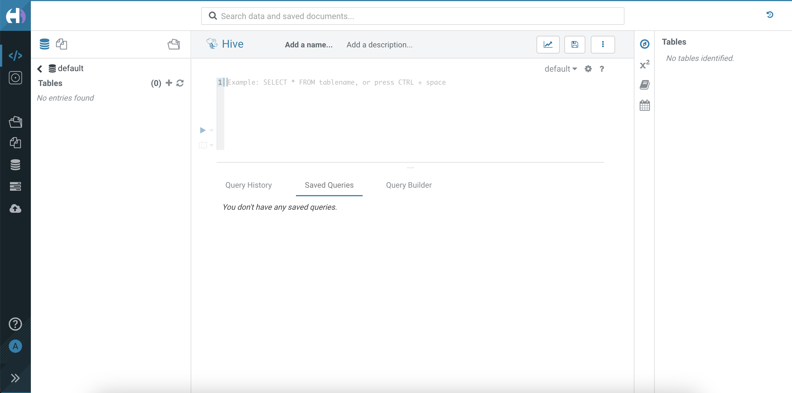

4. From the left pane select **Administer Users** from **admin** menu.

  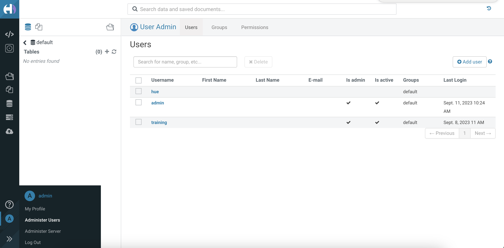

5. In the **User Admin** page, click **Add user**. In the **Create user** page, in **Step 1: Credentials (required)** of the wizard, enter the following information:

    + **Username:** **`training`**
    + **New Password:** **`Training123`**
    + **Password confirmation:** **`Training123`**
    + **Create home directory:** `Checked`

   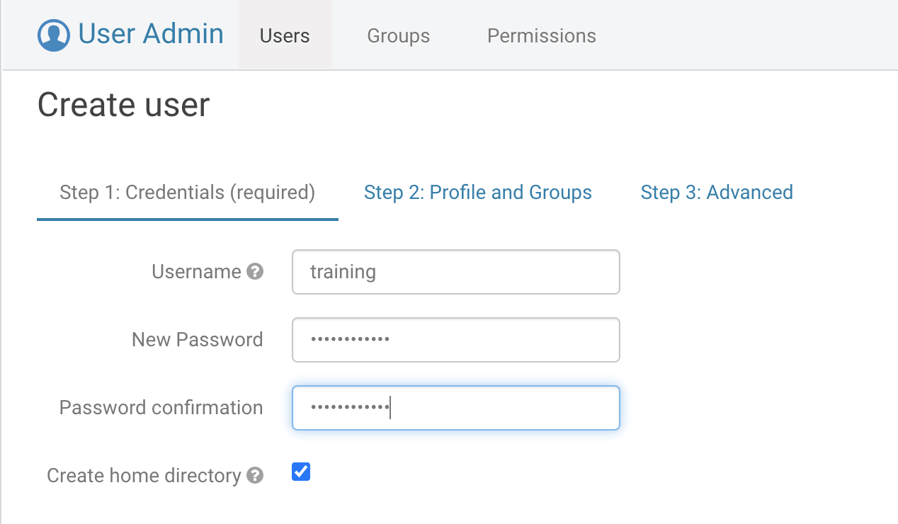

6. Click the **Step 3: Advanced** link of the wizard, select the **Superuser status** checkbox, and then click **Add user**.

       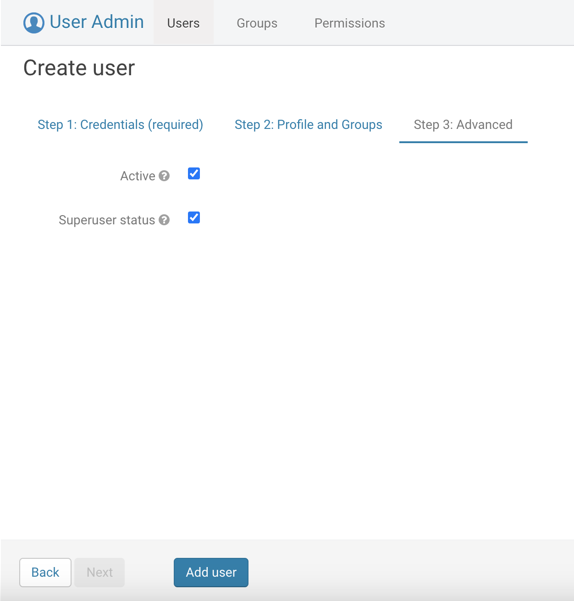

       The **Hue Users** page is re-displayed. The newly added **`training`** user is displayed in the list of Hue users.

       <if type="freetier">
       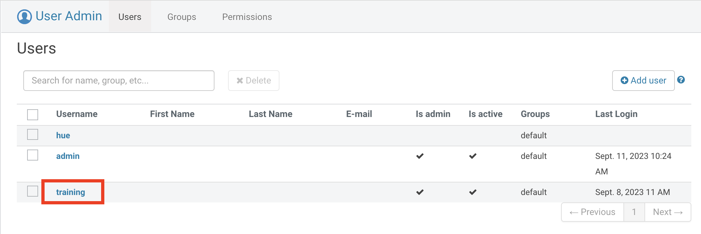
       </if>

       <if type="livelabs">
       
       </if>

7. Exit Hue. From the **admin** menu on the left pane, select **Log Out**.

  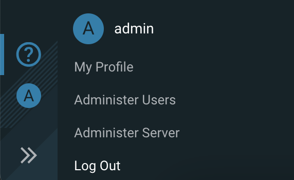

This concludes this lab. You may now proceed to the next lab.

## Want to Learn More?

* [Using Oracle Big Data Service](https://docs.oracle.com/en/cloud/paas/big-data-service/user/index.html)
* [Oracle Cloud Infrastructure Documentation](https://docs.cloud.oracle.com/en-us/iaas/Content/GSG/Concepts/baremetalintro.htm)
* [MIT Kerberos Documentation](https://web.mit.edu/kerberos/krb5-1.12/doc/admin/admin_commands/kadmin_local.html#list-principals)
* [Creating a Key Pair](https://docs.cloud.oracle.com/en-us/iaas/Content/GSG/Tasks/creatingkeys.htm?Highlight=ssh%20key#CreatingaKeyPair)
* [Connecting to Your Instance](https://docs.cloud.oracle.com/en-us/iaas/Content/GSG/Tasks/testingconnection.htm?Highlight=connect%20to%20an%20instance%20using%20ssh)
* [Securing the Oracle Big Data Appliance OLL Video](https://apexapps.oracle.com/pls/apex/f?p=44785:112:102721520016911::::P112_CONTENT_ID,P112_PREV_PAGE:12907)
* [Getting Started with the Command Line Interface (CLI)](https://docs.cloud.oracle.com/en-us/iaas/Content/GSG/Tasks/gettingstartedwiththeCLI.htm)
* [OCI CLI Command Reference - Public-IP](https://docs.cloud.oracle.com/en-us/iaas/tools/oci-cli/2.9.0/oci_cli_docs/cmdref/network/public-ip.html#)
* [OCI CLI Command Reference - Big Data Service (bds)](https://docs.cloud.oracle.com/en-us/iaas/tools/oci-cli/2.10.0/oci_cli_docs/cmdref/bds.html)
* [Using Hue](https://docs.cloudera.com/documentation/enterprise/6/6.3/topics/hue_using.html)

## Acknowledgements

* **Author:**
    + Vivek Verma, Master Principal Cloud Architect, North America Cloud Engineering
* **Contributors:**
    + Anand Chandak, Principal Product Manager, Data and AI
* **Last Updated By/Date:** Vivek Verma, October 2023