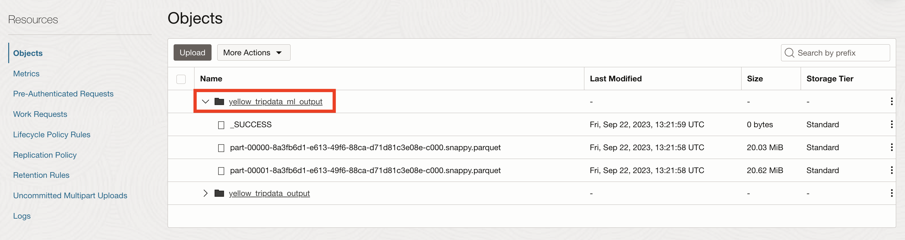
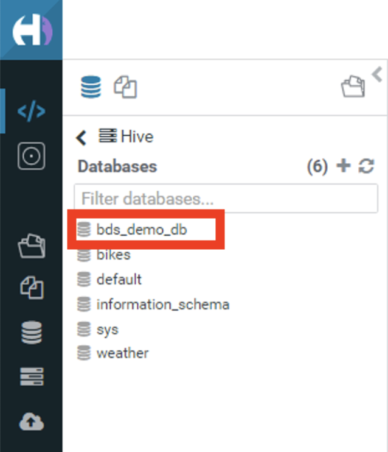
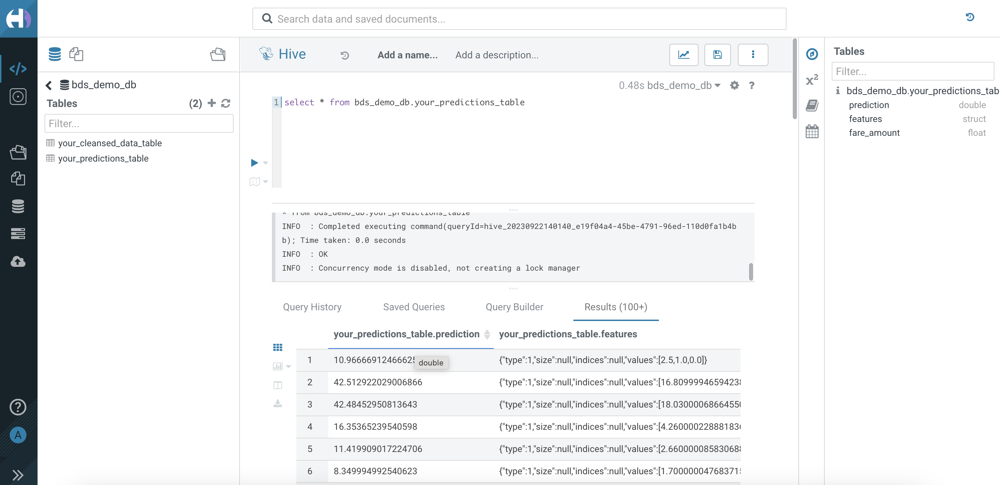

# Run the Machine Learning, Data Science code with Jupyterhub

## Introduction

In this lab, you will wear the hat of a **Data Scientist**, where you will launch a Jupyter notebook that is also offered as a part of **Big Data Service (BDS)**. The Jupyter notebook is then used to build a Data Science model and make predictions. The predections are then stored in a Hive table.

Jupyterhub lets multiple users work together by providing an individual Jupyter notebook server for each user. When you create a cluster, Jupyterhub is installed and configured on your cluster nodes.

Estimated Time: 60 minutes

### Objectives

* Launch Jupyterhub
* Download Jupyter Data Science Notebook
* Configure and Run Data Science Notebook
* Verify predicted data in Object Storage bucket
* Verify predicted data in Hive database table

## Task 1: Launch Jupyterhub

1. Launch **Jupyterhub** using the following url - https://Utility\_Node\_Public\_IP\_Address:8000

    ```
    <copy>https://129.80.209.87:8000</copy>
    ```

    

2. Login using default admin credentials for JupyterHub:

    User name: jupyterhub

    Password: Training#123 (Apache Ambari admin password. This is the cluster admin password that was specified when the cluster was created.)

3. This will launch the Launcher Page.

    

## Task 2: Download Jupyter Data Science Notebook

1. Download the Jupyter notebook from [here](https://objectstorage.us-ashburn-1.oraclecloud.com/p/w6FRGXRU-rwQXtvGR2S7a03ehWmuumzd7H7hTFOYqn_tfLqaAt_7jzeZmNQgFlqK/n/orasenatdpltintegration01/b/Taxi/o/bds-data-science.ipynb).

2. Go to JupyterHub and click **Upload Files**. Select the Jupyter Notebook downloaded in previous step and upload it.

    

## Task 3: Configure and Run Data Science Notebook

1. Click on the Jupyter notebook file name in the **File Browser** on the left to open the notebook. Ensure that the kernel displayed on the right is automatically set to **PySpark**.

    

2. Replace the Namespace mentioned in the Notebook with Object Storage Namespace that was noted in **Task 3 : Lab 6: Cleanse data and upload to Hive using Python (PySpark)** 

3. Execute the notebook clicking on **Run All Cells** under the **Run** menu.

    

4. The spark job saves the predicted data in an Object Storage bucket and also in a Hive external table.

## Task 4: Verify predicted data in Object Storage bucket

1. Login to Oracle Cloud Console and open the navigation menu. Click **Storage**. Under **Object Storage & Archive Storage**, click **Buckets**.

2. Under the list of Buckets, click **Taxi\_Data**. The data is stored in the output folder **yellow\_tripdata\_ml\_output**.

    

## Task 5: Verify predicted data in Hive database table

1. Login to **Hue** and on the **Editor** page click **default** to view the list of databases.

    

2. Click the database that was created by the Spark job - **bds\_demo\_db**.

    

3. This will list the tables created under **bds\_demo\_db** - **your\_predictions\_table**.

4. Enter the query in query editor - 

    ```
    <copy>select * from bds_demo_db.your_predictions_table</copy>
    ```

5. Execute the query to get the output.

    

This concludes this lab. You may now **proceed to the next lab**.

## Acknowledgements

* **Author:**  
    + Vivek Verma, Master Principal Cloud Architect, North America Cloud Engineering
* **Contributors:**  
    + Anand Chandak, Principal Product Manager, Data and AI
* **Last Updated By/Date:** Vivek Verma, October 2023