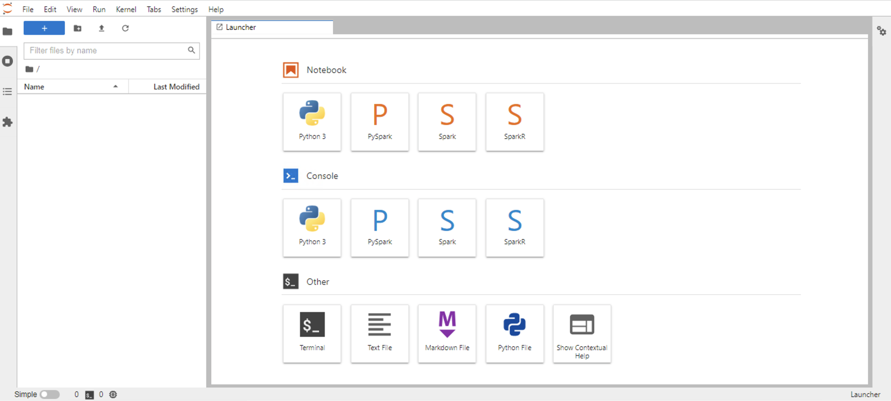
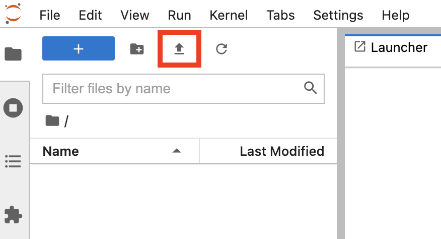
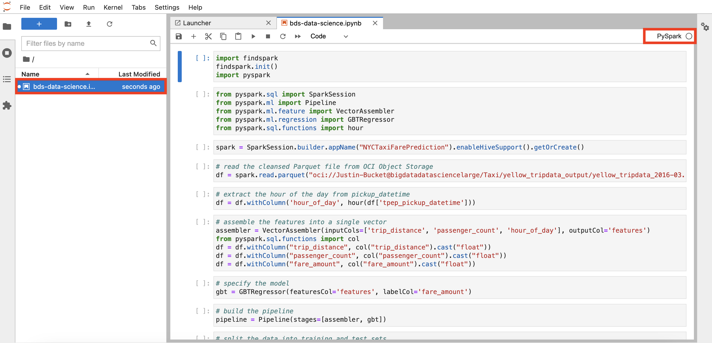
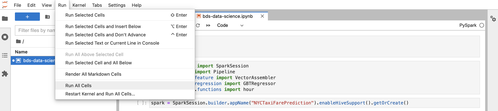

# Run the Machine Learning, Data Science code using Jupyterhub

## Introduction

In this lab, you will wear the hat of a **Data Scientist**, where you will launch a Jupyter notebook that is also offered as a part of **Big Data Service (BDS)**. The Jupyter notebook is then used to build a Data Science model and make predictions. The predections are then stored in a Hive table.

Jupyterhub lets multiple users work together by providing an individual Jupyter notebook server for each user. When you create a cluster, Jupyterhub is installed and configured on your cluster nodes.

Estimated Time: 60 minutes

### Objectives

* Creat an Object Storage API Key for the Cluster
* Enable BDS Cluster connectivity to Object Storage
* Create Object Storage bucket for trnsformed data
* Login to Utility node using SSH and submit a Spark job.
* Verify transformed data in Object Storage Bucket.
* Verify transformed data uploaded to Hive.

## Task 1: Launch Jupyterhub

1. Launch **Jupyterhub** using the following url - https://Utility\_Node\_Public\_IP\_Address:8000

    ```
    https://129.80.209.87:8000
    ```

    

2. Login using default admin credentials for JupyterHub:

    User name: jupyterhub

    Password: Training#123 (Apache Ambari admin password. This is the cluster admin password that was specified when the cluster was created.)

3. This will launch the Launcher Page.

    

4. Download the Jupyter notebook from [here](https://objectstorage.us-ashburn-1.oraclecloud.com/p/WoB1T3VaY06AOiAqSj6PKMn4wLjDu1VJ5J6Lh_CFD6mylShr-66qzDj7Hgo7hJtQ/n/orasenatdpltintegration01/b/Taxi/o/bds-data-science.ipynb).

5. Go to JupyterHub and click **Upload Files**. Select the Jupyter Notebook downloaded in previous step and upload it.

    

6. Click on the Jupyter notebook file name in the **File Browser** on the left to open the notebook. Ensure that the kernel displayed on the right is automatically set to **PySpark**.

    

7. Replace the Namespace mentioned in the Notebook with Object Storage Namespace that was noted in **Task 3 : Lab 6: Cleanse data and upload to Hive using Python (PySpark)** 

8. Execute the notebook clicking on **Run All Cells** under the **Run** menu.

    


This concludes this lab. You may now proceed to the next lab.

## Acknowledgements

* **Author:**  
    + Vivek Verma, Master Principal Cloud Architect, North America Cloud Engineering
* **Contributors:**  
    + Anand Chandak, Principal Product Manager, Data and AI
* **Last Updated By/Date:** Lauran Serhal, July 2021
