#  Use Ambari and Hue to Access a BDS Cluster

## Introduction

<if type="livelabs">
_**IMPORTANT:**_     
_In this lab, you will **only review** (or optionally view the video) how to access Cloudera Manager (CM) and Hue directly in a web browser. This requires creating two ingress security rules and opening the ports for Cloudera Manager and Hue. Since you are using the LiveLabs environment, the two security rules are already created for you, and the two ports for CM and Hue are already opened._
</if>

To ensure security, when BDS deploys a cluster, the nodes in the cluster are not accessible on the public internet. By default, the IP addresses for the cluster nodes are private.

In the previous lab, you made the utility node in your non-HA cluster accessible from the internet by mapping the node's private IP addresses to a public IP address; however, making the utility node publicly available isn't enough to make services that run on those nodes available from the internet.

All services are only available on certain ports. For example, in a non-HA cluster such as **`training-cluster`**, Ambari and Hue run on the first utility node, **`traininun0`**. Before you can access Ambari and Hue on the utility node using a Web browser, you must also open the ports that are associated with both services. You do this by defining an ingress rule on the public subnet to a security list for each service. Security lists act as virtual firewalls for your Compute instances and other kinds of resources with ingress and egress rules that specify the types of traffic allowed in and out of the cluster. Ingress security rules expose HTTP and HTTPS routes from outside the cluster to services within the cluster.

In this lab, you will learn how to access Ambari and Hue directly in a web browser.

Estimated Time: 30 minutes

### Objectives

* Use Ambari and Hue to access a Big Data Service (BDS) cluster.
<if type="livelabs">
* Review how to add ingress rules to the default security rule that enables you to access both Ambari and Hue.
</if>
<if type="freetier">
* Add ingress rules to the default security rule that enables you to access both Ambari and Hue.
</if>

> **Note:**    
This lab assumes that you have successfully completed all of the preceding labs in the **Contents** menu.

### Video Preview

Watch a video demonstration of using Cloudera Manager and Hue to access a Big Data Service cluster

[](youtube:dAGD1If39fw)

## Task 1: Create Ingress Security Rules (and Open Ports) for Ambari and Hue

In this task, you will <if type="freetier">add</if> <if type="livelabs">review how to add
</if> ingress security rules to the default security list in your cluster's VCN. This will allow access from anywhere on the internet to Ambari on port **`7183`** and Hue on port **`8888`**.

<if type="livelabs">
> _**Note:** All screen captures in this lab show the resources' names used when you run the workshop in your own tenancy and not the resources' names in your assigned LiveLabs environment._
</if>

1. Log in to the **Oracle Cloud Console** as the Cloud Administrator, if you are not already logged in. On the **Sign In** page, select your `tenancy`, enter your `username` and `password`, and then click **Sign In**. The **Oracle Cloud Console** Home page is displayed.

<if type="livelabs">
    >_**Note:** If you are using the LiveLabs environment, you do not have administrative privileges._ </if>

</if>

2. Click the **Navigation** menu and navigate to **Networking > Virtual Cloud Networks**.

	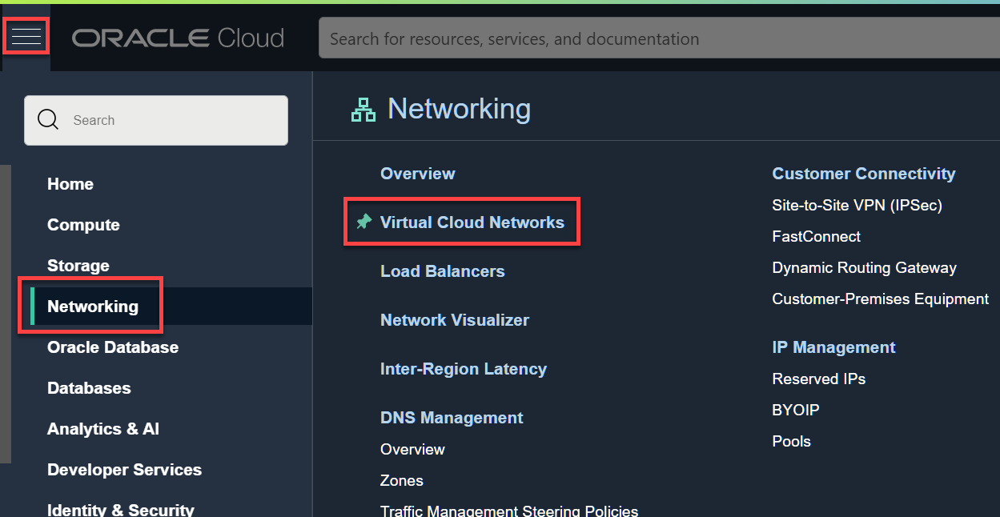

3. On the **Virtual Cloud Networks** page, click your cluster's Virtual Cloud Network, **`training-vcn`**.

  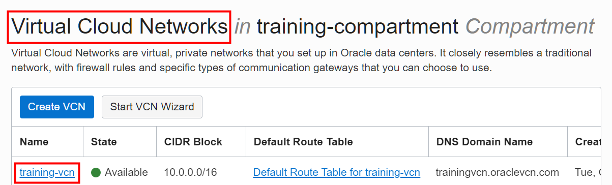

4. Next, you will update the default security list for the public subnet in your VCN. Remember, when you created the cluster, you needed to specify that your cluster belongs to a public subnet. In the **Subnets** section on the **Virtual Cloud Network Details** page, click the public subnet for the selected network.

  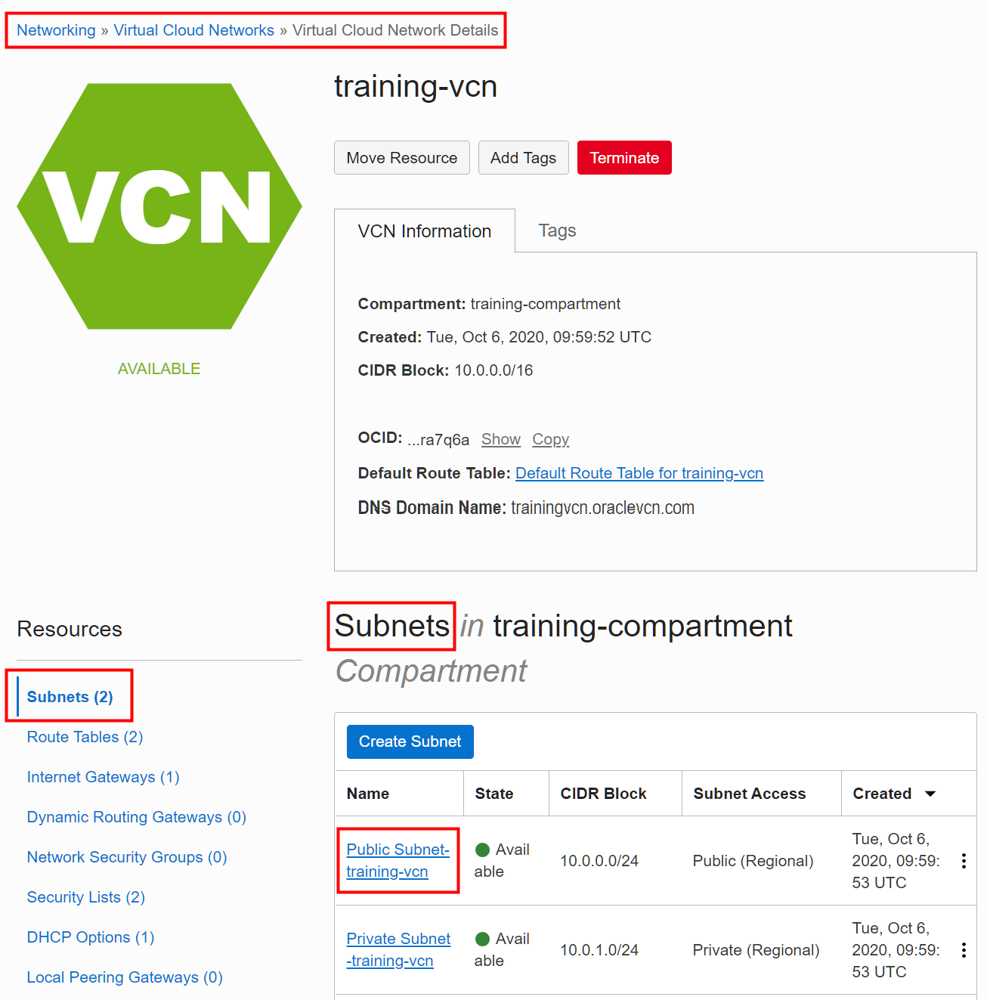

5. In the **Security Lists** section on the **Subnet Details** page, click your **Default Security List** link for your selected network in the **Name** column.

  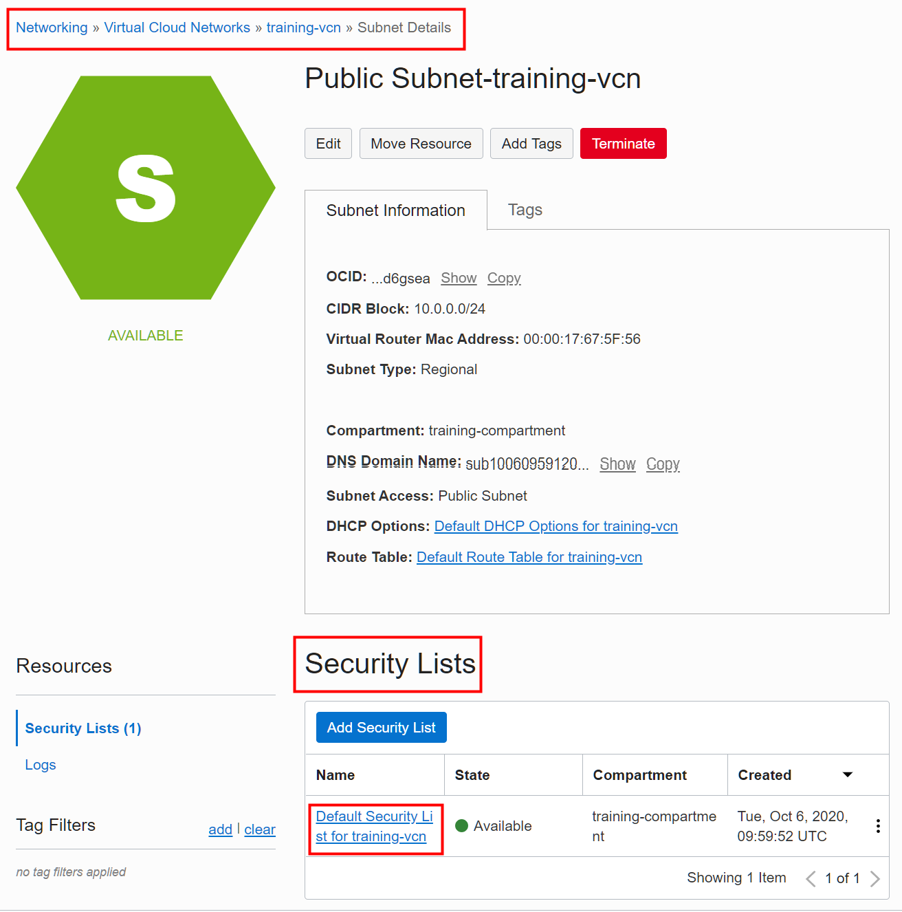

6. On the **Default Security List** page, scroll-down to the **Ingress Rules** section. This section shows the currently available security rules in the selected **Default Security List**. Next, click **Add Ingress Rules**.

  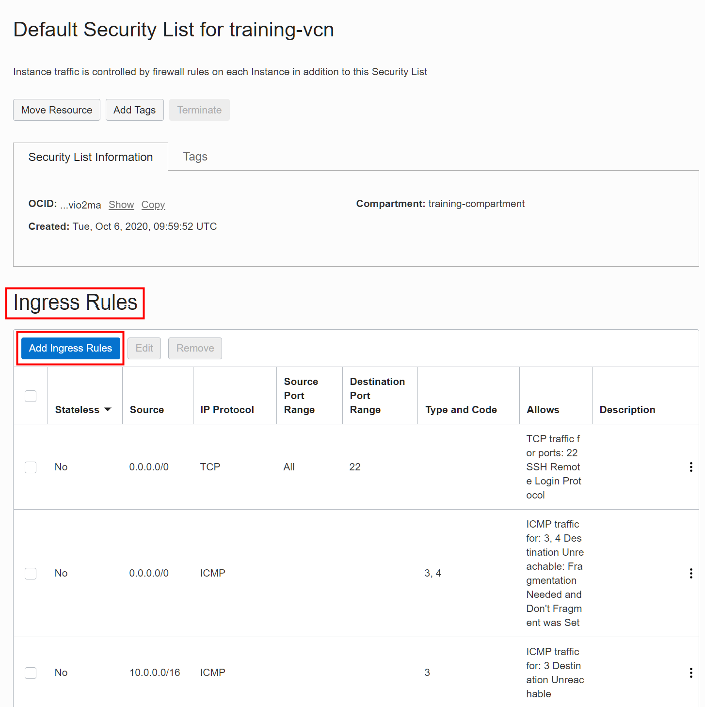

7. In the **Add Ingress Rules** dialog box, add the rule for the TCP protocol which enables you to use Ambari to access your cluster. You can add values to this dialog box to meet your security needs. In our example, we are opening up the port for Ambari to all sources by entering **`0.0.0.0/0`** for the **Source CIDR**. Anyone on the internet can access port **`7183`** for Ambari. No egress rule is required to allow the response traffic. Update the source to a more restrictive CDIR if required. Provide the following information:

    + For the **STATELESS** checkbox, leave it unchecked which makes the rule stateful. Any response to the incoming traffic is allowed back to the originating host, regardless of any egress rules applicable to the instance.
    + For the **SOURCE TYPE**, select **`CIDR`**.
    + For the **SOURCE CIDR**, enter **`0.0.0.0/0`**.
    + For the **IP PROTOCOL**, select **`TCP`**.
    + For the **SOURCE PORT RANGE**, enter **`All`**.
    + For the **DESTINATION PORT RANGE**, enter **`7183`**.
    + For the **DESCRIPTION**, enter **`For Ambari Access on Port 7183`**.

  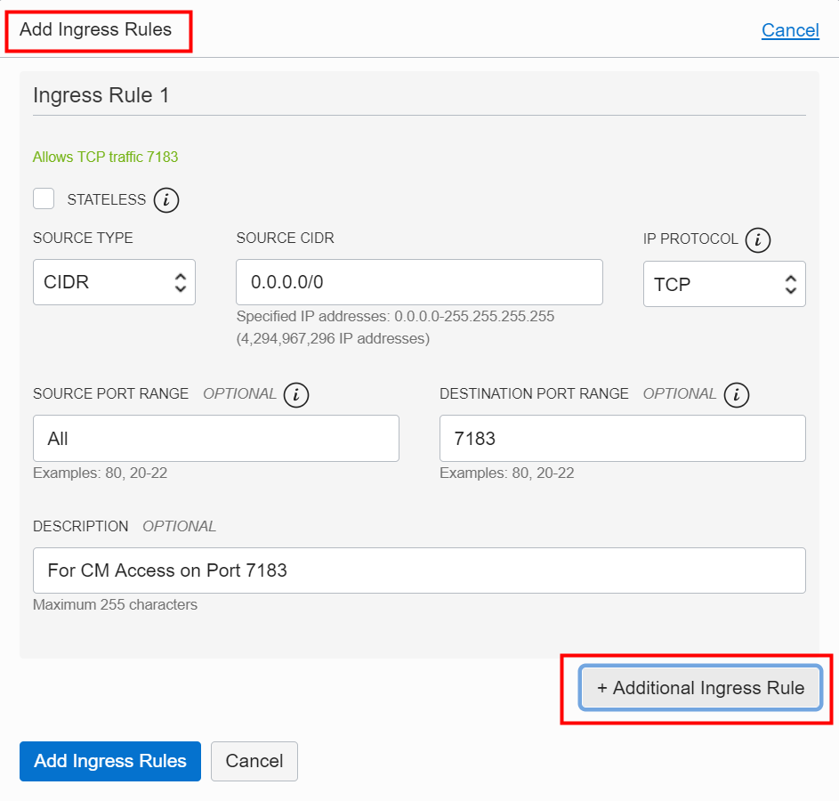


8. Click **+Additional Ingress Rule** to add an ingress security rule for Hue.

9. At the bottom of the **Add Ingress Rules** dialog box, the **Ingress Rule 2** section is displayed. Provide the following information:

    + For the **STATELESS** checkbox, leave it unchecked which makes the rule stateful.
    + For the **SOURCE TYPE**, select **`CIDR`**.
    + For the **SOURCE CIDR**, enter **`0.0.0.0/0`**.
    + For the **IP PROTOCOL**, select **`TCP`**.
    + For the **SOURCE PORT RANGE**, enter **`All`**.
    + For the **DESTINATION PORT RANGE**, enter **`8888`**.
    + For the **DESCRIPTION**, enter **`For Hue Access on Port 8888`**.

10. Click **Add Ingress Rules**.

  

  The two ingress rules are added to the **Default Security List**.

  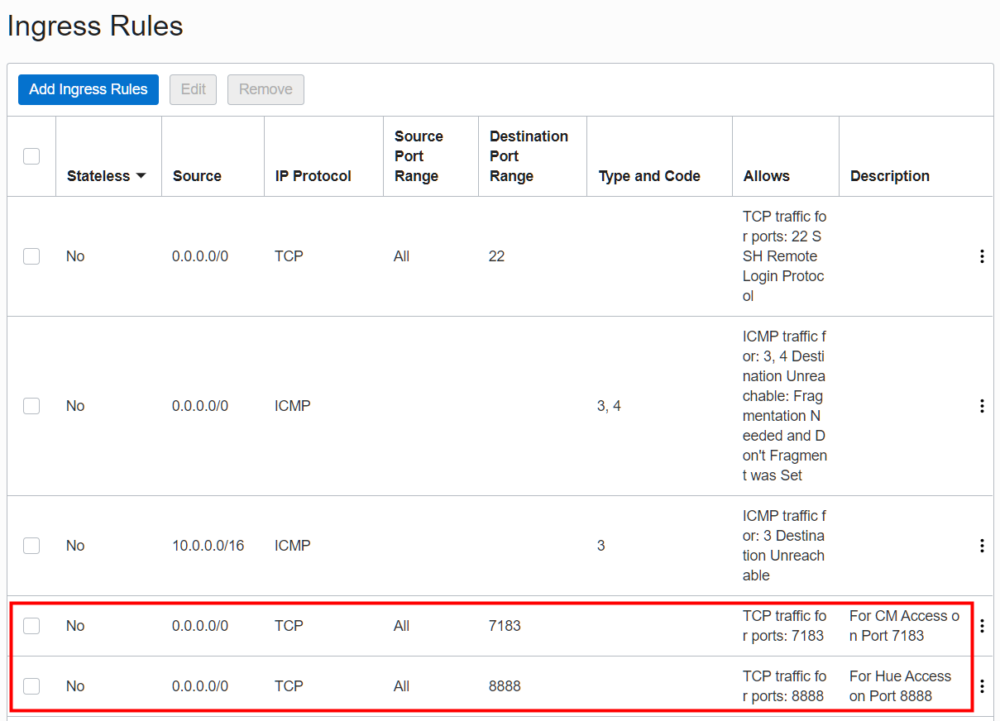

## Task 2: Use Ambari to Access the Cluster

In this task, you will use Ambari to access the cluster. In a non-HA cluster, Ambari runs on the first utility node, **`traininun0`**. You will use the reserved public IP address that is associated with **`traininun0`** that you created in task 2 of **Lab 3, Access a BDS Node Using a Public IP Address**.

1. Open a Web browser window.

2. Enter the following URL:

    ```
    https://<ip-address>:7183
    ```
    > **Note:**    
    In the preceding command, substitute **_``ip-address``_** with your own **_``ip-address``_** that is associated with the first utility node in your cluster, **`traininun0`**, which you created in the previous lab. To view your reserved public IP address in the console, click the **Navigation** menu and navigate to **Networking**. In the **IP Management** section, click **Reserved IPs**. The reserved public IP address is displayed in the **Reserved Public IP Addresses** page.

    In our example, we used the reserved public IP address that is associated with our first utility node as follows:

    <if type="freetier">
    ```
    https://129.80.209.87:7183
    ```
    </if>

    <if type="livelabs">

    ```
    https://129.80.209.87:7183
    ```

    </if>

3. On the Ambari Login screen, enter your **`username`** which is **`admin`** by default in Ambari. For the password, enter the **`password`** that you specified when you created the cluster such as **`Training#123`**. Click **Sign In**.

  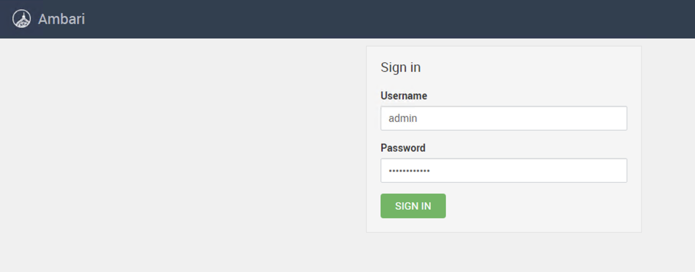

4. In the Ambari Home page, note the name of the cluster and the services running on the cluster.

  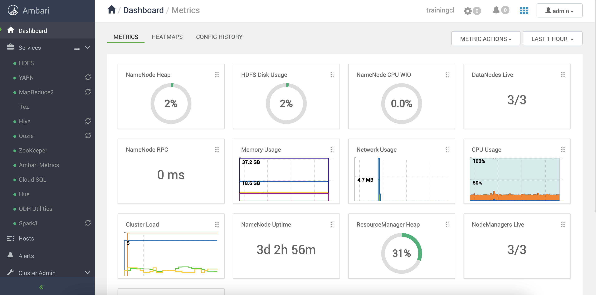

5. Click **Hosts** on the left panel to get a list of hosts.

  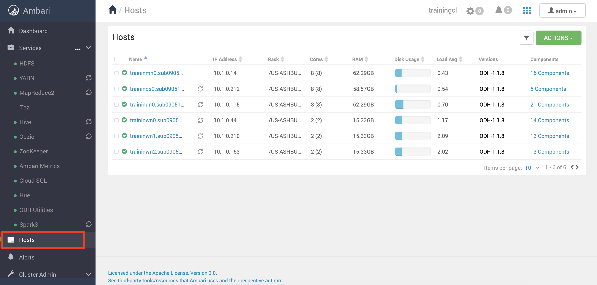

  The hosts of the cluster are displayed. Hosts are configured with one or more components. The component indicates which daemon, also known as service, runs on the host. Typically, a host will run multiple components in support of the various services running in the cluster. Click a host to get the list of components.

   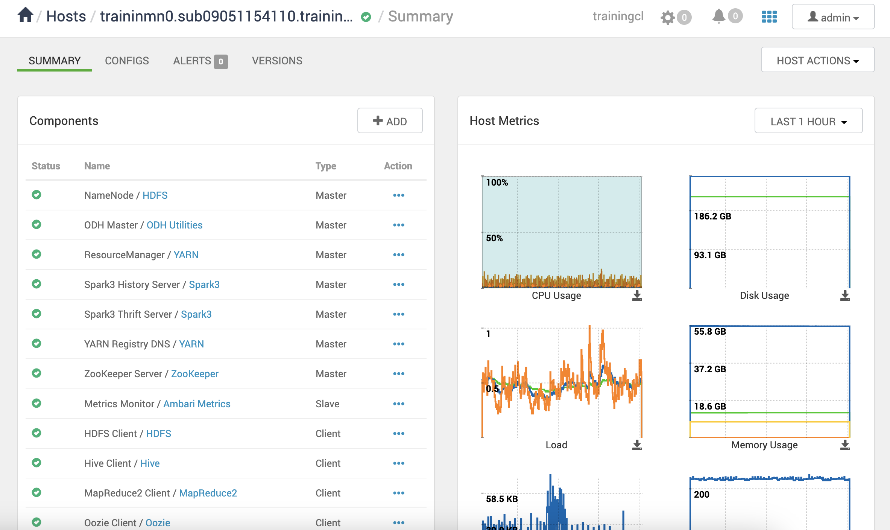

6. Exit Ambari. From the **User** drop-down menu, select **Sign out**.

    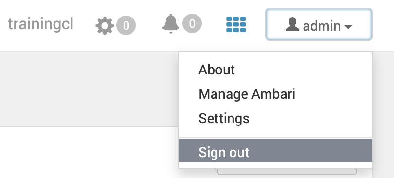

## Task 3: Use Hue to Access the Cluster

In this task, you will use Hue to access the cluster. In a non-HA cluster, Hue runs on the first utility node. You will use the reserved public IP address that is associated with **`traininun0`** that you created in **Lab 3, Access a BDS Node Using a Public IP Address**.

1. Open a web browser window.

2. Enter the following URL:

    ```
    https://<ip-address>:8888
    ```

    > **Note:**    
    In the preceding command, substitute **_``ip-address``_** with your own **_``ip-address``_** that is associated with the **first utility node** in your cluster, **`traininun0`**, which you created in the previous lab.

    In our example, we used the reserved public IP address that is associated with our first utility node as follows:

    <if type="freetier">
    ```
    https://129.80.209.87:8888
    ```
    </if>

    <if type="livelabs">
    ```
    https://129.80.209.87:8888
    ```
    </if>

3. On the Hue Login screen, enter your **`username`** which is **`admin`** by default in Hue. For the password, enter the **`password`** that you specified when you created the cluster such as **`Training#123`**. Click **Sign In**, or **Create Account** if this is the first time you log in to Hue.

    > **Note:** If Hue accounts haven’t been created yet, you can create other user and administrator accounts.

    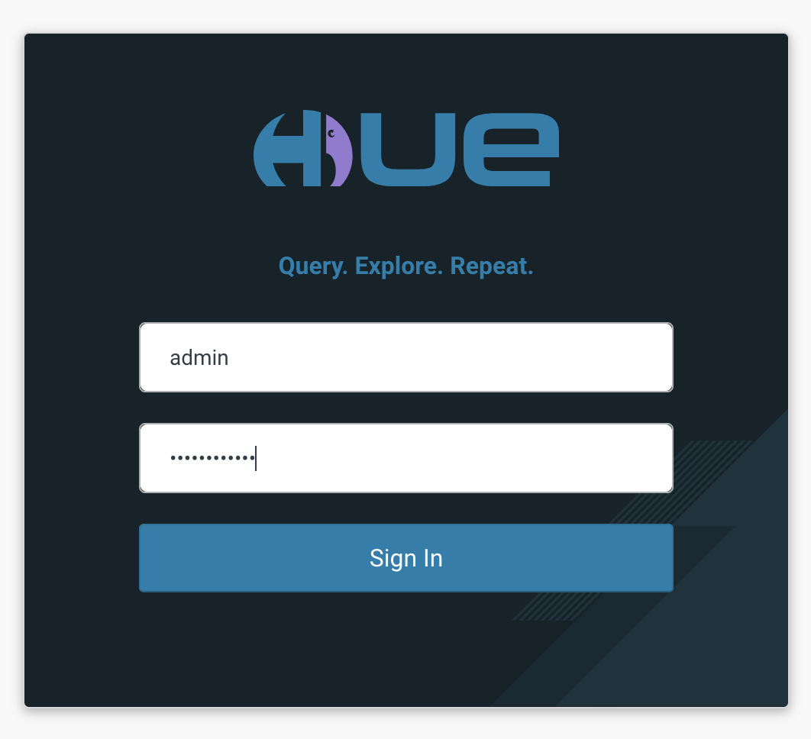

    The **Hue Editor** page is displayed.

  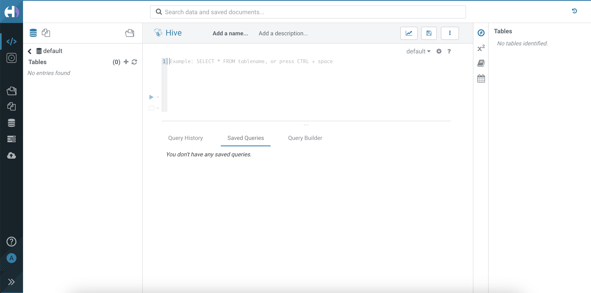

4. For documentation on using Hue, see [Introduction to Hue](https://docs.cloudera.com/documentation/enterprise/6/6.3/topics/hue.html). You can also select **Help** from the left pane and click on **Documentation** for general help topics.

  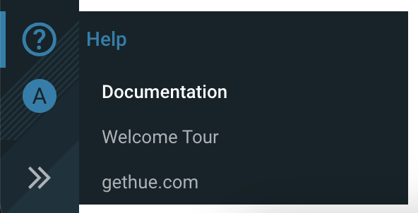

5. Exit Hue. From the **admin** menu on the left pane, select **Log Out**.

  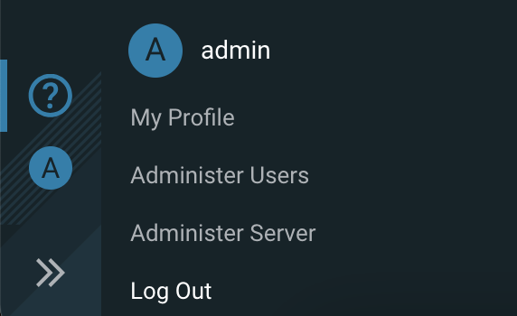

This concludes this lab. You may now proceed to the next lab.

## Want to Learn More?

* [Oracle Big Data Service](https://docs.oracle.com/en/cloud/paas/big-data-service/)
* [Oracle Cloud Infrastructure Documentation](https://docs.cloud.oracle.com/en-us/iaas/Content/GSG/Concepts/baremetalintro.htm)
* [Security Lists](https://docs.cloud.oracle.com/en-us/iaas/Content/Network/Concepts/securitylists.htm)
* [Security Rules](https://docs.cloud.oracle.com/en-us/iaas/Content/Network/Concepts/securityrules.htm)
* [Configure Security Rules for the Network](https://docs.oracle.com/en/cloud/paas/big-data-service/user/configure-security-rules-network.html)
* [VCN and Subnets](https://docs.cloud.oracle.com/iaas/Content/Network/Tasks/managingVCNs.htm)
* [Cloudera Manager](https://docs.cloudera.com/documentation/enterprise/6/6.3/topics/cloudera_manager.html)
* [Using Hue](https://docs.cloudera.com/documentation/enterprise/6/6.3/topics/hue_using.html)

## Acknowledgements

* **Author:**
    + Vivek Verma, Master Principal Cloud Architect, North America Cloud Engineering
* **Contributors:**
    + Anand Chandak, Principal Product Manager, Data and AI
* **Last Updated By/Date:** Vivek Verma, September 2023