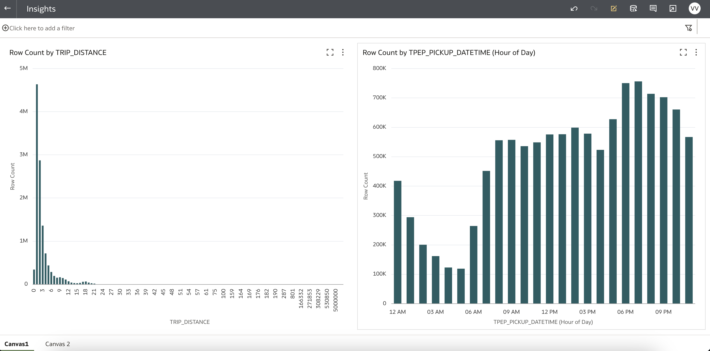

# Run the Machine Learning, Data Science code using Jupyterhub

## Introduction

In this lab, you will wear the hat of a **Data Analyst**, where you will launch **Oracle Analytics Cloud** to visualize the data.

Oracle Analytics Cloud is a scalable and secure Oracle Cloud service that provides a full set of capabilities to explore and perform collaborative analytics for you, your workgroup, and your enterprise.

With Oracle Analytics Cloud you also get flexible service management capabilities, including fast setup, easy scaling and patching, and automated lifecycle management.

Estimated Time: 40 minutes

### Objectives

* Create an Oracle Analytics Cloud (OAC) instance
* Download OAC Workbook
* Update connection settings
* Launch OAC Workbook

## Task 1: Create an Oracle Analytics Cloud (OAC) Instance

1. Go to **Home Console Page** and navigate to **Analytics & AI** section and then select **Analytics Cloud**.

    

2. Select **Create Instance**.

    Complete the form using the following information:
    
    **Name**: Choose a Name
    
    **Description**: &lt;optional&gt;

    **Compartment**: Select a valid compartment in your tenancy
    
    **Capacity**: 2  

    **License Type**: Select **"License Included**

    **Edition**: Select **Enterprise Edition**

3. Click **Create**.

    

    

4. The Analytics instance page will be displayed with a status of ***CREATING***.

    ***Reminder***: Provisioning an Oracle Analytics Cloud instance can take over **20 minutes**.

5. The Analytics instance page will be displayed with a status of ***ACTIVE***.  

    

## Task 2: Download OAC Workbook

1. Download the OAC Workbook from [here](https://objectstorage.us-ashburn-1.oraclecloud.com/p/VKgTBn6-spr-1uvLN9b3MsyNVZO2UH8VJdqoFVHVfs2jV0DjRXXsbJwNugyG6gtu/n/orasenatdpltintegration01/b/Taxi/o/Insights.dva).

2. Go to **Home Console Page** and navigate to **Analytics & AI** section and then select **Analytics Cloud**.

3. From the list of **Analytics Instances** click the instance created in **Task 1**.

4. Click **Analytics Home Page** to launch Oracle Analytics instance home page.

    

5. Click **Import Workbook/Flow**.

    

6. Click **Select File** on the **Import Workbook/Flow** pop-up.

    

7. Select **Insights.dva** file that was downloaded in step 1. Click **Import**.

    

8. After the import is successful, click **OK**.

    

## Task 3: Configure OAC Data Connection

1. Click on the Navigation menu on the left and click **Data**.

    

2. Click **Connections** and click **Inspect** to review the connection details.

    

3. Update the **Host** with Public IP address of the **Utility Node**. 

    Enter Username : hive
    Enter Password : hive
    
    Click **Save**.

    After the changes are saved, click **Close**.

    

## Task 4: Launch OAC Workbook

1. Click on the Navigation menu on the left and click **Home**.

2. On the Home Page click **Insights** under **Workbooks**.

    

3. **Insights** OAC Workbook is displayed with visualizations created from data stored in Hive database table.

    

    The visualization on the right **Row Count by TPEP\_PICKUP\_DATETIME (Hour of Day)** displays the number of trips by the time of the day. As the day progresses, as in the early morning when people are typically either going to school or offices, you see a sudden uptick there. It goes down a bit and then it again rises when it's time to go back home, in the late evening and then it tapers down in the night time. And during the night time the number of trips essentially keeps going down. 
    
    Click on **Canvas 2** to view other graphs which are created. **Records for Top TRIP\_DISTANCE** shows the number of records in this data set for the month which is about 12 million. **Indexed Metrics Growth** shows as we come to the end of the month, there is an interesting pattern that the number of trips go down. 
    
    Similar graphs can be built to analyze, visualize the data which is sitting in an object store with the help of all this integrations that was built during this lab.

This concludes this lab. You may now **proceed to the next lab**.

## Acknowledgements

* **Author:**  
    + Vivek Verma, Master Principal Cloud Architect, North America Cloud Engineering
* **Contributors:**  
    + Anand Chandak, Principal Product Manager, Data and AI
* **Last Updated By/Date:** Vivek Verma, Sep 2023