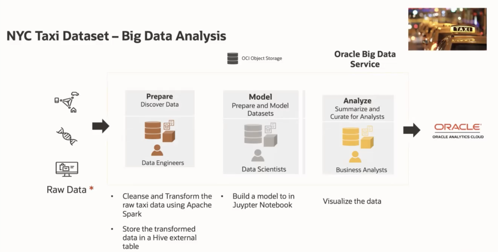

# Workshop Introduction and Overview                                    

The labs in this workshop walk you through all the steps involved in Data Engineering - collecting, cleansing and transforming data, loading data and analysing using **Oracle Big Data Service (BDS)** and visualizing data using **Oracle Analytics Cloud**.

Estimated Workshop Time: 6 hours

## What is Oracle Big Data Service?
Oracle Big Data Service is an Oracle Cloud Infrastructure service designed for a diverse set of big data use cases and workloads. From short-lived clusters used to tackle specific tasks to long-lived clusters that manage large data lakes, Big Data Service scales to meet an organization’s requirements at a low cost and with the highest levels of security.

* Vertically integrated for Hadoop, Kafka, and Spark using Cloudera Enterprise Data Hub.
* Highly secure and highly available clusters provisioned in minutes.
* Expand on premise Hadoop; deploy test and development to the cloud.
* Any scale using high performance bare metal or cost effective virtual machine (VM) shapes.
* End-to-end data management; use with Autonomous Database, Analytics Cloud, OCI Streaming, OCI Data Catalog, OCI Data Science, and OCI Data Flow.
* Use Oracle SQL to query across Hadoop, Object Stores, Kafka, and NoSQL with Cloud SQL.

Watch our short video that explains key features in Oracle Big Data Service:

Here's the Data Flow Diagram depicting the flow of data during this workshop:

## Workshop Objectives
- Prepare for using Oracle Big Data Service (BDS).
- Create a simple (non-HA) Cloudera Distribution Including Apache Hadoop (CDH) Oracle BDS cluster using the Oracle Cloud Infrastructure Console (OCI) and Big Data Service (BDS).
- Access a BDS utility node using a public IP address.
- Use Cloudera Manager (CM) and Hue to access a Big Data Service (BDS) cluster and add ingress rules to the default security rule that enables you to access both CM and Hue.
- Map the private IP address of the first master node in your cluster to a new public IP address to make this node publicly available on the internet and create a Hadoop Administrator user.
- Cleanse data uploaded in CSV format in Oracle Object Storage and upload the same to Object Storage and Hive Database.
- Run the Machine Learning code using BDS Jupyterhub Notebook and make predictions with test data.
- Visualize the data using Oracle Analytics Cloud.
- Clean up all of the resources that you created in this workshop (optional).

## Lab Breakdown
- **Lab 1:** Set Up the BDS Environment
- **Lab 2:** Create a BDS Hadoop Cluster
- **Lab 3:** Access a BDS Utility Node Using a Public IP Address
- **Lab 4:** Use Ambari and Hue to Access a BDS Cluster
- **Lab 5:** Create a Hadoop Administrator User
- **Lab 6:** Cleanse data and upload to Hive using Python (PySpark)
- **Lab 7:** Run the Machine Learning, Data Science code using Jupyterhub
- **Lab 8:** Visualize data using Oracle Analytics Cloud
- **Lab 9:** Clean up Resources Used in this Workshop (Optional)

## Workshop Prerequisites
This workshop requires an Oracle Cloud account. You may use your own cloud account or you can get a Free Trial account as described in the **Getting Started** lab in the **Contents** menu.

> **Notes:**    
 + If you have a **Free Trial** account, when your Free Trial expires your account will be converted to an **Always Free** account. You will not be able to conduct Free Tier workshops unless the Always Free environment is available. [Click here for the Free Tier FAQ page.](https://www.oracle.com/cloud/free/faq.html)
 + For more information about service limits, see [Service Limits](https://docs.cloud.oracle.com/en-us/iaas/Content/General/Concepts/servicelimits.htm) in the Oracle Cloud Infrastructure documentation.
 + To submit a request to increase your service limits, see [Requesting a Service Limit Increase](https://docs.cloud.oracle.com/en-us/iaas/Content/General/Concepts/servicelimits.htm#Requesti) in the Oracle Cloud Infrastructure documentation.

You are all set to begin the labs in this workshop! Click **Lab 1: Set Up the BDS Environment** in the **Contents** menu.

## Want to Learn More About Oracle Big Data Service?

Use these links to get more information about BDS and OCI:

* [Using Oracle Big Data Service](https://docs.oracle.com/en/cloud/paas/big-data-service/user/index.html)
* [Oracle Cloud Infrastructure Documentation](https://docs.cloud.oracle.com/en-us/iaas/Content/GSG/Concepts/baremetalintro.htm)
* [Overview of Oracle Cloud Infrastructure Identity and Access Management (IAM)](https://docs.cloud.oracle.com/en-us/iaas/Content/Identity/Concepts/overview.htm)
* [Oracle Cloud Infrastructure Self-paced Learning Modules](https://www.oracle.com/cloud/iaas/training/foundations.html)
* [Overview of Compute Service](https://www.oracle.com/pls/topic/lookup?ctx=cloud&id=oci_compute_overview)
* [VCN and Subnets](https://docs.cloud.oracle.com/iaas/Content/Network/Tasks/managingVCNs.htm)

## Acknowledgements

* **Authors:**
    * Vivek Verma, Master Principal Cloud Architect, North America Cloud Engineering
* **Contributors:**
    * Anand Chandak, Principal Product Manager, Data and AI
* **Last Updated By/Date:** Vivek Verma, September 2023
