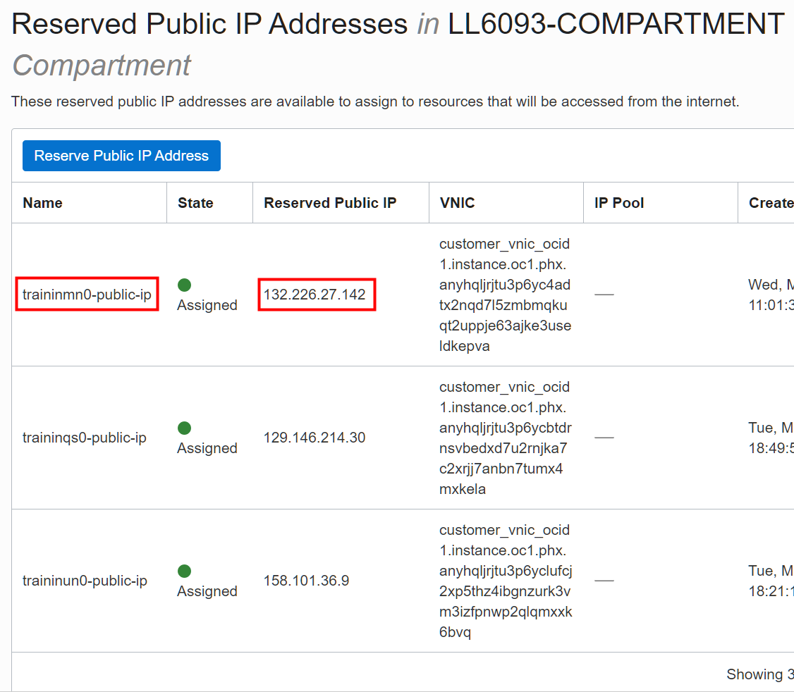

# Create a Hadoop Administrator User

## Introduction

Big Data Service nodes are by default assigned private IP addresses, which aren't accessible from the public internet. In **Lab 4: Access a BDS Node Using a Public IP Address**, you learned about the different methods that you can use to make the nodes in the cluster publicly available on the internet.

In this lab, you will map the private IP address of the **first master node** to a new public IP address to make this node publicly available on the internet. _**This assumes that making the IP address public is an acceptable security risk.**_ You will also create a Hadoop Administrator (superuser) that will be used for the Big Data Service Cluster. This user will have full access to all the data and metadata on the cluster.

Estimated Time: 45 minutes

### Objectives

* Map the private IP address of the first master node to a public IP address.
* Connect to the cluster's first master node using PuTTY.
* Create a new Linux administrator user.
* Access HDFS using the newly created user.
* Add the new user to Hue.

### Prerequisites   
This lab assumes that you have successfully completed all of the preceding labs in the **Contents** menu.

## Task 1: Gather Information About the Cluster

<if type="livelabs">
1. Log in to the **Oracle Cloud Console**, if you are not already logged in, using your LiveLabs credentials and instructions. The **Oracle Cloud Console** Home page is displayed.
</if>

<if type="freetier">
1. Log in to the **Oracle Cloud Console** as the Cloud Administrator that you used to create the resources in **Lab 1**, if you are not already logged in. On the **Sign In** page, select your `tenancy` if needed, enter your `username` and `password`, and then click **Sign In**. The **Oracle Cloud Console** Home page is displayed.
</if>

2. Click the **Navigation** menu and navigate to **Analytics & AI > Big Data Service**.

  

3. On the **Clusters** page, click the **`training-cluster`** link in the **Name** column to display the **Cluster Details** page.

4. In the **Cluster Information** tab, in the **Customer Network Information** section, click the **Copy** link next to **Subnet OCID**. Next, paste that OCID to an editor or a file, so that you can retrieve it later in **Task 2** in this lab.

  <if type="freetier">
  
  </if>

  <if type="livelabs">
  
  </if>

5. On the same page, in the **List of Cluster Nodes** section, in the **IP Address** column, find the private IP address for the first master node, **`traininmn0`**. Save the IP address as you will need it in later tasks. In our example, the private IP address of our first master node in the cluster is <if type="freetier">**`10.0.0.10`**</if> <if type="livelabs">**`10.0.0.2`**</if>.

  <if type="freetier">
  
  </if>

  <if type="livelabs">
  
  </if>

## Task 2: Map the Private IP Address of the First Master Node to a Public IP Address

In this task, you will set three variables using the **`export`** command. The variables will be used in the **`oci network`** command that you will use to map the private IP address of the **first master node** to a new public IP address. You have done similar work in **Lab 4**.

1. On the **Oracle Cloud Console** banner at the top of the page, click the **Cloud Shell** icon. It may take a few moments to connect and authenticate you.

  <if type="freetier">
  
  </if>

  <if type="livelabs">
  
  </if>

2. At the **$** command line prompt, enter the following command, or click **Copy** to copy the command, and then paste it on the command line. The **_`display-name`_** is an optional descriptive name that will be attached to the reserved public IP address that will be created for you. Press the **`[Enter]`** key to run the command.

    ```
    $ <copy>export DISPLAY_NAME="traininmn0-public-ip"</copy>
    ```

3. At the **$** command line prompt, enter the following command, or click **Copy** to copy the command, and then paste it in the command line.   

    ```
    $ <copy>export SUBNET_OCID="subnet-ocid"</copy>
    ```
    > **Note:** In the preceding command, substitute **_``subnet-ocid``_** with your own **`subnet-ocid`** that you identified in **Task 1** of this lab. Press the **`[Enter]`** key to run the command.

    In our example, we replaced the **_``subnet-ocid``_** with our own **`subnet-ocid`**:

    <if type="freetier">
      ```
    $ export SUBNET_OCID="ocid1.subnet.oc1.iad.aaaaaaaa3mhu4yuaito4trodn4cywlv2ys3dtwj67cu26bs2gses4yd6gsea"
      ```
    </if>

    <if type="livelabs">
      ```
    $ export SUBNET_OCID="ocid1.subnet.oc1.phx.aaaaaaaav7csf6i5lsevfr3egwsxagknkyjppdgdlqrdknsyw3jz5bm3fdcq"
      ```
    </if>  

4. At the **$** command line prompt, enter the following command, or click **Copy** to copy the command, and then paste it on the command line. The **`ip-address`** is the private IP address that is assigned to the node that you want to map.

    ```
    $ <copy>export PRIVATE_IP="ip-address"</copy>
    ```
    > **Note:** In the preceding command, substitute **_`ip-address`_** with your first master node's private IP address. Press the **`[Enter]`** key to run the command.

  In our example, we replaced the **_``ip-address``_** with the private IP address of our first master node that we identified in **Task 1** of this lab.

    <if type="freetier">
      ```
    $ export PRIVATE_IP="10.0.0.10"
      ```
    </if>

    <if type="livelabs">
      ```
    $ export PRIVATE_IP="10.0.0.2"
      ```
    </if>  

5.  At the **$** command line prompt, enter the following command exactly as it's shown below **_without any line breaks_**, or click **Copy** to copy the command, and then paste it on the command line. Press the **`[Enter]`** key to run the command.

      ```
    $ <copy>oci network public-ip create --display-name $DISPLAY_NAME --compartment-id `oci network private-ip list --subnet-id $SUBNET_OCID --ip-address $PRIVATE_IP | jq -r '.data[] | ."compartment-id"'` --lifetime "RESERVED" --private-ip-id `oci network private-ip list --subnet-id $SUBNET_OCID --ip-address $PRIVATE_IP | jq -r '.data[] | ."id"'`</copy>
      ```
6.  In the output returned, find the value for **ip-address** field. In our example, it's <if type="freetier">**`193.122.164.186`**</if><if type="livelabs">**`132.226.27.142`**</if>. This is the new reserved public IP address that is mapped to the private IP address of your **first master node**.

  <if type="freetier">  
  
  </if>

  <if type="livelabs">
  
  </if>

7.  To view the newly created reserved public IP address in the console, click the **Navigation** menu and navigate to **Networking**. In the **IP Management** section, click **Reserved IPs**. The new reserved public IP address is displayed in the **Reserved Public IP Addresses** page.

  <if type="freetier">
  
  </if>

  <if type="livelabs">
  
  </if>

## Task 3: Connect to the Cluster's First Master Node Using Secure Shell (SSH)

In this task, you will connect to the first master node using SSH as user **`opc`** (the default Oracle Public Cloud user).

Remember, in **Lab 2**, we used our own SSH public key pair that we created using Windows **PuTTYgen** named `mykey.pub` and associated that key with our cluster. In this lab, we will connect to our cluster using Windows **PuTTY** and provide the SSH private key named `mykey.ppk` which is associated with our `mykey.pub` public key. If you created or used an OpenSSH key pair (using your Linux system or Windows PowerShell), you cannot use PuTTY to connect to your cluster; instead, you will need to use your Linux system or Windows PowerShell using the **`ssh`** command below. PuTTY uses a different key file format than OpenSSH. For information on how to connect to your instance using SSH from a Unix-style system or from a Windows system using OpenSSH, see the [Connecting to Your Instance](https://docs.cloud.oracle.com/en-us/iaas/Content/GSG/Tasks/testingconnection.htm?Highlight=connect%20to%20an%20instance%20using%20ssh) OCI documentation.

> **Note:** You cannot use PuTTY while you are connected to a Virtual Private Network (VPN).

```
<b>$</b> <copy>ssh –i private_key username@public-ip-address</copy>
```

+ **`private_key`** is the full path and name of the file that contains the private key associated with the instance you want to access.
+  **`username`** is the default name for the cluster. The default user name is **`opc`**.
+ **`public-ip-address`** is the public IP address of the cluster node you want to access.

For additional information on connecting to a node in the cluster using SSH, see [Connect to a Cluster Node By Using Secure Shell (SSH)](https://docs.oracle.com/en/cloud/paas/big-data-service/user/connect-cluster-ssh.html) in the Using Oracle Big Data Service documentation.

_If you are already connected to your cluster's first master node using the OpenSSH format with the **`ssh`** command above, you can skip the rest of the tasks in this section and proceed to **Task 4, Create the training Linux OS Administrator User**._

1. To SSH into your cluster using your Windows PuTTYgen generated SSH key pair, start Putty. The **PuTTY Configuration** window is displayed. In the **Category** pane, select the **Session** parameter, if not already selected. In the **Basic options for your PuTTY session** section, provide the following information:

    + **Host Name (or IP address):** **`opc@master-node-0-ip-address`**.    
        > **Note:** In the above string, substitute `master-node-0-ip-address` with your IP address that you created for your **`traininmn0`** master node.

    + **Port:** **`22`**.
    + **Connection type:** **`SSH`**.   
    + **Saved Sessions:** A description of this ssh connection such as `ssh to traininmn0 on BDS cluster`.

    <if type="freetier">
    
    </if>

    <if type="livelabs">
    
    </if>

2. In the **Category** pane, expand **Connection**, expand **SSH**, and then click **Auth**. In the **Options controlling SSH authentication** section, in the **Private key file for authentication** section, click **Browse**. In the **Select private key file** window, select your **_private key_** that is associated with your cluster's **_public key_** that you used when your created your BDS cluster.    

  <if type="freetier">
  
  </if>

  <if type="livelabs">
  
  </if>

3. In the **Category** pane, select the **Session** parameter, and then click **Save** to save your session for easier future access. Your saved session is displayed in the **Saved Sessions** list.

    > **Note:** The next time you need to connect to this node, select the connection name from the **Saved Sessions** list, click **Load**, and then click **Open**.  

  <if type="freetier">
  
  </if>

  <if type="livelabs">
  
  </if>

4. Click **Open** to start the ssh session. If this is your first time connecting to your first master node in the cluster, the following **PuTTY Security Alert** message box is displayed. Click **Yes**.

  <if type="freetier">
  
  </if>

  <if type="livelabs">
  
  </if>

   You are now connected to the **`traininmn0`** master node.

  <if type="freetier">    
  
  </if>

  <if type="livelabs">    
  
  </if>

## Task 4: Create the **`training`** Linux OS Administrator User

Create the **`training`** Linux administrator user and the OS group **`supergroup`**. Assign **`training`** the **`supergroup`** superuser group as the primary group, and **hdfs**, **hadoop**, and **hive** as the secondary groups.

1. The **`opc`** user has **`sudo`** privileges on the cluster which allows it to switch to the `root` user in order to run privileged commands. Change to the `root` user as follows:

    ```
    $ <copy>sudo bash</copy>
    ```
    <if type="freetier">
    
    </if>

    <if type="livelabs">
    
    </if>

2. The **`dcli`** utility allows you to run the command that you specify across each node of the cluster. The syntax for the **`dcli`** utility is as follows:

    ```
    dcli [option] [command]
    ```
    Use the **`-C`** option to run the specified command on all the nodes in the cluster.

    Enter the following command at the **`#`** prompt to create the OS group
    **`supergroup`** which is defined as the **`superuser`** group in hadoop.

    ```
    # <copy>dcli -C "groupadd supergroup"</copy>
    ```
    <if type="freetier">
    
    </if>

    <if type="livelabs">
    
    </if>

3. Enter the following command at the **`#`** prompt to create the **`training`** administrator user and add it to the listed groups on each node in the **`training-cluster`**. The **`useradd`** linux command creates the new **`training`** user and adds it to the specified groups.

    ```
    # <copy>dcli -C "useradd -g supergroup -G hdfs,hadoop,hive training"</copy>
    ```
    <if type="freetier">
    
    </if>

    <if type="livelabs">
    
    </if>

    The preceding command creates a new user named **`training`** on each node of the cluster. The **`-g`** option assigns the **`supergroup`** group as the primary group for **`training`**. The **`-G`** option assigns the **`hdfs`**, **`hadoop`**, and **`hive`** groups as the secondary groups for **`training`**.

    > **Note:** Since the **`training`** user is part of the **hive** group, it is considered an administrator for Sentry.

4. Use the linux **`id`** command to confirm the creation of the new user and to list its groups membership.

    ```
    # <copy>id training</copy>
    ```

5. You can now access HDFS using the new **`training`** administrator user on any node in the cluster such as the **first master node** in this example. Change to the `training` user as follows:

    ```
    # <copy>sudo -su training</copy>
    ```

6. Use the linux **`id`** command to confirm that you are connected now as the **`training`** user.

    ```
    $ <copy>id</copy>
    ```
    <if type="freetier">
    
    </if>

    <if type="livelabs">
    
    </if>

7.  Perform a file listing of HDFS as the `training` user using the following command:

    ```
    $ <copy>hadoop fs -ls /</copy>
    ```
    <if type="freetier">
    
    </if>

    <if type="livelabs">
    
    </if>

## Task 5: Add the **`training`** User to Hue (optional)

In this task, you log into Hue as an administrator and add the **`training`** user as an administrator. In a non-HA cluster, Hue runs on the first utility node. You will use the reserved public IP address that is associated with **`traininun10`** that you created in **Lab 5, Access a BDS Node Using a Public IP Address**.

1. Open a Web browser window.

2. Enter the following URL:

    ```
    https://<ip-address>:8888
    ```
    > **Note:**    
    In the preceding command, substitute **_``ip-address``_** with your own **_``ip-address``_** that is associated with the **first utility node** in your cluster, **`traininun0`**, which you created in a previous lab.

  In our example, we used the reserved public IP address that is associated with our first utility node as follows:

    <if type="freetier">
    ```
    https://193.122.194.103:8888
    ```
    </if>

    <if type="livelabs">
    ```
    https://158.101.36.9:8888
    ```
    </if>

3. If this is the first time you are accessing Hue, the Hue Login screen is displayed. Enter your **`username`** (**`admin`** by default) and the **`password`** that you specified when you created the cluster such as **`Training123`**.

  

  The **Hue Editor** page is displayed.

  

4. From the **admin** drop-down menu, select **Manage Users**.

  

5. In the **User Admin** page, in the **Users** tab, click **Add user**.

   

6. In the **Hue Users - Create user** page, in **Task 1: Credentials (required)** of the wizard, enter the following information:

    + **Username:** **`training`**
    + **New Password:** **`Training123`**
    + **Password confirmation:** **`Training123`**
    + **Create home directory:** `Checked`

   

7. Click the **Task 3: Advanced** link of the wizard, select the **Superuser status** checkbox, and then click **Add user**.

       

       The **Hue Users** page is re-displayed. The newly added **`training`** user is displayed in the list of Hue users.

       <if type="freetier">
       
       </if>

       <if type="livelabs">
       
       </if>

8. Exit Hue. From the **admin** drop-down menu, select **Sign out**.

       


       > **Note:** For documentation on using Hue, see [Introduction to Hue](https://docs.cloudera.com/documentation/enterprise/6/6.3/topics/hue.html). You can also select **Help** from the **User** drop-down menu for general help topics.

  

This concludes this lab. You may now proceed to the next lab.

## Want to Learn More?

* [Using Oracle Big Data Service](https://docs.oracle.com/en/cloud/paas/big-data-service/user/index.html)
* [Oracle Cloud Infrastructure Documentation](https://docs.cloud.oracle.com/en-us/iaas/Content/GSG/Concepts/baremetalintro.htm)
* [MIT Kerberos Documentation](https://web.mit.edu/kerberos/krb5-1.12/doc/admin/admin_commands/kadmin_local.html#list-principals)
* [Creating a Key Pair](https://docs.cloud.oracle.com/en-us/iaas/Content/GSG/Tasks/creatingkeys.htm?Highlight=ssh%20key#CreatingaKeyPair)
* [Connecting to Your Instance](https://docs.cloud.oracle.com/en-us/iaas/Content/GSG/Tasks/testingconnection.htm?Highlight=connect%20to%20an%20instance%20using%20ssh)
* [Securing the Oracle Big Data Appliance OLL Video](https://apexapps.oracle.com/pls/apex/f?p=44785:112:102721520016911::::P112_CONTENT_ID,P112_PREV_PAGE:12907)
* [Getting Started with the Command Line Interface (CLI)](https://docs.cloud.oracle.com/en-us/iaas/Content/GSG/Tasks/gettingstartedwiththeCLI.htm)
* [OCI CLI Command Reference - Public-IP](https://docs.cloud.oracle.com/en-us/iaas/tools/oci-cli/2.9.0/oci_cli_docs/cmdref/network/public-ip.html#)
* [OCI CLI Command Reference - Big Data Service (bds)](https://docs.cloud.oracle.com/en-us/iaas/tools/oci-cli/2.10.0/oci_cli_docs/cmdref/bds.html)
* [Using Hue](https://docs.cloudera.com/documentation/enterprise/6/6.3/topics/hue_using.html)

## Acknowledgements

* **Author:**
    * Lauran Serhal, Principal User Assistance Developer, Oracle Database and Big Data User Assistance
* **Contributor:**
    * Martin Gubar, Director, Oracle Big Data Product Management
* **Last Updated By/Date:** Lauran Serhal, July 2021
