# Create a BDS Hadoop Cluster

## Introduction

In this lab, you will learn how to create a Highly-Available (HA) Cloudera Distribution Including Apache Hadoop (CDH) cluster using the Oracle Cloud Infrastructure Console (OCI) and Big Data Service (BDS). This will be a small development cluster that is not intended to process huge amounts of data. It will be based on small Virtual Machine (VM) shapes that are perfect for developing applications and testing functionality at a minimal cost.

Estimated Lab Time: 60 minutes

### Objectives

* Create an HA Hadoop cluster using BDS and OCI.
* Monitor the cluster creation and the cluster and nodes metrics.
* Review the locations of the various services in the cluster.

### What Do You Need?

This lab assumes that you have successfully completed **Lab 1: Setup the BDS Environment** in the **Contents** menu.

### Video Preview

Watch a video demonstration of creating a simple non-HA Hadoop cluster:

## Task 1: Create a Cluster
There are many options when creating a cluster. You will need to understand the sizing requirements based on your use case and performance needs. In this lab, you will create a small testing and development cluster that is not intended to process huge amounts of data. It will be based on small Virtual Machine (VM) shapes that are perfect for developing applications and testing functionality at a minimal cost. See [Compute Shapes](https://docs.cloud.oracle.com/en-us/iaas/Content/Compute/References/computeshapes.htm#vm-dense) in the Oracle Cloud Infrastructure (OCI) documentation.

Your simple HA cluster will have the following profile:
  + **Nodes:** **2** Master nodes, **2** Utility nodes, and **3** Worker nodes.  
  + **Master and Utility Nodes Shapes:** **VM.Standard2.4** shape for the Master and Utility nodes. This shape provides **4 CPUs** and **60 GB** of memory.
  + **Worker Nodes Shape:** **VM.Standard2.1** shape for the Worker nodes in the cluster. This shape provides **1 CPU** and **15 GB** of memory.
  + **Storage Size:** **150 GB** block storage for the Master, Utility, and Worker nodes.

  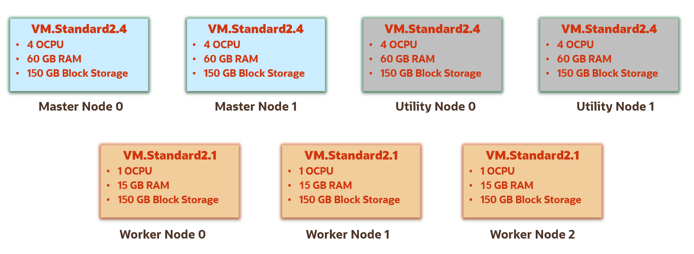

Create the HA cluster as follows:

1. Log in to the **Oracle Cloud Console** as the Cloud Administrator that you used so far in this workshop. On the **Sign In** page, select your `tenancy`, enter your `username` and `password`, and then click **Sign In**. The **Oracle Cloud Console** Home page is displayed.

2. Click the **Navigation** menu and navigate to **Analytics & AI > Big Data Service**.

  

3. On the **Clusters** page, click **Create Cluster**.

  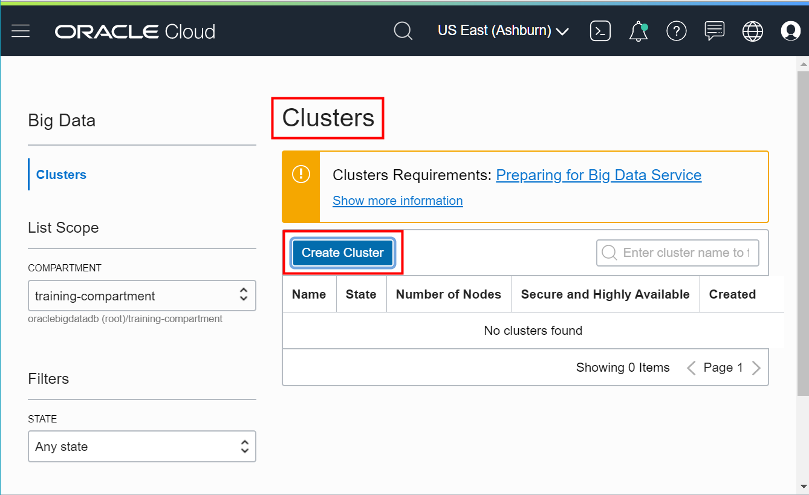

4. At the top of the **Create Cluster** wizard, provide the cluster details as follows:
    * **Cluster Name:** **`training-cluster`**.
    * **Cluster Admin Password:** Enter a `cluster admin password` of your choice such as **`Training123`**. You'll need this password to sign into Cloudera Manager and to perform certain actions on the cluster through the Cloud Console.
    * **Confirm Cluster Admin Password:** Confirm your password.
    * **Secure & Highly Available (HA):** Select this checkbox, if not already selected, to make the cluster secure and highly available. A secure cluster has the full Hadoop security stack, including HDFS Transparent Encryption, Kerberos, and Apache Sentry. This setting can't be changed for the life of the cluster.
    * **Cluster Version:** This read-only field displays the latest version of Cloudera 6 that is available to Oracle which is deployed by BDS.

    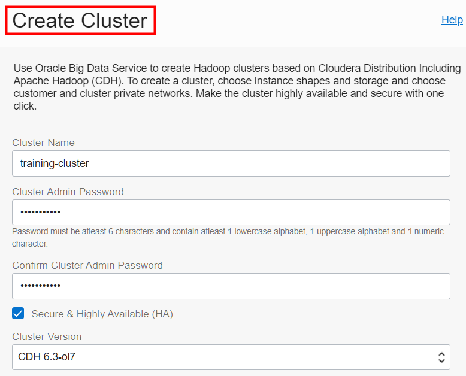

5. In the **Hadoop Nodes > Master/Utility Nodes** section, provide the following details:

    * **Choose Instance Type:** **`Virtual Machine`**.
    * **Choose Master/Utility Node Shape:** **`VM.Standard2.4`**. This is the minimum shape allowed for Master and Utility nodes.
    * **Block Storage Size Per Master/Utility Node (in GB):** **`150 GB`**.  
    **Note:** **`150 GB`** is the minimum block storage size allowed for Master, Utility, and Worker nodes. For information on the supported cluster layout, shape, and storage, see [Plan Your Cluster](https://docs.oracle.com/en/cloud/paas/big-data-service/user/plan-your-cluster.html#GUID-0A40FB4C-663E-435A-A1D7-0292DBAC9F1D).
    * **Number of Master & Utility Nodes** _READ-ONLY_ **:** Since you are creating an HA cluster, this field shows **4** nodes: **2** Master nodes and **2** Utility nodes. For a non-HA cluster, this field would show only **2** nodes: **1** Master node and  **1** Utility node.

    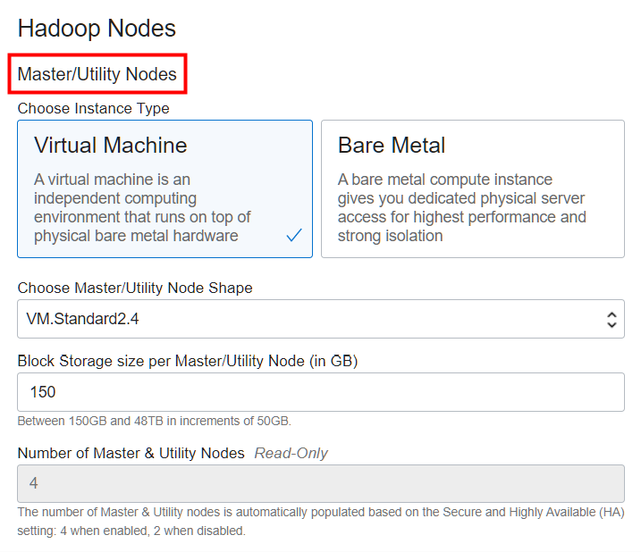

6. In the **Hadoop Nodes > Worker Nodes** section, provide the following details:

    * **Choose Instance Type:** **`Virtual Machine`**.
    * **Choose Worker Node Shape:** **`VM.Standard2.1`**.  This is the minimum allowed shape for Worker nodes.
    * **Block Storage Size per Worker Node (in GB):** **`150 GB`**.  
    * **Number of Worker Nodes:** **`3`**. This is the minimum allowed for a cluster.

    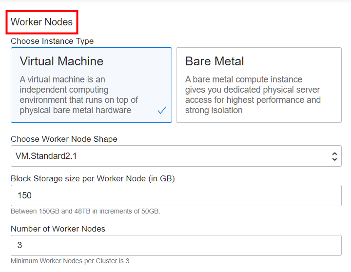

7. In the **Network Setting > Cluster Private Network** section, provide the following details:

     * **CIDR Block:** **`10.1.0.0/16`**. This CIDR block assigns the range of contiguous IP addresses available for the cluster's private network that BDS creates for the cluster. This private network is created in the Oracle tenancy and not in your customer tenancy. It is used exclusively for private communication among the nodes of the cluster. No other traffic travels over this network, it isn't accessible by outside hosts, and you can't modify it once it's created. All ports are open on this private network.

     **Note:** Use CIDR block **`10.1.0.0/16`** instead of the already displayed **`10.0.0.0/16`** CIDR block range. This avoids overlapping IP addresses since you already used the **`10.0.0.0/16`** CIDR block range for the **`training-vcn`** VCN that you created in **Lab 1**. A CIDR block of **`10.1.0.0/16`** provides you with **`65,536`** contiguous IP addresses, **`10.1.0.0`** to **`10.1.255.255`**. You can decrease the range of available IP addresses to free them for other uses by choosing a CIDR block such as **`10.1.0.0/24`**. This provides you with only **`256`** contiguous IP addresses, **`10.1.0.0`** to **`10.1.0.255`**.

8. In the **Network Setting > Customer Network** section, provide the following details:

    * **Choose VCN in `training-compartment`:** **`training-vcn`**. The VCN must contain a regional subnet.   **Note:** Make sure that **`training-compartment`** is selected; if it's not, click the _CHANGE COMPARTMENT_ link, and then search for and select your **`training-compartment`**.
    * **Choose Regional Subnet in `training-compartment`:** **`Public Subnet-training-vcn`**. This is the public subnet that was created for you when you created your **`training-vcn`** VCN in **Lab 1**.
    * **Networking Options:** **`DEPLOY ORACLE-MANAGED SERVICE GATEWAY AND NAT GATEWAY (QUICK START)`**. This simplifies your network configuration by allowing Oracle to provide and manage these communication gateways for private use by the cluster. These gateways are created in the Oracle tenancy and can't be modified after the cluster is created.

    **Note:** Select the **`USE THE GATEWAYS IN YOUR SELECTD CUSTOMER VCN (CUSTOMIZABLE)`** option if you want more control over the networking configuration.

    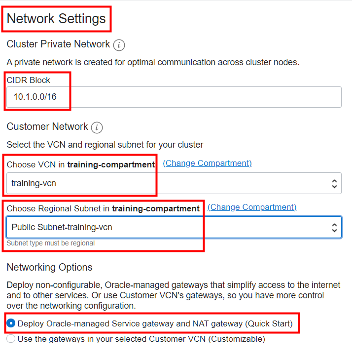

9. In the **Additional Options > SSH public key** section, associate a public Secure Shell (SSH) key with the cluster.

    Linux instances use an SSH key pair instead of a password to authenticate a remote user. A key pair file contains a private key and public key. You keep the private key on your computer and provide the public key when you create an instance. When you connect to the instance using SSH, you provide the path to the private key in the SSH command. Later in **Lab 6**, you will connect to your cluster's master node using the private SSH key that is associated with the public SSH key that you specify here for your cluster.

    **Note:** If you already have an existing public key, you can use it in this step; you don't have to create a new public key. If you need to create a new SSH key pair (using different formats), see the [Creating a Key Pair](https://docs.cloud.oracle.com/en-us/iaas/Content/GSG/Tasks/creatingkeys.htm?Highlight=ssh%20key#CreatingaKeyPair) OCI documentation topic and the
    [Generate SSH key](https://oracle-livelabs.github.io/common/labs/generate-ssh-key/) lab.

    Specify an SSH public key using one of the following methods:
     * Select **Choose SSH key file**, and then either Drag and drop a public SSH key file into the box,
      or click **Select one...** and navigate to and choose a public SSH key file from your local file system.
     * Select **Paste SSH public key**, and then paste the contents from a public SSH key file into the box.

     **Note:** In this lab, we use our own SSH public key pair that we created using Windows **PuTTYgen** named `mykey.pub`. In **Lab 6**, we will connect to our cluster using Windows **PuTTY** and provide the SSH private key named `mykey.ppk` which is associated with our `mykey.pub` public key. If you create OpenSSH key pair using your Linux system or Windows PowerShell, you cannot use PuTTY to connect to your cluster; instead, you will need to use your Linux system or Windows PowerShell. PuTTY uses a different key file format than OpenSSH. To connect to your instance using SSH from a Unix-style system or from a Windows system using OpenSSH, see the [Connecting to Your Instance](https://docs.cloud.oracle.com/en-us/iaas/Content/GSG/Tasks/testingconnection.htm?Highlight=connect%20to%20an%20instance%20using%20ssh) OCI documentation.

     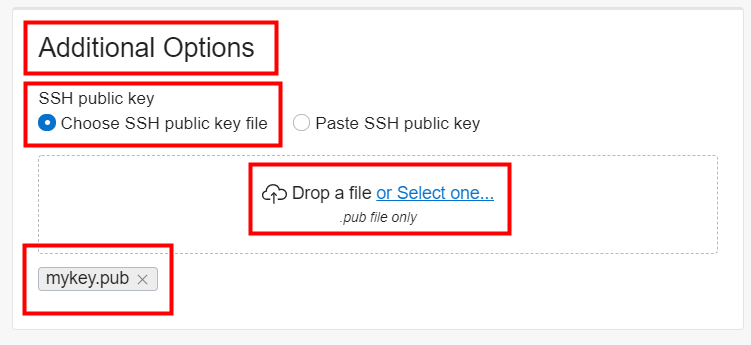

10.  Click **Create Cluster**. The **Clusters** page is re-displayed. The state of the cluster is initially **Creating**.

    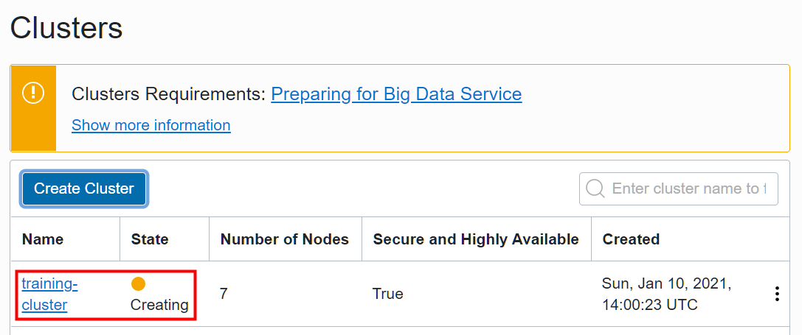

## Task 2: Monitor the Cluster Creation

The process of creating the cluster takes approximately one hour to complete; however, you can monitor the cluster creation progress as follows:

1. To view the cluster's details, click **`training-cluster`** in the **Name** column to display the **Cluster Details** page.

   

   The **Cluster Information** tab displays the cluster's general and network information.

   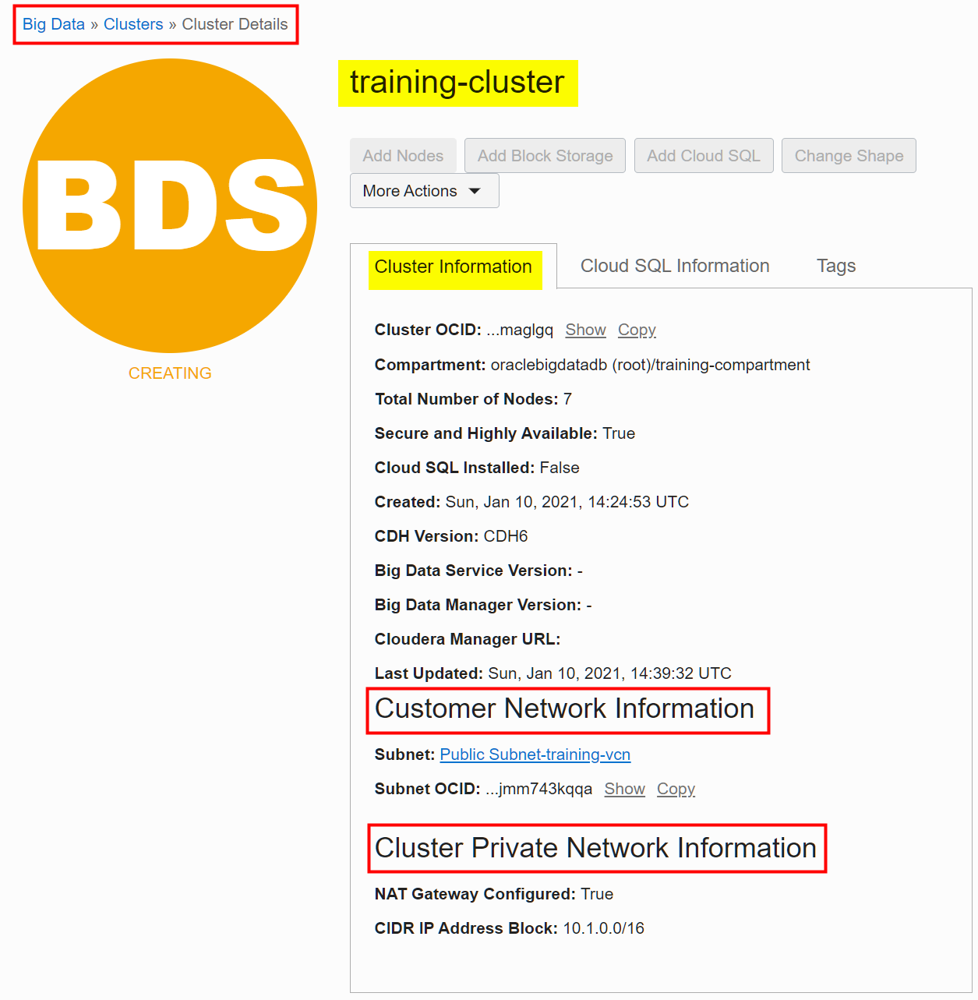  

   The **List of cluster nodes** section displays the following information for each node in the cluster: Name, status, type, shape, private IP address, and date and time of creation.

   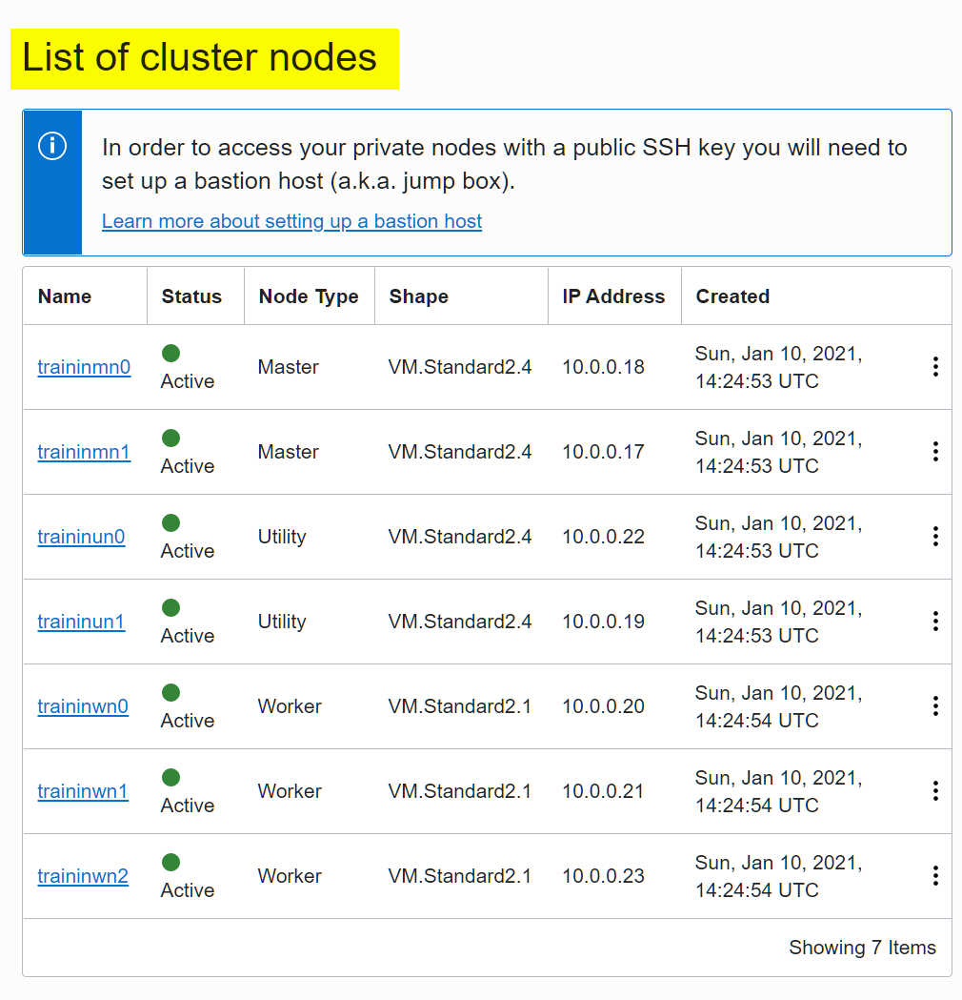  

   **Note:**
   The name of a node is the concatenation of the **first seven** letters of the cluster's name, **`trainin`**, followed by two letters representing the node type such as **`mn`** for a **Master** node, **`un`** for a **Utility** node, and **`wn`** for a **Worker** node. The numeric value represents the node type order in the list such as Worker nodes **`0`**, **`1`**, and **`2`**.

   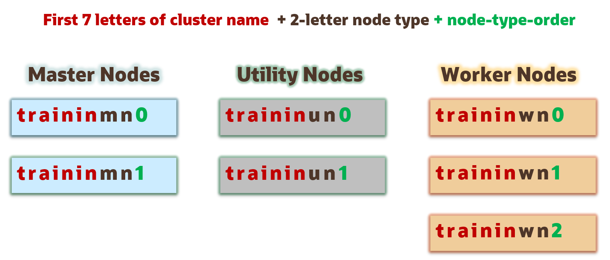

2. To view the details of a node, click the node's name link in the **Name** column. For example, click the **`traininmn0`** first Master node in the **Name** column to display the **Node Details** page.

   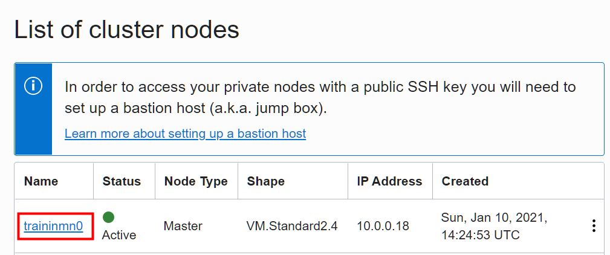  

   The **Node Information** tab displays the node's general and network information.

   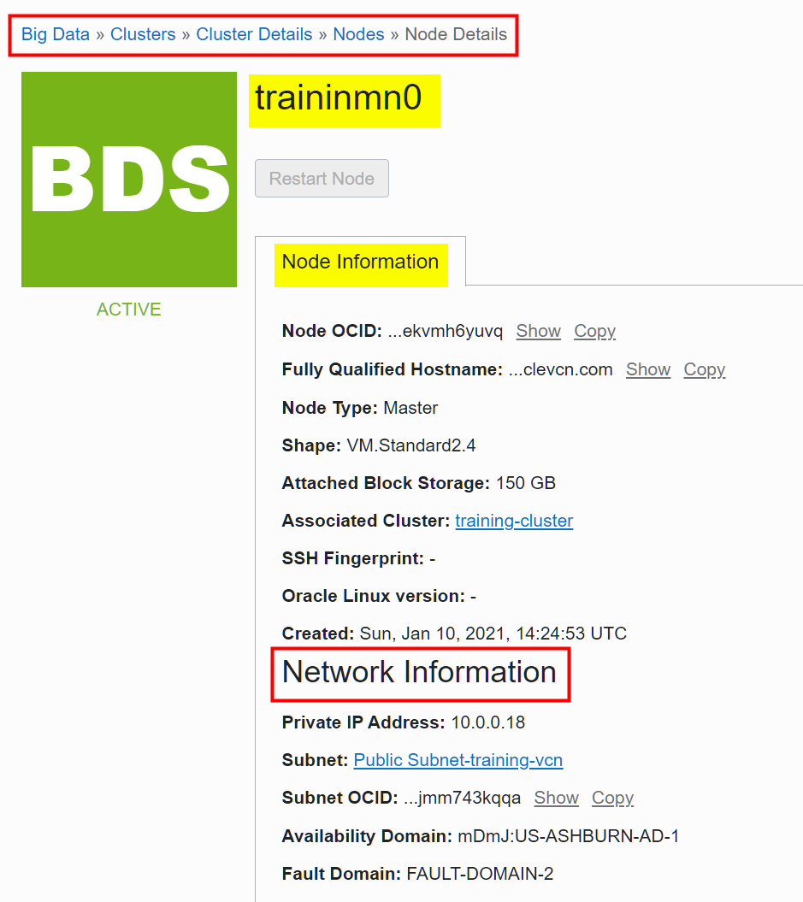  

3. Click the **Cluster Details** link in the breadcrumbs at the top of the page to re-display the **Cluster Details** page.

   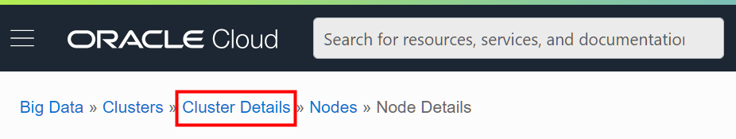  

4. Scroll-down the **Cluster Details** page. In the **Resources** section on the left, click **Work Requests**.

   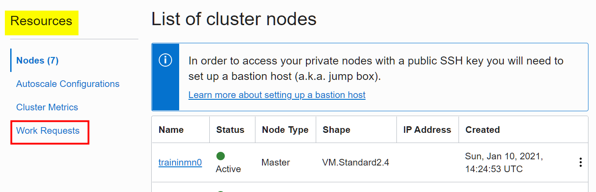  

5. The **Work Requests** section on the page displays the status of the cluster creation and other details such as the **Operation**, **Status**, **% Complete**, **Accepted**, **Started**, and **Finished**. Click the **CREATE_BDS** name link in the **Operation** column.

   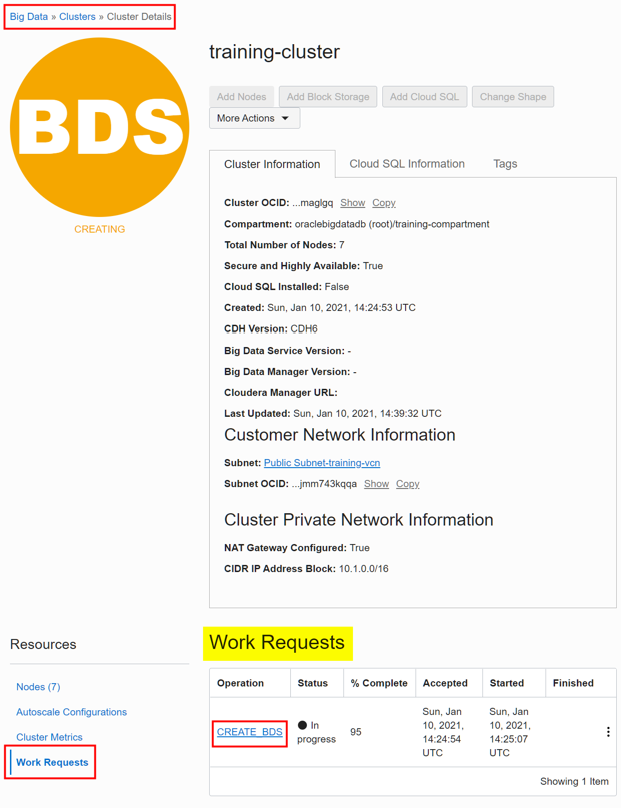

   The **CREATE_BDS** page displays the work request information, logs, and errors, if any.

   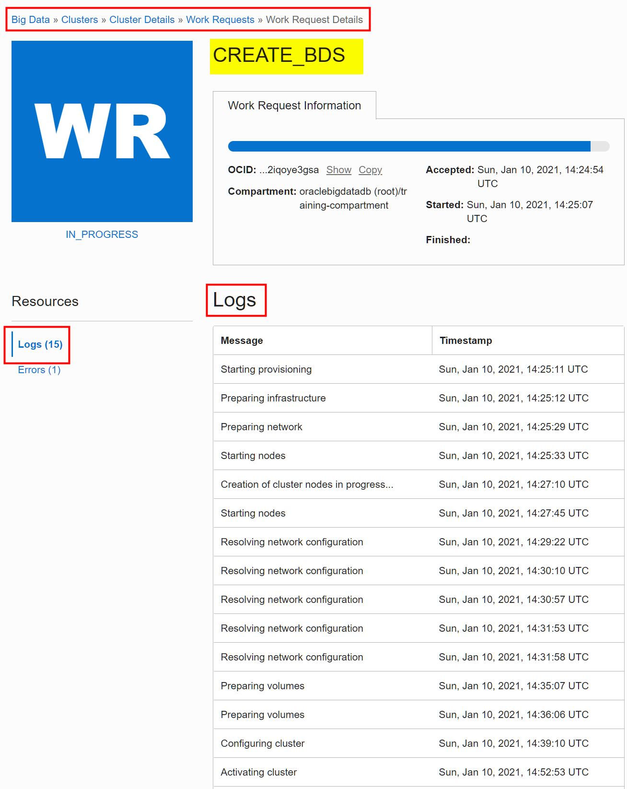

6. Click the **Clusters** link in the breadcrumbs at the top of the page to re-display the **Clusters** page.

    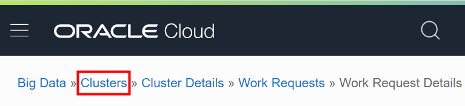  

7. Once the **`training-cluster`** cluster is created successfully, the state changes to **Active**.   

  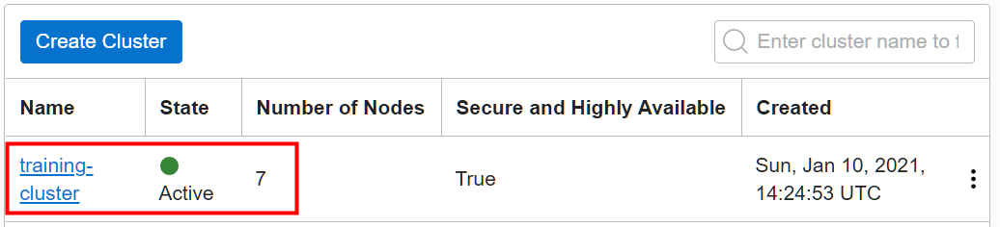  

  **Note:**  
  If you are using a Free Trial account to run this workshop, Oracle recommends that you at least delete the BDS cluster when you complete the workshop to avoid unnecessary charges. You can also complete the optional **Lab 8: Clean up Resources Used in this Workshop** to delete all of the resources that you create in this workshop.

## Task 3: Monitor the Cluster and Nodes Metrics

  Once your cluster is successfully created, you can monitor the cluster's metrics and the metrics of any of its nodes.

1. From the **Clusters** page, click **`training-cluster`** in the **Name** column to display the **Cluster Details** page.

   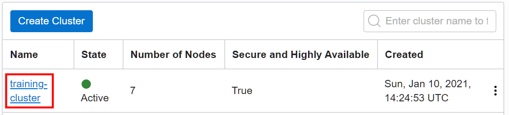

2. Scroll-down the **Cluster Details** page. In the **Resources** section on the left, click **Cluster Metrics**.

   

3. The **Cluster Metrics** section shows the various metrics such as **HDFS Space Used**, **HDFS Space Free**, **Yarn Jobs Completed**, and **Spark Jobs Completed**. You can adjust the Start time, End time, Interval, Statistic, and Options fields, as desired.

      

4. In the **Resources** section on the left, click **Nodes (7)**.

   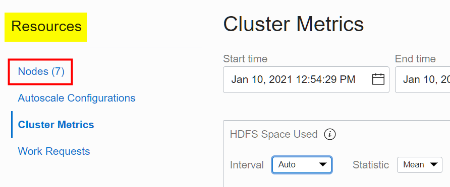

5. In the **List of cluster nodes** section, click any node name link to display its metrics. Click the **`traininmn0`** first Master node in the **Name** column.

     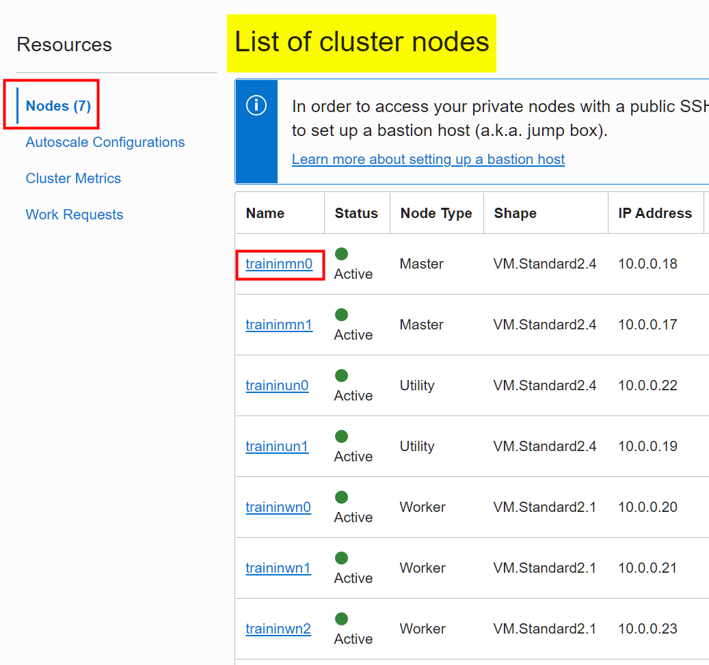

6. In the **Node Details** page, scroll-down to the **Node Metrics** section. This section is displayed at the bottom of the **Node Details** page **only after** the cluster is successfully provisioned. It displays the following charts: **CPU Utilization**, **Memory Utilization**, **Network Bytes In**, **Network Bytes Out**, and **Disk Utilization**. You can hover over any chart to get additional details.

      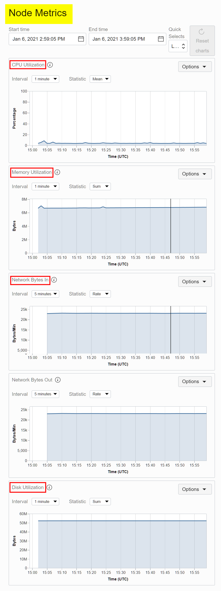  

7. Click the **Cluster Details** link in the breadcrumbs at the top of the page to re-display the **Cluster Details** page.

       

## Task 4: Review Locations of Services in the Cluster

  The `training-cluster` cluster is a highly available (HA) cluster; therefore, the services are distributed as follows:

**First Master Node, `traininmn0`:**

  + HDFS Failover Controller    
  + HDFS JournalNode    
  + HDFS NameNode    
  + Hive Gateway    
  + Key Trustee KMS Key Management Server Proxy
  + Key Trustee Server Active Database
  + Key Trustee Server Active Key Trustee Server
  + Spark Gateway
  + Spark History Server
  + YARN (MR2 Included) JobHistory Server
  + YARN (MR2 Included) ResourceManager
  + ZooKeeper Server

**Second Master Node, `traininmn1`:**

  + HDFS Balancer
  + HDFS Failover Controller
  + HDFS HttpFS
  + HDFS JournalNode
  + HDFS NameNode
  + Hive Gateway
  + Hue Load Balancer
  + Hue Server
  + Hue Kerberos Ticket Renewer
  + Key Trustee KMS Key Management Server Proxy
  + Key Trustee Server Passive Database
  + Key Trustee Server Passive Key Trustee Server
  + YARN (MR2 Included) ResourceManager
  + ZooKeeper Server

**First Utility Node, `traininun0`:**

  + HDFS Gateway
  + HDFS JournalNode
  + Hive Gateway
  + Cloudera Management Service Alert Publisher
  + Cloudera Management Service Event Server
  + Cloudera Management Service Host Monitor
  + Cloudera Management Service Navigator Audit Server
  + Cloudera Management Service Navigator Metadata Server
  + Cloudera Management Service Reports Manager
  + Cloudera Management Service Service Monitor
  + Sentry Server
  + Spark Gateway
  + YARN (MR2 Included) Gateway
  + ZooKeeper Server

**Second Utility Node, `traininun1`:**

  + HDFS Gateway
  + Hive Gateway
  + Hive Metastore Server
  + HiveServer2
  + Hive WebHCat Server
  + Hue Load Balancer
  + Hue Server
  + Hue Kerberos Ticket Renewer
  + Oozie Server
  + Sentry Server
  + Spark Gateway
  + YARN (MR2 Included) Gateway

**Worker nodes, `traininwn0`, `traininwn1`, `traininwn2`:**

  + HDFS DataNode  
  + Hive Gateway
  + Spark Gateway
  + YARN (MR2 Included) NodeManager

**Note:** In **Lab 5, Use Cloudera Manager (CM) and Hue to Access a BDS Cluster**, you will use Cloudera Manager to view the roles, services, and gateways that are running on each node in the cluster.

This concludes this lab. You may now [proceed to the next lab](#next).

## Want to Learn More?

* [Using Oracle Big Data Service](https://docs.oracle.com/en/cloud/paas/big-data-service/user/index.html)
* [Oracle Cloud Infrastructure Documentation](https://docs.cloud.oracle.com/en-us/iaas/Content/GSG/Concepts/baremetalintro.htm)
* [Creating a Key Pair](https://docs.cloud.oracle.com/en-us/iaas/Content/GSG/Tasks/creatingkeys.htm?Highlight=ssh%20key#CreatingaKeyPair)
* [Connecting to Your Instance](https://docs.cloud.oracle.com/en-us/iaas/Content/GSG/Tasks/testingconnection.htm?Highlight=connect%20to%20an%20instance%20using%20ssh)
* [Overview of Oracle Cloud Infrastructure Identity and Access Management](https://docs.cloud.oracle.com/en-us/iaas/Content/Identity/Concepts/overview.htm)
* [Overview of the Compute Service](https://docs.cloud.oracle.com/en-us/iaas/Content/Compute/Concepts/computeoverview.htm)  
* [Compute Shapes](https://docs.cloud.oracle.com/en-us/iaas/Content/Compute/References/computeshapes.htm#vm-dense)

## Acknowledgements

* **Author:**  
    + Lauran Serhal, Principal User Assistance Developer, Oracle Database and Big Data User Assistance
* **Contributors:**  
    + Martin Gubar, Director, Oracle Big Data Product Management
    + Ben Gelernter, Principal User Assistance Developer, DB Development - Documentation
* **Last Updated By/Date:** Lauran Serhal, May 2021
