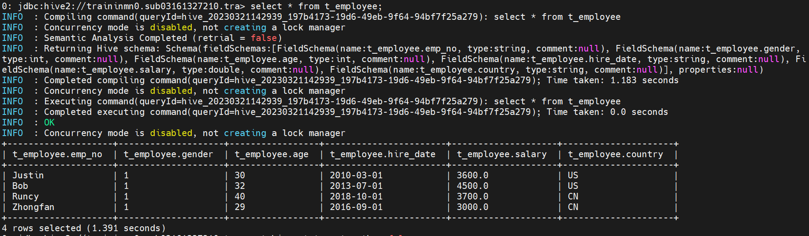

# Create a Hadoop Administrator User

## Introduction

Big Data Service nodes are by default assigned private IP addresses, which aren't accessible from the public internet. In **Lab 4: Access a BDS Node Using a Public IP Address**, you learned about the different methods that you can use to make the nodes in the cluster publicly available on the internet.

In this lab, you will map the private IP address of the **first master node** to a new public IP address to make this node publicly available on the internet. _**This assumes that making the IP address public is an acceptable security risk.**_ You will also create a Hadoop Administrator (superuser) that will be used for the Big Data Service Cluster. This user will have full access to all the data and metadata on the cluster.

**Note:** This lab assumes that your cluster has been created as secure and highly available. If you did not create a secure and HA-cluster, then there is no need to create the Kerberos user.

Estimated Lab Time: 45 minutes

### Objectives

* Map the private IP address of the first master node to a public IP address.
* Connect to the cluster's first master node using PuTTY.
* Create a new Kerberos principal.
* Create a new Linux administrator user.
* Access HDFS using the newly created user.
* Add the new user to Hue.

### What Do You Need?

This lab assumes that you have successfully completed the following labs in the **Contents** menu.

+ **Lab 1: Setup the BDS Environment**
+ **Lab 2: Create a BDS Hadoop Cluster**
+ **Lab 3: Add Oracle Cloud SQL to the Cluster**
+ **Lab 4: Access a BDS Node Using a Public IP Address**
+ **Lab 5: Use Ambari and Hue to Access a BDS Cluster**

## Task 1: Gather Information About the Cluster

1. Log in to the **Oracle Cloud Console** as the Cloud Administrator, if you are not already logged in. On the **Sign In** page, select your `tenancy`, enter your `username` and `password`, and then click **Sign In**. The **Oracle Cloud Console** Home page is displayed.
2. Click the **Navigation** menu and navigate to **Analytics & AI > Big Data Service**.

  

3. On the **Clusters** page, click the **`training-cluster`** link in the **Name** column to display the **Cluster Details** page.
4. In the **Cluster Information** tab, in the **Customer Network Information** section, click the **Copy** link next to **Subnet OCID**. Next, paste that OCID to an editor or a file, so you can retrieve it later in **STEP 2** in this lab.

   
5. On the same page, in the **List of cluster nodes** section, in the **IP Address** column, find the private IP address for the first master node, **`traininmn0`**. Save the IP address as you will need it in later steps. In our example, the private IP address of our first master node in the cluster is **`10.0.0.18`**.

  

## Task 2: Map the Private IP Address of the First Master Node to a Reserved Public IP Address

In this step, you will set three variables using the **`export`** command. The variables will be used in the **`oci network`** command that you will use to map the private IP address of the **first master node** to a new public IP address.

1. On the **Oracle Cloud Console** banner at the top of the page, click the **Cloud Shell** icon. It may take a few moments to connect and authenticate you.

  

2. At the **$** command line prompt, enter the following command, or click **Copy** to copy the command, and then paste it on the command line. The **_`display-name`_** is an optional descriptive name that will be attached to the reserved public IP address that will be created for you. Press the **`[Enter]`** key to run the command.

   ```
   $ <copy>export DISPLAY_NAME="traininmn0-public-ip"</copy>
   ```
3. At the **$** command line prompt, enter the following command, or click **Copy** to copy the command, and then paste it on the command line. Substitute **_``subnet-ocid``_** with your own **`subnet-ocid`** that you identified in **STEP 1** of this lab. Press the **`[Enter]`** key to run the command.

   ```
   $ <copy>export SUBNET_OCID="subnet-ocid"</copy>
   ```

   In our example, we replaced the **_``subnet-ocid``_** with our own **`subnet-ocid`**:

   ```
   $ export SUBNET_OCID="ocid1.subnet.oc1.iad.aaaaaaaauuyvown7hqn2zfl6qtpmasevmi7dhiwvmd2nmoh3hpjmm743kqqa"
   ```
4. At the **$** command line prompt, enter the following command, or click **Copy** to copy the command, and then paste it on the command line. The **`ip-address`** is the private IP address that is assigned to the node that you want to map. Substitute **_`ip-address`_** with your first master node's private IP address. Press the **`[Enter]`** key to run the command.

   ```
   $ <copy>export PRIVATE_IP="ip-address"</copy>
   ```

  In our example, we replaced the **_``ip-address``_** with the private IP address of our first master node that we identified in **STEP 1** of this lab.

    ``$ export PRIVATE_IP="10.0.0.18"  ``

5. At the **$** command line prompt, click **Copy** to copy the following command exactly as it's shown below **_without any line breaks_**, and then paste it on the command line. Press the **`[Enter]`** key to run the command.

   ```
   <copy>oci network public-ip create --display-name $DISPLAY_NAME --compartment-id `oci network private-ip list --subnet-id $SUBNET_OCID --ip-address $PRIVATE_IP | jq -r '.data[] | ."compartment-id"'` --lifetime "RESERVED" --private-ip-id `oci network private-ip list --subnet-id $SUBNET_OCID --ip-address $PRIVATE_IP | jq -r '.data[] | ."id"'`</copy>
   ```
6. In the output returned, find the value for **ip-address** field. In our example, it's **`129.159.75.10`**. This is the new reserved public IP address that is mapped to the private IP address of your **first master node**.

  

7. To view the newly created reserved public IP address in the console, click the **Navigation** menu and navigate to **Networking**. In the **IP Management** section, click **Reserved IPs**. The new reserved public IP address is displayed in the **Reserved Public IP Addresses** page.

  

## Task 3: Connect to the Cluster's First Master Node Using Secure Shell (SSH)

The Kerberos Distribution Center (KDC) is running on the cluster's first master node. In this lab, you will connect to the first master node using SSH as user **`opc`** (the default Oracle Public Cloud user).

Remember, in **Lab 2**, we used our own SSH public key pair that we created using Windows **PuTTYgen** named `mykey.pub` and associated that key with our cluster. In this lab, we will connect to our cluster using Windows **PuTTY** and provide the SSH private key named `mykey.ppk` which is associated with our `mykey.pub` public key. If you created or used an OpenSSH key pair (using your Linux system or Windows PowerShell), you cannot use PuTTY to connect to your cluster; instead, you will need to use your Linux system or Windows PowerShell using the **`ssh`** command below. PuTTY uses a different key file format than OpenSSH. For information on how to connect to your instance using SSH from a Unix-style system or from a Windows system using OpenSSH, see the [Connecting to Your Instance](https://docs.cloud.oracle.com/en-us/iaas/Content/GSG/Tasks/testingconnection.htm?Highlight=connect%20to%20an%20instance%20using%20ssh) OCI documentation.

```
<b>$</b> <copy>ssh –i private_key username@public-ip-address</copy>
```

+ **`private_key`** is the full path and name of the file that contains the private key associated with the instance you want to access.
+ **`username`** is the default name for the cluster. The default user name is **`opc`**.
+ **`public-ip-address`** is the public IP address of the cluster node you want to access.

For additional information on connecting to a node in the cluster using SSH, see [Connect to a Cluster Node By Using Secure Shell (SSH)](https://docs.oracle.com/en/cloud/paas/big-data-service/user/connect-cluster-ssh.html) in the Using Oracle Big Data Service documentation.

_If you are already connected to your cluster's first master node using the OpenSSH format with the **`ssh`** command above, you can skip the rest of the steps in this section and proceed to **STEP 4, Create the training Administrator Kerberos Principal**._

**Important:** You cannot use PuTTY (ssh in general) while you are connected to a Virtual Private Network (VPN).

1. To SSH into your cluster using your Windows PuTTYgen generated SSH key pair, start PuTTY. The **PuTTY Configuration** window is displayed. In the **Category** pane, select the **Session** parameter, if not already selected. In the **Basic options for your PuTTY session** section, provide the following information:

   + **Host Name (or IP address):** **`opc@master-node-0-ip-address`**.**Note:** In the above string, substitute `master-node-0-ip-address` with your IP address that you created for your **`traininmn0`** first master node in **STEP 2**. In our example, the reserved public ip address that is associated with our first master node is **`129.159.75.10`**.
   + **Port:** **`22`**.
   + **Connection type:** **`SSH`**.
   + **Saved Sessions:** A description of this ssh connection such as `ssh connection to traininmn0 on BDS`. You will use this saved ssh connection in later labs to quickly ssh to the first master node in the cluster.

   
2. In the **Category** pane, expand **Connection**, expand **SSH**, and then click **Auth**. In the **Basic options for your PuTTY session** section, in the **Private key file for authentication** section, click **Browse**. In the **Select private key file** window, select your **_private key_** that is associated with your cluster's **_public key_** that you used when your created your BDS cluster. In our example, **_mykey.ppk_** is the private key that is associated with our **_mykey.pub_** public key.

   
3. In the **Category** pane, click the **Session** parameter, and then click **Save** to save your session for easier future access.

   **Note:** The next time you need to connect to this node, select the connection name from the **Saved Sessions** list, click **Load**, and then click **Open**.

   

   Your saved session is displayed in the **Saved Sessions** list.

   
4. Click **Open** to start the ssh session. If this is your first time connecting to your first master node in the cluster, the **PuTTY Security Alert** message box is displayed. Click **Yes** to connect to the node.

   

   You are connected to the **`traininmn0`** first master node.

   

## Task 4: Create the training Administrator Kerberos Principal

In this step, you will create a new Kerberos principal named **`training`**. Identities in Kerberos are called principals. Every user and service that uses the Kerberos authentication protocol requires a principal to uniquely identify itself. There are user principals and service principals. User principal names, or UPNs, represent regular users such as **`training`**.

1. The **`opc`** user has **`sudo`** privileges on the cluster which allows it to switch to the `root` user in order to run privileged commands. Change to the `root` user as follows:

   ```
   $ <copy>sudo bash</copy>
   ```

   
2. Connect to the **Kerberos Key Distribution Center (KDC)**. The **kadmin.local** utility enables the **root** user of the KDC server to directly access and modify the Kerberos database. See [MIT Kerberos Documentation](https://web.mit.edu/kerberos/krb5-1.12/doc/admin/admin_commands/kadmin_local.html#list-principals) and [Securing the Oracle Big Data Appliance](https://apexapps.oracle.com/pls/apex/f?p=44785:112:102721520016911::::P112_CONTENT_ID,P112_PREV_PAGE:12907).

   At **`#`** the command line prompt, enter the following command:

   ```
   # <copy>kadmin.local</copy>
   ```

   
3. At the **`kadmin.local`** command line prompt, use the **`addprinc`** command to add a new Kerberos principal named **`training`**. When you are prompted for a password, specify **Training#123**, and then confirm the password. You will need the password later in this step. See [addprinc](https://web.mit.edu/kerberos/krb5-1.12/doc/admin/admin_commands/kadmin_local.html#add-principal) in the Kerberos Documentation.

   ```
   kadmin.local: <copy>addprinc training</copy>
   ```

   The **`training@BDACLOUDSERVICE.ORACLE.COM`** Kerberos principal is added the Kerberos database. **`training`** is the User Principal and **`BDACLOUDSERVICE.ORACLE.COM`** is the realm. A Kerberos **realm** is an authentication administrative domain. All principals are assigned to a specific Kerberos realm. Enter **`exit`** to exit the KDC.

   
4. Enter **`exit`** at the **`kadmin.local`** command line prompt to return to the **`#`** prompt.

   

## Task 5: Create the training Linux OS Administrator User

Create the **`training`** Linux administrator user and the OS group **`supergroup`**. Assign **`training`** the **`supergroup`** superuser group as the primary group. Assign **hdfs**, **hadoop**, and **hive** as the secondary groups.

1. The **`dcli`** utility allows you to run the command that you specify across each node of the cluster. The syntax for the **`dcli`** utility is as follows:

   ```
   dcli [option] [command]
   ```

   Use the **`-C`** option to run the specified command on all the nodes in the cluster.

   Enter the following command at the **`#`** prompt to create the OS group
   **`supergroup`** which is defined as the **`superuser`** group in hadoop.

   ```
   # <copy>dcli -C "groupadd supergroup"</copy>
   ```

   
2. Enter the following command at the **`#`** prompt to create the **`training`** administrator user and add it to the listed groups on each node in the **`training-cluster`**. The **`useradd`** linux command creates the new **`training`** user and adds it to the specified groups.

   ```
   # <copy>dcli -C "useradd -g supergroup -G hdfs,hadoop,hive training"</copy>
   ```

   The preceding command creates a new user named **`training`** on each node of the cluster. The **`-g`** option assigns the **`supergroup`** group as the primary group for **`training`**. The **`-G`** option assigns the **`hdfs`**, **`hadoop`**, and **`hive`** groups as the secondary groups for **`training`**.

   **Note:** Since the **`training`** user is part of the **hive** group, it is considered an administrator for Sentry.

   
3. Use the linux **`id`** command to confirm the creation of the new user and to list its groups membership.

   ```
   # <copy>id training</copy>
   ```

   

## Task 6: Access HDFS Using the New training Administrator User

Log into any of the Big Data Service nodes such as the **first master node**, get a Kerberos ticket for the **`training`** user, and then perform a file listing of HDFS.

1. You can access HDFS using the new **`training`** administrator user on any node in the cluster such as the **first master node** in this example. Change to the `training` user as follows:

   ```
   # <copy>sudo -su training</copy>
   ```

   You are now connected as the **`training`** administrator user.

   
2. Perform a file listing of HDFS using the following command:

   ```
   # <copy>hadoop fs -ls /</copy>
   ```

   

   The command fails. This is a secure and HA cluster; therefore, before you as user **`training`** can access HDFS, you will need to request a Kerberos ticket (authentication request) using the **`kinit`** tool.
3. Request a Kerberos ticket for the **`training`** user using the **`kinit`** tool. Enter **`Training#123`** for the password when prompted. See [kinit](https://web.mit.edu/kerberos/krb5-1.12/doc/user/user_commands/kinit.html) for additional details.

   ```
   # <copy>kinit training</copy>
   ```

   
4. You can use the **`klist`** utility which allows you to see what, if any, Kerberos credentials you have in your credentials cache. The credentials cache is the location on your local filesystem where Kerberos tickets are stored after you authenticate successfully. The default location for the credentials cache is the file `/tmp/krb5cc_<uid>` where ``<uid>`` is the numeric user ID on the local system. In our example, the
   ``<uid>`` is 1005. The default principal is the ticket that was created for the **`training`** user.

   ```
   # <copy>klist</copy>
   ```

   
5. Perform a file listing of HDFS using the following command:

   ```
   # <copy>hadoop fs -ls /</copy>
   ```

   

   The command works because you as user **`training`** now have a valid Kerberos ticket.

   

## Task 7: Add the training User to Hue (optional)

In this step, you log into Hue as an administrator and add the **`training`** user as an administrator. In an HA-cluster, Hue runs on the second utility node. You will use the reserved public IP address that is associated with **`traininun1`** that you created in **Lab 4, Access a BDS Node Using a Public IP Address**.

1. Open a Web browser window.
2. Enter the following URL. Substitute **_``ip-address``_** with your own **_``ip-address``_** that is associated with the **second utility node** in your cluster, **`traininun1`**, which you created in **Lab 4**.

   ```
   https://<ip-address>:8888
   ```

  **Note:**

  In our example, we used the reserved public IP address that is associated with our second utility node as follows:

    ``https://193.122.171.29:8888``

3. If this is the first time you are accessing Hue, the Hue Login screen is displayed. Enter your **`username`** and **`password`**. Use the **`password`** that you specified when you created the cluster such as **`Training#123`**.

  

  The **Hue Editor** page is displayed.

  

4. From the **admin** drop-down menu, select **Manage Users**.

  

5. In the **User Admin** page, in the **Users** tab, click **Add user**.

   
6. In the **Hue Users - Create user** page, in **Step 1: Credentials (required)** of the wizard, enter the following information:

   + **Username:** **`training`**
   + **New Password:** **`Training#123`**
   + **Password confirmation:** **`Training#123`**
   + **Create home directory:** `Checked`

   
7. Click the **Step 3: Advanced** link of the wizard, select the **Superuser status** checkbox, and then click **Add user**.

   

   The **Hue Users** page is re-displayed. The newly added **`training`** user is displayed in the list of Hue users.

   
8. Exit Hue. From the **admin** drop-down menu, select **Sign out**. You can now login to Hue using the new **`training`** user with **`Training#123`** as the password.

   

   **Note:** For documentation on using Hue, see [Introduction to Hue](https://docs.cloudera.com/documentation/enterprise/6/6.3/topics/hue.html). You can also select **Help** from the **User** drop-down menu for general help topics.

## (Optional) Task 8: Use Ranger to add user and config  Hive writer permission

In this step, you log into Ranger as an administrator and add the **`hwriter`** user and config hive table write permission to this user. In an HA-cluster, Hue runs on the second utility node. You will use the reserved public IP address that is associated with **`traininun0`** that you created in **Lab 4, Access a BDS Node Using a Public IP Address**.

1. Open a Web browser window.
2. Enter the following URL. Substitute **_``ip-address``_** with your own **_``ip-address``_** that is associated with the **first utility node** in your cluster, **`traininun0`**, which you created in **Lab 4**.

   ```
   https://<ip-address>:6182
   ```

  **Note:**

  In our example, we used the reserved public IP address that is associated with our second utility node as follows:

    ``https://129.80.253.156:6182``

3. Login to Ranger, Enter your **`username`** and **`password`**. Use the **`password`** that you specified when you created the cluster such as **`Training#123`**.
   
4. After login to the Ranger,Navigate to **Settings**>**Users/Groups/Roles**.
   
5. Click the **Group** tab and click the "**Add New Group**" button.
   
6. Input the **Group Name** as `writergroup1`.And click the **Save** button to complete add group.
   
7. Click the **Users** tab and click the "**Add new User"**.
   
8. Input the **User Name** as `hwriter` and **Password**, and choose the **Group** as `writergroup1` . And click the **Save** button to complete add user.
   
9. Preapare the Hive database named as bdws and create t_employee table under bdws database. ssh to **Utility node 0**, And use the **hive** cli to create database and table. Following are the script we should prepared.

   ```
   create database bdws;
   use bdws;
   drop table t_employee;
   create table t_employee(
   emp_no string,
   gender int,
   age int,
   hire_date string,
   salary double,
   country string
   )stored as orc;
   insert into t_employee values('Justin',1,30,'2010-03-01',3600,'US');
   insert into t_employee values('Bob',1,32,'2013-07-01',4500,'US');
   insert into t_employee values('Runcy',1,40,'2018-10-01',3700,'CN');
   insert into t_employee values('Zhongfan',1,29,'2016-09-01',3000,'CN');
   ```
10. Navigate to **Access Manager**>**Resource Based Policies**, and click **traningcl_hive** in the HADOOP SQL.

    
11. Click the "**Add New Policy**",
    
12. Setting the policy info as below ,then click the "**Add**" button.
    


13.After add the hive policy, there have new policy named as `writerpolicy1` in the list.


14.Following the Task **4: Create the training Administrator Kerberos Principal** to create the `hwriter` principal.

## (Optional) Task 9: Use the Ranger user to access Hive table

In this step, you ssh to Utility node 0 to select/insert data to hive table via Ranger `hwriter` user.

1. Use the root user ssh login to **Utility Node 0**.
2. Request a Kerberos ticket for the **`hwriter`** user using the **`kinit`** tool. Enter **`Training#123`** for the password when prompted. See [kinit](https://web.mit.edu/kerberos/krb5-1.12/doc/user/user_commands/kinit.html) for additional details.

```
#kinit hwriter
#klist
```


3. Use the `beeline` command, and executing following command:

```
use bdws;
show tables;
select * from t_employee;
set hive.stats.autogather=false;
insert into t_employee values('Justin3',1,30,'2016-09-01',3200,'CN');
```

Here is the **beeline** command output:


Here is the `use bdws` and `show tables` output.


Here is the `select * from t_employee` output.


Here is the `insert into t_employee values('Justin3',1,30,'2016-09-01',3200,'CN')` output.


You may now [proceed to the next lab](#next).

## Want to Learn More?

* [Using Oracle Big Data Service](https://docs.oracle.com/en/cloud/paas/big-data-service/user/index.html)
* [Oracle Cloud Infrastructure Documentation](https://docs.cloud.oracle.com/en-us/iaas/Content/GSG/Concepts/baremetalintro.htm)
* [MIT Kerberos Documentation](https://web.mit.edu/kerberos/krb5-1.12/doc/admin/admin_commands/kadmin_local.html#list-principals)
* [Creating a Key Pair](https://docs.cloud.oracle.com/en-us/iaas/Content/GSG/Tasks/creatingkeys.htm?Highlight=ssh%20key#CreatingaKeyPair)
* [Connecting to Your Instance](https://docs.cloud.oracle.com/en-us/iaas/Content/GSG/Tasks/testingconnection.htm?Highlight=connect%20to%20an%20instance%20using%20ssh)
* [Securing the Oracle Big Data Appliance OLL Video](https://apexapps.oracle.com/pls/apex/f?p=44785:112:102721520016911::::P112_CONTENT_ID,P112_PREV_PAGE:12907)
* [Getting Started with the Command Line Interface (CLI)](https://docs.cloud.oracle.com/en-us/iaas/Content/GSG/Tasks/gettingstartedwiththeCLI.htm)
* [OCI CLI Command Reference - Public-IP](https://docs.cloud.oracle.com/en-us/iaas/tools/oci-cli/2.9.0/oci_cli_docs/cmdref/network/public-ip.html#)
* [OCI CLI Command Reference - Big Data Service (bds)](https://docs.cloud.oracle.com/en-us/iaas/tools/oci-cli/2.10.0/oci_cli_docs/cmdref/bds.html)
* [Using Hue](https://docs.cloudera.com/documentation/enterprise/6/6.3/topics/hue_using.html)

## Acknowledgements

* **Authors:**

  * Anand Chandak, Principal Product Manager, Big Data Services
  * Justin Zou, Principal Data Engineer,Japan & APAC Hub
* **Last Updated By/Date:** Justin Zou, March 2023
