# Set Up Your BDS Environment

## Introduction

In this lab, you will perform a few tasks that are required to get started with BDS. Several of these tasks need to be performed by the Cloud Administrator for your tenancy. There are also optional tasks that make it easier to manage your environment. For example, creating compartments and groups are optional; however, they will simplify administration tasks as your environment expands.

Estimated Lab Time: 30 minutes

### Objectives

In this lab, you will practice performing both the required and optional tasks described in the following table for educational purposes. If you have restrictions on what you can create in your setup, you can use your existing resources; however, make a note of your resources' names which you will need when you create your cluster in the next lab.

**Note:** The steps in this lab and any other labs should be performed sequentially.


| Task                                                                                                                                                | Purpose                                                                                                                                                                                                                                                     | Who?                                     | Required?     |
| --------------------------------------------------------------------------------------------------------------------------------------------------- | ----------------------------------------------------------------------------------------------------------------------------------------------------------------------------------------------------------------------------------------------------------- | ---------------------------------------- | ------------- |
| [STEP 1: Log in to Oracle Cloud Console](#STEP1:LogintotheOracleCloudConsole)                                                                          | Log in to the Oracle Cloud Console to create a compartment, a user, a group, policies, a virtual cloud network, and a BDS cluster.                                                                                                                          | Cloud Administrator                      | No            |
| [STEP 2: Create a Compartment for BDS Resources](#STEP2:CreateaCompartment)                                                                            | Create a compartment named **`training-compartment `** in your tenancy to help organize your BDS resources.                                                                                                                                        | Cloud Administrator                      | No            |
| [STEP 3: Create an Identity and Access Management (IAM) User to be the BDS Administrator](#STEP3:CreateanIAMUsertoBetheBDSAdministrator)               | Create a user named **`training-bds-admin`** that you will add to the administrators group to become a BDS Administrator.                                                                                                                            | Cloud Administrator                      | No            |
| [STEP 4: Create an IAM BDS Administrators Group and Add the New User to the Group](#STEP4:CreateanIAMBDSAdministratorsGroupandAddtheNewUsertotheGroup) | Create an administrators group named **`training-bds-admin-group`** with permissions to create and manage your BDS resources.Add the new user to this group to become a BDS Administrator.                                                                 | Cloud Administrator                      | No            |
| [STEP 5: Create IAM Policies for Administering Your Service](#STEP5:CreateIAMPoliciesforAdministeringYourService)                                      | Create a policy named **`training-admin-policy`** to grant permissions to the BDS Administrator group to manage the cluster.Create a second policy named **`training-bds-policy`** to grant permissions to BDS to create clusters in your tenancy. | Cloud Administrator or BDS Administrator | **Yes** |
| [STEP 6: Create a Virtual Cloud Network (VCN)](#STEP6:CreateaVirtualCloudNetwork(VCN))                                                                 | Create a Virtual Cloud Network (VCN) in your tenancy named **`training-vcn`**, to be used by your cluster(s). Alternatively, you can use an existing VCN in the tenancy.                                                                                   | Cloud Administrator or BDS Administrator | **Yes** |


### What Do You Need?

Login credentials and a tenancy name for the Oracle Cloud Infrastructure Console.

## Task 1: Log in to the Oracle Cloud Console

1. Log in to the **Oracle Cloud Console** as the Cloud Administrator. You will complete all the labs in this workshop using this Cloud Administrator.
   See [Signing In to the Console](https://docs.cloud.oracle.com/en-us/iaas/Content/GSG/Tasks/signingin.htm) in the _Oracle Cloud Infrastructure_ documentation.
2. On the **Sign In** page, select your tenancy, enter your username and password, and then click **Sign In**. The **Oracle Cloud Console** Home page is displayed.

   

   **Note:** Scroll-down to the **Start Exploring** section, and then navigate to the **Key Concepts and Terminology > Learning Modules and Submodules** section. You can use the links in this section to access useful videos and PDF files about topics such as Core Infrastructure, Governance and Administration, and more.

## Task 2: Create a Compartment

A Cloud Administrator can optionally create a compartment in your tenancy to help organize the Big Data Service resources. In this lab, as a Cloud Administrator, you will create a new compartment that will group all of your BDS resources that you will use in the lab.

1. Click the **Navigation** menu and navigate to **Identity & Security > Compartments**.

   
2. On the **Compartments** page, click **Create Compartment**.

   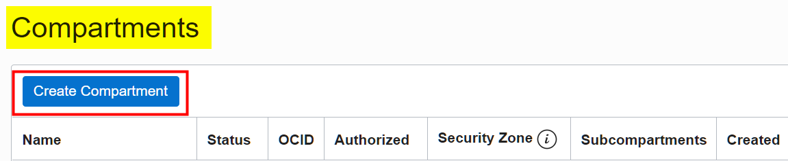
3. In the **Create Compartment** dialog box, enter **`training-compartment`** in the **Name** field and **`Training Compartment`** in the **Description** field.
4. In the **Parent Compartment** drop-down list, select your parent compartment, and then click **Create Compartment**.

   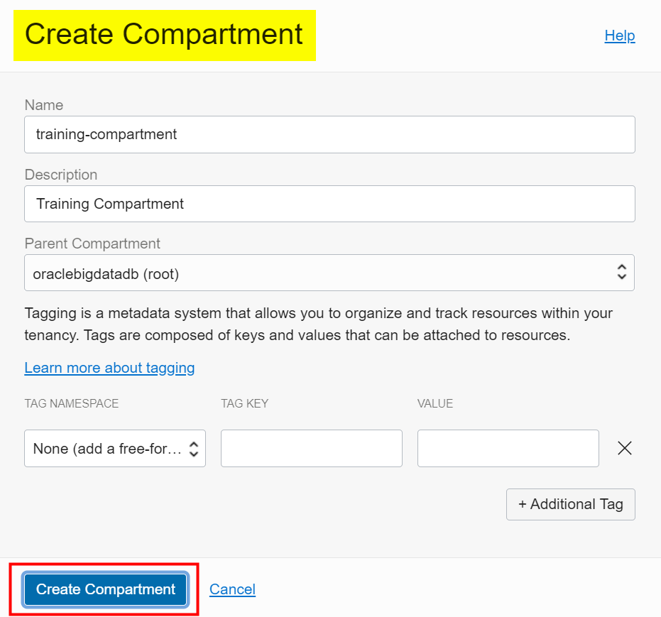

   The **Compartments** page is re-displayed and the newly created compartment is displayed in the list of available compartments.

   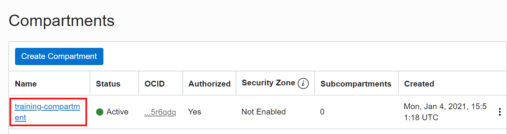

## Task 3: Create an IAM User to Be the BDS Administrator

A Cloud Administrator has complete control over all of the BDS resources in the tenancy; however, it's a good practice to delegate cluster administration tasks to one or more BDS administrators. To create a new BDS administrator for a service, a Cloud Administrator must create a user and then add that user to a BDS administrators group. You create Identity and Access Management (IAM) groups with access privileges that are appropriate to your needs.

Create a new Administrator group that will have full access rights to the new **`training-compartment`** as follows:

1. If you are still on the **Compartments** page from the previous step, click the **Users** link in the **Identity** section on the left; otherwise, click the **Navigation** menu and navigate to **Identity & Security > Users**.
2. On the **Users** page, click **Create User**.

   
3. In the **Create User** dialog box, enter **`training-bds-admin`** in the **Name** field, **`Training BDS Admin User`** in the **Description** field, and then click **Create**.

   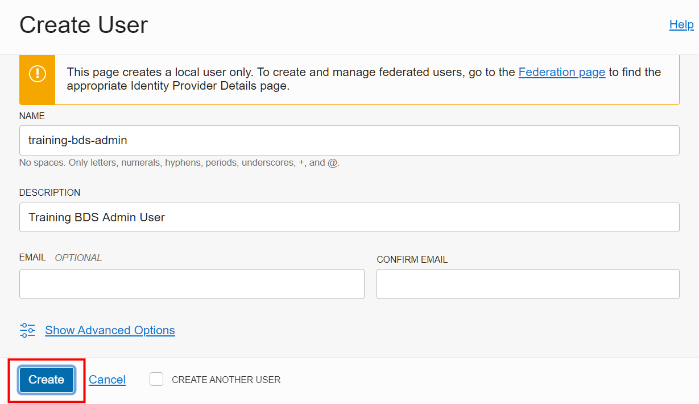
4. The **Users Details** page for the new **`training-bds-admin`** user is displayed.

   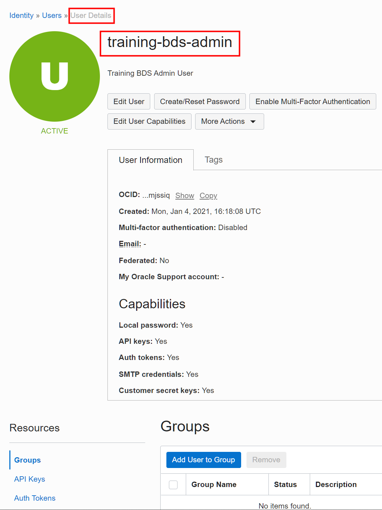
5. Click the **Users** link in the breadcrumbs to re-display the **Users** page. The newly created user is displayed in the list of available users.

   

   **Note:** In this workshop, you will not login to OCI using the new **`training-bds-admin`** user that you just created in this step; instead, you will continue your work using the same Cloud Administrator user that you used so far in this workshop. As a Cloud Administrator, you can create a one-time password for the new **`training-bds-admin`** user. The user must change the password when they sign in to the Console. For detailed information on this topic, see [Managing User Credentials](https://docs.cloud.oracle.com/en-us/iaas/Content/Identity/Tasks/managingcredentials.htm) in the OCI documentation.

## Task 4: Create an IAM BDS Administrators Group and Add the New User to the Group

Create a BDS group whose members will be granted permissions to manage the BDS cluster life cycle.

1. If you are still on the **Users** page from the previous step, click the **Groups** link in the **Identity** section on the left; otherwise, click the **Navigation** menu and navigate to **Identity & Security > Groups**.
2. On the **Groups** page, click **Create Group**.

   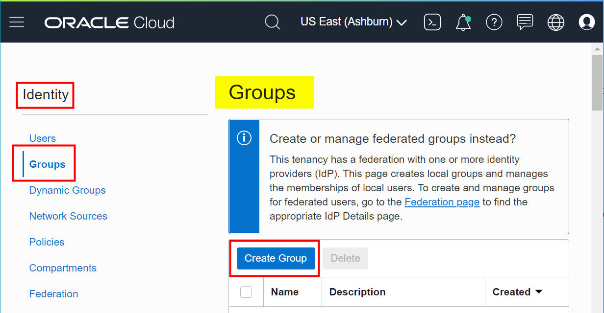
3. In the **Create Group** dialog box, enter **`training-bds-admin-group`** in the **Name** field, **`Training BDS Admin. Group`** in the **Description** field, and then click **Create**.

   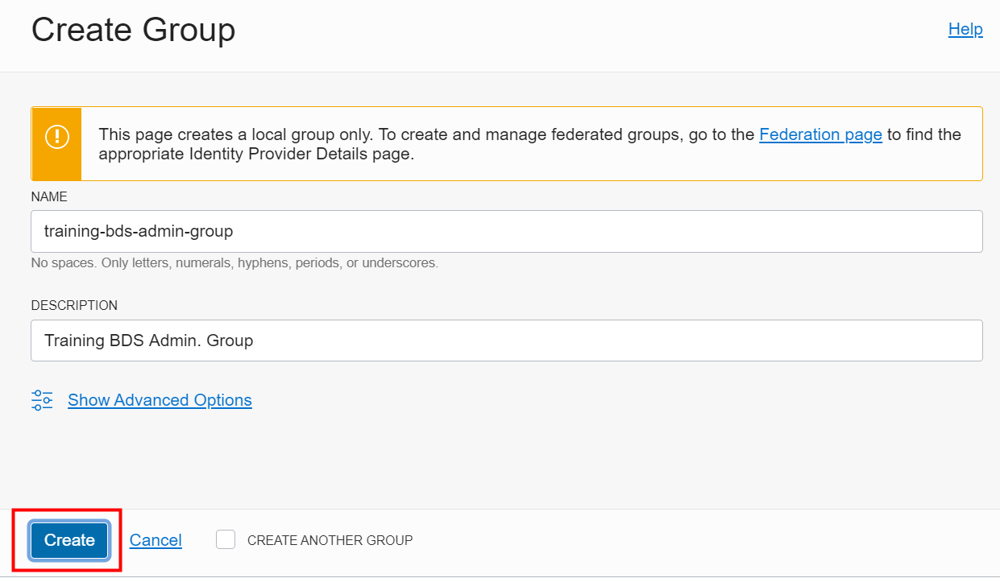
4. The **Group Details** page for the new **training-bds-admin-group** is displayed. In the **Group Members** section, click **Add User to Group**.

  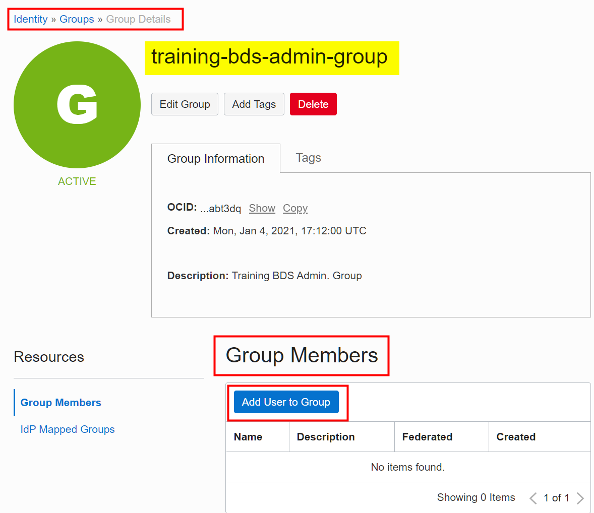

5. In the **Add User to Group** dialog box, select the **`training-bds-admin`** user that you created earlier from the **Users** drop-down list, and then click **Add**.

  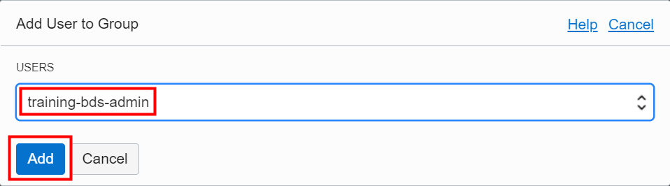

  **Note:**
  If you haven't created the user who will be an administrator yet, go back to **STEP 3: Create an IAM User to be the BDS Administrator to create the user**, create the user, and then return to this step.

6. The **Group Details** page is re-displayed and the newly added user to this group is displayed in the **Group Members** section.

   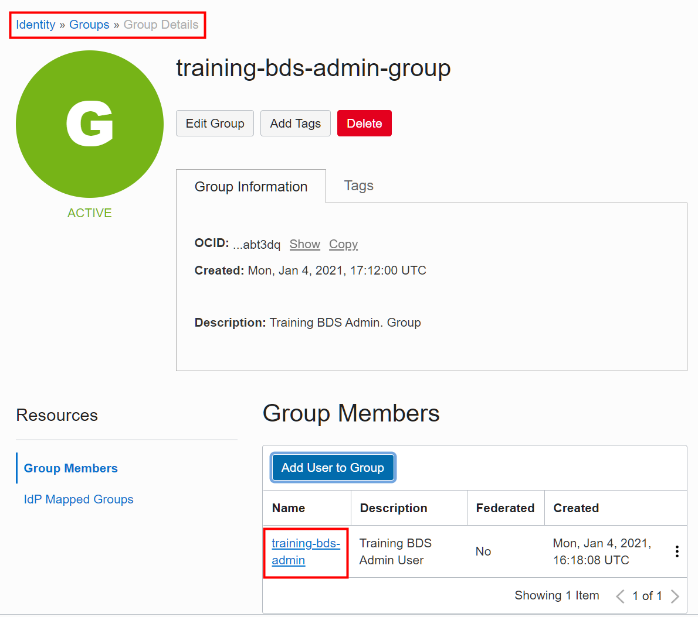
7. Click **Groups** in the breadcrumbs to re-display the **Groups** page. The newly created group is displayed in the list of available groups.

   

## Task 5: Create IAM Policies for Administering Your Service

Create Oracle Cloud Infrastructure Identity and Access Management (IAM) policies to grant privileges to users and groups to use and manage Big Data Service resources. Before you can create a cluster, you must also create a policy that grants the system access to networking resources.

1. If you are still on the **Groups** page from the previous step, click the **Policies** link in the **Identity** section on the left; otherwise, click the **Navigation** menu and navigate to **Identity & Security > Policies**.
2. On the **Policies** page, if your compartment is not selected, use the **Compartment** drop-down list in the **List Scope** section to search for and select the **`training-compartment`** where the new policies will reside.

   

   Type part of the compartment's name in the **Search compartments** text box. When the compartment is displayed in the list, select it.

   
3. Click **Create Policy**.

   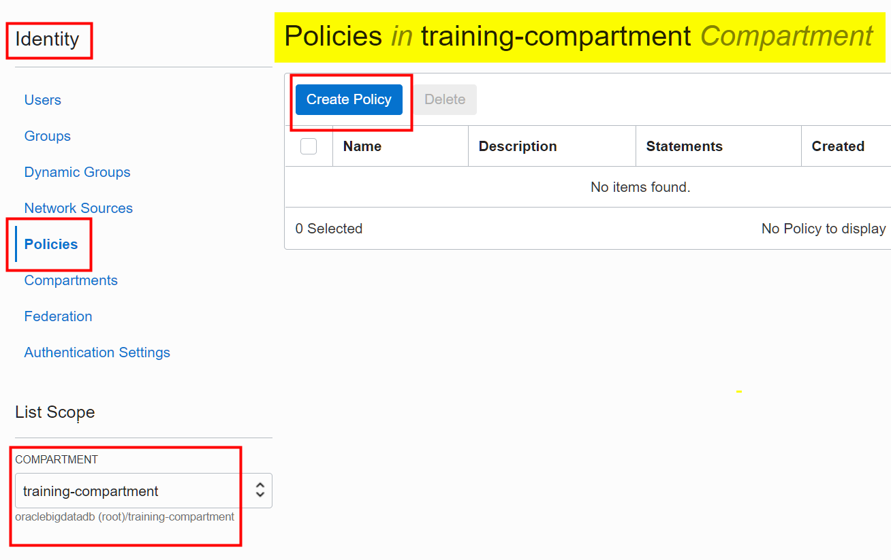

   The **Create Policy** dialog box is displayed.

   
4. In the **Create Policy** dialog box, provide the following information:

   * Enter **`training-admin-policy`** in the **Name** field.

   - Enter **`Training Admin Group Policy`** in the **Description** field.
   - Select **`training-compartment`** from the **Compartment** drop-down list, if it's not already selected.
   - In the **Policy Builder** section, click and slide the **Show manual editor** slider to enable it. An empty text box is displayed in this section.

   

   + Click the **Copy** button in the following code box to copy the two policy statements, and then paste them in the **Policy Builder** text box. The first policy statement grants members of the `training-bds-admin-group` group manage privileges on the Virtual Cloud Network (VCN) resources in `training-compartment`. The second policy statement grants members of the `training-bds-admin-group` group manage privileges to inspect, read, update, create, delete, and move all clusters in `training-compartment`.

     ```
     <copy>allow group training-bds-admin-group to manage virtual-network-family in compartment training-compartment
     allow group training-bds-admin-group to manage bds-instance in compartment training-compartment</copy>
     ```
   + Select the **Create Another Policy** check box to create a second policy after your  create the first policy.

     
5. Click **Create**. A confirmation message is displayed. You can click the **View Details** link to display the **Policy Detail** page in a new tab in your browser. The **Create Policy** dialog box remains displayed because you selected the **Create Another Policy** check box. This enables you to create your second policy.

  

6. Create a new policy in the **`training-compartment`** which will contain policies about the network resources that will be used by your **`training-cluster`**. The policy statement in this new policy grants the system the rights to interact with various networking components. In the **Create Policy** dialog box, provide the following information:

   + Enter **`training-bds-policy`** in the **Name** field.
   + Enter **`Training BDS Service Policy`** in the **Description** field.
   + Use the **Compartment** drop-down list to select **training-compartment**, if you have not done that yet.
   + In the **Policy Builder** section, click the **Show manual editor** slider to enable it. An empty text box is displayed in this section.
   + Click the **Copy** button in the following code box to copy the policy statement, and then paste it in the **Policy Builder** text box. This policy statement allows the Big Data Service, **`bdsprod`**, to access the network, create instances, and more.

     ```
     <copy>allow service bdsprod to {VNC_READ, VNIC_READ, VNIC_ATTACH, VNIC_DETACH, VNIC_CREATE, VNIC_DELETE,VNIC_ATTACHMENT_READ, SUBNET_READ, VCN_READ, SUBNET_ATTACH, SUBNET_DETACH, INSTANCE_ATTACH_SECONDARY_VNIC, INSTANCE_DETACH_SECONDARY_VNIC} in compartment training-compartment</copy>
     ```

     
   + Uncheck the **Create Another Policy** check box. Click **Create**.

     
7. The **Policy Detail** page is displayed and the statement in the **training-bds-policy** is displayed in the **Statements** section.

   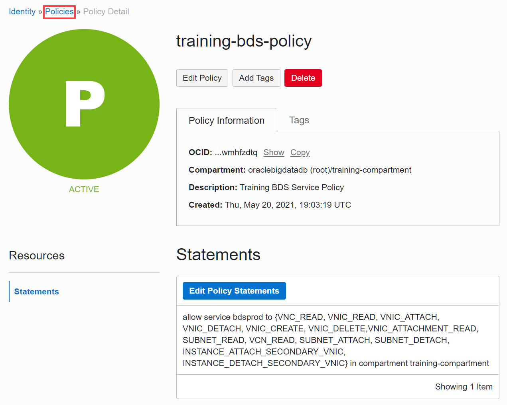
8. Click **Policies** in the breadcrumbs to re-display the **Policies** page. The newly created policies are displayed in the list of available policies.

   

   **Note:** You can click the name of a policy on this page to view and edit its policy statements.

## Task 6: Create a Virtual Cloud Network (VCN)

In this step, you will create a new Virtual Cloud Network (VCN) that will be used by your Big Data Service cluster. In general, if you already have an existing VCN, you can use it instead of creating a new one; however, your existing VCN must be using a `Regional` subnet and the appropriate ports must be opened. In addition, if you want to make the cluster accessible from the public internet, the subnet must be public.

1. Click the **Navigation** menu and navigate to **Networking > Virtual Cloud Networks**.

   
2. On the **Virtual Cloud Networks** page, click **Start VCN Wizard**.

   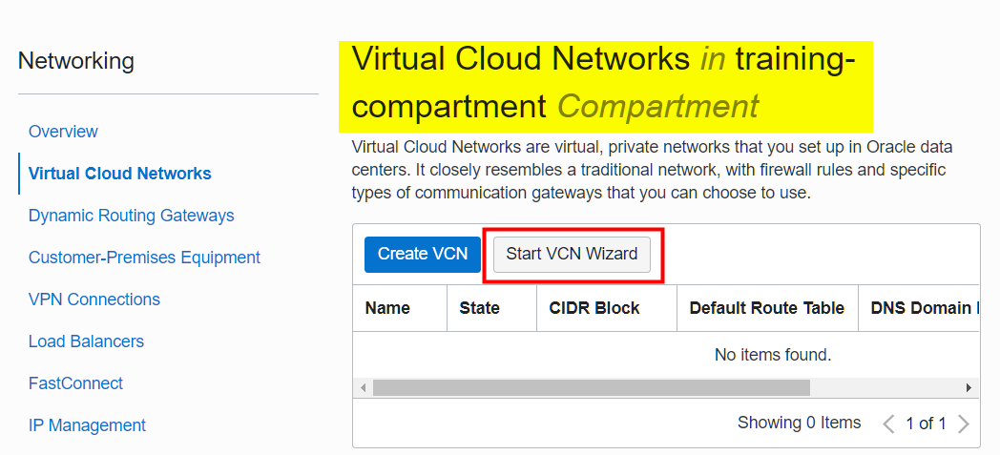
3. In the **Start VCN Wizard** dialog box, select **VCN with Internet Connectivity**, and then click **Start VCN Wizard**.

   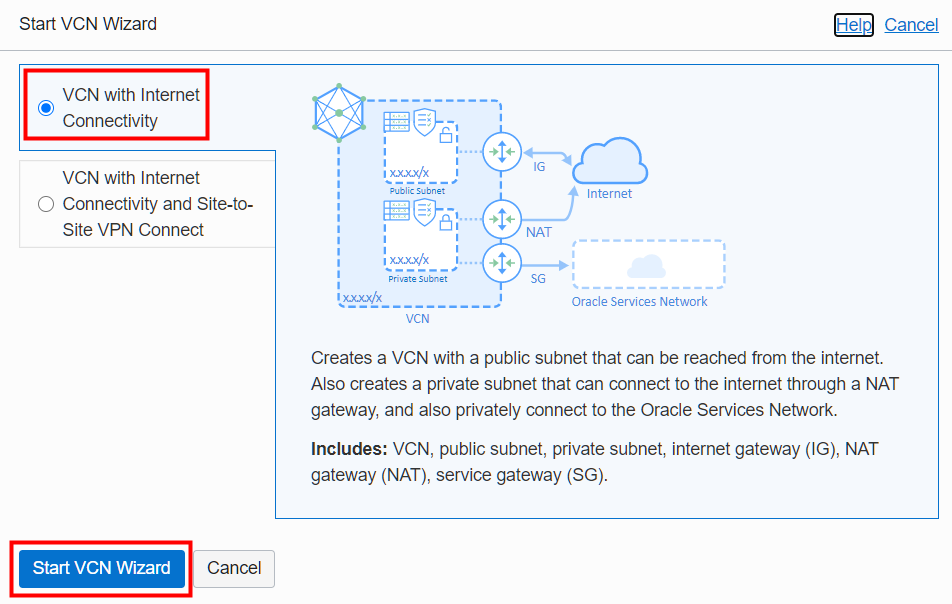
4. The **Configuration** page of the wizard is displayed.

   In the **Basic Information** section, provide the following information:

   + **VCN NAME:** Enter **`training-vcn`**.
   + **COMPARTMENT:** Select **`training-compartment`**.

   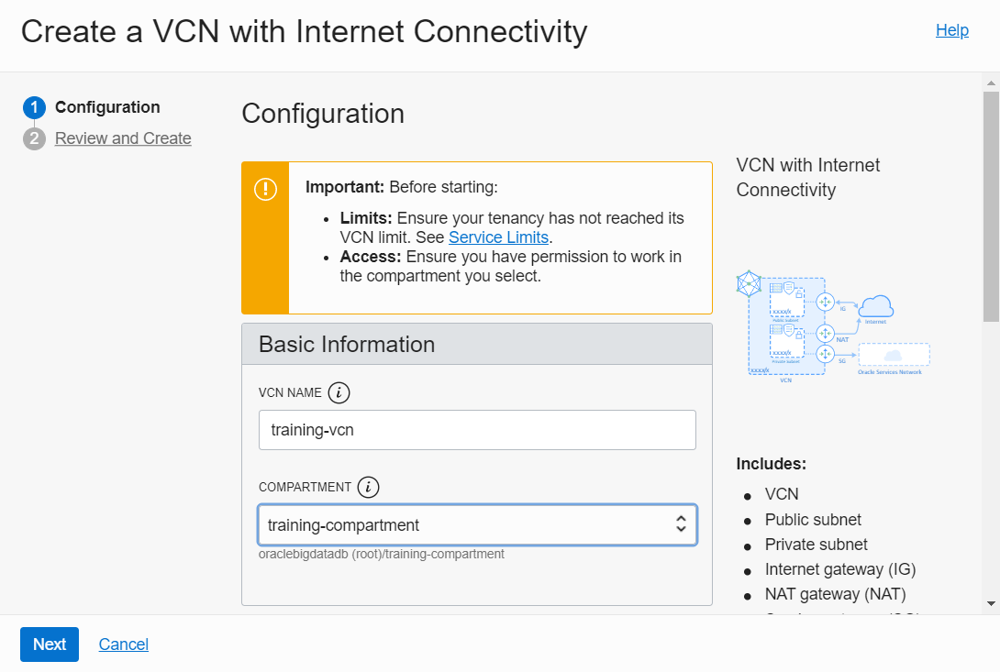

   In the **Configure VCN and Subnets** section, provide the following information:

   + **VCN CIDR BLOCK:** Enter the range of IP addresses for the network as a Classless Inter-Domain Routing (CIDR) block such as **`10.0.0.0/16`**.
   + **PUBLIC SUBNET CIDR BLOCK:** Enter the CIDR block for the public subnet such as **`10.0.0.0/24`**.
   + **PRIVATE SUBNET CIDR BLOCK:** Enter the CIDR block for the private subnet such as **`10.0.1.0/24`**.
   + In the **DNS RESOLUTION** section, select the **USE DNS HOSTNAMES IN THIS VCN** check box. This allows the use of host names instead of IP addresses for hosts to communicate with each other.

   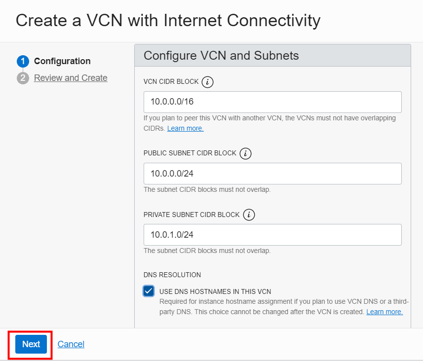
5. Click **Next**. The **Review and Create** wizard's page is displayed. Review the details of the VCN. If you need to make any changes, click **Previous** and make the desired changes.

   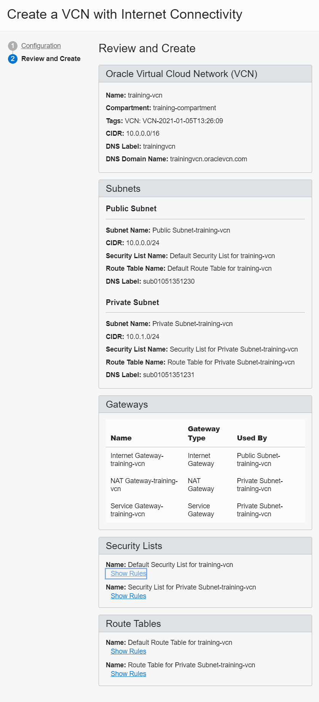
6. Click **Create**.

   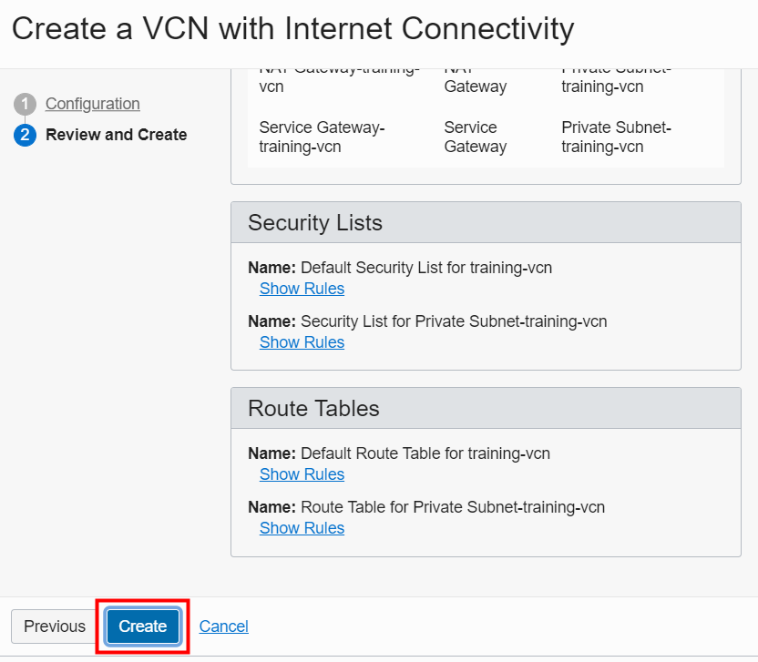
7. When the VCN is created successfully, a confirmation message is displayed.

   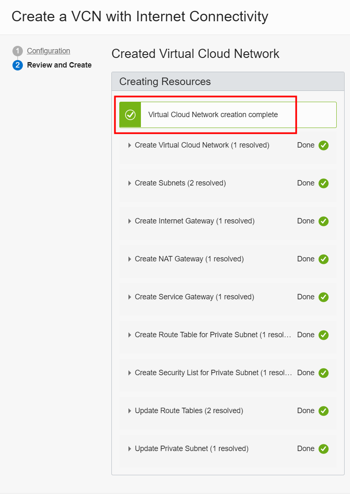
8. Click **View Virtual Cloud Network** to view the details of your new VCN network.

   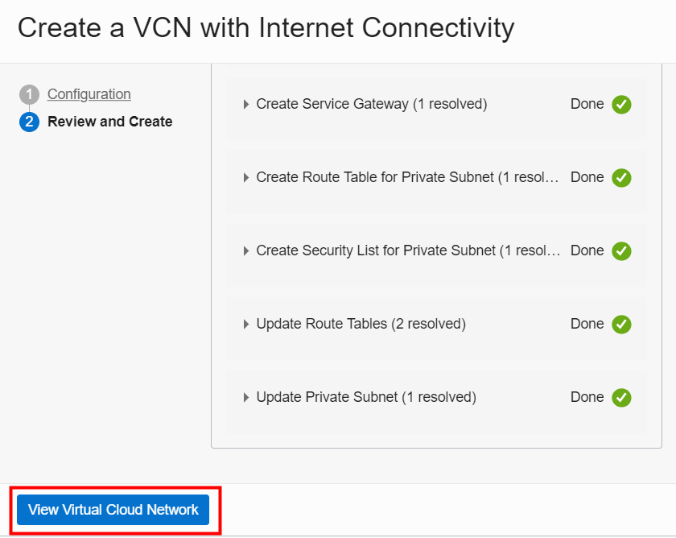
9. The **Virtual Cloud Network Details** page is displayed.

   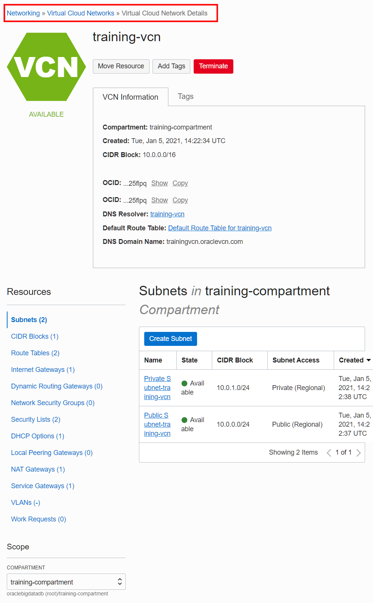
10. Click **Virtual Cloud Networks** in the breadcrumbs to re-display the **Virtual Cloud Networks** page. The newly created VCN is displayed in the list of available VCNs.

   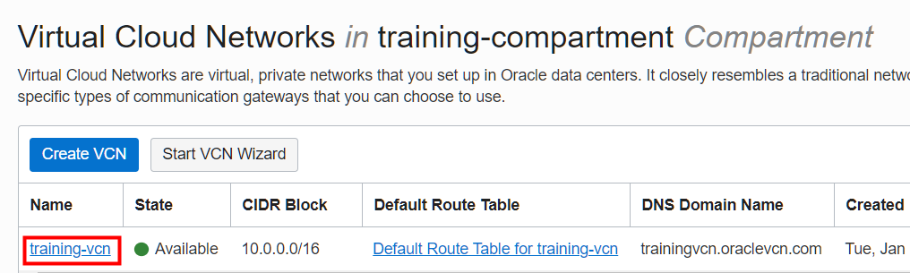

This concludes this lab. You may now [proceed to the next lab](#next).

## Want to Learn More?

* [VCN and Subnets](https://docs.cloud.oracle.com/iaas/Content/Network/Tasks/managingVCNs.htm)
* [Create a Network](https://docs.oracle.com/en/cloud/paas/big-data-service/user/create-network.html#GUID-36C46027-65AB-4C9B-ACD7-2956B2F1B3D4)
* [Using Oracle Big Data Service](https://docs.oracle.com/en/cloud/paas/big-data-service/user/index.html)
* [Oracle Cloud Infrastructure Documentation](https://docs.cloud.oracle.com/en-us/iaas/Content/GSG/Concepts/baremetalintro.htm)
* [Overview of Oracle Cloud Infrastructure Identity and Access Management (IAM)](https://docs.cloud.oracle.com/en-us/iaas/Content/Identity/Concepts/overview.htm)
* [Oracle Cloud Infrastructure Self-paced Learning Modules] (https://www.oracle.com/cloud/iaas/training/foundations.html)
* [Overview of Compute Service](https://www.oracle.com/pls/topic/lookup?ctx=cloud&id=oci_compute_overview)

## Acknowledgements

* **Author:**

  * Anand Chandak, Principal Product Manager, Big Data Services
  * Justin Zou, Principal Data Engineer,Japan & APAC Hub
* **Last Updated By/Date:** Justin Zou, March 2023
